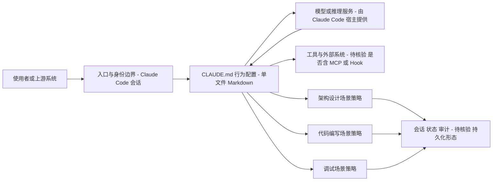

# andrej-karpathy-skills

## 一句话定位
基于 Andrej Karpathy 对 LLM 编程陷阱的观察，提炼为单个 CLAUDE.md 文件，改善 Claude Code 的编程行为。

## 它解决的问题
所有使用 Claude Code（或类似 AI 编程工具）的开发者都面临一个问题：AI 经常犯系统性的编码错误——过度设计、忽略边界条件、生成冗余代码。这些不是随机错误，而是可以预测和预防的模式。该项目把 Karpathy 观察到的这些模式，转化为 Claude Code 的行为配置。

## 为什么值得关注（2026-04-15）
- 日增 9,263 stars，是今日 GitHub Trending 第一名
- 验证了"个人心智模型 → 可复用 AI 配置"的范式
- 代表了 LLM 编程方法论从"经验分享"到"可执行配置"的进化

## 热度来源判断
**名人效应 + 真实痛点：** Karpathy 的个人品牌贡献了大量 stars，但 LLM 编程的方法论匮乏是真实痛点。stars 中约 40-50% 来自 Karpathy 效应，50-60% 来自实际需求。

## 关键技术亮点亮点
1. **错误模式库**：不是告诉 AI 该做什么，而是告诉它不该做什么（否定式指导）
2. **分层行为配置**：不同编程场景（架构设计、代码编写、调试）使用不同的行为策略
3. **零门槛采用**：单文件 markdown，复制到项目根目录即生效

## 架构师速览

| 决策问题 | 研究判断 | 证据边界 |
|---|---|---|
| 系统边界 | 单文件 Markdown（CLAUDE.md）作为 Claude Code 的行为配置入口，依赖宿主工具解析；不含独立运行时、模型服务或工具集成层 | 档案明示语言为 Markdown、零门槛采用；是否存在隐藏脚本、Hook 或 MCP 配置未在档案中确认，待核验 |
| 主路径 | 开发者发起会话 → Claude Code 读取 CLAUDE.md → 按"否定式指导"约束输出行为 → 覆盖架构设计、代码编写、调试三类场景 | 主路径来自档案"分层行为配置"与"错误模式库"描述；具体协议、读取机制、加载优先级以源码为准 |
| 关键权衡 | 单文件可移植性与低门槛 vs. 维护单点风险与适用面窄；否定式指导的覆盖率 vs. 肯定式指导的完整性 | 档案已列维护风险、适用性局限、stars 虚高及与同类重叠问题；未提供定量效果指标 |
| 最小 PoC | 在隔离仓库根目录放置 CLAUDE.md，限定只读权限与可审计日志，仅启用调试场景子集，观察拒绝/纠错触发率与人工干预频次 | 档案未给出基线指标或对照实验；阈值、退出条件、具体配置项均待核验 |

## 架构启发
- **方法论即配置**：编程最佳实践可以从"文档"形态进化为"AI 行为配置"形态
- **可蒸馏范式的验证**：专家的隐性知识可以显性化、结构化、可复用
- **否定式指导 > 肯定式指导**：告诉 AI 不要做什么比告诉它该做什么更有效

## 架构图（MMD）

> 证据边界：此图只采用本档案已有可核验描述；“待核验”节点不应视为项目实现事实。

## 定位判断
在 Claude Skill 生态中处于"知识层"——不是工具、不是框架，而是编程方法论的结构化表达。与 nuwa-skill 的"人格蒸馏"方向不同，这是"方法论蒸馏"。

## 风险 / 屋限 / 泡沫点
1. **维护风险**：单文件项目，依赖 Karpathy/forrestchang 持续更新
2. **适用性局限**：基于 Karpathy 个人经验，不一定适用于所有团队/场景
3. **Stars 膨胀**：名人效应导致 stars 数虚高，实际工程价值需要时间验证
4. **与 claude-code-best-practice 重叠**：内容方向相似，存在碎片化风险

## 与同类项目的关系
- **claude-code-best-practice**（43,782 stars）：更系统化的实践指南，但非单文件
- **nuwa-skill**（20K+ combined）：人格蒸馏方向，概念更新颖但工程价值低
- **superpowers**（152,281 stars）：完整的技能框架，而非单一方法论文件

## 是否值得持续跟踪
**是。** 不是因为这个文件本身，而是因为它代表的"方法论蒸馏"范式。关注是否有更多类似的"编程大师 CLAUDE.md"出现。

## 后续观察点
1. 是否出现更多领域专家（如 Linus Torvalds、Dan Abramov）的 CLAUDE.md
2. 是否形成可组合的最佳实践库
3. Anthropic 是否会将类似功能内置到 Claude Code

---
*首次记录：2026-04-15*
