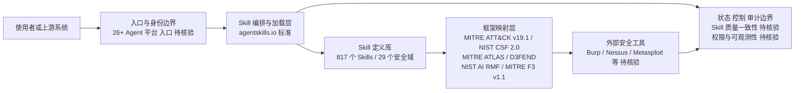

# Anthropic-Cybersecurity-Skills

## 一句话定位

817 个结构化网络安全 Skills，映射 MITRE ATT&CK v19.1、NIST CSF 2.0、MITRE ATLAS、D3FEND、NIST AI RMF 和 MITRE F3（Fight Fraud）六大框架，兼容 Claude Code、Copilot、Codex、Cursor、Gemini CLI 等 26+ 平台。

## 它解决的问题

Agent 安全能力碎片化。本仓库将安全技能标准化、模块化，覆盖 29 个安全领域，Agent 可以按需加载特定安全能力。采用 agentskills.io 标准，支持跨平台安装。

## 为什么值得关注

- **27,424 stars / 3,317 forks**，Apache-2.0，是 Agent Skills 经济中安全领域的代表性项目
- **817 个 Skills** 覆盖 29 个安全领域：渗透测试、事件响应、威胁狩猎、恶意软件分析、OSINT、云安全、DevSecOps 等
- **六大框架映射**：MITRE ATT&CK v19.1、NIST CSF 2.0、MITRE ATLAS、D3FEND、NIST AI RMF、MITRE F3 v1.1
- 兼容 26+ 平台（Claude Code、Copilot、Codex、Cursor、Gemini CLI 等）
- 新增 AI Security（12 skills）、Supply Chain Security（5 skills）、Hardware & Firmware Security（4 skills）等前沿领域

## 热度来源判断

- **安全 Skills 模块化是确定性趋势。** Agent 安全能力从"安全产品"到"安全技能"的转变
- 27K stars 来自安全社区 + Agent 社区的交叉需求
- 与 gstack 113K + mattpocock/skills 141K 并列 Agent Skills 经济三大代表
- GitHub Trending 持续出现，日增约 900 stars

## 关键技术亮点亮点

1. **6 大行业标准框架映射**：不是散乱技能集合，而是结构化映射到 MITRE/NIST 标准
2. **agentskills.io 标准兼容**：跨 26+ Agent 平台安装使用
3. **29 个安全领域覆盖**：从传统网络安全到 AI Security、供应链安全、硬件固件安全
4. **MITRE F3 欺诈框架映射**：94 个欺诈相关技能，覆盖 Positioning 和 Monetization 两大欺诈战术
5. Apache-2.0 许可证，利于企业采用

## 架构师速览

| 决策问题 | 研究判断 | 证据边界 |
|---|---|---|
| 系统边界 | 该项目是面向 26+ Agent 平台的 Skill 定义层（agentskills.io 标准），覆盖 29 个安全域，映射六大框架（MITRE ATT&CK v19.1 / NIST CSF 2.0 / MITRE ATLAS / D3FEND / NIST AI RMF / MITRE F3 v1.1），本身不内置执行器 | 档案仅声明 Skills 定义与框架映射，未提供运行时与工具权限边界，需源码核验 |
| 主路径 | Skill 选择 → Agent 运行时加载 → 调用外部安全工具/Burp/Nessus/Metasploit 等 → 结果回写会话；Python 作为 Skill 描述与脚本载体 | 主路径中"执行依赖 Agent + 工具链"为档案表述，具体协议、持久化与认证未披露 |
| 关键权衡 | 817 个 Skills 的覆盖广度（包含 AI Security、Supply Chain、Hardware/Firmware 等前沿域）与单 Skill 质量、权限边界、可观测性之间的平衡；Apache-2.0 利于采用但 27K stars 含 Agent Skills 热潮泡沫 | 数量、领域分布来自档案；质量一致性、权限模型无量化数据 |
| 最小 PoC | 在单一 Agent 渠道（如 Claude Code）下加载 1 个 ATT&CK 战术 Skill + 1 个 AI Security Skill，限定最小工具权限与可审计日志，验证框架映射准确性与调用延迟 | 仅建议性质，未提供官方示例或基准 |

## 架构启发

**安全能力模块化 = 安全产品的 Agent 化重构。** 传统安全产品是 monolithic 的，Anthropic-Cybersecurity-Skills 把安全能力拆解为可按需加载的 Skills，每个 Skill 对应一个具体安全任务。这种"安全能力即技能"的模式可以复制到其他专业领域（法务、合规、财务等）。

## 架构图（MMD）

> 证据边界：此图只采用本档案已有可核验描述；“待核验”节点不应视为项目实现事实。

## 定位判断

**工具型 → 平台候选。** 安全 Skills 模块化的代表性项目，映射行业标准框架 + 跨平台兼容，是 Agent 安全能力标准化的标志。

## 风险 / 局限 / 泡沫点

1. **817 个 Skills 的质量一致性待验证** — 数量大不等于质量高
2. **仅提供 Skills 定义，实际执行依赖 Agent + 工具链**
3. 与官方安全产品的差距：Skills 是"说明书"，不是"执行器"
4. 安全领域的特殊性：错误的安全建议可能导致严重后果
5. 27K stars 中有 Agent Skills 热潮的泡沫成分

## 与同类项目的关系

- **gstack（113K）/ mattpocock/skills（141K）**：Agent Skills 经济三大代表，分别覆盖通用和安全领域
- **anthropics/skills**：官方 Skills 仓库，本仓库是社区安全领域的补充
- **传统安全工具（Burp/Nessus/Metasploit）**：Skills 是对这些工具的 Agent 化封装层

## 是否值得持续跟踪

**是。** Agent 安全能力标准化是确定性趋势，本项目是该方向的标杆。

## 后续观察点

1. Skills 数量和质量增长（从 817 扩展到多少）
2. 企业实际采用案例（DevSecOps pipeline 集成）
3. 是否出现针对 Skills 质量的第三方评测
4. AI Security 领域 Skills 的深度（提示注入、MCP 中毒等前沿威胁）
5. 与 MITRE/NIST 框架版本的同步更新
