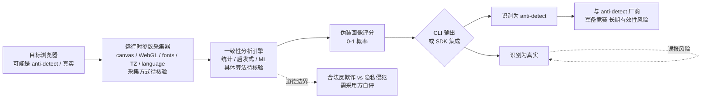

# N4darae/anti-mage

## 一句话定位
**反「anti-detect 浏览器」开源工具**——通过 runtime coherence analysis（运行时一致性分析）检测伪装浏览器指纹的工具，是 GitHub 上首个把"检测 anti-detect 浏览器"做成开源工具的项目。

## 它解决的问题
Anti-detect 浏览器（Multilogin / AdsPower / GoLogin / Dolphin Anty 等）是用于伪造浏览器指纹（canvas / WebGL / fonts / timezone / language / audio context / hardware concurrency 等）的商业产品，主要场景：(1) **跨境电商多账号运营**——同一平台多账号不被识别；(2) **社交媒体多账号管理**；(3) **反爬虫规避**——绕过网站的反爬检测；(4) **联盟营销 / 广告套利**。这类产品的存在对**反欺诈 / 反爬虫 / 风控 / 平台运营方**造成严重困扰——很难区分"真实用户"与"伪装用户"。anti-mage 直击这一痛点：通过 runtime coherence analysis 检测"浏览器各项运行时参数是否一致"——如 canvas hash 与 WebGL renderer / GPU 型号 / fonts 列表 / timezone / language 是否匹配真实硬件画像；如果不一致，识别为"伪装画像"。

## 为什么值得关注
- **Stars:** 1,419（截至 2026-09-03），12 天即破 1k⭐，**首日即达 1024⭐**——发布即爆
- **Forks:** 54，3.8% fork/star 偏低（接近"官方化工具"特征），说明主要是"使用而非修改"
- **License:** MIT
- **语言:** Go（324KB），纯 CLI / library 实现
- **活跃度:** created 2026-08-22，pushed 2026-09-02，持续高活跃
- **规模:** 324KB，单二进制 CLI 工具
- **Topics:** 无 topics（异常信号——可能是"灰色地带"项目避免 SEO）

## 热度来源判断
anti-mage 的热度是 **"反欺诈 / 反爬虫 / 风控方的真实刚需 × GitHub 上首个开源工具 × anti-detect 浏览器已成产业链"** 的组合。Anti-detect 浏览器市场规模在 2026 年估计已达数十亿美元（Multilogin 估值、AdsPower 用户量等），与之对抗的需求同样巨大——但**此前 GitHub 上无开源工具**填补这一空白。anti-mage 的 12 天 1,419⭐ 是 GitHub 上罕见的"刚需驱动"样本。3.8% fork/star 偏低说明主要是"集成使用而非 fork 修改"——典型工具型项目特征。热度**真实且具产业链价值**——但需警惕：与 anti-detect 浏览器厂商形成"检测 / 反检测"军备竞赛，长期可能失效；道德 / 法律边界（合法反欺诈 vs 隐私侵犯）需自评；无 topics（异常信号）说明可能是"灰色地带"项目避免 SEO。

## 关键技术亮点
1. **Runtime coherence analysis**——核心检测算法：检查浏览器各项运行时参数（canvas / WebGL / fonts / timezone / language / audio / hardware）的"内在一致性"，识别不匹配的伪装画像
2. **Go 实现 + 324KB 单二进制**——纯 CLI / library，可作为 SDK 集成到风控系统
3. **MIT License**——商业可用
4. **首创开源地位**——GitHub 上首个把"检测 anti-detect 浏览器"做成开源工具的项目
5. **CLI / library 形态**——可作为独立工具运行，也可作为模块集成到风控 pipeline
6. **针对 anti-detect 浏览器定向**——不针对普通 Tor / VPN 用户，专注 anti-detect 产品伪装画像

## 架构师速览

| 决策问题 | 研究判断 | 证据边界 |
|---|---|---|
| 系统边界 | 浏览器运行时参数采集层 + 一致性分析引擎 + 伪装画像识别层 + CLI / SDK 暴露层 | 四要素是 description 抽象；具体采集哪些参数（canvas / WebGL / fonts ...）、一致性算法（统计模型 / 启发式 / ML）需源码核验 |
| 主路径 | 浏览器加载检测脚本 → 采集 runtime 参数（canvas hash / WebGL renderer / fonts / timezone / language）→ 一致性分析 → 输出"伪装画像"评分 | 主路径为 description 抽象；具体采集方式（headless browser / browser extension / remote JS injection）、一致性算法阈值需 README 核验 |
| 关键权衡 | "开源检测" 普及度 vs "anti-detect 厂商快速迭代伪装算法"；"通用检测" 兼容性 vs "特定 anti-detect 产品" 精度；"MIT 商业可用" vs "合法反欺诈 vs 隐私侵犯" 道德边界 | 324KB 来自 API；MIT License 商业可用；anti-detect 浏览器厂商的反制速度决定工具长期有效性 |
| 最小 PoC | 安装 Go 工具链 → clone 仓库 → go build → 在 Multilogin / AdsPower 启动的浏览器中运行检测 → 验证"伪装画像"被识别 → 在真实 Chrome 中运行 → 验证"真实画像"被正确识别 → 评估误报率与漏报率 | 安装命令需 README 独立核验；具体 runtime 参数采集、一致性算法边界需文档指引 |

## 架构图（MMD）

> 证据边界：此图只采用本档案已有可核验描述；"待核验"节点不应视为项目实现事实。

## 架构启发

`N4darae/anti-mage` 的核心启发是 **"反 anti-detect 检测进入开源时代，runtime coherence analysis 是新武器"**。Anti-detect 浏览器（Multilogin / AdsPower / GoLogin / Dolphin Anty 等）在 2026 年已成产业链（市场规模估计数十亿美元），但反欺诈 / 反爬虫 / 风控方此前**缺乏开源工具**填补"检测 anti-detect"空白。anti-mage 首创开源地位——通过 runtime coherence analysis 检测"浏览器各项运行时参数（canvas / WebGL / fonts / timezone / language）的内在一致性"，识别不匹配的伪装画像。更深层的启发是：**"军备竞赛"型安全工具的开源化正在加速**——AI 与 anti-AI、检测与反检测、爬虫与反爬虫，每个领域都在从"商业闭源"演化为"开源 + 商业"二元格局。3.8% fork/star 偏低（接近官方化工具特征）+ 0 topics（异常信号——避免 SEO 引起 anti-detect 厂商关注）共同说明这是"灰色地带"项目，需自评法律与道德边界。

## 定位判断
**工具型 / 安全基础设施（反 anti-detect 检测）。** anti-mage 是 GitHub 上首个开源"反 anti-detect 检测"工具，定位清晰——服务"反欺诈 / 反爬虫 / 风控 / 平台运营方"。12 天 1,419⭐ + 3.8% fork/star（偏低但真实采用）+ 0 topics（避免 SEO 的"灰色地带"信号）共同说明这是个真实需求驱动的工具型项目。但工具的"长期有效性"是核心风险——anti-detect 浏览器厂商会快速迭代伪装算法。

## 风险/局限/泡沫点
- **anti-detect 厂商反制速度**——Multilogin / AdsPower / GoLogin 等厂商会快速迭代 canvas / WebGL / fonts 伪装算法，使检测规则失效
- **道德 / 法律边界**——anti-mage 服务于"反欺诈方"，但也可被用于"识别普通用户的隐私保护工具（Tor / Brave / Firefox Resist Fingerprinting）"；合法使用边界需自评
- **误报风险**——真实用户的浏览器配置可能因系统 / 扩展 / 隐私工具被误判为"伪装画像"
- **0 topics（异常信号）**——无 topics 设置，可能是"避免 SEO 引起 anti-detect 厂商关注"的策略；也可能是"项目不规范"的信号
- **个人项目属性**——N4darae 个人维护，可持续性存疑
- **无 benchmark 数据**——检测精度（误报率 / 漏报率）无公开 benchmark，需自评

## 与同类项目的关系
- **vs Multilogin / AdsPower / GoLogin（商业 anti-detect 产品）：** 商业 anti-detect 是"伪装工具"，anti-mage 是"反伪装工具"——天然对抗
- **vs FingerprintJS / Fingerprint Pro（开源 / 商业 fingerprinting）：** FingerprintJS 是"生成 fingerprint"用于用户识别，anti-mage 是"识别伪造 fingerprint"——目标相反
- **vs CreepJS（开源 browser fingerprint 检测）：** CreepJS 是"展示浏览器真实 fingerprint"，anti-mage 是"检测 fingerprint 是否被伪造"——目标不同
- **vs 浏览器反作弊 SDK（PerimeterX / DataDome 等）：** 商业 SDK 是综合反爬 / 反欺诈，anti-mage 专注于 anti-detect 检测——更垂直

## 是否值得持续跟踪
**值得跟踪（反 anti-detect 工具）。** anti-mage 是 GitHub 上首个开源"反 anti-detect 检测"工具，定位独特。对反欺诈 / 风控 / 平台运营方，这个工具是低成本试用开源方案；对安全研究者，它是"anti-detect 检测"赛道的开创样本。建议关注：(a) 检测精度是否被独立 benchmark；(c) 与 anti-detect 厂商的对抗演化；(c) 是否出现类似工具（形成"反 anti-detect 工具市场"）。

## 后续观察点
- 检测精度 benchmark（误报率 / 漏报率）是否被独立验证
- 与 anti-detect 厂商的反制 / 反反制演化（被 anti-detect 厂商识别并规避的概率）
- 是否出现类似工具形成"反 anti-detect 工具市场"
- 是否被商业风控 / 反欺诈平台收购或集成
- 是否被滥用（识别普通用户隐私工具）导致法律 / 道德争议

---
> 数据来源: GitHub API (2026-09-03) | Stars: 1,419 | Forks: 54 | License: MIT | 语言: Go | 创建: 2026-08-22