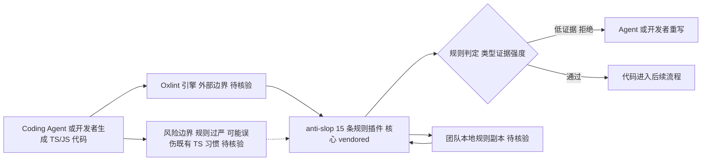

# dmmulroy/anti-slop

## 一句话定位
一组有主见的 Oxlint 自定义规则，用静态分析拒绝 Coding Agent 常见的"低证据"TypeScript/JavaScript 代码模式（如链式类型断言伪造证据、运行时 typeof 窄化、Reflect.apply 绕过类型系统等 15 条），以 Agent Skill 格式安装——代表"Coding Agent 输出治理从'能写代码'进入'写得靠谱'成熟阶段"的工具化。

## 它解决的问题
Coding Agent（Claude Code、Codex、Cursor 等）能快速生成代码，但生成的代码常包含"看起来能工作但类型证据薄弱"的模式——链式类型断言（`as unknown as Foo`）、运行时 typeof 检查、Reflect.apply 绕过、条件空对象展开等。这些模式在人类 review 中容易被忽略，但在大规模 Agent 生成代码中积累后会导致类型安全性退化。anti-slop 解决的是：**用静态分析规则系统性地拒绝这些低证据模式，迫使 Agent（或人类）写出类型证据更强的代码。**

## 为什么值得关注（2026-08-13）
- **品类信号：** anti-slop 是今日涌现的"Coding Agent 治理工具群"代表（同日还有 claudish-to-english、HERO-Anti-OverDefense）。三者从代码质量、可读性、行为约束切入，暗示 Agent 输出治理成为新需求。
- **设计理念明确：** README 强调"vendored, not treated as a fixed npm dependency"——鼓励团队复制规则后根据自身标准修改，而非依赖上游。这是对"lint 规则应是团队资产"理念的工具化。
- **Agent Skill 安装：** `npx skills add dmmulroy/anti-slop --skill install-anti-slop`，Agent 自动复制插件、安装依赖、合并配置、启用所有规则、验证结果。
- **作者 dmmulroy：** 有 skills.sh 平台集成（README badge 可核验），在 Agent Skill 生态有一定活跃度。

## 热度来源判断
**判断：真实需求驱动（Agent 输出治理是新品类），但极早期。** 290 stars / 5 forks / 1 issue 说明项目首日发布，社区刚开始关注。热度来自"Coding Agent 生成的低质量代码"这一广泛痛点——随着 Agent 生成代码占比上升，"代码证据治理"需求真实存在。但首日数据不足以判断是否形成持久品类。

## 关键技术亮点
1. **15 条有主见的 Oxlint 规则（README 可核验）：**
   - `no-chained-type-assertions` — 拒绝嵌套类型断言伪造证据
   - `no-conditional-empty-object-spread` — 拒绝用 `{}` 条件展开省略字段
   - `no-known-value-widening` — 拒绝显式宽类型丢弃已知值证据
   - `no-module-mocking` — 拒绝 Vitest/Jest 模块 mock，提倡真实依赖接缝
   - `no-object-parameters` — 拒绝函数输入用宽泛 `object` 类型
   - `no-reflect-apply/get` — 拒绝 Reflect 绕过，提倡类型化调用
   - `no-runtime-typeof` — 要求边界解析而非临时 typeof 窄化
   - `no-shape-in-symbol-names`、`no-unknown-parameters/returns/type-aliases`、`no-unsafe-dictionary-type`、`no-widen-then-assert`、`require-safety-comment-for-type-assertion` 等
2. **Oxlint 插件架构：** 基于 Oxlint（Rust 编写的 JS/TS linter）的自定义插件，性能远超 ESLint。
3. **Vendored 设计：** 鼓励复制修改而非依赖更新，规则成为团队内部资产。
4. **Agent Skill 自动安装：** 一条命令完成插件安装、配置合并、规则启用、结果验证。

## 架构师速览

| 决策问题 | 研究判断 | 证据边界 |
|---|---|---|
| 系统边界 | anti-slop 是 Oxlint 自定义规则插件（TypeScript），以 Agent Skill 形态安装；外部边界为 Oxlint 引擎与下游 Agent CLI（Claude Code/Codex/Cursor 等使用方）。 | 边界仅来自 README 列出的 Oxlint 依赖与 Agent Skill 安装方式，未审计源码。 |
| 主路径 | Coding Agent 生成 TS/JS 代码 → Oxlint 引擎加载 anti-slop 15 条规则 → 静态分析拒绝低证据模式（链式断言、typeof 窄化、Reflect.apply、模块 mock 等） → 在 Agent 或人类编辑流程中强制重写。 | 路径基于 README 描述的规则集与"在 lint 阶段拒绝"的定位；具体拦截点与 IDE/Agent hook 集成方式未在档案中证实。 |
| 关键权衡 | "证据强度"的强约束 vs 团队既有 TS 编码习惯的兼容性；vendored（鼓励复制改）vs 上游同步更新；Oxlint 性能红利 vs Oxlint 生态覆盖未成熟。 | 权衡仅基于 README 中"vendored, not fixed dependency"、15 条规则枚举与 Oxlint 插件架构描述，无性能基准或采用率数据。 |
| 最小 PoC | 在一个 TS 项目中通过 `npx skills add dmmulroy/anti-slop` 安装插件，跑一次 Oxlint，验证 `no-chained-type-assertions`、`no-runtime-typeof`、`no-reflect-apply` 三条代表性规则是否触发预期报错并阻断构建。 | PoC 步骤直接引自 README 的 Agent Skill 安装命令与 15 条规则清单；具体配置合并与冲突解决行为以安装后实际输出为准。 |

## 架构启发
anti-slop 的核心启发是 **"Agent 生成代码需要新的静态分析维度——'证据强度'"**。传统 lint 规则关注"代码风格"和"常见错误"，而 anti-slop 关注"类型证据的强度"——代码是否用类型断言伪造了不存在的安全性？是否用 Reflect 绕过了类型系统？这种"证据导向"的 lint 理念是 Agent 时代的新需求：当大量代码由 Agent 生成时，"代码是否经得起类型推敲"比"代码风格是否一致"更重要。

## 架构图（MMD）

> 证据边界：此图只采用本档案已有可核验描述；“待核验”节点不应视为项目实现事实。

## 定位判断
**工具型（Agent 输出治理品类，极早期）。** anti-slop 代表"Coding Agent 治理工具群"的代码质量维度。其价值取决于 Agent 生成代码占比的增长——若 Agent 生成的代码成为主流，"证据导向 lint"可能成为标配。当前定位是"Agent 时代 lint 规则的早期探索者"。

## 风险 / 局限 / 泡沫点
- **极早期：** 首日 290 stars / 5 forks，尚无社区验证。是否形成持久品类需后续观察。
- **规则有主见：** 15 条规则中的部分（如 `no-object-parameters`、`no-module-mocking`）可能过于严格，不适合所有团队。"有主见"既是卖点也是局限。
- **Oxlint 生态依赖：** 依赖 Oxlint 生态发展，若 Oxlint 未大规模采用，anti-slop 的覆盖面受限。
- **品类竞争不确定：** 若 ESLint 或 TypeScript 本身增加类似规则，anti-slop 可能被上游吸收。

## 与同类项目的关系
- **vs ESLint/Oxlint 内置规则：** 内置规则关注通用代码质量；anti-slop 专注"Agent 生成代码的低证据模式"，维度不同。
- **vs claudish-to-english（同日）：** claudish-to-english 治理 Agent 输出的"可读性"（AI 术语翻译为英语）；anti-slop 治理"代码证据强度"。两者从不同角度治理 Agent 输出。
- **vs HERO-Anti-OverDefense（同日）：** HERO 约束 Agent 的"行为"（过度防御）；anti-slop 约束 Agent 的"代码模式"。互补。

## 是否值得持续跟踪
**值得跟踪（Agent 治理品类信号）。** anti-slop 是"Coding Agent 治理工具群"的代表项目之一。无论其本身成败，"Agent 输出需要新的治理工具"这一方向值得观察。建议关注：Oxlint 生态增长、是否被主流 Agent 平台（Claude Code/Codex）集成、规则集是否被团队实际采用。

## 后续观察点
- star/fork 增速（首日 290，是否持续增长验证品类需求）
- 是否出现更多"Agent 代码治理"类工具（品类形成信号）
- Oxlint 生态增长趋势
- 是否被 Claude Code / Codex / Cursor 等 Agent 平台官方推荐
- 规则集是否被团队实际采用（vs 仅 star 不使用）

---
> 数据来源: GitHub API (2026-08-13) | Stars: 290 | Forks: 5 | Open Issues: 1 | License: MIT | 语言: TypeScript | 创建: 2026-08-12 | 作者: dmmulroy
