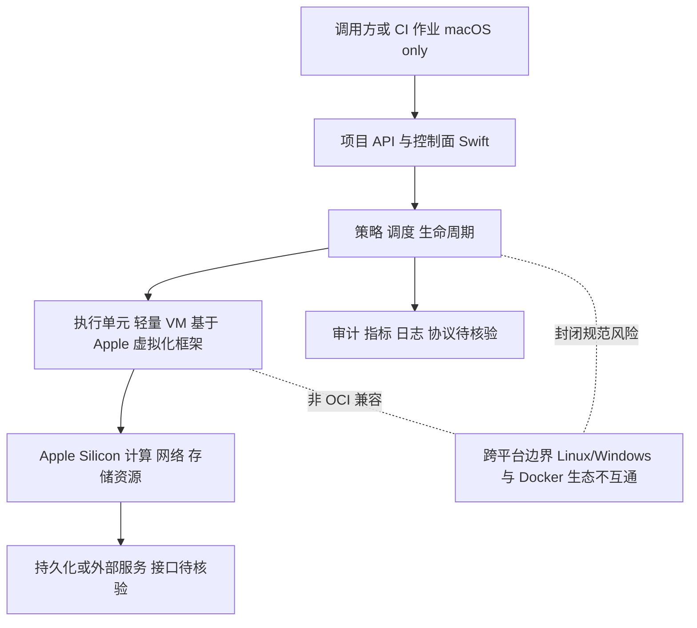

# apple/container

## 一句话定位
Apple 官方开源的 Linux 容器运行时，Swift 编写，基于轻量虚拟机，Apple Silicon 原生优化。

## 它解决的问题
macOS 开发者需要运行 Linux 容器但受限于 Docker Desktop 的性能开销、许可限制和与 Apple 生态的割裂感。apple/container 提供了 Apple 原生的容器方案，无需依赖第三方工具。

## 为什么值得关注（2026-06-12）
日增 2,419 stars，总量 32,164。这是 Apple 官方开源项目，不是社区项目。标志着 Apple 正式进入容器化基础设施领域，对 macOS 开发环境有深远影响。

## 热度来源判断
**真实需求 + Apple 品牌效应。** macOS 开发者对 Docker Desktop 的不满长期积累（性能、资源占用、许可变更）。Apple 官方方案的出现满足了"原生容器"的真实需求。32K stars 中有相当比例是"终于等到"的情绪释放，但底层需求是真实的。

## 关键技术亮点亮点
1. **轻量 VM 析构：** 不是模拟 Docker 的全功能容器引擎，而是基于 Apple 的轻量虚拟化框架
2. **Apple Silicon 原生优化：** 直接利用 M 系列芯片的虚拟化加速能力
3. **Swift 实现：** 和 Apple 生态深度集成，不是"移植"方案
4. **非 Docker 兼容路线：** 选择了自己的容器规范，而非兼容 OCI 标准

## 架构师速览

| 决策问题 | 研究判断 | 证据边界 |
|---|---|---|
| 系统边界 | 边界为：调用方（开发者/CI） → 控制面（API、策略、调度） → 执行单元（轻量 VM） → Apple Silicon 资源（虚拟化框架）；非 Linux/Windows、非 OCI 兼容路径明确排除。 | 基于档案明示的 Swift 实现、Apple Silicon 优化、虚拟化框架、非 OCI 路线；具体 IPC/RPC 协议、控制面接口契约未在档案中给出，需源码核验。 |
| 主路径 | 调用方发起请求 → API/控制面接收 → 策略与调度决定生命周期 → 轻量 VM 执行单元承载 Linux 工作负载 → 写入 macOS 主机资源；旁路审计/指标/日志、持久化与外部服务。 | 路径节点与档案“架构启发”“主路径”描述一致；具体镜像格式、镜像拉取协议、卷/网络插件机制档案未述，待核验。 |
| 关键权衡 | 放弃 OCI/Docker 生态兼容以换取 Apple Silicon 原生性能与生态整合，对应代价是跨平台能力丧失与生态惯性风险。 | 权衡来自档案“非 Docker 兼容路线”“macOS only”“封闭路线风险”；未提供基准性能数据，性能优势未量化。 |
| 最小 PoC | 在 Apple Silicon macOS 上以单一 Linux 工作负载验证：启动延迟、冷启动开销、隔离边界（VM 级隔离）、资源占用、CLI 体验、可观测出口，并预留退出路径以保留切换 OrbStack/Docker Desktop 的能力。 | PoC 范围对齐档案“采用建议”最小执行单元压测；SLO、安全模型、镜像兼容性矩阵档案未给出，须先小规模验证。 |

## 架构启发
Apple 正在构建从芯片→OS→运行时→容器的完整开发者基础设施栈。这种垂直整合策略和 Apple 在 GPU→Metal→SwiftUI 的路径一致。对架构师而言：
- macOS 上的开发环境配置将更简单
- CI/CD 中 macOS runner 的容器化方案将更成熟
- 但跨平台容器方案仍是 Docker 的天下

## 架构图（MMD）

> 证据边界：此图只采用本档案已有可核验描述；“待核验”节点不应视为项目实现事实。

## 定位判断
macOS 开发环境的容器化标准。不是 Docker 的替代品，而是 Apple 生态内的容器运行时。定位类似于 Apple Silicon 上的 Rosetta 2——不是通用方案，但在 Apple 生态内体验最好。

## 风险 / 局限 / 泡沫点
1. **macOS only：** 不支持 Linux 和 Windows，无法成为跨平台容器标准
2. **生态惯性：** Docker 生态（compose、registry、swarm）的惯性极强
3. **非 OCI 兼容：** 可能和现有容器工具链不兼容
4. **封闭路线风险：** Apple 的容器规范可能保持封闭

## 与同类项目的关系
- **vs. Docker Desktop：** Docker Desktop 跨平台但重，apple/container 轻但 macOS only
- **vs. OrbStack：** OrbStack 是第三方轻量替代，apple/container 是官方方案
- **vs. colima：** colima 是社区方案，apple/container 有原生性能优势

## 是否值得持续跟踪
**是。** 作为 Apple 官方容器方案，对 macOS 开发环境的影响是长期的。

## 后续观察点
1. 是否支持 OCI 标准镜像格式
2. 与 Xcode Cloud 的集成程度
3. 社区是否围绕它构建 compose-like 工具

---
*首次记录：2026-06-12*
