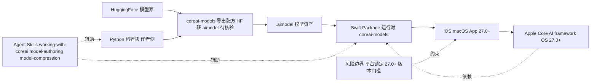

# Apple Core AI Models

## 一句话定位
Apple 端侧 AI 开发者基础设施——模型导出配方（HuggingFace → Core AI `.aimodel`）+ Python 构建块 + Swift 运行时 + Agent Skills，macOS/iOS 27.0+ 上运行。

## 它解决的问题
开发者想在 Apple 设备上跑开源 AI 模型（LLM、扩散模型等），但缺乏标准化的导出→部署→运行链路。Apple Core AI framework 提供了底层能力，但缺开发者工具链。coreai-models 填补了这个空白。

## 为什么值得关注（2026-06-19）
- Apple 官方仓库，非社区第三方——意味着长期维护和生态投入
- 包含 Agent Skills（working-with-coreai, model-authoring, model-compression）
- 支持 Claude Code 插件市场注册——Apple 开始适配 Agent 生态
- macOS/iOS 27.0+ 要求说明 Apple 在 WWDC 2026 后全面推进端侧 AI

## 热度来源判断
Apple 品牌效应 + 开发者对端侧 AI 的真实需求。1,064 stars 对于 Apple 官方仓库来说不算爆发，但这是基础设施层，不是应用层——长期价值远高于 star 数暗示的。

## 关键技术亮点亮点
1. **模型导出配方** — 从 HuggingFace 模型到 Core AI `.aimodel` 格式的标准化流水线
2. **Python 构建块** — PyTorch 模型作者可以直接用 Python 写 Core AI 兼容模型
3. **Swift 运行时** — `coreai-models` Swift Package，直接集成到 iOS/macOS App
4. **Agent Skills 集成** — 3 个官方 Skill 让 Coding Agent 像专家一样使用 Core AI

## 架构师速览

| 决策问题 | 研究判断 | 证据边界 |
|---|---|---|
| 系统边界 | 端侧 AI 工具链：HuggingFace 模型源 → 导出为 `.aimodel` → Python 构建块 → Swift Package 运行时 → iOS/macOS App；仅服务 Apple 平台 | 平台范围（macOS/iOS 27.0+）、`.aimodel` 闭环、Swift/Python 双语言见档案；模型覆盖数量、AGENTS/Skill 内部结构未在档案中给出 |
| 主路径 | 模型作者路径：HuggingFace → coreai-models 导出配方 → `.aimodel` 资产 → 通过 Swift Package 集成到 App → 在 Core AI framework 上运行；Agent Skills 作为辅助开发路径 | `.aimodel` 格式、HuggingFace 来源、Swift Package 集成、Core AI framework 依赖均见档案；具体 API、推理调度、量化流水线在档案中未证实 |
| 关键权衡 | 平台锁定（仅 Apple）与端侧体验/性能/官方支持之间的取舍；同时与跨平台方案（MLX、ONNX、llama.cpp）在覆盖广度上的取舍 | 锁定、Apple 官方、Agent Skills、MLX/ONNX/llama.cpp 关系均见档案；性能、量化水平、能耗等基准未在档案中给出 |
| 最小 PoC | 在 macOS 27.0+ 上选一个 HuggingFace 模型，按导出配方生成 `.aimodel`，通过 Swift Package 集成到最小 App，验证加载与推理；同步在 Claude Code 接入三个 Agent Skills 评估开发体验 | HuggingFace 入口、Python 构建块、Swift Package、Agent Skills 名称见档案；具体 PoC 跑通标准（延迟、内存、模型清单）需以源码/文档为准 |

## 架构启发
Apple 的端侧 AI 策略是 **全栈控制**：芯片（Apple Silicon）→ OS（macOS/iOS 27 Core AI framework）→ 工具链（coreai-models）→ 开发体验（Agent Skills）。这种垂直整合是 Apple 一贯的策略，但在 AI 时代意味着开发者如果绑定 Core AI，就绑定了整个 Apple 生态。

## 架构图（MMD）

> 证据边界：此图只采用本档案已有可核验描述；“待核验”节点不应视为项目实现事实。

## 定位判断
coreai-models 是 **Apple 端侧 AI 的 Xcode**——不是模型本身，而是让开发者能高效使用模型的工具链。如果 Apple 端侧 AI 生态成熟，coreai-models 将成为不可或缺的基础设施。

## 风险 / 局限 / 泡沫点
1. **平台锁定** — `.aimodel` 格式只支持 Apple 平台
2. **macOS/iOS 27.0+ 要求** — 需要最新系统版本，用户覆盖率有限
3. **模型覆盖** — 目前支持的模型数量未知，可能有限
4. **与 ONNX/MLX 竞争** — 已有跨平台方案

## 与同类项目的关系
- **vs MLX** — MLX 是 Apple 的机器学习框架，coreai-models 是部署工具链，互补关系
- **vs ONNX Runtime** — ONNX 跨平台，Core AI 只支持 Apple 但体验更好
- **vs llama.cpp** — llama.cpp 通用但需要自己管理模型格式，Core AI 标准化但锁定 Apple

## 是否值得持续跟踪
**是。** Apple 官方出品 + Agent Skills 集成 = 端侧 AI 基础设施的重要变量。

## 后续观察点
1. 支持的模型列表增长速度
2. 是否有企业级使用案例
3. Agent Skills 是否扩展到更多场景
4. 与 MLX 的长期关系

---
*首次记录：2026-06-19*
