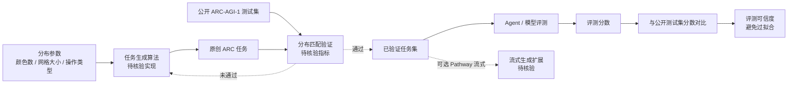

# pathwaycom/arc-task-gen

## 一句话定位
Pathway 官方开源的 ARC-AGI-1 风格任务生成器——生成与公开评测集分布匹配的原创 ARC 任务，为 ARC-AGI 类基准评测提供"无限测试集"，避免过拟合固定测试集。

## 它解决的问题
ARC-AGI（Abstraction and Reasoning Corpus，François Chollet 2017 提出）2023-2024 年成为 AGI 类基准评测的标志性数据集，公开训练 / 评测集已成为 Kaggle 类竞赛、研究者评测、企业 agent 选型的标准工具。但其固定测试集带来真实风险：(1) **过拟合风险**——模型 / agent 可通过记忆测试集而非真正泛化获得高分；(2) **评估可信度下降**——多次重复评测后可信度衰减；(3) **稀缺性瓶颈**——固定测试集难以支持大规模 agent 选型。pathwaycom/arc-task-gen 解决的是 **"ARC-AGI 类基准的合成数据生成 + 分布匹配"** 基础设施，让"无限测试集"成为可能。

## 为什么值得关注（2026-08-31）
- **Stars:** 9,054（截至 2026-08-31），**27 天起步**
- **Forks:** 60（偏低，反映核心用户仍是研究圈而非大众开发者）
- **Watchers/Subscribers:** 14
- **License:** MIT
- **语言:** Python
- **活跃度:** created 2026-08-04，pushed 2026-08-11，**27 天增长但近 20 天无 push**——提示活跃度近期下降
- **规模:** 643 KB（小型 Python 工具）
- **Open Issues:** 1（极低，反映项目稳定或用户尚未规模化）
- **Topics:** 为空（但描述明确）
- **发布渠道:** GitHub 主仓库，无独立主页
- **Pathway 官方背书:** Pathway（实时数据处理框架厂商）官方出品

## 热度来源判断
arc-task-gen 的热度是 **"ARC-AGI 评测可信度痛点 × Pathway 官方背书 × MIT 友好许可 × 27 天 9k⭐ 增长"** 的组合。9,054⭐ / 27 天说明：(1) 真实需求——ARC-AGI 类基准评测的合成数据生成是被低估的痛点；(2) 品牌背书——Pathway 官方出品（Pathway 在实时数据处理领域有一定知名度）；(3) 时机契合——ARC-AGI 公开赛 + AGI 概念热度高涨；(4) 低门槛采用——MIT + Python + 643 KB 极小项目。热度**真实但用户群偏窄**——60 forks / 14 watchers / 1 open issue 反映核心用户是研究圈而非大众开发者；pushed 距今 20 天（8-11）也提示近期活跃度下降。

## 关键技术亮点
1. **ARC-AGI-1 风格任务生成**：与公开评测集分布匹配的原创任务生成，避免过拟合固定测试集
2. **Pathway 框架支持**：基于 Pathway 实时数据处理框架，可扩展为流式生成
3. **MIT 许可**：低门槛采用，研究者可自由 fork / 修改
4. **Python 实现 + 643 KB 极小项目**：纯算法工具，无需重型基础设施
5. **"分布匹配"宣称**：与公开评测集分布匹配——具体分布指标（颜色 / 形状 / 网格大小 / 操作复杂度）需 README 独立核验
6. **Pathway 官方品牌背书**：区别于个人研究项目，有持续维护可能

## 架构师速览

| 决策问题 | 研究判断 | 证据边界 |
|---|---|---|
| 系统边界 | 任务生成器核心（输入：分布参数 → 输出：原创 ARC 任务）+ 分布匹配验证层（待核验）+ 可选 Pathway 流式生成扩展（待核验） | 任务生成 + 分布匹配是 description 明示；Pathway 流式扩展 / 验证层是否独立模块需源码核验 |
| 主路径 | 输入分布参数（颜色数 / 网格大小 / 操作类型）→ 任务生成算法 → 输出原创 ARC 任务 → 与公开评测集分布对比 → 验证匹配度 | 分布匹配是 description 明示；任务生成算法的具体实现（约束求解 / 神经网络 / 规则引擎）需源码核验 |
| 关键权衡 | 分布匹配精度 vs 任务原创性 vs 生成速度 vs ARC 任务复杂度上限 vs 抗过拟合性 vs 数据集偏见 | 643 KB 来自 API；"分布匹配"是 README 自述宣称，独立基准测试（与公开评测集的分布指标 KL 散度）需第三方复现 |
| 最小 PoC | 安装 arc-task-gen → 生成 100 个 ARC 任务 → 与公开评测集对比分布指标（颜色 / 形状 / 网格）→ 用现有 SOTA 模型评测 → 与公开测试集分数对比，验证是否避免了过拟合 | 任务生成 API 调用方式 / 分布对比工具 / 评测脚本需 README 独立核验 |

## 架构启发
arc-task-gen 的核心启发是 **"AI 基准评测必须有自己的合成数据生成器，否则会被过拟合吞噬"**。ARC-AGI 公开测试集已被多次用于 Kaggle 竞赛 / 论文评测，**固定测试集的'可信度半衰期'问题**——这是 AI 评测领域的普遍痛点（ImageNet / GLUE / MMLU 都经历过类似过程）。arc-task-gen 的价值在于把"无限测试集"作为基础设施提供，让评测者可以持续验证模型是否真正泛化。**更深层的启发是"基准评测工具链的成熟度反映 AI 研究阶段"**——从 ImageNet（图像分类）→ GLUE（NLP）→ MMLU（综合知识）→ ARC-AGI（抽象推理）→ 合成数据生成（评测可信度），每个阶段的工具链成熟度反映该方向的研究深度。**对比：** GLUE 已被 SuperGLUE / BIG-bench 部分取代，因前者被过拟合吞噬；arc-task-gen 走的是"为 ARC-AGI 提供合成数据"的前瞻路径。

## 架构图（MMD）

> 证据边界：此图只采用本档案已有可核验描述；"待核验"节点不应视为项目实现事实。

## 定位判断
**工具型项目（ARC-AGI 类基准评测的合成数据生成器）。** arc-task-gen 不仅是研究工具，更试图成为 ARC-AGI 类评测的"基础设施"——类比 GLUE 之于 NLP 评测。9,054⭐ / 27 天 + Pathway 官方背书 + MIT 友好许可显示其工具价值。但"基础设施"取决于几个关键问题：(1) 分布匹配精度是否真达宣称水平（需第三方独立基准）；(2) 任务复杂度上限是否覆盖 SOTA 模型所需难度；(3) 抗过拟合性是否真有效（需长周期评测验证）；(4) Pathway 团队的持续投入承诺。目前定位是"ARC-AGI 类基准的合成数据生成工具"，向评测基础设施演进是合理路径。

## 风险/局限/泡沫点
- **27 天增长但近 20 天无 push**：活跃度近期下降，可能预示开发节奏放缓
- **60 forks 偏低**：反映核心用户仍是研究圈而非大众开发者
- **"分布匹配"宣称复现风险**：与公开评测集的具体分布指标（颜色 / 形状 / 网格大小 / 操作复杂度）匹配度需第三方独立基准
- **任务复杂度上限未明确**：若生成任务过于简单，无法挑战 SOTA 模型，工具价值有限
- **抗过拟合性需长周期验证**：避免过拟合是设计目标，但需要长周期（数月）第三方独立评测才能验证
- **Pathway 团队投入承诺**：Pathway 主要业务是实时数据处理框架，arc-task-gen 是其 AGI 评测方向的延伸项目，长期投入承诺未明确
- **Topics 为空**：项目自定位不清晰，社区发现性受影响

## 与同类项目的关系
- **vs ARC-AGI 公开测试集（Chollet 团队）：** 公开测试集是固定测试集；arc-task-gen 是其合成数据替代
- **vs ImageNet / GLUE / MMLU 合成数据工具：** 同类合成数据生成器，但针对 ARC-AGI 垂直领域
- **vs SuperGLUE / BIG-bench：** GLUE 的后继 / 综合基准；arc-task-gen 是评测可信度工具而非评测本身
- **vs Kaggle ARC-AGI 竞赛：** 竞赛使用固定测试集；arc-task-gen 是其可信度增强工具
- **vs EvalGauntlet / HELM：** 综合模型评测框架；arc-task-gen 是垂直领域（ARC-AGI）合成数据工具

## 是否值得持续跟踪
**值得跟踪（ARC-AGI / AGI 类基准评测的合成数据基础设施）。** arc-task-gen 代表"AI 基准评测的合成数据生成"作为独立赛道首次出现，无论其本身成败，这一方向是行业趋势。建议关注：Pathway 团队持续投入承诺、27 天无 push 后是否会重启开发节奏、"分布匹配"宣称的独立基准验证、是否有 SOTA 模型使用 arc-task-gen 进行评测并发表结果。对 ARC-AGI 研究者，arc-task-gen 是当前最直接的合成数据生成工具。对 AI 评测基础设施观察者，它是"基准评测合成数据"赛道的标杆样本。

## 后续观察点
- Pathway 团队持续投入承诺与项目活跃度恢复
- "分布匹配"宣称的独立基准验证（KL 散度 / Wasserstein 距离等）
- 任务复杂度上限与 SOTA 模型评测覆盖度
- 抗过拟合性的长周期第三方独立评测
- 是否被 ARC-AGI 类 Kaggle 竞赛或研究者论文采用
- 与 SuperGLUE / BIG-bench 等综合评测工具的关系（互补 / 替代）
- Pathway 主线业务调整对 arc-task-gen 维护的影响

---
> 数据来源: GitHub API (2026-08-31) | Stars: 9,054 | Forks: 60 | License: MIT | 语言: Python | 创建: 2026-08-04 | Pushed: 2026-08-11