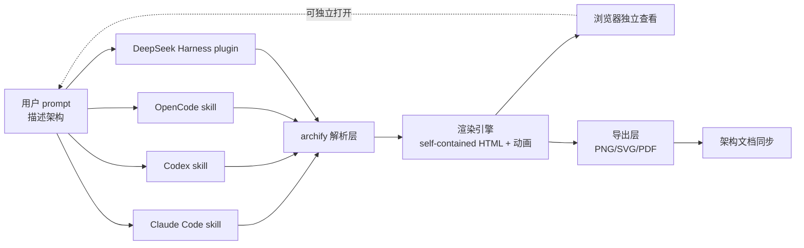

# tt-a1i/archify

## 一句话定位
Agent Skill 级的可验证架构图标准——self-contained HTML（含动画 + 干净导出），覆盖 arch / workflow / sequence / data-flow / lifecycle 五类图；多 Agent Harness 适配（Claude Code / Codex / OpenCode / DeepSeek Harness），4 个月增长到 30k+⭐。

## 它解决的问题
当前 AI Coding 时代缺一个"会画可验证架构图"的通用工具：(1) **Mermaid / PlantUML 等 DSL 缺少可验证性**——语法错就崩，无法与架构文档同步；(2) **现有图工具不友好 AI Agent**——Figma / draw.io 等桌面 / Web 工具不是 Agent Skill 形式，无法被 Claude Code / Codex 直接调用；(3) **跨 Harness 不可移植**——单一平台的 skill 无法覆盖 Claude Code + Codex + OpenCode + DeepSeek Harness 多 Agent 生态。archify 直接把这三类问题工程化：用单一 self-contained HTML 输出（含动画 + PNG/SVG/PDF 导出）+ 多 Harness 适配，把"画架构图"做成可被 AI Agent 直接消费的 Skill 形式。

## 为什么值得关注（2026-08-30）
- **Stars:** 30,833（截至 2026-08-30），**4 个月起步**，处于"爆发性增长"阶段——在 GitHub Trending 日榜持续高位
- **Forks:** 1,922，社区二次使用率极高
- **License:** MIT——下游商业可采用
- **语言:** JavaScript（含大量示例 HTML + 渲染引擎）
- **活跃度:** created 2026-04-15，pushed 2026-08-29，持续高活跃
- **规模:** 99 MB（含大量示例图与可能的渲染资源）
- **发布渠道:** Topics 明示 `claude-skill` / `codex` / `opencode` / `deepseek-harness` / `dsh-plugin`（DeepSeek Harness plugin）五个明确接入面
- **Topics 完整覆盖:** `agent-skills` / `architecture-as-code` / `architecture-diagram` / `code-visualization` / `data-flow-diagram` / `diagram-as-code` / `diagrams-as-code` / `mermaid-alternative` / `sequence-diagram` / `software-architecture` / `system-design` / `text-to-diagram`

## 热度来源判断
archify 的热度是 **"AI Coding 时代缺可验证架构图工具 × Agent Skill 形式 × 多 Harness 适配 × Mermaid alternative 定位"** 的强组合。30,833⭐/4 个月 + 1,922 forks 说明：(1) 真实需求——开发者用 AI Coding 工具时，需要快速画出可被代码 / 文档同步的架构图；(2) 网络效应——Agent Skill 类项目天然适合社区贡献（每个贡献者都可写一个特定场景的 skill）；(3) 跨 Harness 适配——Claude Code / Codex / OpenCode / DeepSeek Harness 四大主流 Harness 全覆盖，开发者无需为不同 Agent 重写图工具。热度**真实且具网络效应潜力**——但需警惕：Mermaid / PlantUML 可能推出 AI Coding 集成版本被官方吸收；4 个月数据不足以判断长期采用曲线。

## 关键技术亮点
1. **多图类型覆盖**：arch / workflow / sequence / data-flow / lifecycle 五类——覆盖软件架构图的全部主要场景
2. **self-contained HTML 输出**：单 HTML 文件 + 动画 + 干净导出（PNG/SVG/PDF），可在浏览器独立打开，无需服务器
3. **多 Agent Harness 适配**：Claude Code skill + Codex + OpenCode + DeepSeek Harness plugin（`dsh-plugin` 明确标识）——四大主流 Harness 全覆盖
4. **Mermaid alternative 定位**：Topics 明示 `mermaid-alternative`——自视为 Mermaid 的可执行 / 可验证替代品
5. **architecture-as-code 范式**：Topics 明示 `architecture-as-code` / `diagrams-as-code`——架构图作为代码的核心抽象
6. **大文件 + 高 Forks**：99 MB + 1,922 forks——含大量示例 + 社区二次使用率极高

## 架构师速览

| 决策问题 | 研究判断 | 证据边界 |
|---|---|---|
| 系统边界 | Agent Skill 层（输入：用户文本 / 代码 / prompt）→ 解析层（理解意图）→ 渲染引擎（self-contained HTML 输出）→ 导出层（PNG/SVG/PDF） | 五类图 + 多 Harness 适配是 Topics 明示；"verifiable"具体含义（diff 算法 / lint 集成 / 与架构文档同步）需源码核验 |
| 主路径 | 用户描述架构 → archify 解析 prompt → 渲染 self-contained HTML（带动画）→ 浏览器独立查看 + 一键导出 | self-contained HTML + 导出是 README 明示；Mermaid alternative 的具体语法差异未公开 |
| 关键权衡 | 自包含 HTML（零外部依赖）vs 文件大小（99 MB 包含示例与资源）vs 浏览器渲染性能 vs 跨 Harness 适配的维护成本 vs 与官方图工具（Mermaid / PlantUML）的竞争 | 99 MB 来自 API 自述；渲染性能基准未给量化数据；跨 Harness 同步维护策略未公开 |
| 最小 PoC | 在 Claude Code 上加载 archify skill，描述一个 5 组件的微服务架构 → 验证产出 self-contained HTML 在浏览器可独立打开 + 动画可播放 → 验证 PNG/SVG/PDF 导出可读 | Claude Code skill 安装命令是 Topics 明示；具体 skill 加载方式 / 命令需 README 独立核验 |

## 架构启发
archify 的核心启发是 **"AI Coding 时代缺的不是新工具，而是 Agent Skill 形式的旧工具"**。Mermaid / PlantUML 是经典图工具，但它们是 DSL 而非 Agent Skill——AI Agent 无法直接消费 DSL。archify 的创新不在于"图语法"，而在于"把图工具做成 Agent Skill"——这是 2026 下半年最重要的工具范式转移。更深层的启发是 **"Agent Skill 是新插件格式"**——4 个月 30k⭐ 证明 Skill 形式的分发效率远高于传统插件；类似 React Native 之于移动开发的"一次编写多平台适配"思路，archify 走的是"一次 Skill 多 Harness 适配"。1,922 forks 反映这是社区驱动的成功，下一波可能是"任何已有成熟工具 → Agent Skill"的项目井喷。

## 架构图（MMD）

> 证据边界：此图只采用本档案已有可核验描述；"待核验"节点不应视为项目实现事实。

## 定位判断
**工具型项目（Agent Skill 形式的多 Harness 架构图标准）。** archify 不仅是图工具，更是 Agent Skill 时代的"图标准"——若成功，会成为 AI Coding 工作流的"画架构图"默认入口。30k⭐/4 个月 + 1,922 forks 已显示网络效应雏形 + 大厂（DeepSeek）官方集成（`dsh-plugin`）。但"标准"取决于一个关键问题：能否在 Mermaid / PlantUML 推出 AI Coding 集成版本前占据用户心智。目前定位是"AI Coding 时代的可验证架构图先驱"，向标准演进是合理路径。

## 风险/局限/泡沫点
- **4 个月数据不足以判断长期采用曲线**：30k⭐ 是爆发力，但 Agent Skill 类项目的长期活跃度是真正的考验——若 6 个月后不再高频更新，可能回落
- **Mermaid / PlantUML 的官方吸收风险**：Mermaid 已支持 GitHub / VS Code 渲染，PlantUML 生态成熟；若任一推出 Agent Skill 集成版本，archify 的"mermaid-alternative"定位可能被吸收
- **99 MB 仓库大小的可维护性**：含大量示例与渲染资源，若缺乏结构化归档，新贡献者上手成本高
- **跨 Harness 适配的维护成本**：Claude Code / Codex / OpenCode / DeepSeek Harness 四个平台 API 与 skill 机制各异，持续同步是工程负担
- **个人项目属性**：tt-a1i 个人维护，1,922 forks 但核心治理集中，可持续性存疑
- **"verifiable"具体机制未公开**：宣称"verifiable architecture diagrams"但具体验证机制（diff 算法 / lint 集成 / 与架构文档同步）需源码核验

## 与同类项目的关系
- **vs Mermaid / PlantUML：** 经典图 DSL 生态成熟，但缺 Agent Skill 形式；archify 自视为 mermaid-alternative
- **vs Figma / draw.io：** 桌面 / Web 工具，UI 友好但 Agent 不可消费；archify 走 Skill 路线
- **vs K-Dense-AI/scientific-agent-skills（8-27）：** 同样 Agent Skills 类项目，但 K-Dense-AI 偏科学领域，archify 偏软件架构
- **vs 8-28 s0xDk/refactoring-ui-skill：** 同样"已有方法论 → Agent Skill"路径，但 s0xDk 转写 Refactoring UI 书，archify 自创新工具
- **vs wshobson/agents：** wshobson 是 Agent Skills 聚合市场，archify 是单一 Skill 产品
- **vs JetBrains/go-modern-guidelines（今日）：** JetBrains 官方"Go 现代化指南"的 skill 形式代表大厂入场 Agent Skill 路径

## 是否值得持续跟踪
**值得跟踪（Agent Skill 时代图工具的潜在标准）。** archify 代表"AI Coding 时代图工具的 Agent Skill 化"方向，无论其本身成败，这一方向是行业趋势。建议关注：Mermaid / PlantUML 是否推出 AI Coding 集成版本（决定 archify 的"Mermaid alternative"命运）、跨 Harness 适配的维护策略（是否聚焦少数 Harness 以保证深度）、是否有大厂（JetBrains / GitHub）入场这一路径。对 AI Coding 开发者，archify 是当前画出可被 AI 消费架构图的最佳工具。对工具观察者，它是"Agent Skill 形式"路径的成功样本。

## 后续观察点
- 是否出现"archify 兼容层"——让 Mermaid / PlantUML 也能被 Agent 消费
- 跨 Harness 适配的维护策略（是否聚焦 Claude Code + Codex 两个主流 Harness）
- "verifiable"具体机制落地（diff 算法 / lint 集成 / 与代码同步）
- 是否被 JetBrains / GitHub / DeepSeek 等大厂官方集成
- 大文件仓库的可持续维护性（99 MB 包含示例的结构化归档）
- 30k⭐/4 个月增长曲线能否在 6 个月后保持稳定

---
*首次记录：2026-08-30*