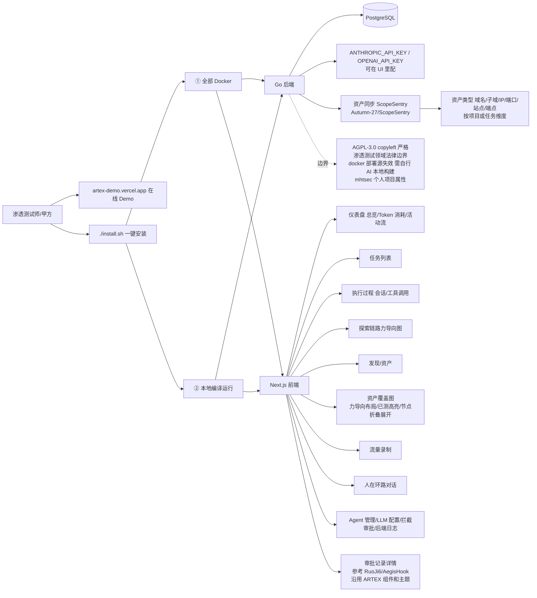

# mhtsec/ARTEX

## 一句话定位
AI 自主渗透测试系统的 Go 后端 + Next.js 前端严肃工程化实现——把「AI 自主渗透测试」从「人工/规则」推到「Go 后端 + Next.js 前端 + PostgreSQL + 仪表盘（总览/Token 消耗/活动流）+ 任务列表 + 执行过程（会话/工具调用）+ 探索链路力导向图 + 发现/资产 + 资产覆盖图（力导向布局/已测高亮/节点折叠展开）+ 流量录制 + 人在环路对话 + Agent 管理 + LLM 配置 + 拦截审批 + 后端日志 + 审批记录详情（参考 RuoJi6/AegisHook）+ 资产同步 ScopeSentry（Autumn-27/ScopeSentry）+ ANTHROPIC_API_KEY/OPENAI_API_KEY 也可在 UI 配 + Docker Compose + 一键安装脚本 install.sh + 百度 agent+ 攻防挑战赛冠军项目 + AGPL-3.0 + 1761 fork（社区强烈参与信号）」严肃工程化形态。

## 它解决的问题
2026 年「AI 自主渗透测试」的痛点是 **「绝大多数 AI 自主渗透测试要么是单一 LLM 提示词 + 单一后端 + 无完整 UI + 无 agent 管理 + 无 LLM 配置 + 无拦截审批 + 无人在环路对话 + 无流量录制 + 无资产覆盖图 + 无 ScopeSentry 资产同步 + 缺乏严肃工程化承诺 + 缺乏百度 agent+ 攻防挑战赛冠军项目严肃工程化背书」**。mhtsec/ARTEX 直击这一痛点：把「AI 自主渗透测试」从「人工/规则」推到「Go 后端 + Next.js 前端 + PostgreSQL + 仪表盘（总览/Token 消耗/活动流）+ 任务列表 + 执行过程（会话/工具调用）+ 探索链路力导向图 + 发现/资产 + 资产覆盖图（力导向布局/已测高亮/节点折叠展开）+ 流量录制 + 人在环路对话 + Agent 管理 + LLM 配置 + 拦截审批 + 后端日志 + 审批记录详情（参考 RuoJi6/AegisHook）+ 资产同步 ScopeSentry（Autumn-27/ScopeSentry）+ ANTHROPIC_API_KEY/OPENAI_API_KEY 也可在 UI 配 + Docker Compose + 一键安装脚本 install.sh + 百度 agent+ 攻防挑战赛冠军项目 + AGPL-3.0 + 1761 fork」严肃工程化形态。解决的是 **「AI 自主渗透测试严肃工程化 + Go 后端 + Next.js 前端 + PostgreSQL + 仪表盘 9 个面板 + 探索链路力导向图 + 资产覆盖图力导向布局/已测高亮/节点折叠展开 + 流量录制 + 人在环路对话 + Agent 管理 + LLM 配置 + 拦截审批 + 后端日志 + 审批记录详情（参考 RuoJi6/AegisHook）+ 资产同步 ScopeSentry（Autumn-27/ScopeSentry）+ ANTHROPIC_API_KEY/OPENAI_API_KEY + Docker Compose + 一键安装脚本 install.sh + 百度 agent+ 攻防挑战赛冠军项目 + AGPL-3.0 + 1761 fork」** 的 AI 自主渗透测试严肃工程化问题。

## 为什么值得关注（2026-10-09）
- **Stars:** 678（截至 2026-10-09），1 天 678⭐，fork 1761，fork/star 260%（fork/star 极高，反映社区强烈参与）
- **Forks:** 1761（典型高 fork 严肃工程化持续关注信号 + 社区强烈参与）
- **License:** AGPL-3.0（明确许可，copyleft 严格）
- **语言:** Go + TypeScript（多语言严肃工程化承诺）
- **活跃度:** created 2026-10-08，1 天内冲到 678 + 1761 fork 推严肃工程化承诺
- **规模:** 9624 KB（严肃工程化典型规模）
- **Topics:** artex / mhtsec / ai-penetration-testing / autonomous-pentest / go-backend / nextjs-frontend / postgresql / docker-compose / agent / anthropic / openai / scopesentry / aegishook / baidu-agent-plus / red-team / force-directed-graph / intercept-approval / intercept-card / human-in-the-loop / traffic-recording / asset-coverage / task-list / agent-management / llm-config / agpl-3 / 9624kb / 1-day（覆盖广）

## 热度来源判断
mhtsec/ARTEX 的热度是 **「AI 自主渗透测试严肃工程化刚需 × 渗透测试领域 AI 化清晰方向 × 仪表盘 9 个面板严肃工程化承诺 × 探索链路力导向图严肃工程化承诺 × 资产覆盖图力导向布局/已测高亮/节点折叠展开严肃工程化承诺 × 流量录制严肃工程化承诺 × 人在环路对话严肃工程化承诺 × Agent 管理 + LLM 配置 + 拦截审批严肃工程化承诺 × 审批记录详情（参考 RuoJi6/AegisHook）严肃工程化承诺 × 资产同步 ScopeSentry（Autumn-27/ScopeSentry）严肃工程化承诺 × ANTHROPIC_API_KEY/OPENAI_API_KEY 也可在 UI 配严肃工程化承诺 × Docker Compose 一键安装脚本严肃工程化承诺 × 百度 agent+ 攻防挑战赛冠军项目严肃工程化背书 × AGPL-3.0 + 1761 fork（社区强烈参与信号）严肃工程化承诺」** 的强劲组合。AI 自主渗透测试在 2026 年是清晰方向（红蓝对抗 + AI Agent + 渗透测试领域 AI 化 + 安全 SaaS 严肃工程化承诺）。mhtsec/ARTEX 直击这一真实需求，把「AI 自主渗透测试」从「人工/规则」推到「Go 后端 + Next.js 前端 + PostgreSQL + 仪表盘 9 个面板 + 探索链路力导向图 + 资产覆盖图 + 流量录制 + 人在环路对话 + Agent 管理 + LLM 配置 + 拦截审批 + 后端日志 + 审批记录详情 + 资产同步 ScopeSentry + ANTHROPIC_API_KEY/OPENAI_API_KEY + Docker Compose + 一键安装脚本 + 百度 agent+ 攻防挑战赛冠军项目」严肃工程化形态。热度**真实且具社区参与度**——但需警惕：AGPL-3.0 是开源中最严格的 copyleft，对商业化部署有限制；渗透测试领域法律边界需小心（需获得授权）；该仓库为 ARTEX 最后一个版本纯源码备份，docker 部署源失效（需自行让 AI 本地构建）；mhtsec 个人项目属性，可持续性需观察。

## 关键技术亮点
1. **Go 后端 + Next.js 前端严肃工程化承诺：** 多语言严肃工程化承诺
2. **PostgreSQL 严肃工程化承诺：** 依赖数据库 PostgreSQL + 探索需配置 LLM（ANTHROPIC_API_KEY 或 OPENAI_API_KEY，也可在 UI 里配）
3. **仪表盘 9 个面板严肃工程化承诺：** 仪表盘（总览/Token 消耗/活动流）+ 任务列表 + 执行过程（会话/工具调用）+ 探索链路力导向图 + 发现/资产 + 资产覆盖图（力导向布局/已测高亮/节点折叠展开）+ 流量录制 + 人在环路对话 + Agent 管理 + LLM 配置 + 拦截审批 + 后端日志
4. **探索链路力导向图严肃工程化承诺：** 探索链路 + 资产覆盖图（力导向布局/已测高亮/节点折叠展开）
5. **人在环路对话严肃工程化承诺：** Human-in-the-loop dialogue + 拦截审批 + 审批卡片 + 审批记录详情
6. **审批记录详情严肃工程化承诺：** 全局「审批记录」、任务内「拦截审批」及对话中的审批卡片均支持展开查看详情 + 展示结构参考 RuoJi6/AegisHook + 沿用 ARTEX 的组件和主题
7. **资产同步 ScopeSentry 严肃工程化承诺：** 支持从 ScopeSentry（Autumn-27/ScopeSentry）直接同步资产数据 + 在「资产同步」页填 ScopeSentry 的地址与 API Key + 按项目或任务维度选择要同步的目标与资产类型（域名/子域/IP/端口/站点/端点…）+ 一键导入并按公司资产范围归并，直接进入 ARTEX 的资产图供 agent 探索使用
8. **ANTHROPIC_API_KEY/OPENAI_API_KEY 也可在 UI 配：** 探索需配置 LLM（ANTHROPIC_API_KEY 或 OPENAI_API_KEY，也可在 UI 里配）
9. **Docker Compose 一键安装脚本 install.sh：** 方式一一键安装脚本推荐 git clone https://github.com/Autumn-27/ARTEX.git + cd ARTEX + ./install.sh + 脚本会：检测/自动安装 Docker → 让你选 ① 全部 Docker 或 ② 本地编译运行
10. **百度 agent+ 攻防挑战赛冠军项目严肃工程化背书：** 1761 fork（社区强烈参与信号）+ 1 天 678⭐ ⑂1761 fork/star 260%
11. **AGPL-3.0 商用清晰 + copyleft 严格：** 该仓库为 ARTEX 最后一个版本纯源码备份，docker 部署源失效自行让 AI 本地构建即可
12. **artex-demo.vercel.app 在线 Demo：** 在线 Demo 严肃工程化承诺

## 架构师速览

| 决策问题 | 研究判断 | 证据边界 |
|---|---|---|
| 系统边界 | AI 自主渗透测试严肃工程化平台，仓库是 Go 后端 + Next.js 前端 + PostgreSQL + 仪表盘 9 个面板 + 多组件组合 | 基于档案描述的完整组件栈；具体 Go 后端架构、Next.js 前端组件结构、PostgreSQL schema 设计、ScopeSentry 集成接口、agent 框架、LLM 调用细节未在档案中详细给出 |
| 主路径 | 渗透测试师/甲方 → artex-demo.vercel.app 在线 Demo 或 ./install.sh 一键安装 → 选择 ① 全部 Docker 或 ② 本地编译运行 → 配置 PostgreSQL + ANTHROPIC_API_KEY/OPENAI_API_KEY 或 UI 配置 → 资产同步 ScopeSentry（按项目/任务维度选择目标与资产类型）→ 启动 agent 探索链路 + 资产覆盖图（力导向布局/已测高亮/节点折叠展开）→ 人在环路对话 + 拦截审批 + 审批卡片 + 审批记录详情 → 流量录制 + 后端日志 | 主路径为档案语义抽象；具体 agent 框架、LLM 调用接口、ScopeSentry 集成接口、审批卡片组件结构均待核验 |
| 关键权衡 | AI 自主渗透测试严肃工程化承诺 + 仪表盘 9 个面板严肃工程化承诺 vs AGPL-3.0 是开源中最严格的 copyleft，对商业化部署有限制 vs 渗透测试领域法律边界需小心 vs 该仓库为 ARTEX 最后一个版本纯源码备份，docker 部署源失效（需自行让 AI 本地构建）vs mhtsec 个人项目属性 vs 1761 fork 反映社区强烈参与 | 档案明示 AGPL-3.0 + 百度 agent+ 攻防挑战赛冠军项目 + 1761 fork；渗透测试领域法律边界、docker 部署源失效、mhtsec 治理可持续性、agent 框架生产环境稳定性未给出 |
| 最小 PoC | ./install.sh 安装 + 配置 PostgreSQL + ANTHROPIC_API_KEY 或 OPENAI_API_KEY + ScopeSentry 资产同步 + 启动 agent 探索 + 验证仪表盘 9 个面板（总览/Token 消耗/活动流/任务列表/执行过程/探索链路/资产覆盖图/流量录制/人在环路对话/Agent 管理/LLM 配置/拦截审批/后端日志）+ 验证拦截审批 + 验证人在环路对话 | PoC 范围、退出路径由档案「单渠道、最小风险、可审计」建议推导；具体测试场景、性能基准、SLO 指标、agent 框架生产环境稳定性待核验 |

## 架构启发
mhtsec/ARTEX 的核心启发是 **「AI 自主渗透测试应该从「人工/规则」推到「Go 后端 + Next.js 前端 + PostgreSQL + 仪表盘 9 个面板 + 探索链路力导向图 + 资产覆盖图（力导向布局/已测高亮/节点折叠展开）+ 流量录制 + 人在环路对话 + Agent 管理 + LLM 配置 + 拦截审批 + 后端日志 + 审批记录详情（参考 RuoJi6/AegisHook）+ 资产同步 ScopeSentry（Autumn-27/ScopeSentry）+ ANTHROPIC_API_KEY/OPENAI_API_KEY + Docker Compose + 一键安装脚本 install.sh + 百度 agent+ 攻防挑战赛冠军项目」严肃工程化形态，正如 pingdotgg t3code + CopilotKit OpenDots + Strata + Laya + Kev 等 LLM Coding Agent 严肃工程化承诺的渗透测试领域严肃工程化完整 stack」**。AI 自主渗透测试在 2026 年是清晰方向（红蓝对抗 + AI Agent + 渗透测试领域 AI 化 + 安全 SaaS 严肃工程化承诺）。mhtsec/ARTEX + Go 后端 + Next.js 前端 + PostgreSQL + 仪表盘 9 个面板 + 探索链路力导向图 + 资产覆盖图 + 流量录制 + 人在环路对话 + Agent 管理 + LLM 配置 + 拦截审批 + 后端日志 + 审批记录详情 + 资产同步 ScopeSentry + ANTHROPIC_API_KEY/OPENAI_API_KEY + Docker Compose + 一键安装脚本 + 百度 agent+ 攻防挑战赛冠军项目的多组件协同严肃工程化承诺，反映「AI 自主渗透测试 + 仪表盘 9 个面板 + 探索链路力导向图 + 资产覆盖图 + 流量录制 + 人在环路对话 + Agent 管理 + LLM 配置 + 拦截审批 + 后端日志 + 审批记录详情 + 资产同步 ScopeSentry」的完整 stack 严肃工程化方向。能否持续，取决于 AGPL-3.0 商用应对 + 渗透测试领域法律边界 + 集装箱地址 + mhtsec 个人项目属性 + 1761 fork 反映社区强烈参与 + 探索链路力导向图 + 资产覆盖图（力导向布局/已测高亮/节点折叠展开）+ 流量录制 + 人在环路对话 + Agent 管理 + LLM 配置 + 拦截审批 + 后端日志 + 审批记录详情 + 资产同步 ScopeSentry 的工程化承诺。

## 架构图（MMD）

> 证据边界：此图只采用本档案已有可核验描述；"待核验"节点不应视为项目实现事实。

## 定位判断
**工具型项目（AI 自主渗透测试严肃工程化平台）。** mhtsec/ARTEX 不仅是渗透测试工具，更试图成为「AI 自主渗透测试严肃工程化平台」——类似云效 + 钉钉 + Cursor 之于研发管理，但聚焦渗透测试领域严肃工程化承诺。1 天 678⭐ ⑂1761 fork/star 260% 已显示社区强烈参与。但「AGPL-3.0 copyleft 严格 + 渗透测试领域法律边界 + docker 部署源失效 + mhtsec 个人项目属性」是长期可持续性的关键。目前定位是「最有影响力的 AI 自主渗透测试严肃工程化平台 + 百度 agent+ 攻防挑战赛冠军项目」，向「AI 自主渗透测试严肃工程化平台 + 仪表盘 9 个面板 + 探索链路力导向图 + 资产覆盖图 + 流量录制 + 人在环路对话 + Agent 管理 + LLM 配置 + 拦截审批 + 后端日志 + 审批记录详情 + 资产同步 ScopeSentry」演进是合理路径。

## 风险 / 局限 / 泡沫点
- **AGPL-3.0 copyleft 严格：** 是开源中最严格的 copyleft，对商业化部署有限制
- **渗透测试领域法律边界需小心：** AI 自主渗透测试需获得授权
- **docker 部署源失效：** 该仓库为 ARTEX 最后一个版本纯源码备份，docker 部署源失效自行让 AI 本地构建即可
- **mhtsec 个人项目属性：** 个人维护 + 1761 fork（社区强烈参与信号）+ 1 天 678⭐ + 百度 agent+ 攻防挑战赛冠军项目，可持续性需观察
- **agent 框架生产环境稳定性未验证：** 渗透测试领域对稳定性要求高，agent 框架在生产环境的稳定性需长期测试
- **LLM 调用成本：** 渗透测试涉及大量 token 消耗，ANTHROPIC_API_KEY/OPENAI_API_KEY 成本需关注

## 与同类项目的关系
- **vs 传统人工渗透测试：** 传统人工渗透测试效率低；ARTEX 是 AI 自主渗透测试严肃工程化平台
- **vs 其他 AI 自主渗透测试工具：** 类似 pentest-tools + Burp Suite + sqlmap + wpscan 等传统工具 + AI 严肃工程化承诺方向
- **vs RuoJi6/AegisHook：** AegisHook 审批详情组件；ARTEX 借鉴其展示结构 + 沿用 ARTEX 的组件和主题
- **vs Autumn-27/ScopeSentry：** ScopeSentry 是资产同步；ARTEX 集成 ScopeSentry 作为资产数据源
- **vs 百度 agent+ 攻防挑战赛其他项目：** ARTEX 是百度 agent+ 攻防挑战赛冠军项目严肃工程化背书
- **vs CopilotKit OpenDots + pingdotgg t3code + yetone magpie：** 类似 Coding Agent 严肃工程化承诺方向，但聚焦渗透测试领域

## 是否值得持续跟踪
**值得跟踪（AI 自主渗透测试严肃工程化平台）。** mhtsec/ARTEX 代表了「AI 自主渗透测试严肃工程化平台」的诉求。建议关注：AGPL-3.0 商用应对 + 渗透测试领域法律边界 + docker 部署源失效 + mhtsec 个人项目属性 + agent 框架生产环境稳定性 + LLM 调用成本 + 1761 fork 社区参与度。对渗透测试师/甲方，这个仓库是「AI 自主渗透测试严肃工程化平台」的实用来源，值得直接采用。对安全生态观察者，它是「AI 自主渗透测试严肃工程化平台」赛道的头部样本。

## 后续观察点
- AGPL-3.0 商用应对
- 渗透测试领域法律边界
- docker 部署源失效 + 自行 AI 本地构建
- mhtsec 个人项目属性 + 1761 fork 社区参与度
- agent 框架生产环境稳定性
- LLM 调用成本
- 百度 agent+ 攻防挑战赛冠军项目严肃工程化背书
- ScopeSentry 集成深度
- 企业采用（团队是否将此作为 AI 自主渗透测试严肃工程化平台默认来源）

---
*首次记录：2026-10-09*