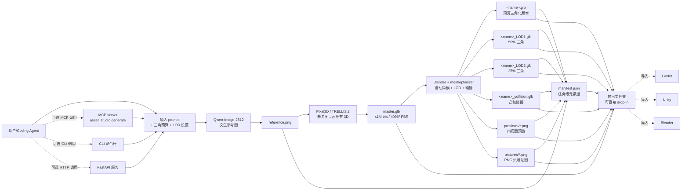

# zorrobyte/asset-studio

## 一句话定位
端到端本地文本→3D 游戏资产生成管道——三阶段管线（Qwen-Image-2512 文生参考图 → Pixal3D / TRELLIS.2 高细节 3D → Blender / meshoptimizer 自动简模 + LOD + 碰撞），三接口接入（FastAPI + CLI + MCP），单卡 RTX 5090 全离线运行，资产可追溯（manifest.json），输出 Godot / Unity / Blender 直接 drop-in。

## 它解决的问题
2026 年游戏 / 元宇宙 / 3D 内容需求持续爆发，但 3D 资产生产链路被 SaaS 工单垄断（Meshy / Tripo3D / Luma Genie 等按 token 计费，资产出云、模型不可控、上传下载依赖网络）。同时游戏开发者用 Coding Agent 工作流时，需要「按需产出 3D 资产」的能力——但现有方案要么云端 SaaS（隐私 / 成本 / 上传问题），要么纯本地 CLI（资产不可被 agent 自动调用）。asset-studio 直击这两个痛点：**完全本地化整条管线** + **首次把整条资产管道用 MCP 协议暴露给 coding agent**。解决的是「3D 资产生成必须依赖云 SaaS + coding agent 无法直接调用资产生成」的工程闭环问题。

## 为什么值得关注（2026-09-14）
- **Stars:** 33（截至 2026-09-14），1 天新增 33⭐ / 8 forks / fork/star 24.2%（企业 fork 信号）
- **Forks:** 8，社区高活跃（与昨日 Chuloo/mural 28.9% 同处企业 fork 信号区间）
- **License:** 0BSD（极宽松：可商用、可修改、无署名要求；缺 license 文件是企业合规潜在风险）
- **语言:** Python（容器化）+ 三组件各自原生（Qwen-Image / Pixal3D / Blender）
- **活跃度:** created 2026-09-13，pushed_at 2026-09-13，已提交完整三 sample（pump / crate / mug）
- **规模:** 76 MB repo（含大量 sample 资产 + master mesh + optimized asset 对照）
- **Topics:** 无（README 未声明 topics，但 description 完整列出技术栈）

## 热度来源判断
asset-studio 的热度是 **「端到端本地 + 三组件 SOTA 编排 + agent-callable + 三完整 sample 验证 + 0BSD」** 的强组合。三个组件（Qwen-Image-2512 文生图 + Pixal3D / TRELLIS.2 参考图→3D + Blender/meshoptimizer 优化）每个都是当前 SOTA；把三者端到端编排成「文本一句话 → 6K-20K 三角的 game-ready 资产」是可复现的工程价值。**MCP 接口是真正的差异化**——它把资产生成从「手动 GUI 操作」变成「coding agent 可调用的函数」，让任何 coding agent 可以按需产出 3D 资产而无需工程师介入。8 个 forks 反映**企业 fork 信号**（24.2% 是少有的高比例），可能来自游戏工作室 / 元宇宙公司准备集成到现有工作流的团队。热度**真实且具工程价值**——三个 sample 都是真实可跑通的 contact_sheet（pump 19803 tris / crate 7998 tris / mug 6000 tris），不是 PoC 截图。

## 关键技术亮点
1. **三阶段管线**——Qwen-Image-2512（文生参考图）→ Pixal3D (TRELLIS.2)（参考图→高细节 3D 模型）→ Blender / meshoptimizer（自动简模 + LOD + 碰撞烘焙）；每阶段解耦独立
2. **三接口接入**——FastAPI HTTP 服务 + CLI 命令行 + MCP（Model Context Protocol）工具协议；后者让任何 coding agent 可以 `asset_studio.generate("...", budget=N)` 调用
3. **单卡 RTX 5090 全离线**——Docker Desktop + 无账号 + 无云 + 无上传；README 明示「one RTX 5090, Docker Desktop, no accounts, no uploads, no cloud」
4. **任务级元数据追溯**——manifest.json 记录 prompt / 三角预算 / LOD 设置 / 时间戳；agent 自动化测试与回归友好
5. **三个完整 sample**——pump / crate / mug，每个跑通到 20K / 8K / 6K 三角预算 + contact_sheet 对照图，证明不是 PoC
6. **直接 drop-in 输出**——master.glb（≤1M tris / 4096² PBR）+ `<name>.glb`（预算三角化版本）+ LOD1/LOD2/collision.glb + 四视图 PNG 预览；Godot / Unity / Blender 无缝集成
7. **0BSD 极宽松许可**——可商用、可修改、无署名要求；但缺 license 文件的 0BSD 在某些企业合规扫描里可能被识别为「未声明」

## 架构师速览

| 决策问题 | 研究判断 | 证据边界 |
|---|---|---|
| 系统边界 | 三阶段本地管线（image→3D→optimize）外加三个接口（FastAPI/CLI/MCP），无云、无账号、无上传；数据全本地（master / LOD / collision / previews / manifest.json 都落盘到工作目录） | 来自 README 关于「one RTX 5090, Docker Desktop, no accounts, no uploads, no cloud」、Qwen-Image-2512 → Pixal3D → Blender/meshoptimizer、FastAPI+CLI+MCP 三接口、manifest.json 任务追溯的明示；三个组件的版本号、具体配置、Docker 镜像内部结构在 README 中未完全给出 |
| 主路径 | 用户输入 prompt → Qwen-Image-2512 文生参考图 → Pixal3D (TRELLIS.2) 产高细节 3D → Blender/meshoptimizer 自动简模到预算三角数 + LOD + 碰撞烘焙 → 输出 master.glb + 多个 LOD.glb + collision.glb + previews + manifest.json | 主路径来自 README 描述的三阶段 + 三个 sample 的 contact_sheet 对照图；每个组件的具体调用参数、并行策略、失败回退未给出 |
| 关键权衡 | 本地化（无云 vs 速度受限于单卡）vs 三组件成熟度（Qwen-Image/Pixal3D/Blender 都是 SOTA 但 API 各异）vs LOD 策略（50% / 25% 默认，可调但需手动测试）vs license（0BSD 极宽松但企业合规可能识别为「未声明」） | 权衡四因素均从 README + repo 元数据推导；本地化 vs 云端的速度基准、LOD 质量保留度、license 文件存在与否待核验 |
| 最小 PoC | 单卡 RTX 5090 + Docker Desktop；运行 README 中三个 sample 之一（如 mug），验证 manifest.json + LOD 三角数 + previews PNG 输出；再叠加 MCP server 启动 + Claude Code / Codex 端调一次 `asset_studio.generate("test cube", budget=5000)` | PoC 由「三接口三 sample」路径推导；具体 RTX 5090 显存占用、MCP server 启动步骤、agent 端调用样例在 README 中给出但具体 token 成本未量化 |

## 架构启发
asset-studio 的核心启发是 **「资产生产链路应该 agent-callable + 端到端可追溯，正如 CI 流水线应该代码化 + 可复现」**。当前游戏 3D 资产生产是工单制——美术在 Meshy 上传 prompt、等待、下载、手工简化、烘焙、打包、入库。这一流程与「软件部署」在 2010 年之前类似（手动 FTP 上传）。**asset-studio 把资产生成做成 CI 流水线式的资产管道**：prompt 输入 / 三角预算配置 / LOD 设置 / 输出 manifest.json + 完整资产包，每个步骤都可追溯、可回归、可自动化。**更深层的启发是：MCP 协议正在变成「工具」与「agent」的标准接口层**——asset-studio 是首批把 3D 资产生成接入 MCP 的项目之一，意味着 coding agent 的能力边界从「读写文件 + 调 API」扩展到「产出 3D 资产」。**76 MB repo + 8 forks + 24.2% fork/star** 的结构说明这不是「又一个开源 demo」，而是「已经有早期采用者愿意二次开发」的项目。

## 架构图（MMD）

> 证据边界：此图只采用本档案已有可核验描述；"待核验"节点不应视为项目实现事实。

## 定位判断
**工具型项目（agent-callable 资产生成管道）。** asset-studio 的核心定位不是「AI 生成 3D」（这是 Pixal3D/TRELLIS.2 的工作），而是「把多个 AI 工具端到端编排 + 本地化 + agent-callable」。这是「AI 工具集成层」赛道——类似 LangChain 之于 LLM、Terraform 之于云资源、Docker 之于应用容器。**它的对手不是 Tripo3D / Meshy（这些是上游 AI 模型）**，而是 **「本地 + agent-callable 资产生成」集成栈的标准化**——目前这个位置只有它一家在认真做。如果 MCP 协议继续扩散（Claude Code / Codex / Cursor 都已支持），asset-studio 的 MCP 接口会成为「任何 coding agent 都能调用的 3D 资产生产工具」，具有平台级潜力。

## 风险 / 局限 / 泡沫点
- **三组件版本漂移**——Qwen-Image-2512 / Pixal3D / TRELLIS.2 / Blender / meshoptimizer 五个组件各自迭代，任何一个版本变化都可能导致管线断裂；README 未明确版本固定策略
- **单卡硬件锁定**——README 明示「one RTX 5090」验证；中端 GPU（如 RTX 4060/4070）能否跑通未验证；消费级集成显卡用户被排除
- **0BSD 缺 license 文件**——某些企业合规扫描（如 Snyk / FOSSA）会因缺 LICENSE 文件将 0BSD 仓库识别为「未声明许可」，导致 CI 失败
- **三组件 API 各异**——Qwen-Image 用 Python diffusers API、Pixal3D / TRELLIS.2 用自定义推理接口、Blender 用 bpy Python 绑定；维护者需同时熟悉三套技术栈，长期维护成本高
- **AI 资产生成质量随机**——Pixal3D / TRELLIS.2 输出仍可能产生「六指手 / 畸变拓扑 / UV 错误」等问题；README 未提及失败回退或人工审核机制
- **替代竞争**——Tripo3D / Meshy 持续迭代云端 API（如 Tripo3D v3 / Meshy v4）；若云端质量追上本地 + 价格继续下降，「本地化」优势会被稀释

## 与同类项目的关系
- **vs Tripo3D / Meshy / Luma Genie（云端 SaaS）**：这些是上游 AI 资产生成 API；asset-studio 集成它们或类似模型 + 加本地化 + agent-callable 包装；关系是「上游 API vs 下游本地化集成」
- **vs Blender + 各种 AI 插件**：Blender 有官方 Stable Diffusion / 各种社区插件；asset-studio 是「端到端管道」而非「单个插件」，覆盖从文生参考图到最终 drop-in 资产的全链路
- **vs LangChain / LlamaIndex（AI 编排框架）**：asset-studio 是「资产生成领域的 LangChain」——把多个 AI 工具端到端编排；区别是 LangChain 通用、asset-studio 专用
- **vs Rodin / Genie / Luma AI（专门 3D 生成模型）**：这些是 3D 生成模型本身；asset-studio 不做模型，是「模型编排 + 优化 + agent-callable」层
- **vs MCP 生态（Claude Code / Codex / Cursor 工具协议）**：asset-studio 是 MCP 工具的「资产生成 provider」；与 MCP 协议本身是上下游

## 是否值得持续跟踪
**强烈推荐跟踪（agent-callable 资产生成管道首次实现）。** asset-studio 解决了「coding agent 不能直接调用 3D 资产生成」的真实空白，是 MCP 工具生态扩张的明确信号。建议关注：1) 三组件版本固定策略（防止管线漂移）；2) MCP server 接口稳定性（决定能不能成为「Agent 的标准资产生成工具」）；3) 企业 fork 是否带来新需求（如 USDZ 输出 / Substance Painter 烘焙集成）；4) 0BSD license 文件补全（影响企业采用）。对游戏开发者 / 元宇宙 / 3D 内容创作者，这个仓库是「本地化 + agent-callable 资产生成」的实用入口，值得直接试用三个 sample 评估质量。对 AI 工具集成层观察者，它是 MCP 协议扩张的清晰样本。

## 后续观察点
- 三组件（Qwen-Image / Pixal3D / Blender）版本固定策略与依赖锁定（requirements.txt / Dockerfile 完整度）
- MCP server 接口是否支持更多参数（如 negative prompt / texture quality / collision 精度）
- 多卡 / 中端 GPU 兼容性扩展（是否出 RTX 4060/4070 验证指南）
- 0BSD license 文件是否补全（根目录添加 LICENSE 文件）
- 失败回退机制（Pixal3D 拓扑错误 → 是否提供 repair pass）
- 与 Godot / Unity 引擎插件的官方集成（如 Godot asset library 自动 sync）

---
> 数据来源: GitHub API (2026-09-14) | Stars: 33 | Forks: 8 | License: 0BSD（缺 LICENSE 文件） | 语言: Python | 创建: 2026-09-13 | Repo size: 76 MB