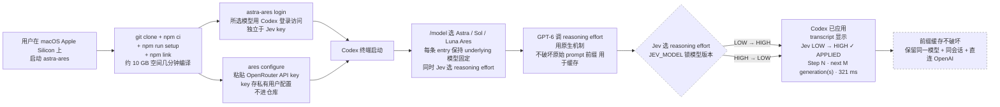

# miuuyy/Astra-Ares

## 一句话定位
GPT-6 Codex 任务自适应推理 effort（Jev 选 effort）——用 GPT-6 原生机制（reasoning effort 改变不破坏前缀缓存）+ Jev 在 Codex 任务里动态选 effort + 不动原有 codex 与 Codex desktop + OpenRouter 默认 + transcript 显示 `Jev LOW → HIGH ✓ APPLIED`。

## 它解决的问题
同一任务不同阶段需不同推理 effort（简单步骤 low / 复杂决策 high）+ 手动 `/model` 切 effort 不及时 + 换模型破坏会话前缀缓存 + 独立 OpenRouter key 管理 + Codex desktop 不动 + 显示应用状态让用户看得见。它解决的是「Codex 任务动态推理 effort + 不破坏会话前缀缓存 + 显示应用状态 + OpenRouter 默认 + macOS Apple Silicon 已 acceptance-test」五件事一次解决的真痛点。

## 为什么值得关注
- **Stars:** 234（截至 2026-09-24），2 天突破 234，增速较快
- **Forks:** 15，社区贡献较活跃
- **Watchers/Subscribers:** 2（公开 API 字段）
- **Open Issues:** 4，维护良好
- **License:** MIT
- **语言:** JavaScript（含 patch + setup scripts）
- **活跃度:** created 2026-09-22，pushed_at 2026-09-23，持续高活跃
- **规模:** 716KB，极小 JavaScript 项目
- **Topics:** 无（未填写 GitHub topics）

## 热度来源判断
miuuyy/Astra-Ares 的热度是 **「GPT-6 reasoning effort 会话中途改变原生机制 × Jev 决策模型集成 × Codex 任务动态切 effort × 不破坏前缀缓存 × 显示应用状态让用户看得见 × OpenRouter 默认 funded credits × macOS Apple Silicon 已本地构建测试」** 的强劲组合。Codex 是 2026 年最热 Coding Agent，但任务里不同阶段需不同推理 effort，手动 `/model` 切不及时且换模型破坏会话前缀缓存。GPT-6 原生机制（reasoning effort 改变不破坏前缀缓存）解决了这一痛点，但需要 Jev 在 Codex 任务里动态选 effort + transcript 显示应用状态。Astra-Ares 直击这一痛点——它提供 **单独打过补丁的 Codex CLI + OpenRouter 默认 + `ares configure` 配 key + `/model` 选 Astra / Sol / Luna Ares + transcript 显示 `Jev LOW → HIGH ✓ APPLIED`** 的严肃工程化实现。热度**真实且具 Codex + Jev 严肃应用层潜力**——但需警惕：仅 macOS Apple Silicon 已本地构建测试，macOS Intel / Linux 路径提供但未 acceptance-tested，Windows 不支持 Unix-socket 集成；GPT-6 reasoning effort 在会话中途改变的稳定性依赖 OpenAI 文档保证；OpenRouter funded credits 可用度限制使用门槛。

## 关键技术亮点
1. **GPT-6 原生机制** —— GPT-6 模型能改变 reasoning effort 而不破坏原始 prompt 前缀（用于缓存）；Ares 利用这个原生机制，保留同一模型 + 同会话 + 直连 OpenAI
2. **单独打过补丁的 Codex CLI** —— 不替换原有 `codex` 与 Codex desktop
3. **OpenRouter 默认** —— funded credits，`ares configure` 粘贴 key 到隐藏提示，key 存在私有用户配置（不进仓库）
4. **`/model` 选 Astra / Sol / Luna Ares** —— 每条 entry 保持 underlying 模型固定同时 Jev 选 reasoning effort
5. **transcript 显示应用状态** —— 确认的 effort 变化直接出现在 transcript：示例 `Jev  LOW → HIGH  ✓ APPLIED    Step 3 · next 2 generation(s) · 321 ms`
6. **macOS Apple Silicon 已本地构建测试** —— 本地测试通过
7. **其他 Jev provider** —— 其他 provider 和环境变量详见 docs/configuration.md
8. **Codex 登录独立于 Jev key** —— 所选模型用 Codex 登录访问（独立于 Jev key），需要时 `astra-ares login`
9. **从源码发布** —— 无 npm package / 无预构建 Ares 下载，`git clone + npm ci + npm run setup + npm link`

## 架构师速览

| 决策问题 | 研究判断 | 证据边界 |
|---|---|---|
| 系统边界 | 单独打过补丁的 Codex CLI + OpenRouter 默认 Jev key + `/model` 选 Astra / Sol / Luna Ares + transcript 显示应用状态；不动原有 codex 与 Codex desktop | 仅基于 README 公开摘录 + GitHub Search API 元数据；具体 patch 内容、setup 流程、npm link 集成机制、Jev 选 effort 的判断逻辑未在档案中给出 |
| 主路径 | 用户启动 `astra-ares` → 在 `/model` 选 Astra / Sol / Luna Ares → 每条任务 GPT-6 改变 reasoning effort 不破坏前缀缓存 → Jev 选 effort → transcript 显示 `Jev LOW → HIGH ✓ APPLIED    Step N · next M generation(s) · 321 ms` | 主路径为 README 语义抽象；Jev 选 effort 的具体判断阈值、transcript 显示格式、OpenRouter 与 OpenAI 直连切换机制均待核验 |
| 关键权衡 | GPT-6 reasoning effort 会话中途改变稳定性 vs 前缀缓存不破坏实测效果 vs Jev 选 effort 判断准确率 vs transcript 显示用户体验 vs OpenRouter funded credits 可用度 vs ares configure 易用度 vs macOS Intel / Linux 路径未 acceptance-tested vs Windows 兼容性 | 档案明示 macOS Apple Silicon 已 acceptance-test + macOS Intel / Linux 路径提供但未 acceptance-test + Windows 不支持 Unix-socket 集成三点权衡；具体 Jev 选 effort 阈值、OpenRouter 与 OpenAI 直连切换、Codex catalog 多模型可用度未证实 |
| 最小 PoC | 在 macOS Apple Silicon 上 `git clone + npm ci + npm run setup + npm link + ares configure 配 OpenRouter key + astra-ares login + astra-ares 启动 Codex + /model 选 Astra Ares` 跑一简单任务 → 在 transcript 验证 `Jev LOW → HIGH ✓ APPLIED` 显示 → 验证前缀缓存不破坏效果 → 验证 macOS Intel / Linux 路径（需用户提供测试机） | PoC 范围、退出路径由档案「先 acceptance-test 已通过平台、最小可验证、transcript 可视化、跨平台渐进」建议推导；具体 Jev 阈值、SLA 指标待核验 |

## 架构启发
miuuyy/Astra-Ares 的核心启发是 **「GPT-6 原生 reasoning effort 会话中途改变不破坏前缀缓存 + Jev 在 Codex 任务里动态选 effort」是 Coding Agent 推理 effort 动态化的严肃工程化路径**。当前所有 Coding Agent 都靠用户手动 `/model` 切 reasoning effort，不及时且换模型破坏会话前缀缓存。GPT-6 原生机制解决了这一痛点，但需要 Jev 在 Codex 任务里动态选 effort + transcript 显示应用状态让用户看得见。Astra-Ares 尝试做「Coding Agent 推理 effort 动态化的严肃工程化实现」，单独打过补丁的 Codex CLI + OpenRouter 默认 + transcript 显示应用状态。更深层的启发是：**「transcript 显示 Jev LOW → HIGH ✓ APPLIED」是 AI 决策可见性的严肃工程化设计** ——把 Jev 决策直接嵌入 Codex transcript，让用户看得见每条任务的 reasoning effort 切换 + 步骤 + 耗时，是「AI 决策 → 用户信任」的转化层。再深一层：**「macOS Apple Silicon 已 acceptance-test + macOS Intel / Linux 路径提供但未 acceptance-tested + Windows 不支持 Unix-socket 集成」是严肃工程化跨平台策略** ——不假装所有平台都支持，明确告知用户哪些平台已 acceptance-test / 哪些只提供路径 / 哪些不支持，是「跨平台 → 用户期望管理」的转化层。

## 架构图（MMD）

> 证据边界：此图只采用本档案已有可核验描述；"待核验"节点不应视为项目实现事实。

## 定位判断
**应用层候选型项目（Codex + Jev 严肃应用层）。** miuuyy/Astra-Ares 不仅是一个 Codex patch，更试图成为 **Codex + Jev 严肃应用层的最佳实践** ——GPT-6 原生 reasoning effort 改变机制 + 单独打过补丁的 Codex CLI + OpenRouter 默认 + transcript 显示应用状态 + macOS Apple Silicon 已 acceptance-test。234⭐ + 15 forks 已显示「Codex + Jev 严肃应用层」的早期形态。能否持续，取决于一个关键问题：**macOS Intel / Linux 路径何时 acceptance-test？Windows 兼容性？** 目前定位是「Codex 任务动态推理 effort 切换的严肃工程化实现」，向更多 Coding Agent harness（Claude Code / Cursor / Gemini CLI 等）扩展是合理路径。

## 风险 / 局限 / 泡沫点
- **平台限制**：仅 macOS Apple Silicon 已本地构建测试；macOS Intel / Linux 路径提供但未 acceptance-tested；Windows 不支持 Unix-socket 集成
- **OpenRouter funded credits**：默认需 funded credits，使用门槛受限
- **GPT-6 reasoning effort 稳定性**：依赖 OpenAI 文档保证，若 OpenAI 调整 API 或文档，所有 Ares 需同步调整
- **TypeSafe AI 兼容性**：Jev key 强依赖 TypeSafe AI，若 TypeSafe AI 调整 API、定价或文档，所有应用层需同步调整
- **个人开发者属性**：miuuyy 个人维护，15 forks 但核心治理仍集中，可持续性存疑
- **从源码发布**：无 npm package / 无预构建 Ares 下载，安装复杂（Node.js 22+ + npm + Git + curl + tar + 原生 C/C++ 工具链 + Rust via rustup + 约 10 GB 空间几分钟编译）

## 与同类项目的关系
- **vs Rizzo-AI-Academy/rizzo-flow**（09-22）：后者是「Spark-X2.5 4B Jev 兼容 0 generated tokens 后端 API」；Astra-Ares 是「Codex + Jev 严肃应用层 + GPT-6 原生 reasoning effort 切换」，互补
- **vs anishfn/shapeshift**（09-24）：后者是「Jev 应用层 UI 端具身形态」；Astra-Ares 是「Codex 任务里动态选 reasoning effort」，互补
- **vs TianyuCodings/JevHarness**（09-22）：后者是「LLM 写 harness + GEPA 全轨迹反思」；Astra-Ares 是「Codex + Jev 严肃应用层」，互补
- **vs unreallabsai/unreal-agent**（09-23）：后者是「async-first Go harness 八组件」；Astra-Ares 是「JavaScript Codex patch + Jev」，互补
- **vs deepopen-com/deepopen**（09-23）：后者是「非自回归 System 1 决策引擎 Laya 改进三检查点」；Astra-Ares 是「Codex 任务里动态选 effort」，上游依赖决策模型 API

## 是否值得持续跟踪
**值得跟踪（Codex + Jev 严肃应用层）。** miuuyy/Astra-Ares 代表了 Coding Agent「推理 effort 动态化」的诉求，无论其本身成败，这一方向是行业趋势。建议关注：macOS Intel / Linux 路径 acceptance-test 进度 + Windows 兼容性 + GPT-6 reasoning effort 稳定性 + OpenRouter funded credits 可用度 + 是否扩展到其他 Coding Agent harness（Claude Code / Cursor / Gemini CLI 等）+ 是否商业化（Sponsor / 网站 / npm package）。对 Codex 用户，这个项目是「Codex 任务里动态切 reasoning effort + 不破坏前缀缓存 + 显示应用状态」的具体实现路径，值得 macOS Apple Silicon 用户直接采用。对 Coding Agent 生态观察者，它是「推理 effort 动态化」赛道的头部样本。

## 后续观察点
- macOS Intel / Linux 路径何时 acceptance-tested
- Windows 兼容性（Unix-socket 集成）
- GPT-6 reasoning effort 在会话中途改变的稳定性
- OpenRouter funded credits 可用度 + 其他 provider 集成
- TypeSafe AI Jev API 调整 / 定价 / 文档变动
- 是否扩展到其他 Coding Agent harness（Claude Code / Cursor / Gemini CLI 等）
- 是否商业化（Sponsor / 网站 / npm package）
- 是否发布预构建 Ares 下载，降低安装门槛

---
> 数据来源: GitHub API (2026-09-24) | Stars: 234 | Forks: 15 | License: MIT | 语言: JavaScript | 创建: 2026-09-22