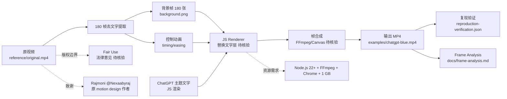

# Tejashmakwana/astra-chatgpt-hyperframes

## 一句话定位
Hyperframes 运动设计可复现——保留原视频 **180 帧背景 + 控制动画**，**JS 替换 ChatGPT 主题文字层**；完整复现工作流（frame analysis + reproduction-verification JSON + render commands），2 天 130⭐，fork 10，JavaScript。

## 它解决的问题
2026 年 AI 生成影视级内容（OpenAI Sora / Runway / Pika）的痛点是：(a) **参考不可核验**——AI 输出与原参考的差异无法逐帧对比；(b) **输出不可复现**——同一 prompt 不同时间生成结果不同；(c) **替换不便**——想替换某个元素（如文字层）需要重新生成整段视频。`astra-chatgpt-hyperframes` 直击这三点：(a) **保留原视频 180 帧**——背景与控制动画完整保留；(b) **替换文字层**——JS 渲染 ChatGPT 主题文字，原视频不动；(c) **完整复现工作流**——frame analysis + reproduction-verification JSON + render commands，任何人都能复现。

## 为什么值得关注
- **Stars:** 130（截至 2026-09-08），2 天净增，单日均速 ~65⭐/day
- **Forks:** 10（fork/star 7.7%，略高于 magnitude 7.2%）
- **语言:** JavaScript 主导
- **项目年龄:** 2 天（创建 2026-09-06）
- **核心差异:** 保留原视频 + JS 替换 + 完整复现工作流

## 热度来源判断
`astra-chatgpt-hyperframes` 的热度来自三个因素：(1) **AI 影视级内容需求**——Sora / Runway / Pika 爆发后，社区对"AI 影视级内容可复现"的关注度上升；(2) **原参考保留的差异化**——大多数 AI 视频工具从零生成，astra-chatgpt-hyperframes 保留原参考；(3) **完整复现工作流**——frame analysis + verification JSON 是 GitHub 上少见的"AI 内容可复现"治理模式。

2 天 130⭐ / fork 10（fork/star 7.7%）的组合反映 **"AI 内容可复现 + 参考保留"** 的差异化。

## 关键技术亮点
1. **180 帧背景保留:** 原视频 180 帧去文字提取（"text-cleared source frames preserve its backgrounds and control animations"）
2. **JS 替换文字层:** JavaScript 渲染 ChatGPT 主题文字，原视频不动
3. **完整复现工作流:** raw reference（`reference/original.mp4`）+ frame analysis（`docs/frame-analysis.md`）+ reproduction verification（`docs/reproduction-verification.json`）+ render commands（`npm ci --ignore-scripts`）
4. **多平台兼容:** macOS / Linux / Windows 都能运行 Hyperframes；需要 Node.js 22+ + FFmpeg/FFprobe (libx264) + Chrome + 1 GB 空间
5. **原参考致谢:** README 致谢 Rajmoni（@Nexaabyraj，原始 motion design 作者）——明确版权边界
6. **示例视频:** `examples/chatgpt-blue.mp4`——可视化对比 AI 输出与原参考

## 架构师速览

| 决策问题 | 研究判断 | 证据边界 |
|---|---|---|
| 系统边界 | AI 影视级内容可复现工具层——原视频提取 + JS 渲染 + 复现工作流；关键是"保留原参考 + 替换文字层"vs "AI 从零生成" | 边界由 README 明示；具体 JS 渲染引擎（Canvas / WebGL）需 README 核验 |
| 主路径 | 原视频 → 180 帧去文字提取 → JS 渲染 ChatGPT 主题文字 → 帧合成 → 输出 MP4 → 复现验证 | 主路径为 README 语义抽象；具体帧合成的实现（FFmpeg / Canvas）需 README 核验 |
| 关键权衡 | 保留原参考的版权安全（vs AI 从零生成的版权洁净）；JS 替换的灵活性（vs 视频合成的精度）；完整复现的资源成本（180 帧 + Chrome + 1 GB） | README 致谢 Rajmoni 原作者；版权边界（fair use）需法律意见 |
| 最小 PoC | clone 仓库 → `npm ci --ignore-scripts` → 运行 render commands → 检查输出 `examples/chatgpt-blue.mp4` → 对比原视频背景 + 替换文字 | PoC 范围由 README "Render it" 推导；具体渲染时间 / 资源消耗需 benchmark |

## 架构启发
`astra-chatgpt-hyperframes` 的核心启发是 **"AI 影视级内容可复现 = 保留原参考 + 替换局部 + 完整工作流"**。传统 AI 视频工具（Sora / Runway / Pika）从零生成，无法保留参考；astra-chatgpt-hyperframes 走 **"提取 + 替换 + 验证"** 三段式——原视频背景与控制动画完整保留，仅替换文字层。

更深层的启发是 **"AI 内容的复现治理"**——`reproduction-verification.json` 是 GitHub 上少见的"AI 内容可复现"治理模式：任何人都能验证 AI 输出是否与原参考一致。

风险提示：**保留原视频的版权边界**——是否构成 fair use 需要法律意见；**180 帧提取的资源成本**——1 GB 空闲 + Chrome + FFmpeg 是较重依赖。

## 架构图（MMD）

> 证据边界：此图只采用本档案已有可核验描述；"待核验"节点不应视为项目实现事实。

## 定位判断
**工具型项目（AI 影视级内容可复现工具），向"AI 内容复现治理"演进。** `astra-chatgpt-hyperframes` 不仅是一个 JS 渲染工具，更是 AI 影视级内容"参考可核验 + 输出可复现"模式的样本。2 天 130⭐ / fork/star 7.7% 已显示初步关注。当前定位是"AI 内容可复现头部样本"，向"AI 内容复现治理平台"演进是合理路径。

## 风险/局限/泡沫点
- **版权边界:** 保留原视频 180 帧是否构成 fair use 需要法律意见；与 Rajmoni 原作者的关系是"致谢"（未明示授权）
- **资源成本:** 1 GB 空闲 + Chrome + FFmpeg + Node.js 22+ 是较重依赖
- **180 帧提取的精度:** JS 替换文字层是否真的"无视觉差异"需要逐帧对比；180 帧的时间粒度是否足够细需要 benchmark
- **JS 渲染 vs 视频合成的精度差异:** JS 渲染可能引入字体 / 抗锯齿差异，与原视频的像素级对比可能不一致
- **2 天新项目风险:** Tejashmakwana 是新 GitHub 账号，项目可持续性未验证
- **AI 视频工具的快速迭代:** Sora / Runway / Pika 持续升级，"AI 从零生成"可能很快超过"AI 替换"的差异化

## 与同类项目的关系
- **vs Sora / Runway / Pika:** 商业化 AI 视频生成（从零生成）；astra-chatgpt-hyperframes 是参考保留 + 替换——零生成 vs 参考替换
- **vs kacperkapusciak/goldie (9-06, 1856⭐):** goldie 是 AI 直接产出 App Store 预览图；astra-chatgpt-hyperframes 是 AI 在原参考基础上做适应——直接产出 vs 参考适应
- **vs achimala/dream-loop (9-08, 121⭐):** dream-loop 是图像生成 + 子 Agent 批评闭环；astra-chatgpt-hyperframes 是视频参考替换——视频 vs 图像 / 闭环 vs 替换
- **vs EverettFish/holo-card-studio (9-08, 779⭐):** holo-card-studio 是从零生成 3D 内容；astra-chatgpt-hyperframes 是参考保留——零生成 vs 参考保留
- **vs EverettFish/holo-card-studio 的"四层图":** holo-card-studio 也是"分离层"思路（4 层独立生成 + UV 对齐）；astra-chatgpt-hyperframes 是"分离背景与文字"——相似的"分离层"思路

## 是否值得持续跟踪
**值得跟踪（AI 影视级内容可复现头部样本）。** `astra-chatgpt-hyperframes` 代表了 AI 影视级内容"参考可核验 + 输出可复现"的方向，与 180 帧保留 + JS 替换 + 完整复现工作流 + 2 天 130⭐ 共同构成新方向。建议关注：(a) 版权边界的法律演化；(b) 180 帧提取的精度；(c) "AI 内容复现治理"模式是否成型；(d) 与 Sora / Runway / Pika 的竞争演化。对运动设计师 / 视频创作者，astra-chatgpt-hyperframes 是 AI 内容可复现的开源方案。

## 后续观察点
- 版权边界的法律演化（fair use）
- 180 帧提取的精度（与原视频的像素级对比）
- JS 渲染 vs 视频合成的精度差异
- AI 视频工具的快速迭代（Sora / Runway / Pika）
- "AI 内容复现治理"模式是否成型
- 多语言 / 多主题扩展（除 ChatGPT 主题外）

---
> 数据来源: GitHub API (2026-09-08) | Stars: 130 | Forks: 10 | License: 待核验 | 语言: JavaScript | 创建: 2026-09-06
