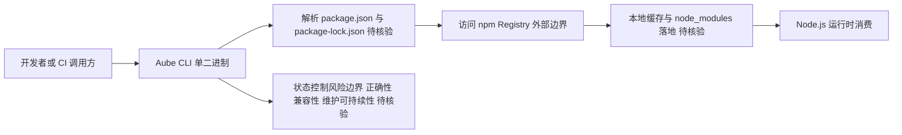

# Aube

## 一句话定位
Rust 实现的快速 Node.js 包管理器，定位为 npm/yarn/pnpm 的替代品。

## 它解决的问题
Node.js 包管理器长期存在性能瓶颈。虽然 pnpm 已经显著改善，但 Rust 实现可以从底层优化依赖解析、下载和缓存策略。

## 为什么值得关注（2026-04-21）
Rust 重写 JS 工具链是持续趋势（SWC、Turbopack、Biome 之后），aube 是包管理器领域的新尝试。318 star 说明社区对"更快 npm"有持续需求。

## 热度来源判断
热度适中，Rust + JS 工具链组合自带关注。但这个赛道已有 pnpm、Bun 内置管理器等成熟方案，后来者需要显著差异化。

## 关键技术亮点亮点
1. **Rust 实现**：依赖解析和网络请求层面的原生性能
2. **兼容 npm 生态**：支持 package-lock.json 和现有 registry
3. **轻量设计**：无运行时依赖，单一二进制

## 架构师速览

| 决策问题 | 研究判断 | 证据边界 |
|---|---|---|
| 系统边界 | Aube 是 Rust 编写的 Node.js 包管理器 CLI（单二进制、无运行时依赖），位于 npm registry 与本地 node_modules 之间，承担依赖解析、下载与缓存职责 | 仅依据档案"Rust 实现 / 兼容 npm 生态 / 轻量无依赖"等表述，未读源码 |
| 主路径 | 用户 CLI 调用 → 解析 package.json/lock → 走 npm registry 拉取 → 落地到本地存储 | 档案明确"支持 package-lock.json 和现有 registry"，未确认具体网络协议、缓存策略与并发模型 |
| 关键权衡 | 与 pnpm 正面竞争：必须证明性能/正确性/差异化三者之一显著胜出；单纯"更快 npm"难以突破生态壁垒 | 仅来自档案"定位判断"与"风险/局限"章节，benchmark 与企业采纳尚未证实 |
| 最小 PoC | 在一个中等规模 Node 项目（含 lockfile、CI 缓存）对比 aube vs pnpm 的 install/cold-cache 时延、磁盘占用、lock 一致性三项 | 档案未给出真实 benchmark，PoC 结论须自行运行验证；安全/合规/SLO 在档案中未涉及 |

## 架构启发
Rust 重写 JS 工具链已成成熟模式。关键不是语言选择，而是能否在正确性（依赖解析）和性能之间找到新平衡点。

## 架构图（MMD）

> 证据边界：此图只采用本档案已有可核验描述；“待核验”节点不应视为项目实现事实。

## 定位判断
工具型项目。除非性能提升达到数量级（类似 esbuild vs webpack），否则难以撼动 pnpm 的地位。

## 风险 / 局限 / 泡沫点
1. **生态壁垒**：npm 生态的网络效应极强
2. **维护成本**：包管理器需要长期投入，个人项目难以为继
3. **差异化不足**：如果只是"快一点的 pnpm"，吸引力有限

## 与同类项目的关系
- pnpm：当前最强竞争者，内容寻址存储
- Bun：内置包管理器，全栈方案
- npm：官方方案，最慢但最稳定

## 是否值得持续跟踪
观望。如果 3 个月内达到 5K star 且有企业采纳迹象，升级为持续跟踪。

## 后续观察点
1. 是否有 benchmark 显示显著性能优势
2. 是否有企业或知名开源项目切换
3. 是否引入独特的依赖管理策略（非单纯性能）

---
*首次记录：2026-04-21*
