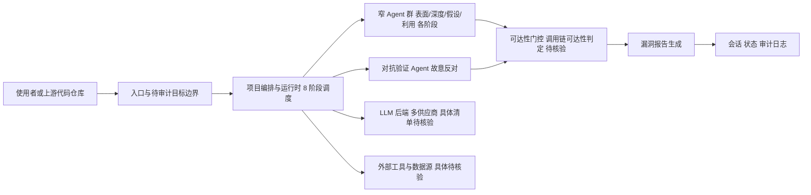

# evilsocket/audit

## 一句话定位
8 阶段漏洞发现 Agent，由安全社区传奇人物 Simone Margaritelli（evilsocket）开发，基于多窄 Agent 并行 + 故意反对（adversarial）+ 可达性门控的架构，实现自动化安全审计。

## 它解决的问题
传统安全扫描工具（SAST/DAST）产生大量误报，且无法理解业务逻辑漏洞。LLM 驱动的安全 Agent 虽然能理解代码语义，但单个 Agent 容易陷入确认偏误——倾向于"发现"它想发现的漏洞。audit 通过多 Agent 架构解决这个问题：部署多个专业化窄 Agent 并行分析，引入"故意反对者"角色交叉验证发现，并用可达性门控过滤无法实际利用的漏洞路径，显著降低误报率。

## 为什么值得关注
- **作者背书:** evilsocket 是知名安全研究员（BetterCap、Bleux作者），在安全社区有极高声誉
- **架构创新:** 8 阶段流水线 + 对抗式验证是安全 Agent 的架构突破
- **实战导向:** 基于实际漏洞发现经验设计，而非学术理论
- **Python 实现:** 易于理解和扩展，MIT 许可证利于社区贡献

## 热度来源判断
热度主要来自 evilsocket 的个人影响力和安全社区的口碑传播。作为 HackTheBox/BetterCap 的作者，evilsocket 的每个新项目都会受到安全社区的高度关注。Cloudflare Project Glasswing 论文的影响（8 阶段架构的灵感来源）也为项目提供了理论背书。

## 关键技术亮点亮点
- 8 阶段流水线：范围定义 → 表面分析 → 深度分析 → 漏洞假设 → 对抗验证 → 可达性分析 → 利用验证 → 报告生成
- 多窄 Agent 并行：每个阶段由专门化的 Agent 处理，避免上下文窗口溢出
- 对抗式验证（adversarial validation）：故意构建"反对者"Agent 挑战其他 Agent 的发现
- 可达性门控：分析漏洞路径是否可达（从外部输入到漏洞触发点的完整调用链）
- LLM 无关设计：支持多种 LLM 后端

## 架构师速览

| 决策问题 | 研究判断 | 证据边界 |
|---|---|---|
| 系统边界 | audit 是一个面向安全研究者的 LLM 驱动审计 CLI/Agent 工具，由编排层串联 8 阶段流水线（范围定义 → 表面分析 → 深度分析 → 漏洞假设 → 对抗验证 → 可达性分析 → 利用验证 → 报告生成），外部边界为调用方/代码仓库与多个 LLM 后端 | 仅依据档案"一句话定位"与"关键技术亮点"，未涉及具体的 CLI 入参格式、支持的模型列表清单 |
| 主路径 | 请求（代码仓库或入口）→ 项目编排与运行时 → 多窄 Agent 并行分析 + 对抗验证 Agent 交叉挑战 → 可达性门控过滤 → 漏洞报告回写 | "主路径"为档案描述的归纳，具体消息协议、状态持久化方式须以源码核验 |
| 关键权衡 | 误报率与对抗验证深度/LLM 调用次数之间的取舍：多 Agent 对抗验证降低确认偏误，但 LLM 调用呈倍数增长（成本与延迟随之上升） | 仅依据档案"风险/局限"中"LLM 成本高"与"误报率"两条说明，具体阶段间调用图未在档案中给出 |
| 最小 PoC | 在隔离环境中以单一小型代码仓库为输入、固定 LLM 后端、固定阶段（建议保留对抗验证与可达性门控），以"输出报告中的漏洞条目与可达性结论"作为最小验收项 | 档案未给出示例仓库或对照基准，"保留两阶段"为建议而非档案承诺 |

## 架构启发
audit 的"对抗式验证"设计是一个重要的 Agent 架构模式——**通过内部对抗来提升系统可靠性**。传统多 Agent 系统追求协作，audit 证明在关键决策场景中，"故意挑刺"的 Agent 比"一致同意"更有价值。对架构师的启发是：AI 系统的可靠性不能靠单一 Agent 的正确性，而需要通过架构层面的对抗机制来保障。

## 架构图（MMD）

> 证据边界：此图只采用本档案已有可核验描述；“待核验”节点不应视为项目实现事实。

## 定位判断
**工具型（安全研究）。** 这是一个面向安全研究者的专业工具，定位类似于"AI 驱动的代码审计助手"。它不是平台，而是方法论的具体实现——8 阶段架构本身就是可迁移的安全审计框架。

## 风险/局限/泡沫点
- **规模有限:** 798 stars 对于安全工具来说适中，但远低于明星级项目
- **LLM 成本高:** 多 Agent + 对抗验证意味着大量 LLM 调用，运行成本不低
- **误报率:** 即使有对抗验证，LLM 的幻觉问题仍可能导致虚假漏洞报告
- **范围局限:** 当前聚焦代码审计，未覆盖网络/基础设施层面的漏洞发现
- **更新频率:** pushed_at 2026-06-10，需要关注后续维护节奏

## 与同类项目的关系
- 与 **DeepAudit**（AI 黑客战队）在 AI 安全审计维度竞争——DeepAudit 更系统化但更重
- 与 **Cobra**（FeeiCN）在源代码安全审计维度形成传统 vs AI 的对比
- 与 **Trail of Bits Skills** 在 AI 安全工具维度互补
- 灵感来源 Cloudflare Project Glasswing 论文，与 Cloudflare 的安全研究方向呼应
- 与 AutoCVE（larlarua）在 CVE 自动发现维度形成"代码审计 vs 二进制分析"的分工

## 是否值得持续跟踪
**推荐跟踪。** 作为 evilsocket 的作品和 AI 安全审计的创新架构，8 阶段流水线 + 对抗验证的设计理念对安全 Agent 开发有参考价值。建议关注其迭代速度和社区采纳情况。

## 后续观察点
- 是否扩展到更多安全场景（二进制、网络、云配置）
- LLM 成本优化和推理效率改进
- 社区贡献的 Agent 阶段和检查器
- 对抗验证机制的实际效果数据（误报率降低程度）
- 是否被企业安全团队实际采用

---
> 数据来源: GitHub API (evilsocket/audit) | 星标: 798 | 语言: Python | 许可证: MIT
