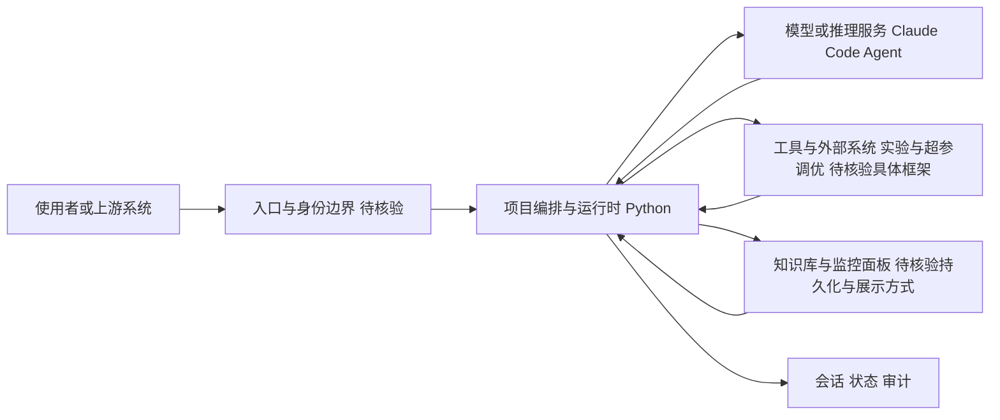

# auto-deep-researcher-24x7

## 一句话定位
完全自主的 24/7 深度研究系统，基于 Claude Code，支持实验自动化和超参数调优，让 AI 独立完成从研究问题提出到实验验证的完整研究流程。

## 它解决的问题
研究流程中存在大量重复性工作：实验管理复杂、超参数调优耗时、研究路径选择依赖经验。传统研究工具以人工为主，效率低下；实验管理工具缺乏智能化；超参数优化工具功能单一，缺乏完整研究流程。auto-deep-researcher-24x7 构建了从研究问题理解到实验执行、结果分析、知识沉淀的完整自动化闭环。

## 为什么值得关注
- **前沿性**：代表 AI 研究自动化的前沿方向
- **完全自主**：24/7 运行，无需人工干预的完整研究流程
- **实验管理**：自动化实验执行、监控和结果分析
- **超参数优化**：支持 GPU 加速的超参数调优
- **知识积累**：研究过程中的经验自动沉淀和复用
- **基于 Claude Code**：利用最新的 AI Agent 能力
- **Apache License 2.0 开源**

## 热度来源判断
- AI 研究自动化是前沿方向，社区关注度极高
- Claude Code 生态的扩展带来研究类应用的涌现
- 实验自动化 + 超参数调优的组合填补了工具空白
- GPU 支持降低了大规模实验的门槛

## 关键技术亮点亮点
1. **完全自主的研究流程**：研究问题理解 → 路径规划 → 实验执行 → 结果分析 → 知识沉淀
2. **GPU 支持和超参数优化**：支持 GPU 加速的优化算法
3. **知识库机制**：研究过程中的经验自动沉淀，支持跨实验复用
4. **监控面板**：实时研究进度和结果展示
5. **基于 Claude Code**：利用 Claude Code 的 Agent 能力驱动研究流程

## 架构师速览

| 决策问题 | 研究判断 | 证据边界 |
|---|---|---|
| 系统边界 | 作为编排层，串联 Claude Code Agent、实验执行/超参数调优工具、知识库与监控面板，主入口形态未在档案中给出 | 入口协议、鉴权方式、模型供应商接入细节均未描述，需源码核验 |
| 主路径 | 问题理解 → 路径规划 → 实验执行（含 GPU 加速超参优化）→ 结果分析 → 知识沉淀，并配有实时监控面板 | “完全自主”与“24/7”仅为定位表述，无 SLA、调度、恢复机制证据 |
| 关键权衡 | 自主性与可控性、成本与算力、领域适用范围与跨域迁移、自动化质量与人工核验之间的张力 | GPU 资源需求量仅定性提及，缺乏基准/成本数据 |
| 最小 PoC | 在单一研究任务/最小工具权限下跑通“问题→实验→结果→知识沉淀”闭环，并启用审计日志与人工复核 | 仓库内是否存在示例脚本、Docker 入口或测试用例，未在档案中说明 |

## 架构启发
1. **智能体架构设计**：可扩展的自主智能体架构，研究-实验-验证闭环
2. **研究-实验-验证闭环**：完整的自动化研究流程，减少人工干预
3. **知识积累机制**：研究过程中的经验自动沉淀，形成可持续优化的知识库

## 架构图（MMD）

> 证据边界：此图只采用本档案已有可核验描述；“待核验”节点不应视为项目实现事实。

## 定位判断
**基础设施候选** — 具备底层基础设施的特征，未来可能演化为研究自动化平台。底层研究基础设施具有支撑能力。

## 风险/局限/泡沫点
1. **质量依赖**：研究质量依赖系统设计能力和模型能力
2. **数据依赖**：需要大量高质量训练数据
3. **偏见问题**：可能产生系统性偏见
4. **成本高昂**：GPU 资源需求较大
5. **领域限制**：主要适用于机器学习领域
6. **验证局限**：研究结果需要人工验证，创意突破能力有限

## 与同类项目的关系
| 项目 | 定位 | 关系 |
|------|------|------|
| Optuna/Ray Tune | 超参数优化 | 组件参照：auto-deep-researcher 集成优化能力 |
| MLflow | 实验管理 | 组件参照：实验追踪与结果管理 |
| Claude Code | AI Agent 基础 | 依赖：基于 Claude Code 构建 |

## 是否值得持续跟踪
**是，强烈建议** — 代表研究自动化的重要突破，具有重要的技术价值和商业潜力。

## 后续观察点
- 实际研究效果的质量和可信度验证
- 从机器学习领域扩展到其他研究领域的进展
- 企业和研究机构的采纳情况
- GPU 成本控制与资源效率优化
