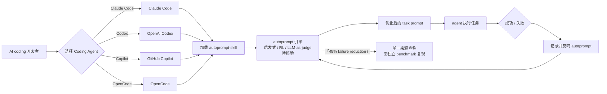

# Spielewoy/autoprompt-skill

## 一句话定位
**AI coding 过程质量 skill**——宣称 "cuts failures by 45% on agentic coding tasks"，通过 autoprompt 机制降低 AI coding agent 在编程任务上的失败率；兼容 Claude Code / Codex / GitHub Copilot / OpenCode 四大主流 Coding Agent。

## 它解决的问题
AI Coding Agent（Claude Code / Codex / GitHub Copilot / OpenCode 等）在 2026 下半年已经成为开发者日常工具，但**失败率高是公认痛点**——单次 prompt 成功率有限，多轮迭代后成功率下降，复杂任务（重构 / 测试 / 调试）失败率显著升高。autoprompt-skill 直击这一痛点：通过**自动化的 prompt 工程机制**（autoprompt），在 agent 执行任务前自动优化 prompt，降低失败率。Topics 覆盖 19 项（agent-skills / ai-coding / claude-code / codex / github-copilot / opencode / prompt-engineering / tdd ...），说明是当前"AI coding 过程质量"方向覆盖最广的 skill 之一。把 Agent Skill 从"做什么"（设计 / 写作 / 视频 / 购物）引向"如何做得更稳"（过程质量）——**新的范式**。

## 为什么值得关注
- **Stars:** 971（截至 2026-09-03），17 天累计 971⭐（**未达 1k⭐ 阈值但已进入关注范围**）
- **Forks:** 64，6.6% fork/star（典型工具型——真实安装使用）
- **License:** MIT
- **语言:** JavaScript（11.4MB）
- **活跃度:** created 2026-08-17，pushed 2026-08-30，17 天内持续高活跃
- **规模:** 11.4MB，含完整 skill 实现 + 测试 + 文档
- **Topics:** 19 项精准命中 ai-coding / prompt-engineering / tdd 等所有相关场景——跨平台覆盖是该 skill 的关键卖点

## 热度来源判断
autoprompt-skill 的热度是 **"AI coding 失败率高痛点 × 「cuts failures by 45%」卖点 × 跨四大 Coding Agent 兼容"** 的组合。AI Coding Agent 的失败率是开发者最关心的痛点之一——wshobson/agents、Claude Skills 官方库、Skills CLI 等都在尝试用"垂直 skill"解决"做什么"问题，但"如何做得更稳"（过程质量）方向鲜有头部样本。autoprompt-skill 是首个把"过程质量"作为 skill 主打的项目。**"cuts failures by 45%" 的单一来源宣称需独立 benchmark 验证**，但方向本身是真实的。17 天 971⭐ + 6.6% fork/star（典型工具型）+ 19 项 topics 覆盖度共同说明这是个真实需求驱动的 skill。热度**真实且具范式价值**——但需警惕：单一来源宣称的可复现性、与各 Coding Agent 自身演进的竞品关系。

## 关键技术亮点
1. **「cuts failures by 45%」的卖点**——AI coding 失败率降低 45%（单一来源宣称，需独立 benchmark 复现）
2. **跨四大 Coding Agent 兼容**——同时支持 Claude Code / Codex / GitHub Copilot / OpenCode（19 项 topics 全覆盖）
3. **Autoprompt 自动化**——自动化的 prompt 工程机制，在 agent 执行任务前自动优化 prompt
4. **TDD 集成**——topics 明示 `tdd`（test-driven-development），与软件工程最佳实践对齐
5. **Subagents 支持**——topics 明示 `subagents`，可与 Claude Code sub-agents 配合
6. **Multi-agent systems 集成**——topics 明示 `multi-agent-systems`，支持多 agent 协作场景

## 架构师速览

| 决策问题 | 研究判断 | 证据边界 |
|---|---|---|
| 系统边界 | AI coding agent skill 层 + autoprompt 引擎 + 跨平台适配层（Claude Code / Codex / Copilot / OpenCode）+ 测试与基准层 | 四要素是 topics 与 description 明示；具体 autoprompt 算法（heuristic / RL / LLM-as-judge）需 README 核验；"45% failure reduction" 的基准测试集与对比方法需独立 benchmark |
| 主路径 | AI coding agent 加载 autoprompt-skill → 用户提交任务 → autoprompt 自动优化 prompt → agent 执行任务 → 记录成功 / 失败 → 反哺 autoprompt 优化 | 主路径为 description 抽象；具体 autoprompt 触发时机（before / during / after）、优化算法细节需 README 核验 |
| 关键权衡 | "cuts failures by 45%" 单一来源宣称 vs 独立 benchmark 复现；"跨四大 agent 兼容" 覆盖广 vs 各 agent 适配深度；"MIT 商业可用" vs "个人项目可持续性"；"过程质量" 新范式 vs "垂直 skill" 主流范式 | 11.4MB 来自 API；MIT License 商业可用；具体 autoprompt 算法、benchmark 数据需 README 核验 |
| 最小 PoC | 安装 autoprompt-skill（Claude Code 或 Codex 任选）→ 准备 1 个 AI coding 任务（如"重构 X 函数"）→ 执行任务，对比"无 autoprompt" vs "有 autoprompt" 的成功率 → 在 GitHub Copilot / OpenCode 上重复 → 评估跨平台兼容性 | 安装命令需 README 独立核验；具体 autoprompt 配置项、benchmark 数据需文档指引 |

## 架构图（MMD）

> 证据边界：此图只采用本档案已有可核验描述；"待核验"节点不应视为项目实现事实。

## 架构启发

`Spielewoy/autoprompt-skill` 的核心启发是 **"Agent Skill 从'做什么'演化为'如何做得更稳'——过程质量是新范式"**。当前 Agent Skill 生态（wshobson/agents、Claude Skills 官方库、Skills CLI）大多按"垂直能力"分类（设计 / 写作 / 视频 / 购物 / 调试），但开发者面临"AI coding 失败率高"的真实痛点——单次 prompt 成功率有限、多轮迭代后成功率下降、复杂任务失败率显著升高。autoprompt-skill 把 Agent Skill 引向"过程质量"——通过 autoprompt 自动化机制在 agent 执行任务前自动优化 prompt，"cuts failures by 45%" 是单一来源宣称但方向本身真实。更深层的启发是：**"过程质量 skill"可能成为 Agent Skill 协议的标准扩展**——从测试 / 验证 / 重构 / 安全 review 等维度都有真实需求。19 项 topics 覆盖度（agent-skills / ai-coding / claude-code / codex / github-copilot / opencode / prompt-engineering / tdd ...）说明是当前"AI coding 过程质量"方向覆盖最广的 skill 之一。但"45% failure reduction"的可复现性、与各 Coding Agent 自身演进的竞品关系是核心风险。

## 定位判断
**工具型 / AI coding 过程质量 skill 候选。** autoprompt-skill 不只是"又一个 skill"，而是把 Agent Skill 从"做什么"（设计 / 写作 / 视频 / 购物）引向"如何做得更稳"（过程质量）的**新范式探索**。17 天 971⭐ + 6.6% fork/star + 19 项 topics 覆盖度共同说明这是个真实需求驱动的 skill。"cuts failures by 45%" 的宣称若被独立 benchmark 复现，将成为 Agent Skill 领域的标杆；若复现失败，可能被归类为"营销夸大"。

## 风险/局限/泡沫点
- **「cuts failures by 45%」单一来源宣称风险**——基准测试集、对比方法、统计显著性需独立 benchmark 复现
- **跨平台兼容深度风险**——同时兼容 Claude Code / Codex / Copilot / OpenCode 四大 agent 的维护成本极高，每个 agent 自身快速演进
- **与 Coding Agent 自身演进的竞品关系**——Anthropic / OpenAI / GitHub / OpenCode 都在做 prompt 工程优化，autoprompt-skill 的差异化是否长期成立待观察
- **个人项目属性**——Spielewoy 个人维护，可持续性存疑
- **「过程质量」是真实需求还是伪痛点**——若 45% 失败率降幅不可复现，整个方向可能是伪痛点
- **JavaScript 实现 vs Python 实现**——与多数 Python 实现的 AI agent 框架相比，JavaScript 实现的 autoprompt 是否有性能 / 兼容性差异

## 与同类项目的关系
- **vs wshobson/agents（38k⭐）：** wshobson 是"跨平台 Coding Agent 技能市场"，autoprompt-skill 是"过程质量垂直 skill"——wshobson 是平台、autoprompt-skill 是垂直能力
- **vs Anthropic Skills 官方：** Anthropic 官方 Skills 是 Claude-only，autoprompt-skill 是跨四大 agent——跨平台覆盖差异化
- **vs OpenAI Codex / GitHub Copilot 内置 prompt 工程：** 各 Coding Agent 自身在做 prompt 优化，autoprompt-skill 作为"外置 skill"是否能与之协同需评估
- **vs Claude Code sub-agents / Task tool：** Claude Code 自带 sub-agents / Task tool 是"通用能力"，autoprompt-skill 是"过程质量 skill"——互补关系
- **vs Anthropic Prompt Library：** Anthropic Prompt Library 是"通用 prompt 模板"，autoprompt-skill 是"自动化 prompt 工程"——一个偏静态、一个偏动态

## 是否值得持续跟踪
**值得跟踪（AI coding 过程质量 skill）。** autoprompt-skill 代表了 Agent Skill 从"做什么"演化为"如何做得更稳"的范式探索，无论其本身成败，这一方向是行业趋势。建议关注：(a) "cuts failures by 45%" 的独立 benchmark 复现；(b) 跨四大 agent 兼容的实际深度；(c) 与各 Coding Agent 自身 prompt 优化的差异化。对 AI coding 用户，这个 skill 值得直接试用评估实际失败率降幅。

## 后续观察点
- 「cuts failures by 45%」的独立 benchmark 复现（社区 vs 官方）
- 跨四大 agent 兼容的实际深度（是否达到各 agent 原生 prompt 优化的同等水平）
- 是否被 Anthropic / OpenAI / GitHub 官方采用或集成
- 是否出现"过程质量"赛道的其他 skill（测试 / 验证 / 重构 / 安全 review 等）
- 是否从"skill"演化为"独立 framework"（autoprompt-engine）

---
> 数据来源: GitHub API (2026-09-03) | Stars: 971 | Forks: 64 | License: MIT | 语言: JavaScript | 创建: 2026-08-17