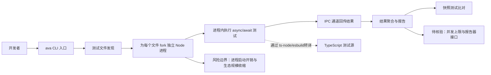

# avajs/ava

## 一句话定位
面向 Node.js 的高并发、零配置、基于现代异步语法的 JavaScript 测试运行器（Test Runner）。

## 它解决的问题
传统 Node.js 测试框架（如 Mocha、Jest）在并行执行、异步支持和启动速度上存在瓶颈。AVA 的核心主张是：**每个测试文件都在独立进程中并发运行**，充分利用多核 CPU，显著缩短大型测试套件的执行时间。同时，它原生支持 async/await，无需回调和 Promise 包装，让测试代码更简洁。

## 为什么值得关注
- **Stars:** 20,838（截至 2026-08-07），在 Node 测试领域排名前列
- **Forks:** 1,462，社区维护稳定
- **License:** MIT，完全开源
- **活跃度:** pushed_at 2026-06-17，仍在持续维护
- **设计哲学:** 极简配置、并发优先、测试隔离——影响了后续许多测试框架设计

## 热度来源判断
AVA 的热度属于**早期技术影响力沉淀**。它在 2015-2018 年是 Node.js 测试领域的热门创新者，率先推动了"并发测试"理念。虽然近年来 Jest 和 Vitest 崛起分流了大量用户，但 AVA 仍有忠实社区。当前 Star 增速趋缓，但作为"并发测试框架先驱"的技术历史价值依然存在。

## 关键技术亮点亮点
1. **进程级并发:** 每个测试文件运行在独立 Node.js 进程，通过 IPC 收集结果，彻底避免状态污染
2. **零配置:** `npm install ava` 后可直接 `ava` 运行，无需配置文件
3. **原生异步:** 基于.async/await，支持 Observable 和 callback 风格
4. **快照测试:** 内置 Snapshot Testing，与 Jest API 类似但并发执行
5. **TypeScript 支持:** 通过 `ts-node` 或 `esbuild` 原生支持 TS 测试

## 架构师速览

| 决策问题 | 研究判断 | 证据边界 |
|---|---|---|
| 系统边界 | AVA 作为 CLI 工具型测试运行器，边界落在"测试文件（输入）→ 独立 Node.js 进程（执行）→ IPC 通道（结果回流）→ 报告/快照（输出）"之间，外部依赖仅为 Node.js 运行时与可选 `ts-node`/`esbuild` 转译器 | 档案仅给出"每测试文件独立进程 + IPC 收集结果"概述，进程间协议、IPC 格式、报告器接口未在档案中给出 |
| 主路径 | 开发者 `ava` CLI 调用 → 文件发现 → 为每个测试文件 fork 独立 Node.js 进程 → 进程内执行 async/await 测试 → IPC 回传结果 → 聚合输出/快照；TS 通过 `ts-node` 或 `esbuild` 透传 | 档案仅确认"零配置 + 原生 async + TS 支持 + 快照测试"，文件匹配规则、watch 模式、并发上限未在档案中给出 |
| 关键权衡 | 进程级隔离换启动开销：单文件隔离彻底消除状态污染，但在大规模套件下 fork 进程成本显著；零配置换扩展深度：开箱即用但生态规模与可定制性弱于 Jest/Mocha | 档案明确指出"启动开销显著"与"生态收缩"，但未给出具体基准数值 |
| 最小 PoC | 单仓库装 `ava` 后直接 `ava` 跑通一份含 async 测试 + TS 测试 + Snapshot 的小型套件，验证：零配置启动、独立进程并发执行（多核占用）、快照生成与比对、`ts-node`/`esbuild` 转译路径 | 档案未证实具体并发度、watch 行为、CI 集成细节与插件机制，需在 PoC 中核验 |

## 架构启发
AVA 的"进程隔离并发"架构是对 Node.js 单线程限制的一种突破方式。它启发了后续框架对"测试并行度"的重视——Vitest 在某些方面借鉴了其思路。核心启发是：**在 I/O 密集型测试场景下，进程级隔离比线程级更安全，比串行执行更高效**。

## 架构图（MMD）

> 证据边界：此图只采用本档案已有可核验描述；“待核验”节点不应视为项目实现事实。

## 定位判断
**成熟工具型项目。** AVA 不再是高速增长的"新星"，而是进入稳定维护期的工具。它适合对测试速度有极致要求、且偏好极简配置的中小型项目。大型企业更倾向 Jest/Vitest（生态更大），AVA 在特定场景仍有价值。

## 风险/局限/泡沫点
- **生态收缩:** 社区活跃度下降，插件和教程数量远少于 Jest/Vitest
- **Vitest 替代:** Vitest 兼容 Jest API 且更快，直接蚕食 AVA 的目标用户
- **Node 原生测试:** Node.js 内置 `node:test` 模块日趋成熟，长期看挤压第三方测试框架空间
- **启动开销:** 每文件独立进程在大规模测试下启动开销显著

## 与同类项目的关系
- **vs Jest:** Jest 生态最大但串行为主；AVA 并发更快但生态小
- **vs Vitest:** Vitest = Vite 原生 + Jest 兼容 + 并发，是当前最大威胁
- **vs node:test:** Node 原生测试模块零依赖，适合轻量项目
- **vs Mocha:** Mocha 灵活但需大量配置，AVA 主张零配置

## 是否值得持续跟踪
**低优先级跟踪。** AVA 作为工具型项目已进入稳定期，技术演进放缓。建议关注其是否向 Vite/ESM 生态深度迁移，否则将逐步边缘化。

## 后续观察点
- 是否推出 Vite 原生集成以应对 Vitest 竞争
- Star 趋势是否出现加速下滑（被 Vitest 完全替代的信号）
- 社区维护者数量和 Issue 响应速度

---
> 数据来源: GitHub API (2026-08-07) | Stars: 20,838 | Forks: 1,462 | License: MIT
