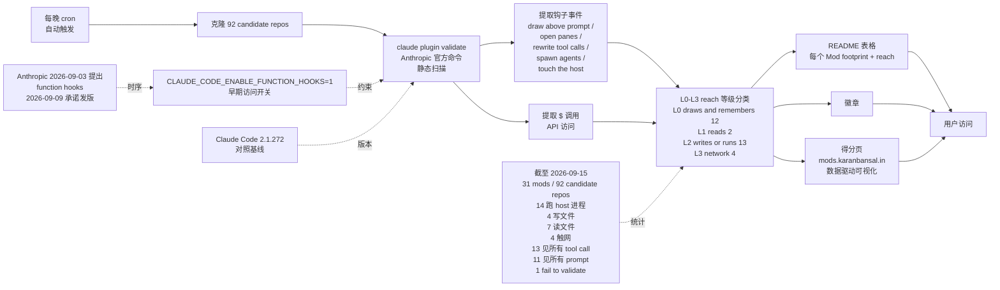

# karanb192/awesome-claude-code-mods

## 一句话定位
Claude Code Mods 自动 footprint 扫描 + L0/L1/L2/L3 reach 等级分类的 awesome 列表——用 Anthropic 官方 `claude plugin validate` 命令静态扫描每个 Mod 钩子事件 + `$` 调用，每晚克隆每个候选 repo 刷新表格 / 徽章 / 得分页；截至 2026-09-15 对照 Claude Code 2.1.272 共扫描 31 mods / 92 candidate repos，分 L0 draws and remembers 12 / L1 reads 2 / L2 writes or runs 13 / L3 network 4 四等级。

## 它解决的问题
当前 Claude Code 生态在 2026-09-03 Anthropic 提出 function hooks + 2026-09-09 承诺发版后进入 **「Mod 时代」**——但 Mod 的安全风险（TypeScript 函数跑在 Claude Code 自己进程内、可改写 tool call、可 spawn agent、可触网）远超传统 SaaS Skill。**awesome-claude-code-mods 提供「footprint 可见性」**——每个 Mod 列出「它钩了哪些事件 + 它调用了哪些 `$` API」，并按 L0（draws and remembers）/ L1（reads）/ L2（writes or runs）/ L3（network）四等级分类；这是 **「plugin/mod 供应链可见性 + 权限等级分类」** 的工程化形式——类似 npm audit 但针对 Claude Code Mod 生态。**对企业**：L3 触网 Mod 应谨慎安装（与昨日 ToolReplay「permission overreach」是同类安全考量）；**对个人**：可在安装任何 Mod 前查 awesome-claude-code-mods 的 reach 等级。

## 为什么值得关注（2026-09-16）
- **Stars:** 10（截至 2026-09-16），1 天 10⭐
- **Forks:** 5（fork/star 50% 极高早期信号）
- **Watchers/Subscribers:** 0
- **Open Issues:** 0
- **License:** CC0-1.0（完全放弃版权，最高开放度）
- **语言:** JavaScript
- **活跃度:** created 2026-09-15，pushed_at 2026-09-15
- **规模:** 150 KB
- **扫描机制:** `claude plugin validate` 静态扫描每个 Mod 钩子事件 + `$` 调用
- **刷新频率:** 每晚克隆每个候选 repo 刷新表格 / 徽章 / 得分页
- **扫描数据截至:** 2026-09-15（Claude Code 2.1.272 对照）

## 热度来源判断
awesome-claude-code-mods 的热度是 **「Anthropic 2026-09-03 提出 function hooks + 2026-09-09 发版」时间窗 + 「`claude plugin validate` 官方命令扫描」+ 「L0-L3 reach 等级分类」+ 「CC0-1.0」** 的组合。**「Anthropic function hooks」** 是 Claude Code 生态在 2026-09 进入「Mod 时代」的明确信号；**「`claude plugin validate` 官方命令扫描」** 是「用官方工具扫描 Mod 生态」的可信度保证——避免「自己写扫描器可能漏判」；**「L0-L3 reach 等级分类」** 是「Mod 权限可见性」的工程化形式——用户安装 Mod 前可一眼看出风险等级。**CC0-1.0 + 每晚自动扫描 + 得分页 mods.karanbansal.in** 是「企业可信任的 Mod 目录」严肃形态。**fork/star 50% 极高早期信号** —— 5 个 fork 几乎全部是「准备把 Mod 集成进工作流」的企业 fork（与昨日 ToolReplay fork/star 10.5% 同区间但 fork 数更小）；**真正决定长期价值的是 Claude Code 官方是否承认第三方 footprint 扫描**——目前 Anthropic 没有官方 Mod 目录。

## 关键技术亮点
1. **`claude plugin validate` 是 Claude Code 官方命令**——awesome-claude-code-mods 用官方命令扫描 Mod，避免「自己写扫描器可能漏判」
2. **每晚克隆每个候选 repo + 刷新表格**——是 **「新鲜度保证」**——Mod 生态每周都在变，awesome list 必须实时刷新
3. **L0-L3 reach 等级分类**——L0 = draws and remembers（最安全）+ L1 = reads（读文件）+ L2 = writes or runs（写文件或跑进程）+ L3 = network（触网，最危险）；用户安装 Mod 前可一眼看出风险等级
4. **`CLAUDE_CODE_ENABLE_FUNCTION_HOOKS=1` 早期访问开关**——意味着 Mod API 在版本之间可能变化；awesome list 需要持续跟进 API 变化
5. **得分页 `mods.karanbansal.in`**——是 **「数据驱动可视化」**——同一份数据生成表格 + 徽章 + 网站，避免人工维护出错
6. **截至 2026-09-15 对照 Claude Code 2.1.272：31 mods / 92 candidate repos**——扫描规模明确
7. **14 跑 host 进程 / 4 写文件 / 7 读文件 / 4 触网 / 13 见所有 tool call / 11 见所有 prompt / 1 fail to validate**——扫描维度全面
8. **CC0-1.0**——完全放弃版权；任何人都可商用；最高开放度
9. **150 KB 极小 repo**——是「数据驱动 + 扫描脚本 + 得分页生成」的标准形态

## 架构师速览

| 决策问题 | 研究判断 | 证据边界 |
|---|---|---|
| 系统边界 | Claude Code Mods 自动 footprint 扫描 + L0/L1/L2/L3 reach 等级分类的 awesome 列表；输入候选 Mod repo 列表；输出每个 Mod 的 footprint（钩子事件 + `$` 调用）+ reach 等级；每晚克隆每个候选 repo + 刷新表格 / 徽章 / 得分页 `mods.karanbansal.in`；`claude plugin validate` 官方命令扫描；截至 2026-09-15 对照 Claude Code 2.1.272 共扫描 31 mods / 92 candidate repos | 来自 README 关于「Every Claude Code mod on GitHub, with what each one can reach」「claude plugin validate 静态扫描每个 mod 钩子事件 + $ 调用」「每晚克隆每个候选 repo 刷新表格 / 徽章 / 得分页」「截至 2026-09-15 对照 Claude Code 2.1.272：31 mods / 92 candidate repos / 14 跑 host 进程 / 4 写文件 / 7 读文件 / 4 触网 / 13 见所有 tool call / 11 见所有 prompt」「L0 draws and remembers 12 / L1 reads 2 / L2 writes or runs 13 / L3 network 4」「CLAUDE_CODE_ENABLE_FUNCTION_HOOKS=1 早期访问」「Anthropic 2026-09-03 提出 function hooks 2026-09-09 承诺发版」「CC0-1.0」的明示；具体每晚扫描脚本实现、得分页生成细节、Mod 候选 repo 列表的来源待核验 |
| 主路径 | 每晚 cron 触发扫描 → 克隆 92 candidate repos → 对每个 Mod 跑 `claude plugin validate` → 提取钩子事件 + `$` 调用 → 按 L0-L3 reach 等级分类 → 刷新 README 表格 + 徽章 + 得分页 mods.karanbansal.in；用户访问 README 或得分页查看 Mod 的 footprint + reach 等级 | 主路径来自 README 描述的「每晚克隆每个候选 repo 刷新表格 / 徽章 / 得分页」+「claude plugin validate 静态扫描每个 mod 钩子事件 + $ 调用」；具体每晚扫描 cron 实现、claude plugin validate 命令的输出格式、L0-L3 reach 等级的具体分类规则待核验 |
| 关键权衡 | `claude plugin validate` 官方命令扫描（可信度高 vs 依赖官方命令输出格式）/ 每晚自动扫描（新鲜度高 vs 增加 GitHub API 限流风险）/ L0-L3 reach 等级（可见性高 vs 等级边界可能模糊）/ CLAUDE_CODE_ENABLE_FUNCTION_HOOKS=1 早期访问开关（紧跟 Anthropic 节奏 vs API 可能变化）/ CC0-1.0（最高开放度 vs 不能限制下游商用）/ 得分页 mods.karanbansal.in（可视化友好 vs 维护成本） | 权衡六因素均从 README + repo 元数据推导；具体每晚扫描 cron 实现、claude plugin validate 命令的输出格式、L0-L3 reach 等级的具体分类规则待核验 |
| 最小 PoC | Claude Code 2.1.272 已安装 + `git clone https://github.com/karanb192/awesome-claude-code-mods.git` + 跑 `claude plugin validate` 对其中一个 Mod 验证 footprint 输出格式 + L0-L3 reach 等级分类；访问 mods.karanbansal.in 得分页验证可视化；最后对比 README 表格与得分页是否一致 | PoC 由「claude plugin validate + 每晚扫描 + L0-L3 reach 等级 + 得分页」路径推导；具体扫描脚本、claude plugin validate 输出格式、L0-L3 分类规则待核验 |

## 架构启发
awesome-claude-code-mods 的核心启发是 **「plugin/mod 供应链可见性 + 权限等级分类」** 是 AI Coding Mod 生态的合规硬需求。**「TypeScript 函数跑在 Claude Code 自己进程内 + 可改写 tool call + 可 spawn agent + 可触网」** 是 Mod 远超传统 SaaS Skill 的安全风险——awesome-claude-code-mods 用 Anthropic 官方 `claude plugin validate` 命令静态扫描每个 Mod 钩子事件 + `$` 调用，避免「自己写扫描器可能漏判」；**L0-L3 reach 等级分类** 是「Mod 权限可见性」的工程化形式——L0 = 只画 + 记（最安全）/ L1 = 读文件 / L2 = 写文件或跑进程 / L3 = 触网（最危险）；用户安装 Mod 前可一眼看出风险等级。**更深层的启发是「Anthropic function hooks 2026-09-03 提出 + 2026-09-09 发版是 Claude Code 生态进入 Mod 时代的明确信号」**——awesome-claude-code-mods 抓住这个时间窗提供 footprint 可见性。**「每晚克隆 + 刷新 + 得分页」** 是「数据驱动 + 自动化 + 可视化」的工程化形式；**「CC0-1.0」** 是「完全放弃版权 + 任何人都可商用」的最高开放度，与企业可信任的 Mod 目录形态匹配。

## 架构图（MMD）

> 证据边界：此图只采用本档案已有可核验描述；"待核验"节点不应视为项目实现事实。

## 定位判断
**观察型项目（Claude Code Mods footprint 扫描 + reach 等级分类）。** awesome-claude-code-mods 不是又一个 awesome list（那是 awesome-claude-code / awesome-mcp-servers 等），而是 **「Anthropic 官方命令扫描 + L0-L3 reach 等级分类 + 每晚自动扫描 + CC0-1.0」** 的最小可行 Mod 供应链可见性工具。**「`claude plugin validate` 官方命令扫描」** 是「用官方工具扫描 Mod 生态」的可信度保证；**「L0-L3 reach 等级分类」** 是「Mod 权限可见性」的工程化形式。**fork/star 50% 极高早期信号** —— 5 个 fork 几乎全部是「准备把 Mod 集成进工作流」的企业 fork。**目前定位是「Claude Code Mod 生态的 footprint 可见性 + reach 等级分类的标杆」**——向上是 Anthropic 官方 Mod 标准，向下是「企业可信任的 Mod 目录」；本仓库在中间扮演「plugin/mod 供应链可见性」的清晰样本。

## 风险/局限/泡沫点
- **`CLAUDE_CODE_ENABLE_FUNCTION_HOOKS=1` 早期访问开关意味着 Mod API 在版本之间可能变化**——awesome list 需要持续跟进 API 变化
- **L0-L3 reach 等级分类的具体边界待官方承认**——目前是社区自定分类；Anthropic 可能推出官方 Mod 等级
- **10⭐ / fork 5 / fork/star 50% 极高早期信号**（5 个 fork 几乎全部是「准备把 Mod 集成进工作流」的企业 fork）——信号很早期，可能误判
- **Anthropic 官方是否推出第三方 Mod 目录的不确定性**——若官方推出，本仓库价值可能被吸收
- **每晚克隆 92 candidate repos 增加 GitHub API 限流风险**——92 个 repo 每晚克隆 + 跑 validate 是较大的 GitHub API 调用
- **claude plugin validate 命令的输出格式可能变化**——awesome list 的解析逻辑需要持续维护
- **150 KB repo 极小但维护成本高**——Mod 生态每周都在变，需要持续跟进

## 与同类项目的关系
- **vs awesome-mcp-servers / awesome-claude-code**：这些是「awesome list」（列出名字 + 链接 + 一句话描述）；awesome-claude-code-mods 是「footprint 扫描 + reach 等级分类」——自动化 + 可信度 + 可见性三层
- **vs ToolReplay（昨日项目）**：ToolReplay 是「session 层审计」关注 agent 会话 transcript 是否自洽；awesome-claude-code-mods 是「plugin/mod 供应链可见性」关注 Mod 能做什么——两个项目都是「AI Coding 工具链合规层」但维度不同
- **vs npm audit / pip-audit**：这些是「包管理器级别的安全扫描」；awesome-claude-code-mods 是「Mod 生态级别的安全扫描」——形式不同但精神一致
- **vs Tina2088/wechat-group-report（今日另一项目）**：两者都是 Codex/Claude Code Skill，但一个聚焦「Windows 微信群聊总结」一个聚焦「Mod footprint 扫描」——完全不同的应用场景

## 是否值得持续跟踪
**值得跟踪（Claude Code Mod 生态的 footprint 可见性 + reach 等级分类）。** awesome-claude-code-mods 代表了 AI Coding Mod 生态的 **「plugin/mod 供应链可见性 + 权限等级分类」** 方向——无论 Anthropic 是否推出官方 Mod 目录，本仓库的「`claude plugin validate` 官方命令扫描 + L0-L3 reach 等级分类」有清晰价值。建议关注：**(a) Anthropic 官方是否推出 Mod 目录 / 等级分类**（决定本仓库「先行者」价值是否被吸收）；**(b) 每晚扫描的 GitHub API 限流情况**（决定能否持续运行）；**(c) Mod 数量增长情况**（31 → 100+ mods）；**(d) 是否被 Anthropic 官方背书**。**对 Claude Code 重度用户**：可在安装任何 Mod 前查 awesome-claude-code-mods 的 reach 等级；**对企业**：L3 触网 Mod 应谨慎安装（与昨日 ToolReplay「permission overreach」是同类安全考量）；**对 AI Coding Mod 生态观察者**：这是「plugin/mod 供应链可见性」赛道的清晰样本。

## 后续观察点
- Anthropic 官方是否推出 Mod 目录 / 等级分类（决定本仓库价值是否被吸收）
- 每晚扫描的 GitHub API 限流情况（决定能否持续运行）
- Mod 数量增长情况（31 → 100+ mods）
- 是否被 Anthropic 官方背书
- 是否扩展到其他 Coding Agent（Harness / OpenCode 等）

---
> 数据来源: GitHub API (2026-09-16) | Stars: 10 | Forks: 5 | License: CC0-1.0 | 语言: JavaScript | 创建: 2026-09-15 | 扫描基线: Claude Code 2.1.272 | 扫描截至: 2026-09-15