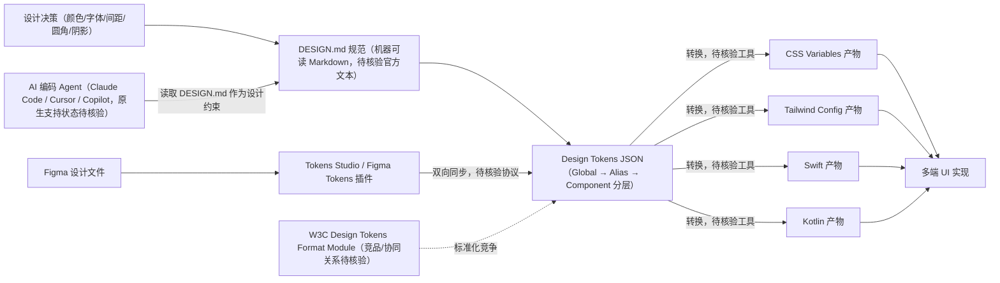

# VoltAgent/awesome-design-md

## 一句话定位
围绕 DESIGN.md 规范的 awesome-list，汇集设计系统、设计令牌（Design Tokens）、Figma 集成和 AI 辅助设计的最佳实践与工具，推动"设计即代码"范式。

## 它解决的问题
设计系统从"设计师的 Figma 文件"到"开发者的代码实现"之间存在巨大鸿沟——颜色值不一致、间距不统一、组件命名不同步。DESIGN.md 是一种将设计规范以机器可读的 Markdown 格式定义的方案，配合 Design Tokens 实现设计 → 代码的自动同步。awesome-design-md 汇集了这一生态的工具、模板和案例。

## 为什么值得关注
- **Stars:** 107,124 stars，设计系统类 awesome-list 中 Star 数最高
- **范式推动:** DESIGN.md 是新兴的设计-开发协作范式，有潜力成为行业标准
- **AI 时代意义:** AI 编码 Agent（Claude Code、Cursor）可以直接读取 DESIGN.md 来生成符合设计规范的代码
- **生态汇集:** 汇集了设计令牌工具、Figma 插件、代码生成器、主题系统等全链路工具
- **实用导向:** 不是理论讨论，而是可直接使用的工具和模板集合

## 热度来源判断
awesome-design-md 的热度来自两个趋势交汇：(1) Design Tokens 范式成熟——W3C Design Tokens Format Module 正在标准化，社区工具（Style Dictionary、Tokens Studio）已可用；(2) AI 编码 Agent 需要设计规范输入——Agent 生成 UI 代码时需要 DESIGN.md 作为"设计约束"，这创造了新的需求。Star 数从 2025 年快速攀升，与 AI 编码工具的普及节奏吻合。

## 关键技术亮点亮点
- **DESIGN.md 规范:** 以 Markdown 格式定义颜色、字体、间距、圆角、阴影等设计令牌，机器可读
- **Design Tokens 链路:** DESIGN.md → Tokens (JSON) → 多平台输出（CSS Variables / Tailwind Config / Swift / Kotlin）
- **Figma 集成:** Tokens Studio / Figma Tokens 插件实现 Figma ↔ 代码双向同步
- **AI 友好:** DESIGN.md 是纯文本，AI Agent 可以直接读取并作为生成代码的约束条件
- **主题系统:** 支持明暗主题、品牌变体的令牌管理

## 架构师速览

| 决策问题 | 研究判断 | 证据边界 |
|---|---|---|
| 系统边界 | awesome-design-md 是一个 awesome-list 资源集合，非运行时系统；其倡导的边界是"DESIGN.md 规范 → Tokens (JSON) → 多平台代码产物"，横跨 Figma 插件、令牌转换器与前端/移动端代码 | 档案未提供 DESIGN.md 的官方规范文本或令牌分层字段定义；Tokens Studio、Style Dictionary 等具体组件的接口未在档案中详述 |
| 主路径 | 主路径是"设计决策 → DESIGN.md（Markdown 规范） → Tokens（JSON）→ CSS Variables / Tailwind Config / Swift / Kotlin 等多端代码"，Figma 通过 Tokens Studio 插件介入"双向同步" | 档案仅列出多平台输出名称，未给出具体同步协议（如 Figma Plugin API 调用方式、Token 字段命名规范） |
| 关键权衡 | 核心权衡是"框架无关的规范抽象（DESIGN.md）"vs"W3C Design Tokens Format 等竞品标准化路径"；次级权衡是"设计师+开发者跨角色协作门槛"与"生态工具链成熟度"之间的互锁 | 档案明确指出 DESIGN.md 尚无官方标准、与 W3C DT Format 的关系待核验；未量化协作门槛数据 |
| 最小 PoC | PoC 应聚焦"选定一个 Figma 设计文件 → 用 Tokens Studio 导出为 DESIGN.md/Tokens JSON → 生成至少 CSS Variables 与 Tailwind Config 两份产物 → 用 AI 编码 Agent（Claude Code/Cursor）读取 DESIGN.md 生成 UI 代码，验证设计一致性" | 档案提到 AI Agent 可读 DESIGN.md，但未给出具体 Agent 是否已原生支持 DESIGN.md（标注为待核验）；工具链具体版本与兼容矩阵档案未覆盖 |

## 架构启发
awesome-design-md 背后的核心思想是"设计即数据"——将设计决策从人类的直觉和 Figma 文件，转化为机器可读的结构化数据。这使得设计变更可以自动传播到代码层（修改令牌 → 自动更新所有 UI），也为 AI 生成 UI 代码提供了"设计约束"。其 Token 分层架构（Global Tokens → Alias Tokens → Component Tokens）是一种良好的抽象设计。

## 架构图（MMD）

> 证据边界：此图只采用本档案已有可核验描述；“待核验”节点不应视为项目实现事实。

## 定位判断
**知识资源 + 生态推动型项目。** awesome-design-md 本身是一个 awesome-list（资源集合），但它推动的 DESIGN.md 规范有潜力成为设计-开发协作的行业标准。其价值在于：(1) 汇集工具和资源降低采用门槛；(2) 通过社区力量推动 DESIGN.md 标准化。

## 风险 / 局限 / 泡沫点
- **标准竞争:** DESIGN.md 尚无官方标准，可能有竞争格式（如 W3C Design Tokens Format）
- **采用门槛:** 需要 设计师 + 开发者 同时采用，跨角色协作推广难度大
- **awesome-list 泡沫:** GitHub 上 awesome-list 泛滥，部分 Star 来自"收藏但不使用"行为
- **依赖工具链:** DESIGN.md 需要配套工具（Token 转换器、Figma 插件）才有价值，工具链不完善时体验差

## 与同类项目的关系
- **vs Style Dictionary:** Style Dictionary 是 Token 转换工具，awesome-design-md 是生态集合
- **vs Tokens Studio:** Tokens Studio 是 Figma 插件产品，awesome-design-md 推广其使用
- **vs Tailwind Config:** Tailwind Config 是特定框架的设计令牌，DESIGN.md 是框架无关的规范层
- **vs Material Design / Design Systems:** 传统设计系统是文档 + 组件库，DESIGN.md 是机器可读的规范

## 是否值得持续跟踪
**是。** DESIGN.md + Design Tokens 是设计-开发协作的未来方向，尤其在 AI 编码 Agent 时代意义更大——Agent 需要机器可读的设计规范。值得关注的是：DESIGN.md 是否走向标准化、AI 工具的集成深度、以及与 W3C Design Tokens Format 的关系。

## 后续观察点
- DESIGN.md 是否被主流 AI 编码工具（Claude Code、Cursor、Copilot）原生支持
- W3C Design Tokens Format 标准化进展及与 DESIGN.md 的关系
- Figma ↔ DESIGN.md 双向同步工具的成熟度
- 大型企业采用 DESIGN.md 的案例
- 是否从 awesome-list 演进为标准制定组织 / 工具产品

---
> 数据来源: GitHub API (2026-08-07) | 首次发现: 2026-06-16
