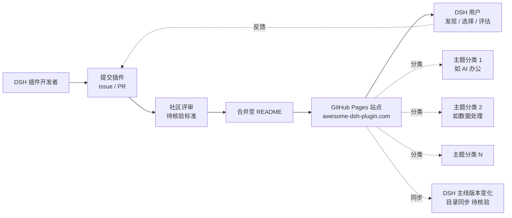

# awesome-dsh-plugin/awesome-dsh-plugin

## 一句话定位
DeepSeek Harness (DSH) 插件精选列表——awesome-list 形态的 DSH 生态目录，由社区组织 `awesome-dsh-plugin` 维护（而非 DeepSeek 官方），18 天 13,705⭐ / 2,366 forks，证明 DSH 生态已具备自组织能力。

## 它解决的问题
DSH 插件生态在 8-18 deepseek-harness 上架后呈井喷式增长——但用户在数百款插件中难以发现 / 选择 / 评估。"awesome-list" 模式是 GitHub 生态治理的最经典范式（最早可追溯至 awesome-python / awesome-rust 等），由社区而非官方维护的精选列表能：(1) **降低发现成本**——按主题 / 场景分类；(2) **提供质量信号**——社区评审过滤低质插件；(3) **形成生态入口**——awesome-dsh-plugin 域名（awesome-dsh-plugin.com）已上线，标志生态目录走向产品化。awesome-dsh-plugin 解决的是 DSH 生态的"信息发现 + 质量治理"基础设施。

## 为什么值得关注（2026-08-31）
- **Stars:** 13,705（截至 2026-08-31），**18 天起步**
- **Forks:** 2,366（远超 stars 量级项目，fork/star=17.3%，反映社区强烈参与编辑）
- **Watchers/Subscribers:** 32
- **License:** CC0-1.0（公共领域贡献协议，awesome-list 通用选择）
- **语言:** Python（仓库元数据用 Python，但实际内容多为 Markdown）
- **活跃度:** created 2026-08-13，pushed 2026-08-30，18 天持续高活跃
- **规模:** 65 MB（包含大量插件 README 引用 / 截图 / 资源）
- **Open Issues:** 316（社区评审高频）
- **GitHub Pages:** 已开启（awesome-dsh-plugin.com 站点已上线）
- **Discussions:** 已开启
- **Topics 完整覆盖:** `awesome` / `awesome-list` / `deepseek-harness` / `dsh` / `dsh-plugin` 五个明确
- **官方主页:** https://awesome-dsh-plugin.com

## 热度来源判断
awesome-dsh-plugin 的热度是 **"DSH 插件生态井喷 × awesome-list 经典范式 × 社区而非官方维护 × 18 天爆发曲线"** 的强组合。13,705⭐ / 2,366 forks / 18 天说明：(1) 真实需求——DSH 插件数量已超用户能直接浏览的临界点；(2) 经典范式吸引力——awesome-list 模式在 GitHub 生态有近 10 年验证；(3) 网络效应——fork 数远超 stars 是"用户想要编辑 / 贡献列表"的标志；(4) 域名 + Pages 站点——awesome-dsh-plugin.com 已上线说明产品化路径明确。热度**真实且具生态枢纽价值**——但需警惕：316 open issues（社区评审 / 提交 PR 排队积压是 awesome-list 类项目的常见问题）、DSH 主线版本变化时目录可能失同步、awesome-list 类项目长期活跃度依赖核心维护者精力。

## 关键技术亮点
1. **社区而非官方维护**：账号 `awesome-dsh-plugin` 是组织账号（不是 DeepSeek 官方）——这是生态自组织的明确信号
2. **GitHub Pages 站点**：awesome-dsh-plugin.com 已部署——比纯 README 列表更进一步的产品化
3. **CC0-1.0 许可**：公共领域贡献协议，符合 awesome-list 通用选择
4. **fork/star 比 17.3%**：远超个人开发者项目 5-8% 水平，反映社区参与度极高
5. **316 open issues**：社区评审 / 提交 PR 高频——这是 awesome-list 类项目的典型指标
6. **65 MB 规模**：含大量插件 README 引用 / 截图 / 资源——这是高质量 awesome-list 的特征（而非简单 README 列表）

## 架构师速览

| 决策问题 | 研究判断 | 证据边界 |
|---|---|---|
| 系统边界 | GitHub 仓库（Markdown 列表）+ GitHub Pages 站点（awesome-dsh-plugin.com）+ 社区评审流程（issue/PR 驱动） + DSH 插件分类法 | 仓库 + Pages 站点是 API 明示；社区评审流程（如何过滤 / 谁有合并权 / 评分体系）需 README 独立核验 |
| 主路径 | 用户提交插件 → issue / PR → 社区评审 → 分类合并 → 同步至 GitHub Pages 站点 → 用户通过站点或 README 发现插件 | issue/PR 驱动的贡献流程是 awesome-list 类项目惯例；具体评审标准（star 数门槛 / 活跃度 / 主题相关性）未公开 |
| 关键权衡 | 包容性 vs 质量门槛 vs 维护者精力 vs 目录同步 DSH 主线版本 vs 自组织 vs 商业化路径 | 316 open issues 来自 API；社区评审积压是真实风险；商业化路径（GitHub Sponsors / 付费特性）未明确 |
| 最小 PoC | 访问 awesome-dsh-plugin.com → 验证 DSH 插件按主题 / 场景分类 → 提交一个非主流 DSH 插件 → 验证评审流程 → 跟踪从提交到合并的周期 | 站点是否公开 / 评审标准 / 合并周期需 README 独立核验 |

## 架构启发
awesome-dsh-plugin 的核心启发是 **"平台层达到临界规模后，awesome-list 类生态目录必然出现，且由社区而非官方维护"**。8-18 deepseek-harness 上架后，DSH 插件在 13 天内涌入 6+ 款主流插件（dsh-desktop 22k⭐ / dsh-routing-suite 7k⭐ / dsh-web 6.5k⭐ / dsh-anchored-standard 3.8k⭐ / dsh-plugin-upgrade-skill 等）——这已远超用户能直接浏览的临界点，awesome-list 是必然产物。**更深层的启发是"社区而非官方维护"信号**——账号 `awesome-dsh-plugin` 不是 DeepSeek 官方，而是社区组织。这与 npm / PyPI 的官方 vs 社区目录之争、Linux 发行版的官方 vs 社区仓库之争同构：**当生态达到临界规模，社区自组织目录比官方目录更具公信力**。**对比：** awesome-python（2014）/ awesome-rust（2014）证明 awesome-list 模式在 GitHub 生态治理中有近 10 年验证；awesome-dsh-plugin 走的是同样路径。

## 架构图（MMD）

> 证据边界：此图只采用本档案已有可核验描述；"待核验"节点不应视为项目实现事实。

## 定位判断
**工具型项目（DSH 插件生态的社区目录）。** awesome-dsh-plugin 不仅是 awesome-list，更是 DSH 生态的"发现入口"——类比 npmjs.com / pypi.org 在 JavaScript / Python 生态的地位。13,705⭐ / 2,366 forks / awesome-dsh-plugin.com 已显示生态枢纽雏形。但"目录 → 平台"取决于几个关键问题：(1) 社区评审机制能否规模化（316 open issues 反映治理压力）；(2) GitHub Pages 站点的功能深度（搜索 / 评分 / 评论）；(3) 商业化路径（赞助 / 付费特性）是否清晰。目前定位是"DSH 插件精选列表（社区维护）"，向生态枢纽演进是合理路径。

## 风险/局限/泡沫点
- **316 open issues 积压风险**：awesome-list 类项目的常见问题——评审 / 合并积压可能导致贡献者流失
- **DSH 主线版本同步风险**：若 deepseek-harness 主仓库 API / 插件规范变化，awesome-dsh-plugin 目录可能失同步
- **核心维护者单点风险**：awesome-list 类项目长期活跃度依赖少数核心维护者精力
- **商业化路径不清晰**：awesome-dsh-plugin.com 站点是否商业化（赞助 / 付费特性 / 广告）未明确
- **社区评审标准未公开**：star 数门槛 / 活跃度要求 / 主题相关性等核心评审标准需 README 独立核验
- **CC0-1.0 许可的限制**：商业项目 fork 后可用于商业用途但缺少署名要求，可能被低质 fork 滥用
- **awesome-list 模式的内在局限**：纯文本列表在数百款插件后信息密度下降，可能需要更结构化的目录工具

## 与同类项目的关系
- **vs deepseek-harness 主仓库：** 主仓库是 DSH 插件的运行时 / 框架；awesome-dsh-plugin 是其生态目录
- **vs awesome-python / awesome-rust：** 同样 awesome-list 范式，但针对 DSH 垂直生态，更聚焦
- **vs npmjs.com / pypi.org：** 中心化包管理平台的 web 化目录；awesome-dsh-plugin 走 GitHub + Pages 路径，更轻量
- **vs 8-30 tt-a1i/archify：** archify 是单一 Agent Skill 产品；awesome-dsh-plugin 是 DSH 生态聚合目录
- **vs 8-27 K-Dense-AI/scientific-agent-skills：** 同样是 Agent Skill 类项目，但 K-Dense-AI 是单一仓库聚合 skills；awesome-dsh-plugin 是 awesome-list 聚合

## 是否值得持续跟踪
**值得跟踪（DSH 插件生态的社区目录 / 生态入口）。** awesome-dsh-plugin 代表"平台层达到临界规模后，社区自组织目录"的必然产物，无论其本身成败，这一方向是行业趋势。建议关注：316 open issues 收敛速度、GitHub Pages 站点的功能深度（搜索 / 评分 / 评论）、商业化路径（赞助 / 付费特性）、与 DSH 主线版本的同步策略、是否有大厂（Microsoft / Google / Anthropic）下场做官方生态目录。对 DSH 用户，awesome-dsh-plugin 是当前发现插件的主要入口。对生态观察者，它是"awesome-list 模式在 AI 插件时代复兴"的标杆样本。

## 后续观察点
- 316 open issues 收敛速度与社区评审机制成熟度
- GitHub Pages 站点功能深度（搜索 / 评分 / 评论 / API）
- 商业化路径（GitHub Sponsors / 付费特性 / 广告）
- 与 DSH 主线版本的同步策略
- 是否有大厂（Microsoft / Google / Anthropic）下场做官方生态目录
- 核心维护者精力投入与项目可持续性
- 主题分类法的演化（垂直行业 / 场景 / 性能分级）

---
> 数据来源: GitHub API (2026-08-31) | Stars: 13,705 | Forks: 2,366 | License: CC0-1.0 | 语言: Python | 创建: 2026-08-13 | Pushed: 2026-08-30