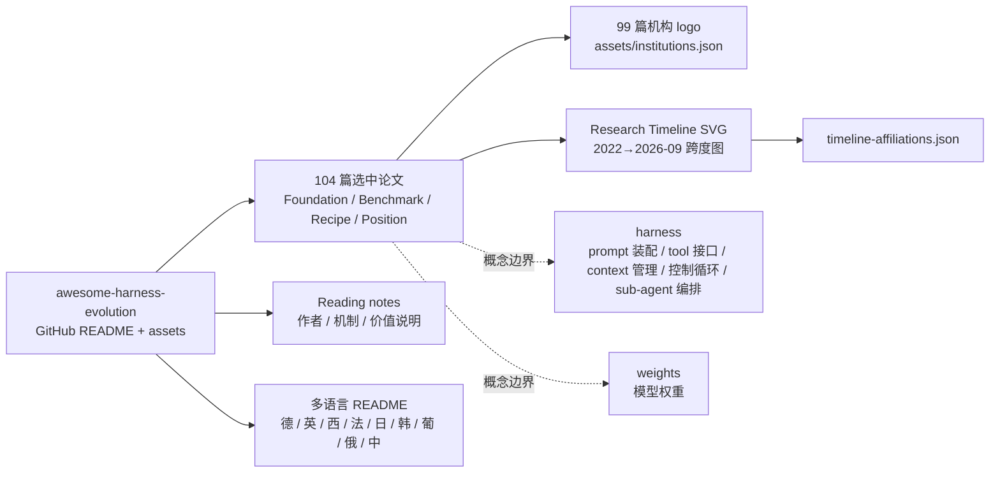

# wannabeyourfriend/awesome-harness-evolution

## 一句话定位
awesome-harness-evolution——AI Agent Harness 演化论文精选清单；明确把「harness（prompt 装配 / tool 接口 / context 管理 / 控制循环 / sub-agent 编排）」与「weights（模型权重）」区分开；Foundation / Benchmark / Recipe / Position 四类 104 篇选中论文；99 篇带作者机构 logo；CC0。

## 它解决的问题
2025-2026 年 AI Agent 赛道爆发，但学术 / 工程社区对 **「harness」**（围绕 LLM 的运行时脚手架：prompt 装配 + tool 接口 + context 管理 + 控制循环 + sub-agent 编排）与 **「weights」**（模型权重本身）的区分尚未广泛接受。Awesome Harness Evolution 直击这一痛点：它把 harness 相关论文系统化收集（搜索 / 优化 / 修复 / 训练 / 协同演化 / 评估），并提供 Foundation / Benchmark / Recipe / Position 四类组织 + Research Timeline 2022→2026-09 跨度图。**它本身不写代码，但为整个 Agent Harness 赛道提供论文索引**——研究型 awesome-list 的成熟模板。

## 为什么值得关注（2026-09-13）
- 1 天 22⭐ / fork 1 / fork/star 4.5%
- 明确区分 harness vs weights——学术 / 工程概念边界清晰
- 104 篇选中论文（99 篇带机构 logo）——内容深度大
- Research Timeline SVG 2022→2026-09 跨度图——可视化研究谱系
- Foundation / Benchmark / Recipe / Position 四类组织——清晰分类
- assets/institutions.json + timeline-affiliations.json 双源文件——可核验
- 多语言 README（德 / 英 / 西 / 法 / 日 / 韩 / 葡 / 俄 / 中）——国际化

## 热度来源判断
Awesome Harness Evolution 的热度是 **「AI Agent Harness 赛道学术化刚需 + 研究型 awesome-list 模板 + Timeline 可视化」三因素叠加**。AI Agent 学术 / 工程社区需要明确的概念边界（harness vs weights），而 awesome-list 是低成本但高价值的内容组织方式。**22⭐ / 1 天 / 4.8 MB size 反映作者花大量时间做的内容深度**——Research Timeline + 99 篇机构 logo + 双源 JSON 文件支持核验。**热度来源真实但偏小众**——它是学术 / 研究型项目，目标用户是 AI Agent 研究者与高级工程师，不是普通开发者。

## 关键技术亮点
1. **harness vs weights 概念边界**——把 prompt 装配 / tool 接口 / context 管理 / 控制循环 / sub-agent 编排定义为 harness，区别于模型权重
2. **104 篇选中论文**——Foundation / Benchmark / Recipe / Position 四类组织
3. **99 篇带机构 logo**——作者机构归属可视化
4. **Research Timeline SVG 2022→2026-09**——跨度图，可视化研究谱系
5. **assets/institutions.json + timeline-affiliations.json**——双源文件支持核验
6. **多语言 README**——德 / 英 / 西 / 法 / 日 / 韩 / 葡 / 俄 / 中
7. **Reading notes**——每篇论文附作者 / 机制 / 价值说明
8. **CC0 license**——鼓励衍生，无版权限制

## 架构师速览

| 决策问题 | 研究判断 | 证据边界 |
|---|---|---|
| 系统边界 | awesome-list 形式的论文索引；GitHub README + assets 目录；纯内容无运行时 | 来自 README 与 assets 目录结构；具体论文是否覆盖到 2026-09（最新 arXiv 提交）待核验 |
| 主路径 | 论文收集 → 分类（Foundation / Benchmark / Recipe / Position）→ 机构归属 logo → Timeline SVG → 多语言 README | 主路径来自 README 章节结构；论文收录标准、版本同步频率待核验 |
| 关键权衡 | 收录广度（覆盖全 vs 维护成本）vs Timeline 可视化（清晰 vs 工作量大）vs 多语言 README（本地化友好 vs 翻译成本）vs CC0（鼓励衍生 vs 无版权保护） | 四权衡来自 README 特性对照；具体收录标准、Tailwind 工作量未公开 |
| 最小 PoC | 浏览 README → 看 Research Timeline 跨度图 → 选择 Foundation 类读 3-5 篇代表性论文 → 检查 assets/timeline-affiliations.json 验证机构归属 | PoC 由 awesome-list 形式推导；论文收录标准与同步策略待核验 |

## 架构图（MMD）

> 证据边界：此图只采用本档案已有可核验描述；"待核验"节点不应视为项目实现事实。

## 架构启发
Awesome Harness Evolution 的核心启发是 **「研究型 awesome-list 模板」**——把 awesome-list 从「资源索引」做到「学术谱系图」（timeline + 机构 logo + 第一作者归属 + 阅读笔记）。更深层的启发是 **「harness vs weights 的概念边界」**——这是 AI Agent 赛道最关键的概念区分之一，让研究者 / 工程师能聚焦 harness 而非 weights。**最值得借鉴的是「assets/institutions.json + timeline-affiliations.json」双源文件**——让 awesome-list 不仅可读而且可验证，是研究型 awesome-list 的工程化细节。

## 定位判断
**观察型项目（AI Agent Harness 学术谱系）。** Awesome Harness Evolution 不是工具，而是 **「研究型 awesome-list」**——它本身不写代码，但为整个 Agent Harness 赛道提供论文索引。它填补了 (a) AI Agent Harness 概念边界清晰的空白；(b) 研究型 awesome-list 模板的空白。能否成为「研究必读清单」取决于：(a) 是否持续更新到最新 arXiv 提交；(b) 是否被引用为 Agent Harness 研究的入门参考。当前定位是「AI Agent Harness 学术 / 工程社区的论文索引标杆」。

## 风险 / 局限 / 泡沫点
- **awesome-list 本质是内容维护**——作者维护意愿决定可持续性
- **CC0 license 无版权保护**——可能被 fork 但不署名 / 不回馈
- **Timeline SVG 工作量大**——每篇新论文都需更新机构归属
- **论文收录标准未公开**——可能有主观选择偏差
- **目标用户偏小众**——AI Agent 研究者与高级工程师，非普通开发者
- **22⭐ / 1 天基数较小**——可能未广泛传播到目标用户群

## 与同类项目的关系
- **vs `wshobson/agents`：** wshobson/agents 是 Agent 插件市场；awesome-harness-evolution 是 Agent Harness 论文索引
- **vs `awesome-claude-code`：** awesome-claude-code 是 Claude Code 资源索引；awesome-harness-evolution 是整个 Harness 赛道论文索引
- **vs `awesome-llm-apps`：** awesome-llm-apps 是 LLM 应用清单；awesome-harness-evolution 是 Harness 学术谱系
- **vs `affaan-m/ecc`：** ecc 是 Agent Harness 性能优化框架；awesome-harness-evolution 是其学术背景索引
- **vs arXiv：** arXiv 是论文发布平台；awesome-harness-evolution 是 Harness 主题论文精选

## 是否值得持续跟踪
**值得跟踪（AI Agent Harness 学术 / 工程社区论文索引标杆）。** Awesome Harness Evolution 把 harness vs weights 的概念边界清晰化，是研究型 awesome-list 的成熟模板。建议关注：(a) 是否持续更新到最新 arXiv 提交；(b) 是否被引用为 Agent Harness 研究的入门参考。对 AI Agent 研究者，这是直接可用的论文清单（按 Foundation / Benchmark / Recipe / Position 分类）。对 AI Agent 工程社区，它是理解 Harness 赛道学术背景的入口。

## 后续观察点
- 论文收录是否持续更新到最新 arXiv 提交
- 是否被引用为 Agent Harness 研究入门参考
- Timeline SVG 是否扩展到 2027
- 多语言 README 是否持续维护
- 是否出现 fork + 衍生清单（如 specific Harness sub-topic）
- awesome-list 形式 vs SaaS 论文管理工具的演化

---
> 数据来源: GitHub API (2026-09-13) + README 公开摘录 | Stars: 22 | Forks: 1 | License: CC0-1.0 | 语言: Python | 创建: 2026-09-12 | 仓库 size: 4.8 MB
