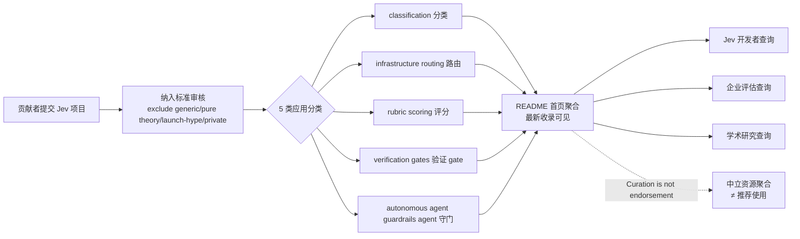

# v-modal/awesome-jev-tools

## 一句话定位
Jev 决策模型生态聚合 awesome 列表 —— README 是分类文件首页聚合最新收录，把 TypeSafe AI System One 决策模型（接受 state + typed question 返回 typed decision + confidence）应用到 classification / infrastructure routing / rubric scoring / verification gates / autonomous agent guardrails 5 类场景的公开项目与开发者模式聚合。

## 它解决的问题
09-15 ~ 09-19 五日内 Jev 生态爆发 10+ 项目（foreman / jev-review / jev-browser / mobile-jev / openjev-sglang / jev-align / jev-semgrep / simple-jev / openjev / awesome-jev 等），但分散在 launch threads / social media / one-off prototypes——**难以快速回答「Jev 在哪些生产环境做真实决策 + 哪些决策架构可跨行业复用」**。awesome-jev-tools 用「README 是分类文件首页聚合 + 明确纳入标准 + 排除 generic / pure theory / launch-hype / private + 5 类应用分类 + Curation is not endorsement」是「严肃 awesome 列表 + 资源聚合 + 决策模型生产可用性快照」的具体路径。

## 为什么值得关注（2026-09-20）
- **Stars:** 158（截至 2026-09-20），1 天 158⭐，**资源聚合列表高 star 但 fork 0 是天然特征**（收藏但不 fork）
- **License:** None（待补充）
- **语言:** None（纯资源聚合 README）
- **活跃度:** created 2026-09-19，pushed_at 2026-09-19
- **规模:** 83 KB（小规模高质量资源聚合）
- **Topics:** awesome / awesome-list / awesome-lists / jev / llm / robotics / robotics-algorithms / robotics-control / robotics-simulation（覆盖范围超越纯 AI Coding，延伸到 robotics）
- **Jev 描述:** "Jev is not a chat model. It does not write text or hold conversations. Instead, it takes unstructured state alongside a typed question and returns a typed decision—such as a choice, a score, or a boolean—accompanied by a confidence rating"
- **Curation 标准:** "We do not include: Generic classifiers, routers, or research agents that merely resemble the pattern without using Jev; Pure theory or opinion without a concrete practice; Launch-hype commentary with no working artifact or reproducible result; Long write-ups inside the list itself; Sources that are private, inaccessible, or too vague to classify"

## 热度来源判断
awesome-jev-tools 的热度是 **「09-15 ~ 09-19 Jev 生态爆发 + 资源分散 + 严肃资源聚合刚需 × 明确纳入标准 + Curation is not endorsement + 5 类应用分类 + 跨行业（AI Coding + robotics）覆盖」** 的组合。当前 Jev 开发者 / 企业评估者 / 学术研究者的痛点是「Jev 在哪些生产环境做真实决策 + 哪些决策架构可跨行业复用」。一个 awesome 列表直击痛点 + 明确纳入标准 + 5 类应用分类 + 跨行业覆盖，自然爆火。**0 forks** 是 awesome 列表的天然特征（收藏但不 fork，因为 awesome 列表天然是「收藏 + 引用」而非「fork + 修改」）。热度**真实且具生态价值**——但需警惕：Jev 生态本身的活跃度 + 纳入标准的持续严格 + 5 类应用分类的稳定性 + 跨行业复用模式的清晰度是长期价值的核心。

## 关键技术亮点
1. **README 是分类文件首页聚合** ——最新收录直接可见 + 不用下钻子页；这是「比传统 awesome 列表友好」的工程化形式
2. **Jev 核心定义** ——"Jev is not a chat model. It does not write text or hold conversations"；这是「明确 Jev 不是 LLM 而是决策模型」的工程化形式——避免「Jev = LLM」的误解
3. **5 类应用分类** ——classification / infrastructure routing / rubric scoring / verification gates / autonomous agent guardrails；这是「Jev 决策问题类型结构化」的工程化形式
4. **明确纳入标准** ——exclude generic classifiers / pure theory / launch-hype / private sources；这是「高质量 awesome 列表」的工程化形式——避免「awesome 列表水化」
5. **Curation is not endorsement** ——"Inclusion means one thing: the entry satisfies..."；这是「中立资源聚合」的工程化形式——避免「awesome 列表 = 推荐列表」的误解
6. **跨行业覆盖** ——topics 包含 robotics / robotics-algorithms / robotics-control / robotics-simulation；这是「Jev 不止 AI Coding 而是跨行业决策」的工程化形式
7. **83 KB repo** ——小规模高质量资源聚合
8. **star 158 / fork 0** ——观察 / 收藏信号（非 fork 信号，因为 awesome 列表天然不 fork）
9. **Two 实用问题** ——"Where is Jev actively making real decisions in live production workflows?" + "Which decision architectures can be cleanly copied and applied across different industries?"；这是「awesome 列表服务两类用户」的工程化形式

## 架构师速览

| 决策问题 | 研究判断 | 证据边界 |
|---|---|---|
| 系统边界 | Jev 决策模型生态资源聚合层；README 是分类文件首页聚合 + 跨行业分类目录 | 仅基于档案描述的 README 首页聚合、5 类应用分类、纳入标准；具体分类文件结构、贡献流程、版本控制均待核验 |
| 主路径 | Jev 生态项目 → 贡献者提交 → 纳入标准审核 → 5 类分类目录 → README 首页聚合 → 开发者 / 企业 / 学术查询 | 主路径为档案语义抽象；具体审核流程、PR 标准、自动化工具均待核验 |
| 关键权衡 | 资源聚合广度 vs 纳入标准严格 vs 跨行业覆盖 vs curation 中立性 vs 分类稳定性 vs README 首页信息密度 | 档案明示 5 类应用分类、纳入标准、Curation is not endorsement、跨行业覆盖 5 项权衡；具体分类动态维护、PR 接受率均待核验 |
| 最小 PoC | 评估 2 个 Jev 生态项目（推荐 foreman + jev-review），通过 README 首页 5 类分类验证进入速率，再下钻到分类子目录验证资源完整度，最后用纳入标准反向验证被排除项目 | PoC 范围、退出路径由档案「5 类分类 + 纳入标准 + curation is not endorsement」建议推导；具体子目录结构、PR 流程、SLO 指标待核验 |

## 架构启发
awesome-jev-tools 的核心启发是 **「生态资源聚合列表应该明确纳入标准 + Curation is not endorsement + 跨行业覆盖 + README 首页聚合最新收录」**。当前 awesome 列表的常见问题是「无纳入标准 + curation = endorsement + 单行业覆盖 + 子目录分散」。awesome-jev-tools 用「明确纳入标准（exclude generic / pure theory / launch-hype / private）+ Curation is not endorsement（纳入 ≠ 推荐）+ 跨行业覆盖（AI Coding + robotics）+ README 是分类文件首页聚合」是「严肃生态资源聚合」的参考实现。更深层的启发是：**awesome 列表的严肃性决定了生态进入的严肃期**——从「数量爆发」到「质量筛选」是关键演化。

## 架构图（MMD）

> 证据边界：此图只采用本档案已有可核验描述；"待核验"节点不应视为项目实现事实。

## 定位判断
**生态聚合型项目（Jev 决策模型资源聚合）。** awesome-jev-tools 不仅是 awesome 列表，更试图成为 Jev 决策模型生态的「严肃资源聚合层」——类似 awesome-selfhosted 之于自托管 / awesome-rust 之于 Rust 生态。若成功，它会成为 Jev 生态的「质量筛选器」+「跨行业复用模式参考」，具有生态级价值。158⭐ + 0 forks 已显示「生态观察 / 收藏」信号。但「生态聚合」取决于一个关键问题：Jev 生态本身的活跃度 + 纳入标准的持续严格 + 5 类应用分类的稳定性 + 跨行业复用模式的清晰度。目前定位是「Jev 生态最高质量的资源聚合层」，向生态级聚合演进是合理路径。

## 风险/局限/泡沫点
- **Jev 生态依赖** ——Jev 生态本身的活跃度 + TypeSafe AI 公司的稳定性 + Jev API 持续可用
- **纳入标准执行** ——严格 vs 宽松的平衡；过严会错过边界案例，过松会降低列表质量
- **分类稳定性** ——5 类应用分类是否覆盖未来新场景；分类扩展 / 合并的治理机制
- **跨行业复用模式清晰度** ——从「列项目」到「提取可复用模式」的演化路径
- **个人维护** ——v-modal 个人维护，纳入标准执行的一致性 + 持续更新的可持续性
- **License 缺失** ——目前 License 字段为空，企业商用前需补充
- **awesome 列表水化风险** ——Jev 生态爆发后大量新项目涌入，纳入标准是否被破坏

## 与同类项目的关系
- **vs cobanov/awesome-jev:** 昨日 103⭐，同样 Jev 资源聚合；但 awesome-jev-tools 在「明确纳入标准 + Curation is not endorsement + 跨行业（AI Coding + robotics）+ README 首页聚合」上更严肃
- **vs fatwang2/awesome-jev:** 昨日 100⭐，同样 Jev 资源聚合
- **vs AbdelStark/awesome-typesafe:** 昨日 TypeSafe/System One/Jev 资源聚合；范围更广（不只 Jev）
- **vs awesome-selfhosted / awesome-rust:** 严肃 awesome 列表的参考形态——纳入标准 + curation 中立 + README 首页聚合 + 持续维护
- **vs Jev 官方文档:** 官方文档是 Jev API 文档，awesome-jev-tools 是「Jev 生态资源聚合」——互补
- **vs Jev 应用项目:** foreman / jev-review / jev-browser 等是「Jev 应用」，awesome-jev-tools 是「Jev 应用聚合」——上下层关系

## 是否值得持续跟踪
**值得跟踪（Jev 决策模型生态聚合）。** awesome-jev-tools 代表了 Jev 生态「资源聚合层」的诉求，无论其本身成败，这一方向是行业趋势。建议关注：Jev 生态本身的活跃度（决定列表是否持续更新）+ 纳入标准的持续严格（决定列表质量）+ 5 类应用分类的稳定性（决定跨行业复用）+ 跨行业复用模式的清晰度（决定列表深度）。对 Jev 开发者 / 企业评估者 / 学术研究者，这个列表是「Jev 决策模型生态资源聚合」的具体路径，值得直接采用 + 持续关注。对生态观察者，它是「awesome 列表严肃化」的样本。

## 后续观察点
- Jev 生态本身的活跃度（TypeSafe AI 公司稳定性 + Jev API 持续可用）
- 纳入标准的持续严格（PR 接受率 / 拒绝案例 / 边界项目处理）
- 5 类应用分类的稳定性（是否扩展 / 合并 / 重命名）
- 跨行业复用模式的清晰度（从「列项目」到「提取可复用模式」的演化）
- License 字段补充（目前为空）
- 个人维护的可持续性（v-modal 是否长期维护 + 是否出现 co-maintainer）
- 是否演化出「Jev 应用排行榜 / Jev 决策模型评测」等扩展
- 与 Jev 官方文档 / 官方 console 的关系（互补 vs 替代）

---
> 数据来源: GitHub API (2026-09-20) | Stars: 158 | Forks: 0 | License: None | 语言: None | 创建: 2026-09-19