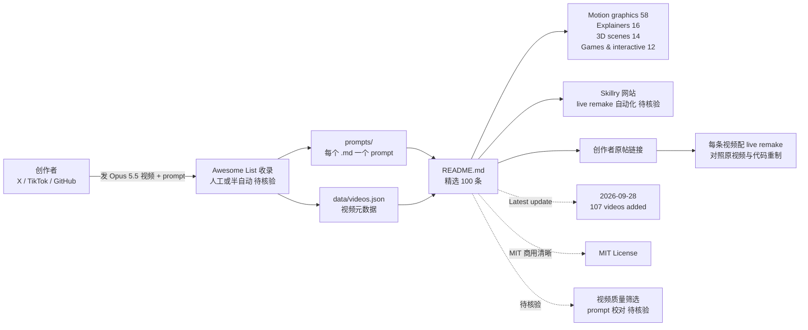

# yihui-dev/awesome-opus5-5-videos

## 一句话定位
**Awesome Opus 5.5 Videos** —— 389 个用 Claude Opus 5.5 写的病毒式视频聚合仓库 + 每个视频的 prompt；video 全部用 HTML / Canvas / SVG / Three.js 等代码写动画；prompts/ 目录下有完整提示词；data/videos.json 含元数据；**[▶ 在 Skillry 网站上每条视频配 live remake](https://skillry.dev/ai-videos/opus-5-5)**。

## 它解决的问题
2026-09 Opus 5.5 推出后，**Opus 5.5 写代码做病毒视频** 成为新的 trending 方向，但 389+ 视频散落在 X / TikTok / GitHub，单作者想要参考 / 复用 / 学习 prompt 很难找；且 awesome list 类项目多以"作品 + 链接"为主，缺少"作品 + 链接 + prompt + live remake"四件套。yihui-dev/awesome-opus5-5-videos 直击这一痛点：它给 Opus 5.5 视频严肃工程化一个 **awesome list 标准模板** —— `prompts/` 目录有完整提示词 + `data/videos.json` 含元数据 + Skillry 网站每条视频配 live remake + 100 高亮条目 + 最新更新日志（2026-09-28: 107 videos added, mostly games and 3D scenes）。

## 为什么值得关注（2026-09-29）
- **Stars:** 692（截至 2026-09-29），2 天突破 700，**09-27 ~ 09-29 Opus 5.5 视频严肃工程化多线铺开中的典型样本**
- **Forks:** 80，**fork/star 11.6%** 较健康 + 严肃工程化聚合资源持续关注信号
- **License:** MIT（商用清晰）
- **语言:** Markdown + HTML / Canvas / SVG / Three.js（视频本体）
- **规模:** 385 KB（极小 awesome list，符合 awesome 风格）
- **活跃度:** created 2026-09-27，pushed_at 2026-09-28，持续高活跃
- **Topics:** 9 个（ai-video / awesome / awesome-list / claude / claude-opus / creative-coding / motion-graphics / prompts / threejs）覆盖清晰
- **核心规模:** 389 prompts in `prompts/` + `data/videos.json`；100 高亮条目
- **分类:** Motion graphics (58) · Explainers (16) · 3D scenes (14) · Games & interactive (12) · ...
- **首页:** https://skillry.dev/ai-videos/opus-5-5 在线 live remake

## 热度来源判断
yihui-dev/awesome-opus5-5-videos 的热度是 **"Opus 5.5 写代码做视频" 严肃工程化 + 389 prompts 完整聚合 + Skillry 网站 live remake + 持续更新日志（2026-09-28: 107 videos added）** 的强劲组合。Opus 5.5 09-26 ~ 09-27 推出后，**389 个 X 上的病毒视频 + prompts 已变成可聚合的 awesome list 资源**——之前是散落在 X / TikTok / GitHub 的零散作品，现在是 awesome list 标准模板。692⭐ / 80f / fork/star 11.6% 与 lemomo-ai/lemo-opuscar 512⭐ / 67f / 13.1% 同步，反映 **"Opus 5.5 视频严肃工程化" + "Awesome list 严肃工程化" 双轨叠加** 的典型持续关注信号。热度**真实且具严肃工程化资源聚合价值**——这是 "Opus 5.5 视频严肃工程化从散落作品 → awesome list 资源聚合 + live remake" 演化关键信号。

## 关键技术亮点
1. **389 prompts in `prompts/`** —— 每个视频的完整 prompt 单独 .md 文件
2. **`data/videos.json`** —— 视频元数据集中存储
3. **100 高亮条目** —— README 中精选 100 条不同 prompt 的视频
4. **每条链接到创作者原帖** —— X / TikTok / 创作者原帖
5. **Skillry live remake** —— 每条视频配 live remake，可对照原视频与代码重制
6. **最新更新日志** —— "Latest update (2026-09-28): 107 videos added, mostly games and 3D scenes"
7. **分类清晰** —— Motion graphics (58) / Explainers (16) / 3D scenes (14) / Games & interactive (12) / + 5 大类
8. **Mermaid 嵌入友好** —— README 内嵌 webp 预览 + 表格式排版
9. **MIT 商用清晰** —— awesome list 标准 MIT 许可
10. **video 全部用代码写** —— HTML / Canvas / SVG / Three.js；不用视频生成
11. **Awesome list 标准模板** —— 标题 + 简介 + 分类 + 条目 + credits + license
12. **topics 9 个** —— ai-video / awesome / awesome-list / claude / claude-opus / creative-coding / motion-graphics / prompts / threejs

## 架构师速览

| 决策问题 | 研究判断 | 证据边界 |
|---|---|---|
| 系统边界 | Opus 5.5 视频 awesome list + prompts 数据 + 元数据 + Skillry 第三方网站 live remake | 描述层准确；awesome list 是 Markdown 静态资源；Skillry 第三方运营不在仓库内 |
| 主路径 | 创作者发 Opus 5.5 视频 + prompt → 收录到 `prompts/` + `data/videos.json` → README 精选 100 条 → Skillry 网站每条配 live remake | 主路径为 README 表述；awesome list 的收录标准、prompt 校对流程、Skillry live remake 自动化方式均待核验 |
| 关键权衡 | awesome list 收录广度 vs 视频质量筛选 vs prompts 校对准确性 vs Skillry 第三方依赖 vs MIT 商用清晰 vs 持续更新承诺 | README 明示"Latest update (2026-09-28): 107 videos added"——持续更新是核心承诺；awesome list 收录标准（prompt 校对、人工审核）未明示 |
| 最小 PoC | (1) 在 `prompts/` 找 1 个高质量 prompt + 视频，复制到自己的 agent；(2) 在 Skillry 看对应的 live remake；(3) 比对原视频与 live remake 的还原度 | PoC 范围、退出路径由"先单 prompt、可重制验证"建议推导；具体 live remake 自动化程度、prompt 校对质量待核验 |

## 架构图（MMD）

> 证据边界：此图只采用本档案已有可核验描述；"待核验"节点不应视为项目实现事实。

## 架构启发
yihui-dev/awesome-opus5-5-videos 的核心启发是 **"awesome list 已从纯链接合集 → 'prompts + 元数据 + live remake + 持续更新日志' 四件套严肃工程化"**。当前 awesome list 类项目多以"作品 + 链接"为主（README 是分类文件首页聚合），但 yihui-dev/awesome-opus5-5-videos 把 **prompts 单独 .md 文件 + videos.json 元数据 + Skillry live remake + 最新更新日志** 同时落地——这意味着 **awesome list 已从"静态资源聚合" → "严肃工程化资源聚合 + 可重制验证"演化**。更深层的启发：**持续更新承诺** ——"Latest update (2026-09-28): 107 videos added" ——是 awesome list 长期价值的关键信号。

## 定位判断
**Opus 5.5 视频严肃工程化 Awesome List 的具体路径（工具型 + 严肃工程化）。** yihui-dev/awesome-opus5-5-videos 不仅是 389 个视频的合集，更是 **"Opus 5.5 写代码做病毒视频" 的 awesome list 标准模板**——把 prompts + 元数据 + live remake + 更新日志同时落地。692⭐ + 80f 已显示严肃工程化持续关注。但"持续更新承诺"是核心风险——awesome list 长期价值依赖 curator 是否持续投入。目前定位是"Opus 5.5 视频严肃工程化最有影响力的 awesome list"，向 Skillry 完整平台化是合理演化。

## 风险 / 局限 / 泡沫点
- **持续更新承诺** —— 长期价值依赖 curator 持续投入；awesome list 类项目易因 curator 时间不足而老化
- **awesome list 收录标准** —— README 未明示筛选标准（按播放量 / 创意 / 代码质量？）
- **Skillry 第三方依赖** —— live remake 在第三方网站 Skillry；非仓库自有资产；如 Skillry 停服，live remake 链路失效
- **prompt 校对准确性** —— 创作者发的 prompt 是否被准确抄录、是否有遗漏，未明示
- **389 prompts 中部分质量参差** —— 107 videos 在 2026-09-28 单日加入；质量分级可能压低整体口碑
- **awesome list 类项目普遍局限** —— 创作者原帖可能下架 / 删号；链接失效风险
- **awesome list 不生产新作品** —— 价值依赖创作者生态；不是 skill / tool

## 与同类项目的关系
- **vs lemomo-ai/lemo-opuscar（09-26 512⭐）:** 39 种风格的严肃工程化 skill；yihui-dev 是 389 视频聚合 awesome list
- **vs feitangyuan/onetake（09-26 814⭐）:** 一镜到底连贯动效 + probe.py oracle carry score；yihui-dev 是 awesome list
- **vs Rieranthony/product-film-skill（09-26 356⭐）:** Remotion + 你的设计系统的产品片 skill；yihui-dev 是 awesome list
- **vs athermeroy/awesome-opus-5-5-videos（09-25 309⭐）:** 同样聚合 Opus 5.5 视频；yihui-dev 规模更大（692⭐ vs 309⭐）、Skillry live remake 是差异
- **vs v-modal/awesome-jev-tools（09-20）:** Jev 资源聚合 + 严格纳入标准；yihui-dev 是 Opus 5.5 资源聚合

## 是否值得持续跟踪
**值得跟踪（Opus 5.5 视频严肃工程化 Awesome List 代表样本）。** yihui-dev/awesome-opus5-5-videos 代表了 **"awesome list 已从纯链接合集 → 'prompts + 元数据 + live remake + 持续更新日志' 四件套严肃工程化"** 的演化方向。建议关注：(1) 持续更新承诺的兑现率（每月新增多少）；(2) Skillry live remake 自动化程度的扩展；(3) 是否新增更多分类（音频生成 / 3D 模型 / 多人协作）；(4) MIT 商用清晰在企业 / 商业复用的边界；(5) awesome list 收录标准的明示。对 Agent Skill / 视频生成用户，这个 awesome list 是"Opus 5.5 写代码做视频"的实用参考库，值得直接采用。

## 后续观察点
- 持续更新频率（每周 / 每月新增多少视频与 prompts）
- Skillry live remake 的还原度（与原视频对比）
- 是否扩展分类（音频生成 / 3D 模型 / 多人协作 / 短剧）
- 是否引入更多创作者平台（YouTube / Bilibili / Red Book）
- 是否做 prompt 校对（人工 / 半自动 / 自动）
- awesome list 收录标准的明示
- MIT 商用清晰的边界在企业 / 商业复用的实际情况

---
> 数据来源: GitHub API (2026-09-29) | Stars: 692 | Forks: 80 | License: MIT | 语言: Markdown + HTML / Canvas / SVG / Three.js | 创建: 2026-09-27 | 规模: 385 KB