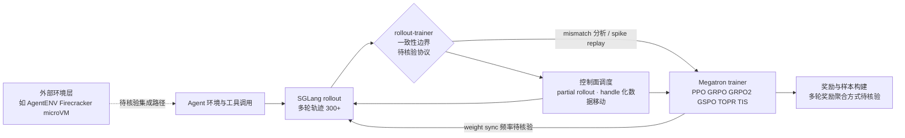

# XYZ-AI-Lab/axrl

## 一句话定位
Agentic RL 后训练框架，基于 SGLang rollout + Megatron 训练，处理 300+ 轮多轮轨迹与数百亿参数规模训练，直击 rollout-trainer 一致性这一 Agent RL 工程化核心难题。

## 它解决的问题
LLM 后训练正从单轮问答转向多轮 Agent RL：模型与长生命周期环境交互、调用工具、观察结果、更新上下文、多轮后才获得奖励。这给后训练框架带来新挑战——需协调多轮 rollout、环境状态、工具调用、奖励收集、训练样本构建、权重同步。更隐蔽但致命的是**rollout 与 trainer 之间的不一致**：tokenization、chat template、logprobs、routing、packing、weight sync 的微小差异会导致 loss spike 和 reward 不稳定。

## 为什么值得关注（2026-07-30）
- **直击 Agent RL 工程化核心难题**：rollout-trainer 一致性是多轮 Agent RL 从"能跑"到"可复现"的关键。
- **真实规模**：官方称用于 300+ 轮轨迹、数百亿参数规模的真实 Agent RL 工作流。
- **引擎组合成熟**：SGLang（rollout）+ Megatron（训练）是已被验证的组合。
- **呼应昨日 AgentENV 信号**：AgentENV 提供环境实例（Firecracker 微虚拟机），AxisRL 处理 rollout-trainer 一致性——两者互补，共同验证 Agent RL 基础设施走向工程化。

## 热度来源判断
**真实技术需求主导，热度温和。** Agent RL 后训练是前沿但小众领域，569⭐（7 天）对一个纯框架项目健康。热度来自真正做大模型后训练的团队的需求，而非话题性。风险：规模与效果为官方声称，缺乏独立大规模复现案例。

## 关键技术亮点亮点
1. **rollout-trainer 一致性工程化**：提供 mismatch 分析、routing replay 检查、spike replay，把 rollout 与 trainer 间隐秘的差异变成可观测、可复现调试的问题。
2. **多策略目标**：PPO、GRPO/GRPO2、GSPO、TOPR、TIS 等可配置，覆盖主流 RL 后训练算法。
3. **降低 idle 时间**：partial rollout + 轻量控制面调度，减少长尾轨迹与工具延迟导致的 rollout/training 资源闲置。
4. **handle-based 数据移动 + 上下文打包**：重负载数据（routing replay、多模态 artifact）按需读取，trainer worker 按需消费，控制面保持轻量。

## 架构师速览

| 决策问题 | 研究判断 | 证据边界 |
|---|---|---|
| 系统边界 | Agentic RL 后训练框架，定位于 SGLang（rollout）与 Megatron（trainer）之间的系统契约层，不替代底层引擎 | 依据 README 明示的"SGLang rollout + Megatron 训练"组合与"系统层框架"自定位；具体进程边界与 RPC 协议未公开 |
| 主路径 | 多轮 rollout（300+ 轮）→ rollout-trainer 一致性校验（tokenization/logprobs/routing/packing/weight sync）→ 训练样本构建 → Megatron 训练 | 多轮规模与一致性维度来自档案；训练样本构造与权重同步实现细节需源码核验 |
| 关键权衡 | 多算法可配（PPO/GRPO/GRPO2/GSPO/TOPR/TIS）换取与 SGLang+Megatron 的强绑定，扩展性受限于引擎组合 | 算法列表与引擎绑定来自档案；其他引擎（vLLM/DeepSpeed）的迁移成本未公开 |
| 最小 PoC | 在 SGLang+Megatron 最小 GPU 配置上跑通 PPO 单环境短轨迹，对齐 tokenization/logprobs/routing 三项一致性，再引入 GRPO 与长轨迹 | 官方声称支持该子集；具体硬件门槛、SGLang/Megatron 版本兼容性与部署形态"待核验" |

## 架构启发
AxisRL 的核心启发是：**在多轮 Agent RL 中，系统层的"一致性契约"比算法本身更决定成败。** 算法（PPO/GRPO）是已知的，但 tokenization 偏差一个 token、weight sync 晚一版、logprobs 计算路径不同，都会在多轮累积后放大为 reward 不稳定。AxisRL 把这些边界显式化并提供调试工具，是从"炼丹"走向"工程"的关键。

## 架构图（MMD）

> 证据边界：此图只采用本档案已有可核验描述；“待核验”节点不应视为项目实现事实。

## 定位判断
在 Agent RL 后训练框架赛道，AxisRL 定位为**系统层框架**——它不替代 SGLang/Megatron，而是处理它们之间的系统契约。与 AgentENV（环境实例层）互补：AxisRL 管 rollout↔trainer 一致性，AgentENV 管 Agent↔环境交互实例。

## 风险 / 局限 / 泡沫点
1. **规模与效果为官方声称**：300+ 轮、数百亿参数规模需独立复现案例佐证，当前 0 open issues 可能说明社区使用尚浅。
2. **部署门槛高**：依赖 SGLang + Megatron + 大规模 GPU 集群，非一般团队能复现。
3. **文档/教程成熟度未知**：作为新框架，上手成本与社区生态待观察。
4. **强绑定 SGLang/Megatron**：若团队用其他引擎（vLLM/DeepSpeed），集成成本未知。

## 与同类项目的关系
- **vs OpenRLHF / TRL**：通用 RL 后训练框架，单轮任务成熟；AxisRL 专注多轮 Agent RL 的系统层一致性。
- **vs AgentENV（昨日）**：互补关系——AgentENV 提供环境实例（Firecracker microVM），AxisRL 处理 rollout-trainer 一致性。
- **vs veRL**（字节）：同为 Agent RL 框架，设计哲学与引擎选择不同。

## 是否值得持续跟踪
**是。** Agent RL 后训练是确定性方向，rollout-trainer 一致性是真实痛点。跟踪重点：独立大规模复现案例、与 AgentENV/veRL 等的组合实践、社区采用度。

## 后续观察点
1. 独立团队在真实 Agent RL 任务中的复现案例与稳定性报告。
2. 是否支持非 SGLang/Megatron 引擎组合（如 vLLM + DeepSpeed）。
3. 与 AgentENV 等环境层方案的集成实践。

---
*首次记录：2026-07-30 · 数据来源：GitHub API + 仓库官方 README*
