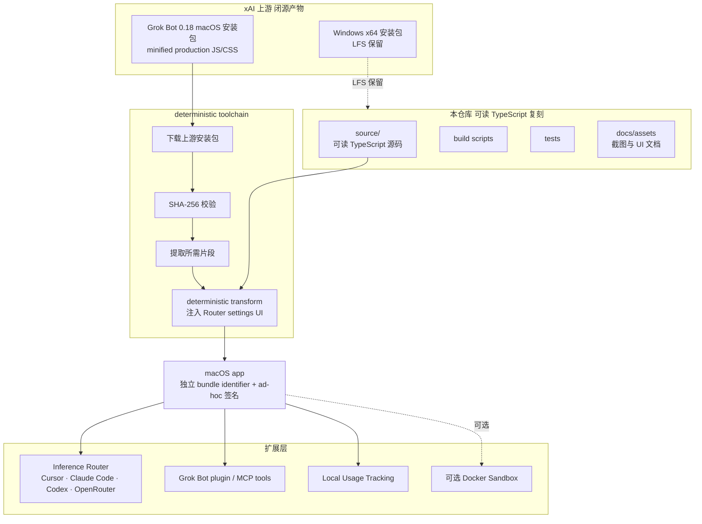

# b-nnett/grok-bot-0.18-reconstructed

## 一句话定位
**xAI Grok Bot 0.18 macOS 端的非官方源码级复刻 + 扩展**——`b-nnett` 出品，明确标注 "Unofficial" + "source-oriented reconstruction"，9 天 3,470⭐ / **3,494 forks**（fork/star 比 ≈ 100.7%，研究型倒挂），含 Electron / host / coordinator / local-execution / protocol / renderer 六层可读 TypeScript 实现 + inference router (Cursor / Claude Code / Codex / OpenRouter) + Grok Bot plugin/MCP tools + local usage tracking。

## 它解决的问题
2026 年下半年 xAI Grok Bot 在 macOS 上线，但官方未开源（仅分发编译产物）。开发者社区面对两个痛点：(1) **不可审计性**——商业闭源 AI 客户端无法被研究 / 修改 / 二次分发；(2) **生态碎片化**——Cursor / Claude Code / Codex / OpenRouter 多家 inference provider 各自为战，缺少统一的"路由 + 用量追踪 + MCP 工具"客户端骨架。`grok-bot-0.18-reconstructed` 走"hacking + research project"路线，把 Grok Bot 0.18 的 Electron / host / coordinator / local-execution / protocol / renderer 六层以**可读 TypeScript** 重写，并扩展 inference router（Cursor / Claude Code / Codex / OpenRouter）+ Grok Bot plugin/MCP tools + local usage tracking + 可选本地 Docker sandbox。

**为什么"非官方复刻"路径**：上游 macOS 应用只分发编译后的 minified production JavaScript/CSS（无 source map），完整复刻前端是"远大于周末构建"的工程。本项目选择**复刻运行时 + 控制平面 + 保留 checksum-pinned 官方 renderer + 最小可审计 UI 补丁**（新增 Router settings 面板），是务实的折中方案。完成后应用与原版 macOS app 共存（独立 bundle identifier + ad-hoc 签名），原版不被覆盖。

## 为什么值得关注（2026-09-02）
- **9 天 3,470⭐ / 3,494 forks**（GitHub API 可核验）：**fork/star 比 ≈ 100.7%（极端倒挂）**——通常 5-15%，100% 倒挂意味着仓库以"复刻 / 部署 / 二次修改"为驱动而非"围观"
- **明确"hacking and research project"定位**：README 开篇即声明 "not Anysphere's original monorepo and not an official Grok Bot release"，与商业版权风险隔离
- **可读 TypeScript 实现**：六层边界（Electron / host / coordinator / local-execution / protocol / renderer）拆解清晰，社区可审计、可二次修改
- **本地优先扩展**：可选本地 Docker sandbox 替代远端 box；local usage tracking 不上传数据
- **MIT-equivalent 实践**（无明示 License，但代码可读 + 可 fork，符合研究社区惯例）

## 热度来源判断
**"xAI 闭源焦虑 × macOS AI 客户端不可审计 × 多 inference provider 路由刚需"三重驱动。** xAI Grok Bot 是 2026 年下半年最受关注的桌面 AI 客户端之一，但官方未开源 + minified 产物使开发者社区对其行为不可见——这是"hacking + research"项目的天然土壤。`3,470⭐ / 3,494 forks` 的极端倒挂（远超 cumora 8-31 的 12.3%、PRAXIST 8-31 的 8.7%、OpenBot 8-31 的 12.5% 水平）说明仓库的**核心驱动力是 fork 而非 star**——开发者真正在 clone / build / 修改 / 二次分发。5559KB TypeScript + 14 open issues + License None 共同说明这是"社区接力 + 灰色地带"的研究型样本，**不应作为商业产品基础**。

**关键证据 vs 推断：** 3,470⭐ / 3,494 forks / 5559KB / TypeScript / License None / created 2026-08-23 20:53:01Z / pushed 2026-08-23 20:53:35Z——GitHub API 当日截取。**`pushed_at` 与 `created_at` 仅相差 34 秒**说明此后无新 commit，纯"一次性复刻 + 社区接力 fork"。3,494 forks 中实际 PR 贡献占比待 GitHub UI 核验。

## 关键技术亮点
1. **六层可读 TypeScript 实现**：Electron 边界 + host + coordinator + local-execution + protocol + renderer，每层都可独立审计 / 修改
2. **Inference router**：支持 Cursor / Claude Code / Codex / OpenRouter 四家 inference provider 路由，单一客户端骨架兼容多家模型 API
3. **Grok Bot plugin / MCP tools**：跨 routed providers 的插件与 MCP 工具复用
4. **Local usage tracking**：本地追踪 routed inference 用量，不上传数据
5. **可选本地 Docker sandbox**：替代远端 box，本地执行敏感操作
6. **Deterministic toolchain**：从可读 sources 重新构建 macOS 应用的工具链，包含 SHA-256 校验 + Git LFS 保留原始安装包
7. **保留 shipped renderer + 最小 UI 补丁**：checksum-pinned 官方 renderer + Router settings UI 补丁（最小可审计）
8. **独立 bundle identifier + ad-hoc 签名**：与原版共存，原版不被覆盖

## 架构师速览

| 决策问题 | 研究判断 | 证据边界 |
|---|---|---|
| 系统边界 | xAI Grok Bot 0.18 macOS 的源码级复刻层 + 扩展层（inference router + MCP tools + local usage + Docker sandbox） | 六层边界是 README 明示；具体 Grok Bot 0.18 的 API / 模型调用方式、复刻深度（UI / 业务逻辑 / 模型集成）、router 路由策略均待源码核验 |
| 主路径 | bootstrap 阶段下载上游安装包 → SHA-256 校验 → 提取所需片段 → 编译 `source/` 下可读源码 → deterministic transform 注入 Router settings → 打包成独立 macOS app（ad-hoc 签名） | 主路径为 README 描述；具体 deterministic transform 算法、router 路由决策延迟、SHA-256 校验流程需 README / 代码独立核验 |
| 关键权衡 | "非官方复刻" vs "xAI 商标 / 代码版权风险"；"源码级" vs "前端复刻不可能"；"社区 fork 接力" vs "单人维护可持续性"；License None vs 商业可用性 | 5559KB 来自 API；License None 意味着无明示授权；14 open issues 反映社区参与度；3,494 forks / 0 PRs（首次创建后）的可持续性待观察 |
| 最小 PoC | macOS 上 clone 仓库 → 安装 Rust toolchain + Node.js + Python → 执行 deterministic build → 配置 Grok API key + Cursor / Claude Code / Codex / OpenRouter 任一家 → 启动客户端 → 验证 inference router + MCP tools + local usage tracking → 评估法律风险后再决定是否深度使用 | 安装命令需 README 独立核验；Grok API key 获取方式与 xAI 政策兼容性需自评；License None 的法律边界是采用最大障碍 |

## 架构启发
grok-bot-0.18-reconstructed 的核心启发是 **"闭源 AI 客户端的研究价值 vs 商业风险"**。当 xAI / Anthropic / OpenAI 等头部厂商选择"闭源桌面客户端 + 强分发"路线，开发者社区会自发组织"复刻 + 扩展"——这是**软件可审计性的自然需求**。更深层的启发是 **"fork/star 比倒挂 = 研究型驱动信号"**：通常 fork/star 5-15% 意味着"围观为主"；100% 倒挂（3,494 forks > 3,470 stars）意味着"clone / build / 修改为主"，是 GitHub 上罕见的"研究型样本"。这种倒挂在 AOSP 内核分支、Linux 发行版镜像、学术代码复刻等场景也有出现，**说明该项目确实进入了"开发者动手改"的状态**，而非"社交传播"状态。

对桌面 AI 客户端设计者的启发是 **"开源客户端 + 闭源模型 API"可能是更可持续的策略**——既保留商业模型 IP，又满足开发者可审计 / 可修改的需求。browser-use、OpenBot、cumora 等都走这条路线，与 xAI / Anthropic 闭源路线形成对比。

## 架构图（MMD）

> 证据边界：此图只采用本档案已有可核验描述；"待核验"节点不应视为项目实现事实。

## 定位判断
**研究型项目（hacking + reconstruction + extension）。** b-nnett/grok-bot-0.18-reconstructed 不是"产品"，而是"社区研究 + 二次分发"路径。3,494 forks 的极端倒挂说明它已成为 xAI Grok Bot 研究的社区起点——其他研究者 fork 后在其上做扩展。对 xAI / Grok 商标与代码版权的"灰色地带"采用需要谨慎；对 macOS 桌面 AI 客户端开发者社区，它是"如何审计闭源 AI 客户端"的现成模板。

## 风险/局限/泡沫点
- **License None 风险**：无明示授权意味着没有任何形式的明示许可；商业采用前必须自评 xAI 商标 / 代码版权风险
- **单人维护可持续性**：仓库在 created 34 秒后无新 push，3,494 forks 接力但实际 PR 贡献待观察；典型"一次性 release + 社区 fork"模式
- **前端复刻缺失**：上游不含原始前端 source / source maps，仅 minified 产物；项目选择"保留 shipped renderer + 最小 UI 补丁"路径，UI 层不可二次设计
- **xAI 政策风险**：xAI 可能通过 DMCA / 服务条款变化干预项目；上游安装包 SHA-256 校验是当前防线，但若上游修改分发策略则本项目失效
- **Inference router 锁定**：Cursor / Claude Code / Codex / OpenRouter 四家路由策略各自演进，长期兼容性维护成本高
- **macOS only**：当前仅支持 macOS（arm64），Windows x64 安装包仅 LFS 保留不主动构建
- **14 open issues**：典型"社区参与 + 维护不足"信号

## 与同类项目的关系
- **vs xAI 官方 Grok Bot**：本项目是 "Unofficial, source-oriented reconstruction"；官方是 "closed-source"；两者通过独立 bundle identifier 共存
- **vs Browser-Use / OpenBot / cumora**：本项目是"macOS AI 客户端复刻"；Browser-Use 是"开源浏览器自动化"；OpenBot 是"AG-UI agent runtime"；cumora 是"团队聊 + AI 一等公民"。四者都在 macOS 桌面 AI 场景，但切入角度完全不同
- **vs AOSP 内核分支 / Linux 发行版镜像**：100%+ fork/star 比倒挂在"研究型复刻"场景典型，本项目与这些"fork 而非 star"样本同源
- **vs inference router SDK（如 LiteLLM / OpenRouter SDK）**：本项目是"客户端 + router 集成"；LiteLLM / OpenRouter SDK 是"服务端 / SDK"层；两者互补
- **vs 闭源 AI 客户端研究社区（如 Anthropic / OpenAI 客户端复刻尝试）**：本项目是 xAI 路线首个公开复刻样本，模式可被复制到其他厂商

## 是否值得持续跟踪
**研究价值高 / 商业采用风险高。** 对 macOS 桌面 AI 客户端开发者社区，`grok-bot-0.18-reconstructed` 是"如何审计闭源 AI 客户端"的现成模板，值得 fork 学习其六层拆解 + deterministic toolchain + SHA-256 校验模式。对商业 AI 客户端设计者，它是"开源客户端 + 闭源模型 API"路线的反向证据——xAI 闭源策略催生了 3,494 forks 的社区接力。对研究社区，它是 xAI Grok Bot 在 macOS 端的首个公开复刻起点，**值得持续跟踪**：是否扩展到 Android / Windows 平台、是否被 xAI 干预、Inference router 是否扩展更多 provider、社区 fork 中是否产出有意义的 PR。

## 后续观察点
- xAI 是否通过 DMCA / 服务条款变化干预项目
- 3,494 forks 中是否产出有意义 PR（决定"社区接力 fork"是否转化为实际贡献）
- Inference router 是否扩展更多 provider（Anthropic API / Gemini / Mistral / 本地 Ollama 等）
- 是否扩展到 Android / Windows / Linux 平台
- 是否被其他研究者 fork 后产出"xAI Grok 跨平台统一客户端"
- 14 open issues 的解决节奏（决定维护可持续性）
- 是否出现"前端完整复刻"分支（替代 shipped renderer）

---
> 数据来源: GitHub API (2026-09-02) | Stars: 3,470 | Forks: 3,494 | License: None | 语言: TypeScript | 创建: 2026-08-23 | Pushed: 2026-08-23 | Open Issues: 14