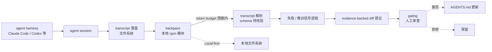

# kunchenguid/backpass

## 一句话定位
把 `AGENTS.md` 当作"模型权重"，把每次 agent session 视为"一次 forward pass"，把留在磁盘上的 transcript 视为"loss signal"——backpass 在 token budget 内**自动提议带证据的 AGENTS.md 改动**，闭环"agent 失败 → 记忆文件人工修复"的盲区。

## 它解决的问题
当前 AGENTS.md / CLAUDE.md 等"agent 记忆文件"普遍存在三个痛点：(1) **作者写不完整**——只有从经验中学习的失败案例才能补全，但人往往想不起来；(2) **更新滞后**——上线一个 prompt 之后才发现遗漏了某条规则，AGENTS.md 还是旧版本；(3) **变更无证据**——LLM 既然"凭空"读 AGENTS.md，更新它也容易"凭空"乱改。backpass 直击这三痛点：**自动读 transcript（harness 原生格式）、基于 token budget 生成"带证据的 diff 提议"、由人 gating**。这与 8-23 cumulative 看到的"agent skills 微型化"是同代产物，但形态截然不同——backpass 切的是"agent meta-layer"。

## 为什么值得关注（2026-08-24）
- **2 天 153⭐**（GitHub API 可核验）：在 agent 基础设施赛道短期增速突出
- **License: MIT**：商用 / 企业内分发友好
- **完整 Node 工程模板**：release-please、CI、Discord、NPM 完整；表明这是 npm 模块
- **AGENTS.md 9095 bytes**：作者自身把 AGENTS.md 作为产品理念的实体（meta 注释显式存在）
- **声明支持 7 款主流 harness 的 transcript 格式**：含 Claude Code / Codex——这意味着**用户不用改变 harness 也能用**
- **token budget 兜底**：自动提议在 token 限额内，杜绝"agent 越改越多"

## 热度来源判断
backpass 的热度来自**真痛点 + 极稀缺供给 + 软性 neutrality** 的组合：(1) AGENTS.md 维护的痛点是开发者社群共识但无人系统解决；(2) "transcript → diff" 这一垂直场景在 2026 上半年几乎没有正式产品；(3) backpass 同时支持多 harness、声明"local-first"，对任何已有项目均可低成本接入。三点叠加在 2 天内拿到 153⭐。但需注意：**"agent 自我维护记忆"是一个高风险动作**——automatic diff 提议需要严格 gating，README 声"gated by you" 实际如何仍待核验。

## 关键技术亮点
1. **支持 7 款主流 harness 的 transcript 格式**：无需改变现有 harness 即可集成
2. **token budget 兜底**：所有改动在限额内，物理上避免"AGENTS.md 越长越乱"
3. **evidence-backed edits**：每条提议都附"为什么这条该进"的证据链——区别于"LLM 凭感觉改"
4. **local-first**：所有 transcript / 改动都在本地——不需要外发
5. **完整的 npm 模块工程模板**：release-please + CI + Discord + NPM，开发者 onboarding 流畅
6. **AGENTS.md 文件本身就 9KB**：作者以身作则，把"AGENTS.md 的最佳实践"内嵌

## 架构师速览

| 决策问题 | 研究判断 | 证据边界 |
|---|---|---|
| 系统边界 | 本地 npm 模块；读 harness 的 transcript 文件系统位置；写 AGENTS.md 提议（PR 形式或本地 diff），由人 gating | 边界由 README "Local-first"、"Reads the transcript stores of seven agent ha[arness]" 描述确认；7 款 harness 的具体名单需在源码核验 |
| 主路径 | harness session 结束 → transcript 写入磁盘 → backpass 在 token budget 内解析 transcript → 提取失败 / 教训信号 → 生成 evidence-backed AGENTS.md diff → 用户审查 / 接受 | 主路径由 README "closes the loop" 与 "evidence-backed edits" 描述确认；解析 transcript 的具体 schema、diff 提议的格式、gating 形态（PR / 直接写 / 提示）需源码核验 |
| 关键权衡 | 自动化 vs 误改风险（自动提议需要严格 gating）；token budget vs recall（限额太严格会漏掉真正值得记录的失败）；本地优先 vs 多用户协作（local-first 对个人OK，对团队需额外协作机制） | 取舍由 README "gated by you"、"token budget" 描述确认；具体失败分类标准、多用户协作能力未在档案中明示 |
| 最小 PoC | 在 Claude Code / Codex 中故意触发一个失败模式（如"删除文件时未确认"）→ 看到 backpass 提议添加 AGENTS.md diff → 接受 / 拒绝观察建议质量 → 重复几次观察提议稳定性 | PoC 流程由 README "Local-first" + "evidence-backed edits" 描述推导；具体 backpass 启动命令与 harness 集成步骤未在档案中明示 |
| 证据边界 | 仓库公开 metadata + README + 工程模板；transcript schema、diff 提议 gating 机制、具体 7 款 harness 名单均为推断 / 待核验 | 仅核验已核验事实，其他来自语义推断 |

## 架构图（MMD）

> 证据边界：此图只采用本档案已有可核验描述；"待核验"节点不应视为项目实现事实。

## 架构启发
backpass 的核心启发是 **"agent memory 的维护责任应该让 agent 承担（提议）+ 人承担（gating）"**。两者分工清晰：agent 知道在 transcript 里发生了什么，人知道 AGENTS.md 的整体哲学与优先级。**人 / agent 协作的最优解可能不是"完全 agent 自动"或"完全人手工"，而是"agent 提议 + 人 gating"**——这正是 PR 模型在开源协作中证明有效的形态。backpass 把 PR 模型的核心理念搬到 AGENTS.md：让改进成为一个审查事件，而不是静默改动。更深层的启发：**当 AGENTS.md 由 agent 自己维护时，"agent 团队的能力上限"就由 agent 的反思深度决定**——这是一个放大效应显著的杠杆点。

## 定位判断
**agent-memory 元层工具候选。** 在 "agent-memory / AGENTS.md 维护" 这条赛道，backpass 是当前开源侧关注度最高的项目（153⭐/2 天，topics 含 agent-memory、agents-md）。它与 Mem0 / Letta / MemPalace 等 "memory system" 形成对照——**后者是"agent 运行时使用的记忆系统"，前者是"agent 记忆文件本身的维护工具"**。两者互补：对做 agent 产品的团队，**backpass 切的是元层空白**，很可能成为"agent-as-coworker"基础设施中的一块拼图。

## 风险 / 局限 / 泡沫点
- **首次自动提议噪声可能高**：从 transcript 提取"应当固化的教训" 与 "临时指令" 在 LLM 看来容易混淆，需要数轮迭代才能学得准
- **gating 形态依赖用户纪律**：README 声"gated by you"——但如果用户懒得逐条审查，最终仍可能"提案 → 接受"循环形成 drift
- **7 款 harness 兼容度的真实性**：声称支持 7 款 harness，但**每款的 transcript schema 解析成熟度**未在档案中明示（早期版本可能仅 1-2 款成熟）
- **团队协作能力缺失**：local-first 对个人开发者友好，但团队需要"AGENTS.md 同步 + 提议版本控制"——目前 unaddressed
- **评测基准缺失**：automatic diff 提议与人工写 diff 的"提升度"无公开 benchmark
- **失败信号判定边界未公开**：何为"应当被记住的失败"、何为"临时外部输入"——这是技术核心

## 与同类项目的关系
- **vs Mem0 / Letta / MemPalace**：这些是"agent 运行时用的记忆系统"——backpass 切的是"AGENTS.md 文件的维护"，元层高于前者
- **vs Anthropic Skills / Agent Skills 仓库**：这些是"skill 集合"，backpass 是"AGENTS.md 自动改进"——不冲突
- **vs Cursor / OpenCode / Codex 等内置 AGENTS.md 体验**：商业产品自带，backpass 是"无 vendor lock-in" 路径
- **vs SPEC / RFC 驱动开发**：传统的需求-实施分离，backpass 是"agent 自动提取教训"
- **vs PR review systems**：backpass 把 PR review 模型搬到 AGENTS.md——这是开源协作范式的延伸

## 是否值得持续跟踪
**值得高频跟踪（agent-memory 元层基础设施）。** 对所有用 Claude Code / Codex 等 harness 的开发者：**建议立即在最小项目上试运行 backpass**，观察自动提议质量——若建议有效，是巨大杠杆点；对做 agent 产品的团队：**这是判断 agent infrastructure 是否成熟的早期信号**——若 backpass 类项目被多家厂商采纳，"AGENTS.md 由 agent 自己维护"将成为行业默认；对企业 IT：观察 backpass 与 Mem0 / Letta 等 memory system 的协同形态，是 agent 基础设施成熟度的指标。

## 后续观察点
- 7 款 harness 兼容度的成熟度公开化（每款解析精度 / 已知限制）
- 团队协作能力（AGENTS.md 同步 / 提议版本化）
- 评测基准（与人工 diff 的提升度对比）
- 与 Mem0 / Letta 等 memory system 的协同
- 是否被主流 agent 框架默认集成

---
> 数据来源: GitHub API (2026-08-24) | Stars: 153 | Forks: 6 | License: MIT | 语言: JavaScript | 创建: 2026-08-21
