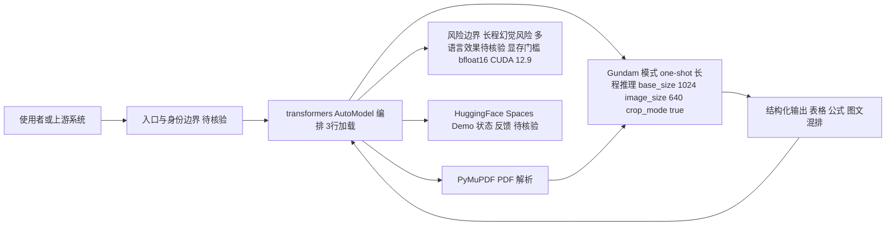

# Baidu Unlimited-OCR

## 一句话定位
百度 PaddlePaddle 团队出品的 one-shot 长程 OCR 系统——单次推理解析超长文档，告别切段拼接。

## 它解决的问题
传统 OCR 处理长文档（论文、书籍、复杂报表）需要先切段→逐段识别→后处理拼接，导致：
1. 上下文丢失（表格被切断、段落不连贯）
2. 拼接错误累积
3. 处理管线复杂，工程维护成本高

Unlimited-OCR 实现了 one-shot long-horizon parsing——单次推理处理整个长文档，保留全局上下文。

## 为什么值得关注（2026-06-25）
- 6 天 6.3K stars，增速与 DeepSeek-OCR 发布时相当
- 基于 DeepSeek-OCR 架构进一步突破，arXiv 论文已发布
- HuggingFace Spaces 在线 Demo 上线，可立即体验
- 百度 PaddlePaddle 团队出品，工程化质量有保障
- MIT 协议，支持商业使用

## 热度来源判断
- **真实需求**：文档智能是企业刚需（合同、报告、论文、票据），OCR 是所有文档 AI 管线的入口
- **技术突破驱动**：one-shot 长程解析是 OCR 领域的关键突破，不是营销驱动
- **Demo 可验证**：HuggingFace Spaces 让任何人立即验证效果
- **生态协同**：transformers 库直接加载，降低试用门槛

## 关键技术亮点亮点
1. **One-shot Long-horizon Parsing**：单次推理处理超长文档，不再需要切段拼接
2. **Gundam 模式**：base_size=1024 + image_size=640 + crop_mode=True，自动分块处理超长文档但保持全局上下文
3. **DeepSeek-OCR 架构演进**：在 DeepSeek-OCR 基础上优化长程推理
4. **多格式支持**：图片、PDF（PyMuPDF 集成）、复杂表格+图+公式混排
5. **transformers 原生**：AutoModel + AutoTokenizer，3行代码加载

## 架构师速览

| 决策问题 | 研究判断 | 证据边界 |
|---|---|---|
| 系统边界 | 百度 PaddlePaddle 团队开源的 Python OCR / 文档解析项目，使用 PyMuPDF 处理 PDF，依赖 transformers + bfloat16 + CUDA 12.9 推理 | 边界依据档案中 language=Python、tags（含 paddlepaddle、document-parsing）、关键技术亮点 4、风险 1；具体模型文件路径与依赖清单未在档案中给出 |
| 主路径 | 单次推理（one-shot long-horizon parsing）经 Gundam 模式（base_size=1024 + image_size=640 + crop_mode=True）在保持全局上下文下处理长文档，transformers AutoModel/AutoTokenizer 三行加载 | 依据关键技术亮点 1、2、5；HuggingFace Spaces Demo 与 arXiv 论文存在性仅作为热度依据，未做内容核验 |
| 关键权衡 | 中文文档强、长程全局上下文优势 vs. 高显存门槛、多语言效果未知、长程"幻觉"细节遗漏风险 | 依据风险 1、2、4 与亮点 2；DeepSeek-OCR 迭代速度与领先窗口期信息来自档案推断 |
| 最小 PoC | 用 HuggingFace Spaces Demo 输入一张含表格/公式/图文混排的长图或 PDF，观察 one-shot 输出与版式还原；通过 transformers AutoModel 加载做最小推理复现，验收显存与中文/英文效果差异 | 仅承诺使用档案描述的 Gundam 参数与 transformers 调用方式；具体 tokenizer 名称、模型权重 ID、生产环境硬件门槛待核验 |

## 架构启发
Unlimited-OCR 的关键架构选择是"gundam 模式"——通过 crop_mode 在保持全局上下文的同时处理超长文档。这与 LLM 从 sliding window 到 long-context 的演进路径一致：
- 传统 OCR = sliding window LLM（局部上下文，拼接）
- Unlimited-OCR = long-context LLM（全局上下文，单次推理）

**启发：** 文档智能管线将从"多阶段 pipeline"简化为"端到端单模型"。这会影响文档解析、知识库构建、Agent 文档理解的整个技术栈。

## 架构图（MMD）

> 证据边界：此图只采用本档案已有可核验描述；“待核验”节点不应视为项目实现事实。

## 定位判断
Unlimited-OCR 处于 OCR/文档智能的基础设施层。它不是终端用户工具，而是开发者构建文档 AI 应用的底层能力。类似于 firecrawl 之于 Web 抓取——Unlimited-OCR 之于文档理解。

## 风险 / 局限 / 泡沫点
1. **GPU 资源需求**：bfloat16 + CUDA 12.9，长文档推理需要大量显存，限制了边缘部署
2. **中文文档优势 vs 多语言**：百度出品意味着中文文档处理可能最优，但其他语言效果需验证
3. **竞品快速迭代**：DeepSeek-OCR 也在持续更新，技术领先窗口期可能不长
4. **长文档"幻觉"风险**：长程推理可能产生局部细节遗漏，需在生产中验证

## 与同类项目的关系
| 项目 | 定位 | 差异 |
|------|------|------|
| DeepSeek-OCR | 通用 OCR 模型 | Unlimited-OCR 的前序基础，通用性更广 |
| PaddleOCR | 工业级 OCR 工具包 | 百度自家产品线，更偏工程化工具，Unlimited-OCR 更偏模型突破 |
| Tesseract | 传统 OCR 引擎 | 规则驱动，无法处理复杂版式，但资源消耗极低 |
| MinerU | PDF 解析工具 | 偏向 PDF 结构化，Unlimited-OCR 偏向视觉理解 |

## 是否值得持续跟踪
✅ **持续跟踪**。OCR 长程突破直接影响文档智能基础设施，对企业知识库、合同审查、论文分析等场景有重大价值。

## 后续观察点
1. 多语言（英文/日文/韩文）长文档效果验证
2. 企业落地案例和实际生产环境性能数据
3. 与 DeepSeek-OCR 的效果对比 benchmark
4. 社区贡献的 fine-tune 模型和垂直领域适配
5. Agent 集成——是否有 MCP Server 封装

---
*首次记录：2026-06-25*
