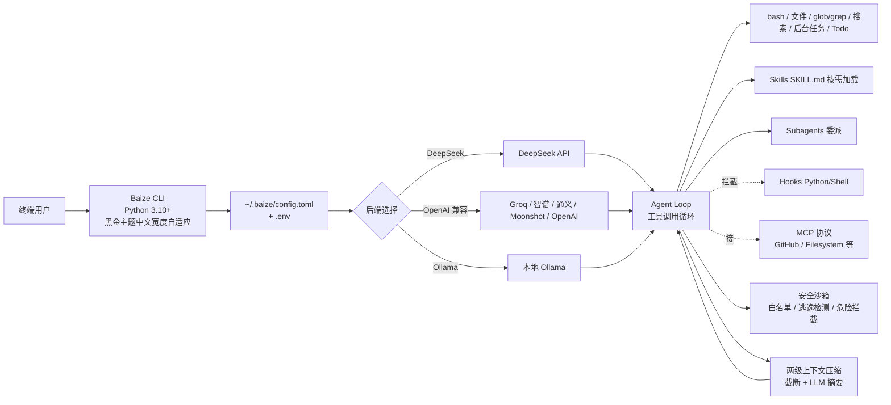

# Xu123-Bob/Baize

## 一句话定位
白泽（Baize）——中文 Vibe Coding CLI Agent；通晓万物的瑞兽化身为 AI Coding 助手；多后端支持（DeepSeek / OpenAI 兼容 / Ollama 本地）；Skills + Subagents + Hooks + MCP + 两级上下文压缩 + 安全沙箱；黑金 CLI 主题中文宽度自适应。

## 它解决的问题
2025-2026 年 Coding Agent 工具爆发（Claude Code / Cursor / Codex / Pi / OpenCode 等），但 (a) 多数海外产品对中文宽度支持差（终端显示错位）；(b) DeepSeek / 智谱 / 通义 / Moonshot 等本土模型需要单独适配；(c) Claude Code 等闭源产品无法深度定制或私有化部署。**白泽（Baize）直击这一痛点：用 Python 完整复刻 Claude Code 的语义（Skills + Subagents + Hooks + MCP），并补足安全沙箱 + 中文宽度自适应 CLI**——本土 Coding Agent Loop 实现，可深度定制。

## 为什么值得关注（2026-09-13）
- 1 天 67⭐ / fork 0——产品成熟度早期信号，但星标反映用户关注
- 多后端支持（DeepSeek / OpenAI 兼容 / Ollama 本地）——本土模型适配完整
- Skills + Subagents + Hooks + MCP 四件套——对齐 Claude Code 语义
- 安全沙箱（命令白名单 / 路径逃逸检测 / 危险命令拦截 / 敏感文件保护 / 脚本注入拦截）——企业级安全
- 黑金 CLI 主题中文宽度自适应——本土化体验

## 热度来源判断
Baize 的热度是 **「Claude Code 语义完整复刻 + 中文宽度本土化 + 多后端支持 + 安全沙箱」四因素叠加**。Claude Code 是 2026 年 Coding Agent 标杆，但 (a) 闭源无法定制；(b) 中文终端显示差；(c) 海外模型对国内开发者成本高。Baize 是这一定位的清晰尝试——本土 Coding Agent Loop 实现。fork=0 反映当前主要是星标而非 fork 衍生——是产品成熟度的早期信号。**热度来源真实**——本土开发者对 Claude Code 替代品有明确需求；但**能否进入「基础设施候选」取决于能否被企业广泛采用**。

## 关键技术亮点
1. **多后端支持**——DeepSeek / OpenAI 兼容（Groq / 智谱 / 通义 / Moonshot / OpenAI）/ Ollama 本地；一键切换
2. **零配置启动**——首次运行自动生成 `~/.baize/config.toml` + `.env`；用户只需填一次密钥
3. **完整工具链**——bash 执行 / 文件读写编辑 / glob/grep 搜索 / 网页搜索抓取 / 后台任务 / Todo 管理
4. **技能系统 SKILL.md**——按需加载领域知识，让 AI 在特定场景下更专业
5. **子代理 Subagents**——把复杂任务委派给独立上下文的子代理，避免污染主会话
6. **钩子 Hooks**——Python / Shell 拦截工具调用前后 + 审计日志 + 自动格式化 + 测试门控
7. **MCP 协议**——通过 Model Context Protocol 接入外部工具服务器（GitHub / Filesystem 等）
8. **两级上下文压缩**——工具结果截断 + LLM 摘要支持超长对话
9. **安全沙箱**——命令白名单 / 路径逃逸检测 / 危险命令拦截 / 敏感文件保护 / 脚本注入拦截
10. **黑金 CLI 主题**——中文宽度自适应 + 代码高亮 + Diff 着色 + 思考折叠

## 架构师速览

| 决策问题 | 研究判断 | 证据边界 |
|---|---|---|
| 系统边界 | 本地 Python CLI Agent；多后端 LLM 切换；本地工具链 + Skills/Subagents/Hooks/MCP 扩展点；本地配置文件 ~/.baize | 来自 README 章节结构与特性列表；具体 MCP server 实现 / Hooks 签名 / Skills 加载机制（是否类似 Claude Code 热加载）待核验 |
| 主路径 | 用户输入 → 后端 LLM 选模型 → 工具调用循环（bash / 文件 / glob/grep / 搜索）→ 可选 Hooks 拦截 → 可选 Subagent 委派 → Skills 按需加载 → 输出回用户 | 主路径来自 README「完整工具链」描述；Subagent 委派触发条件、Skills 加载时机待核验 |
| 关键权衡 | 多后端灵活（DeepSeek / OpenAI / Ollama）vs 协议一致性（各后端 API 差异）vs 中文宽度 CLI（终端兼容性 vs 美观）vs 安全沙箱严格度（保护强 vs 易用性弱） | 四权衡来自 README 特性对照；安全沙箱的具体规则集（哪些命令禁止、哪些路径逃逸规则）待核验 |
| 最小 PoC | 装 Python 3.11 + DeepSeek API key → `baize` → 在某项目根目录让 agent 跑「修这个 bug」最小任务；观察 Hooks 是否生效、MCP 是否连通、Subagent 是否按需触发 | PoC 由「多后端 + 完整工具链」推导；Hooks / MCP / Subagent 的真实触发率待核验 |

## 架构图（MMD）

> 证据边界：此图只采用本档案已有可核验描述；"待核验"节点不应视为项目实现事实。

## 架构启发
白泽（Baize）的核心启发是 **「Claude Code 语义的可 fork Python 替代」**——用 Python 完整复刻 Skills + Subagents + Hooks + MCP 四件套，让本土开发者能深度定制。更深层的启发是 **「多后端 + 安全沙箱 + 中文宽度」的三重本土化**——这三点是 Claude Code 等海外产品在国内的明显短板。**最值得借鉴的是「黑金 CLI 主题中文宽度自适应」**——终端 UI 细节往往决定开发者日常体验，中文宽度（Wider CJK Character）处理是易被忽略但影响巨大的工程细节。安全沙箱（命令白名单 + 路径逃逸检测 + 脚本注入拦截）是企业级 Coding Agent 的必备能力。

## 定位判断
**平台候选型项目（本土 Coding Agent Loop）。** 白泽（Baize）自己宣称要做一个 Claude Code 的可 fork 替代——这是「基础设施候选」定位的明确表述。它填补了 (a) Claude Code 闭源无法定制的空白；(b) 海外产品对中文宽度支持差的空白；(c) 海外模型对国内开发者成本高的空白。能否进入「基础设施」取决于：(a) 是否被企业广泛采用（决定生态扩展）；(b) Skills + Subagents + Hooks + MCP 是否真能形成网络效应（决定护城河）；(c) 安全沙箱是否真能满足企业合规（决定商业化空间）。当前定位是「最有影响力的本土 Claude Code 替代」。

## 风险 / 局限 / 泡沫点
- **fork=0 反映产品成熟度早期信号**——主要是星标而非 fork 衍生
- **Python 实现 vs Claude Code TypeScript 实现**——性能 / 启动延迟可能不如
- **安全沙箱规则集未公开**——具体哪些命令禁止 / 哪些路径逃逸规则，企业采用前需审查
- **Skills + Subagents + Hooks + MCP 都是「实现 Claude Code 语义」**——差异化空间有限，需要找到自己独特价值
- **README 提到 `cd baize-agent` 但仓库名是 `baize`**——README 与 git clone 后目录名不一致，潜在混淆
- **多后端 API 差异同步成本**——DeepSeek / OpenAI / Ollama API 持续演进，同步维护是负担
- **中文宽度 CLI 主题兼容性**——某些终端模拟器（Windows Terminal / 老 macOS Terminal）对 WCC 字符支持差

## 与同类项目的关系
- **vs Claude Code：** Claude Code 闭源，Baize 可 fork + Python 深度定制；Claude Code 英文为主，Baize 中文宽度适配
- **vs Codex CLI：** Codex CLI 是 OpenAI 官方 + GPT 系列；Baize 多后端 + DeepSeek/Ollama
- **vs Cursor：** Cursor 是 GUI IDE + VSCode fork；Baize 是 CLI
- **vs 昨日 `wshobson/agents`：** wshobson/agents 是 Agent 插件市场；Baize 是 Agent Loop 工具本身
- **vs 昨日 maskit：** maskit 是出网层隐私；Baize 是 Agent Loop 层
- **vs 昨日 routeVSCODE：** routeVSCODE 是模型层路由；Baize 是 Agent Loop 层

## 是否值得持续跟踪
**值得跟踪（本土 Coding Agent Loop 标杆）。** 白泽（Baize）代表了本土 Coding Agent 工具链补完的方向——Claude Code 语义的可 fork Python 替代。建议关注：(a) 是否被企业广泛采用（决定生态扩展）；(b) 多后端 API 同步维护策略（决定可持续性）；(c) Skills 生态是否形成（决定护城河）。对国内 Coding Agent 用户，这是直接可用的本土 Claude Code 替代。对 Coding Agent 生态观察者，它是「Claude Code 语义 + 多后端 + 中文宽度」的标杆。

## 后续观察点
- Skills + Subagents + Hooks + MCP 是否被企业二次开发（决定生态扩展）
- 多后端 API 同步维护策略（DeepSeek / OpenAI / Ollama 演进时）
- 是否出现 fork/star 上升信号（决定产品成熟度）
- 黑金 CLI 主题在 Windows Terminal / 老 macOS Terminal 上的兼容性
- 安全沙箱规则集是否公开 + 企业合规审计
- 是否出现 macOS / Windows 原生 GUI 包装（决定破圈）

---
> 数据来源: GitHub API (2026-09-13) + README 公开摘录 | Stars: 67 | Forks: 0 | License: MIT | 语言: JavaScript | 创建: 2026-09-12 | 仓库 size: 3.2 MB
