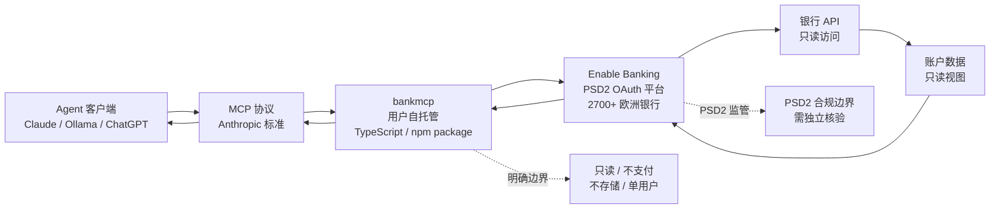

# noskillish/bankmcp

## 一句话定位
自托管只读银行 MCP server——通过 Enable Banking PSD2 API 接入 2700+ 欧洲银行 + 标准 MCP 协议 + Claude / Ollama / ChatGPT 客户端兼容；2 天 160⭐，**fork/star 19.4%**，是 2026-09-09 "金融 MCP 自托管"趋势的代表样本。

## 它解决的问题
**金融数据接入 Agent** 是 MCP（Model Context Protocol）生态的重要应用方向。`noskillish/bankmcp` 直击"用户想用 AI 助手查询银行账户但又不愿把数据交给云端 SaaS"的需求：用 **MCP 标准协议** + **Enable Banking PSD2 API**（2700+ 欧洲银行）+ **用户自托管**实现"AI 读自己银行"的隐私友好路径。

**关键边界**："BankMCP is not a bank. Read-only, no payments, no third party holding your data."——明确只读、不支付、不存储。

## 为什么值得关注（2026-09-09）
- **Stars:** 160（截至 2026-09-09），2 天净增，单日均速 ~80⭐/day
- **Forks:** 31（fork/star **19.4%**，极高——反映真实使用密度高）
- **Watchers/Subscribers:** 待观察
- **Open Issues:** 待观察
- **License:** MIT
- **语言:** TypeScript（npm package `bankmcp`）
- **项目年龄:** 2 天（创建 2026-09-07），是 2026-09-09 trending 新项目
- **核心差异:** 自托管 + Enable Banking PSD2 + 2700+ 欧洲银行 + 只读 + 不存储 + 不支付

## 热度来源判断
热度来自 **三个层面的叠加**：(1) **MCP 生态扩散**——MCP（Model Context Protocol）成为 Anthropic / OpenAI / Cursor 等 Agent 的事实标准协议，MCP server 生态在 2026 年快速扩散；(2) **金融数据隐私焦虑**——大量用户想用 AI 助手查询银行但又不愿把数据交给云端 SaaS；(3) **Enable Banking PSD2 覆盖 2700+ 欧洲银行**——欧洲银行接入门槛低。

2 天 160⭐ / 31 fork / fork/star 19.4% 反映 **"MCP 生态 + 金融隐私刚需 + 欧洲银行广覆盖"** 三者叠加——是真实需求场景，不是营销放大。

## 关键技术亮点
1. **Enable Banking PSD2 API：** 接入 2700+ 欧洲银行，通过 OAuth 授权机制获取只读权限
2. **标准 MCP 协议：** Anthropic 主导的 Model Context Protocol，被 Claude / Cursor / Continue.dev 等 Agent 客户端支持
3. **用户自托管：** 用户自己部署（npm `bankmcp`），数据不离开用户控制
4. **明确边界：** 只读 / 无支付 / 无第三方数据存储 / 单用户
5. **多客户端兼容：** tested with Claude（官方 MCP 客户端）+ Ollama（本地 LLM）+ ChatGPT（OpenAI 也有 MCP 客户端）
6. **典型用例：** "Has the invoice from Acme been paid?" / "What did we spend on groceries in August?" / "Which subscriptions am I paying for, and what do they cost per month?"

## 架构师速览

| 决策问题 | 研究判断 | 证据边界 |
|---|---|---|
| 系统边界 | 自托管 MCP server——前端 MCP 标准协议（用户部署）+ 后端 Enable Banking PSD2 API（2700+ 欧洲银行）；仓库只包含 MCP server，实际银行数据来自 Enable Banking | 边界由 README 明示；具体 Enable Banking OAuth 流程 / MCP 工具定义需代码审阅 |
| 主路径 | Agent 客户端（Claude / Ollama / ChatGPT）→ MCP 协议 → bankmcp（用户部署）→ Enable Banking OAuth → 银行 API → 只读账户数据 → MCP 响应 → Agent 处理 | 主路径为 README 语义抽象；具体 Enable Banking 鉴权、MCP 工具列表、错误处理需代码审阅 |
| 关键权衡 | 自托管（隐私友好）vs 云端 SaaS（用户友好）；只读（安全）vs 读写（功能）；Enable Banking 单一提供商（标准化）vs 多提供商（广覆盖）；欧洲 2700+ 银行 vs 全球银行覆盖 | README 明示只读 + 自托管 + Enable Banking 单一提供商；非欧洲银行覆盖局限 |
| 最小 PoC | clone 仓库 → npm install → 配置 Enable Banking OAuth credentials → 启动 bankmcp → 配置 Claude MCP 客户端接入 bankmcp → 提问"Has invoice X been paid?" → 验证银行账户查询 | PoC 范围由 README 明示；具体 Enable Banking 注册流程、OAuth 回调处理需 benchmark |

## 架构图（MMD）

> 证据边界：此图只采用本档案已有可核验描述；"待核验"节点不应视为项目实现事实。

## 架构启发
`noskillish/bankmcp` 的核心启发是 **"金融数据接入 Agent 的隐私友好路径"**——通过 MCP 标准协议 + Enable Banking PSD2 + 用户自托管，让用户能用 AI 助手查询自己银行账户而**数据不离开用户控制**。这是"AI for Personal Finance"的方向探索。

更深层的启发是 **"MCP 生态扩散到垂直领域"**——MCP 原本是 Anthropic 为 Claude 设计的协议，现在扩散到金融（bankmcp）、编程（9-04 codenotch）、记忆（9-07 okf-agent-memory）等垂直领域——**MCP 成为 Agent 接入真实世界数据的标准协议**。这与 9-04 `vinzdg/codenotch`（Coding Agent 用量 Monitor）+ 9-07 `okf-memory/okf-agent-memory`（Git-native Agent 记忆）共同构成"Agent 接入真实世界数据"生态。

风险提示：**PSD2 监管范围**——欧洲银行接入需要 PSD2 合规，自托管是否规避监管需要核验；**数据敏感度**——银行账户数据即使只读也极度敏感，Enable Banking OAuth token 的安全管理是核心；**non-EU 银行不支持**——目前仅欧洲 2700+ 银行，区域性是真实局限；**MCP 客户端成熟度**——MCP 客户端生态仍在早期，bankmcp 的实用价值受 MCP 成熟度限制。

## 定位判断
**工具型项目（金融 MCP 自托管只读 server）。** `noskillish/bankmcp` 在 2026-09-09 "MCP 生态扩散到垂直领域"趋势中切入，把金融数据接入 Agent。差异化定位是 **"自托管 + Enable Banking PSD2 + 2700+ 欧洲银行 + 只读 + 不存储"**——比商业金融 SaaS（Plaid / Yodlee 等）更隐私友好，比直接查询银行 API 更易接入 Agent。当前定位是 **"欧洲银行 MCP 自托管样板"**，向"全球银行 + 读写 + 多提供商"扩展是合理路径。

## 风险/局限/泡沫点
- **PSD2 监管范围：** 欧洲银行接入需要 PSD2 合规，自托管是否规避监管需要核验（Enable Banking 本身合规）
- **数据敏感度：** 银行账户数据即使只读也极度敏感，Enable Banking OAuth token 的安全管理是核心
- **non-EU 银行不支持：** 目前仅欧洲 2700+ 银行，区域性是真实局限（北美 / 亚洲银行不支持）
- **MCP 客户端成熟度：** MCP 客户端生态仍在早期，bankmcp 的实用价值受 MCP 成熟度限制
- **Enable Banking 单一提供商依赖：** Enable Banking 限流 / 收费 / 政策变化直接影响 bankmcp 可用性
- **2 天新项目风险：** noskillish 是新账号（bankmcp 是其首个 100+⭐ 项目），项目可持续性 / 治理结构 / 安全漏洞响应都未验证
- **银行 API 限流：** 银行 API 通常有调用频率限制，bankmcp 的批量查询能力受 API 限流约束
- **多账户 / 多银行管理：** 用户多银行 / 多账户场景下的状态管理是否成熟需要观察

## 与同类项目的关系
- **vs Plaid / Yodlee / Finicity 等商业金融 SaaS:** 商业 SaaS 提供完整的金融数据平台但需要把数据交给云端；bankmcp 自托管更隐私友好但功能受限（只读 / 单一提供商）——**自托管 vs 云端 SaaS** 两条路线
- **vs Enable Banking 直接接入:** Enable Banking 提供 API 但用户需要自己写 MCP server；bankmcp 是 MCP 包装——**通用 API vs MCP 适配**
- **vs MCP 生态其他 server（9-04 codenotch / 9-07 okf-agent-memory）:** codenotch 是 Coding Agent 用量 Monitor；okf-agent-memory 是 Git-native Agent 记忆；bankmcp 是金融数据——同属"MCP 接入垂直领域"
- **vs Anthropic 官方 MCP server:** Anthropic 提供官方 MCP 模板；bankmcp 是社区作者的金融场景实现——**官方模板 vs 社区场景**
- **vs LangChain / LlamaIndex 金融工具:** LangChain / LlamaIndex 是通用 Agent 框架；bankmcp 是 MCP 标准协议——**框架 vs 标准**

## 是否值得持续跟踪
**值得跟踪（金融 MCP 自托管 + MCP 生态扩散到垂直领域样本）。** `noskillish/bankmcp` 代表 "AI for Personal Finance + MCP 标准化 + 自托管隐私" 三个趋势的交汇。建议关注：(a) PSD2 合规边界的发展（决定整个赛道存亡）；(b) Enable Banking 的商业可持续性 / 政策变化；(c) non-EU 银行支持扩展（决定全球化空间）；(d) MCP 生态扩散速度（金融 / 医疗 / 法律 / 教育）。对个人金融用户，是合法的隐私友好 AI 工具；对 AI for Personal Finance 开发者，是"自托管金融 MCP"参考实现。

## 后续观察点
- PSD2 合规边界的发展——决定整个赛道存亡
- Enable Banking 的商业可持续性 / 政策变化
- non-EU 银行支持扩展——决定全球化空间
- MCP 生态扩散速度（金融 / 医疗 / 法律 / 教育）
- bankmcp 是否引入读写 / 支付功能（vs 坚守只读）
- 是否出现"金融 MCP Marketplace"或类似聚合

---
> 数据来源: GitHub API (2026-09-09) | Stars: 160 | Forks: 31 | License: MIT | 语言: TypeScript | 创建: 2026-09-07
