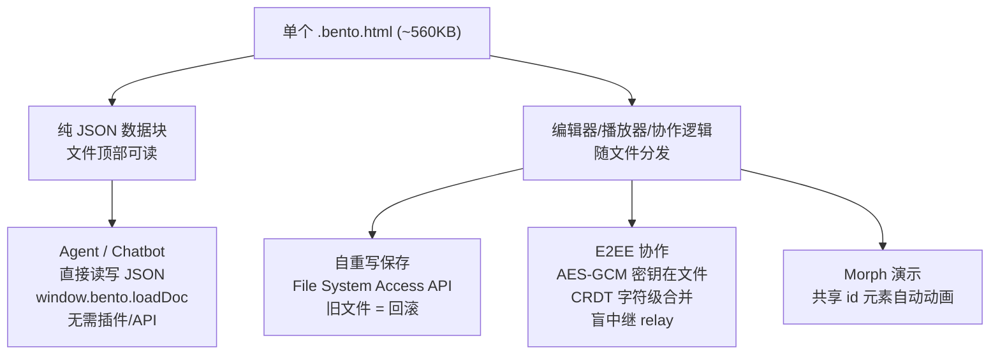

# nyblnet/bento

## 一句话定位
装进单个 HTML 文件的办公套件（幻灯片）——文件即软件，编辑器/播放器/协作全部内置在 ~560KB 的单个 `.bento.html` 文件里，发给对方用任意浏览器打开即可编辑/播放。

## 它解决的问题
目标用户是希望拥有「真正属于自己的文档」、拒绝被云文档锁定的知识工作者。痛点是：现代办公文档从「你拥有的东西」变成「你租的东西」——锁定在某公司云端、需登录、仅在公司服务器在线时可读。

Bento 让文档回归「单文件、永久可读、本地优先」——2026 年创建的文件在 2036 年仍可用任意浏览器打开。

## 为什么值得关注（2026-07-29）
- **文件即软件**：整套编辑器/播放器/协作逻辑随文档一起分发，对方无需安装任何东西。
- **为 AI 可编辑性而设计**：文档是文件顶部一段纯 JSON，Agent 可原地编辑 `.bento.html`（`window.bento.loadDoc`），chatbot 可 round-trip JSON——无需插件、无需 API。这是「文档作为 Agent 交付物」的低摩擦范式。
- **自重写保存 + CRDT + E2EE**：用 File System Access API 重写自己的数据块，自研 CRDT（字符级文本合并），同步 relay 是盲中继（只存密文）。

## 热度来源判断
热度来自**对云文档锁定疲劳的真实情绪** + 「单文件即应用」的技术新鲜感 + AI 可编辑性的叙事。2.8K 星、175 fork，分布健康。注意它当前主要是幻灯片（slides）品类，并非完整 office suite——「office suite that fits in a file」是愿景，落地先从 slides 切入。

## 关键技术亮点
1. **自重写保存**：文件用 File System Access API 重写自己的数据块（保存时把 deck 写回文件顶部），旧文件保留为回滚；下载 fallback 兜底。
2. **文档即纯 JSON + AI 可编辑**：数据是文件顶部一个可读 JSON 块，无二进制格式。Agent 直接原地编辑文件，chatbot round-trip JSON——`window.bento.loadDoc`。
3. **Morph 演示**：共享 id 的元素在幻灯片间动画（位置/尺寸/颜色/渐变），复制幻灯片重排即可自动生成动效。
4. **E2EE + CRDT 协作**：AES-GCM，密钥存在文件里而非服务器；自研 CRDT 含字符级文本合并，离线编辑精确合并；同步 relay 是盲中继（约一个文件大小，可读源码验证）。
5. **签名自更新**：发布 ECDSA 签名，应用内提示更新；更新写入新文件、旧文件保留为回滚，服务器永不触碰文档。
6. **无依赖图表引擎**：自研 bar/line/pie/scatter，演示时实时绘制（tooltip/缩放/数据 morph）。

## 架构启发
核心启发是**「为 AI 可编辑性设计的本地优先文档格式，可能成为 Agent 交付物的新载体」**。当文档是纯 JSON 且 Agent 可直接读写文件时，Agent 与文档的交互从「调 API」退化为「读写文件」——摩擦骤降。这对架构师的启发是：**设计交付物格式时，把「机器可读写性」作为一等约束**，而非事后补 API。

## 定位判断
定位为**工具型**，但其「文件即软件 + AI 可编辑 JSON」范式有演化为文档形态标准的潜力。当前聚焦 slides 品类，向完整 office suite 扩展是既定愿景。

## 风险 / 局限 / 泡沫点
1. **当前仅 slides**：自称「office suite」但实际落地是幻灯片，文档/表格尚未交付——愿景与现状有差距。
2. **File System Access API 浏览器兼容**：自重写保存依赖该 API，非 Chromium 浏览器降级为下载。
3. **CRDT 自研风险**：自研字符级 CRDT 的正确性边界需大规模验证，协作冲突处理是已知难题。
4. **小团队 / 采用门槛**：作为对抗云文档的范式，需克服用户「习惯云协作」的惯性。

## 与同类项目的关系
- **vs Reveal.js / Slidev**：Reveal.js/Slidev 是幻灯片框架（需构建/部署）；Bento 是**文件即应用**（零安装、自包含），分发模型根本不同。
- **vs Notion / Google Slides**：云文档锁定 vs 本地优先永久可读——哲学对立。
- **vs 本地优先文档工具（如 Obsidian）**：Obsidian 是笔记工具；Bento 把「文件即软件」推向办公交付物 + AI 可编辑。

## 是否值得持续跟踪
**是，持续跟踪。** 「文件即软件 + AI 可编辑 JSON」范式对 Agent 交付物形态有启发。建议关注其从 slides 向完整 office suite 的扩展，以及 CRDT 在真实协作下的鲁棒性。

## 后续观察点
1. 是否从 slides 扩展到文档/表格，兑现「office suite」愿景。
2. 自研 CRDT 在多人大规模并发编辑下的正确性与性能。
3. Agent 生态是否采纳 `.bento.html` 作为交付物格式（如 OpenWorker 类 Coworker 直接产出 bento 文件）。

---
*首次记录：2026-07-29* · *数据来源: GitHub Search API (gh CLI) + README*
