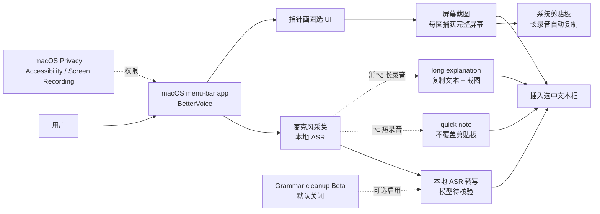

# TarunTomar122/better-voice

## 一句话定位
**桌面多模态输入的小而美样本**——macOS menu-bar app，本地转写语音 + 圈选屏幕区域作为视觉指代：按住 ⌥ 录语音、画圈圈选 UI、每圈捕获该区域完整屏幕，释放 ⌥ 完成录音并把转写文本 + 截图插入选中文本框。

## 它解决的问题
macOS 上的语音输入工具普遍有两个痛点：(1) **语音是孤立模态**——传统 dictation 只把语音转文字，缺乏视觉指代（"我说的就是这个"），用户在描述 UI bug / 设计反馈 / 代码错误时需要补充截图或文字说明；(2) **语音 + 截图的组合操作繁琐**——先 dictation、再 cmd-shift-4 截图、再粘贴，体验碎片化。better-voice 把"语音 + 视觉指代"作为同一个交互的左右声道，让"我指给你看 + 我说给你听"成为一次完成的输入。

## 为什么值得关注（2026-08-25）
- **2 天 189⭐**（GitHub API 可核验）：macOS 桌面工具短期增速突出
- **Swift 实现**：原生 macOS 体验（非 Electron wrapper），利用 Apple Silicon 性能
- **2 天 25 forks**：相对较高的 fork 数表明社区贡献活跃
- **完整 onboarding 截图 + Buy me a coffee 链接**：个人开发者项目，作者公开支持
- **README 显式标注 "experimental"**：诚实标注成熟度
- **明确交互细节**：⌥ 短录音（quick note）、⌘⌥ 长录音（long explanation）、圈选机制、本地声音确认、剪贴板策略
- **macOS accessibility API + 本地 ASR + 屏幕 capture**：三个能力的创新组合

## 热度来源判断
better-voice 的热度来自 **"LLM 时代桌面输入仍有空白 × 个人开发者执行力 × 低门槛集成"** 的组合：(1) LLM 之前 dictation 工具极少把"视觉指代"作为 first-class 交互；(2) 个人开发者能用 Swift 在 2 天内做出 189⭐，证明 UX 创新仍有大量低垂果实；(3) macOS 开发者社区对"本地 ASR + 系统级集成"的工具有强需求。**主要风险：** 无 LICENSE 文件（默认版权封闭）、experimental 标签、不保证持续维护——企业内部采用需自行评估。

## 关键技术亮点
1. **语音 + 视觉指代的统一交互**：按 ⌥ 录语音时画圈选 UI，每圈自动捕获该区域完整屏幕——语音与视觉指代作为同一输入的两面
2. **本地转写（local transcription）**：所有 ASR 在本地完成，不外发语音数据——隐私友好
3. **macOS accessibility + screen capture API 集成**：利用系统级能力，不是第三方 wrapper
4. **短 / 长录音双模式**：⌥ 短录音（quick note，不覆盖剪贴板）/ ⌘⌥ 长录音（long explanation，自动复制文本 + 截图到剪贴板）——适配不同场景
5. **多圈选累积**：每次圈选捕获完整屏幕，按引用顺序累积截图
6. **Grammar cleanup (Beta)**：默认关闭的可选语法清理——用户可控
7. **Buy me a coffee 公开支持**：个人开发者项目的典型形态

## 架构师速览

| 决策问题 | 研究判断 | 证据边界 |
|---|---|---|
| 系统边界 | 原生 macOS menu-bar app；本地 ASR；系统级 clipboard 集成；macOS privacy permission (Accessibility / Screen Recording) 交互 | 边界由 README "open-source macOS menu-bar app. It transcribes speech locally and captures the full screen" 描述确认；具体 ASR 模型（Apple Speech Analyzer? Whisper.cpp?）需源码核验 |
| 主路径 | 用户按住 ⌥ → 麦克风采集语音 + 同时画圈屏幕 → 每圈自动截屏 → 释放 ⌥ → 本地 ASR 转写 → 转写文本 + 截图插入选中文本框 + 复制到剪贴板 | 主路径由 README "Hold ⌥ for a quick note... While recording, circle any important UI with the pointer" 描述确认；具体转写模型 / 截图格式 / 剪贴板写入策略需源码核验 |
| 关键权衡 | 本地 vs 云端 ASR（README 强调"transcribes speech locally"——隐私优先，但可能牺牲准确率）；短录音 vs 长录音（不同剪贴板策略）；是否启用 Grammar cleanup（默认关闭——避免引入云端依赖） | 取舍由 README "transcribes speech locally" + "Grammar cleanup is off by default" 描述确认；具体本地 ASR 模型大小 / 准确率 / 是否完全离线需源码核验 |
| 最小 PoC | 下载 macOS build → 在 Privacy & Security 授予 Accessibility + Screen Recording 权限 → 在任意文本框按住 ⌥ 录音 + 画圈 → 释放后验证转写文本 + 截图插入 | PoC 流程由 README 描述推导；具体 build 来源（GitHub Releases? brew?）需 README 进一步核验 |
| 证据边界 | README + 截图 + Buy me a coffee；具体本地 ASR 模型、屏幕 OCR 是否启用、Grammar cleanup 使用的 LLM 均未公开 | 已核验事实来自 README 与 API；其他来自语义推断 |

## 架构图（MMD）

> 证据边界：此图只采用本档案已有可核验描述；"待核验"节点不应视为项目实现事实。

## 架构启发
better-voice 的核心启发是 **"LLM 之前无法实现的桌面输入范式"**——语音转文字是经典能力，屏幕 capture 也是经典能力，但**"语音 + 视觉指代作为同一交互"是 LLM 时代才被重新审视的 UX 模式**。更深层的启发：**macOS accessibility + 本地 ASR + 屏幕 capture 三个能力的组合仍有大量 UX 创新空间**——这是 2026-2027 年个人开发者可考虑的低门槛创业方向。再深一层：**桌面多模态输入与 LLM 时代的契合**——LLM 处理多模态输入的能力，让"语音 + 截图 + 文字"作为同一提示成为可能，过去 SaaS 时代的纯文本输入正在被桌面多模态取代。

## 定位判断
**工具型（macOS 桌面多模态输入小工具）。** better-voice 是"个人开发者 + 小而美 + macOS 原生"的典型样本，2 天 189⭐ 显示 macOS 开发者社区的强需求。**主要风险：** 无 LICENSE 文件（默认版权封闭）、experimental 标签、不保证持续维护——企业内部正式采用需自行评估；类似功能可能被 Apple 在 macOS 原生 dictation 中整合。**值得 6 月观察**，特别是关注 Apple 是否推出原生"语音 + 视觉指代"能力。

## 风险 / 局限 / 泡沫点
- **无 LICENSE 文件**：README 未明示 LICENSE（仅 Buy me a coffee 链接），默认版权封闭——企业内部采用需向作者求证
- **experimental 标签**：作者诚实标注成熟度，可能不稳定
- **持续维护风险**：个人开发者项目，bus factor 低（仅 1 人维护）
- **Apple 原生整合风险**：macOS dictation 未来可能原生支持"语音 + 视觉指代"能力，将直接挤压个人项目空间
- **本地 ASR 模型限制**：完全本地 vs 部分本地（部分依赖 Apple Speech Framework）的边界需源码核验——若依赖云端 ASR，隐私语义被破坏
- **macOS 版本要求未明示**：是否需要 macOS 14+ / Apple Silicon？README 未明示
- **Grammar cleanup 引入云端 LLM 风险**：若启用，云端 LLM 处理本地语音数据的隐私边界需明确

## 与同类项目的关系
- **vs Wispr Flow / MacWhisper / VoiceInk**：这些是 macOS dictation 工具（部分支持本地 ASR），better-voice 的差异化是"语音 + 视觉指代"组合
- **vs Apple 原生 dictation**：原生 dictation 不支持视觉指代，better-voice 填补这一空白
- **vs SuperWhisper / MacGPT**：这些是更广义的 macOS AI 工具，better-voice 专注于 dictation + 视觉指代
- **vs ScreenCapture + 手动 dictation 组合**：手动组合操作繁琐，better-voice 一次完成
- **vs macOS accessibility API 直接使用**：直接使用 API 需要自己写代码，better-voice 是封装好的 UX 层

## 是否值得持续跟踪
**值得观察（macOS 桌面多模态输入小工具）。** 对个人 macOS 用户：**建议立即试用，特别是需要给团队发 UI bug 报告 / 设计反馈的场景**；对个人开发者：**值得花 1-2 小时研究代码，作为 macOS 多模态输入 UX 创新的参考**；对企业 IT：6 月内观察 Apple 是否原生整合此能力，再决定是否内部推广。

## 后续观察点
- LICENSE 文件补充（明示意图）
- 本地 ASR 模型细节（Apple Speech Framework vs Whisper.cpp）
- 是否引入云端 LLM（Grammar cleanup 的具体实现）
- macOS 版本要求 / Apple Silicon 兼容性
- Apple 原生 dictation 是否推出"语音 + 视觉指代"能力
- 持续维护承诺（个人开发者 bus factor）
- Buy me a coffee 收入是否支撑持续开发

---
> 数据来源: GitHub API (2026-08-25) | Stars: 189 | Forks: 25 | 语言: Swift | 创建: 2026-08-23
