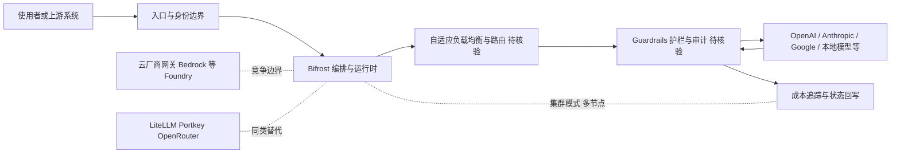

# maximhq/bifrost

## 一句话定位
号称"比 LiteLLM 快 50 倍"的企业级 AI 网关——Go 实现的高性能 LLM 代理，含自适应负载均衡、集群模式、护栏和 1000+ 模型支持，开销 <100μs。

## 它解决的问题
企业使用多个 LLM 提供商（OpenAI、Anthropic、Google、本地模型等）时，需要统一接口、负载均衡、成本控制、故障转移和安全过滤。现有方案（如 LiteLLM Python 实现）性能不足，而企业级需求（高并发、低延迟、合规审计）越来越强。Bifrost 用 Go 重写，主打极致性能和企业级特性。

## 为什么值得关注
- **Stars:** 7,122 stars，AI Gateway 赛道新星
- **Forks:** 1,013，社区贡献活跃
- **Go 实现**，性能导向，适合高并发场景
- **<100μs 开销**：对延迟敏感的实时应用（语音、视频）至关重要
- **1000+ 模型支持**：覆盖面广
- **集群模式**：支持生产级高可用部署
- 持续活跃（2026-08-07 更新）

## 热度来源判断
- **LLM 基础设施需求爆发（高）**：企业多模型部署已成常态
- **性能差异化（高）**：比 LiteLLM 快 50x 的口号极具传播力
- **Go 生态红利（中）**：Go 在基础设施领域的优势
- **企业 AI 安全合规（中高）**：护栏和审计功能满足合规需求

## 关键技术亮点亮点
1. **<100μs 代理开销**：Go 实现+零拷贝设计，接近线速转发
2. **自适应负载均衡**：根据模型延迟、成本、可用性动态路由请求
3. **集群模式**：多节点部署，共享配置和状态，支持水平扩展
4. **Guardrails（护栏）**：请求/响应过滤，PII 检测，内容安全
5. **1000+ 模型适配**：统一 API 接口适配各厂商模型格式
6. **成本追踪和预算控制**：按 team/project/user 维度的成本分析

## 架构师速览

| 决策问题 | 研究判断 | 证据边界 |
|---|---|---|
| 系统边界 | 作为 LLM 代理网关，介于调用方与多模型供应商之间，统一协议出口并附加路由、护栏与审计职责 | 基于 ai-gateway/llm/load-balancer/guardrails/go/proxy 标签与档案"一句话定位/解决的问题"，未含具体接入协议与部署形态 |
| 主路径 | 请求进入网关 → 自适应负载均衡/路由 → 护栏过滤 → 转发至 OpenAI/Anthropic/Google/本地模型等 → 响应回传并写入成本与审计 | 路径中的"集群模式"是否必经需源码核验；1000+ 模型清单来源未在档案中给出 |
| 关键权衡 | Go 性能优势 vs LiteLLM 等既有生态先发；自托管可控 vs 云厂商 Bedrock/AI Foundry 的托管网关；营销宣称 "<100μs / 50x" vs 第三方基准缺失 | 性能数据来自项目自述，未见独立基准；商业模式、集群实现细节、企业版功能成熟度档案未确认 |
| 最小 PoC | 在单渠道、单供应商、关闭护栏深度策略的前提下复现 <100μs 级别开销，并验证成本维度（team/project/user）记账与故障转移基本行为，再决定是否扩大接入面与启用集群模式 | 护栏深度、集群一致性、成本追踪粒度、是否提供托管 SaaS 均为档案明示的后续观察点，PoC 阶段需逐项验收 |

## 架构启发
- **AI 网关是必要基础设施**：类比 API Gateway（Kong/APISIX），LLM 也需要专用网关
- **Go 的基础设施优势**：高并发+低内存，适合代理类组件
- **性能即差异化**：在功能趋同的 AI Gateway 市场，性能是核心卖点

## 架构图（MMD）

> 证据边界：此图只采用本档案已有可核验描述；“待核验”节点不应视为项目实现事实。

## 定位判断
**高潜力基础设施候选**。在 AI Gateway 赛道以性能为核心差异化，有潜力成为企业 LLM 部署的标准组件之一。

## 风险/局限/泡沫点
- **"50x faster" 需验证**：营销话术，实际场景差异可能很大
- **LiteLLM 生态先发优势**：LiteLLM 已有大量用户和插件生态
- **企业级功能成熟度**：审计、合规、多租户等功能需要时间打磨
- **商业模式不明**：开源+企业版？纯开源？SaaS？
- **云厂商竞争**：AWS Bedrock、Azure AI Foundry 提供类似网关能力

## 与同类项目的关系
- **vs LiteLLM**：直接竞品，Bifrost 主打性能，LiteLLM 主打生态和易用性
- **vs Portkey**：Portkey 偏 SaaS，Bifrost 偏自托管
- **vs OpenRouter**：OpenRouter 是托管路由服务，Bifrost 是自部署网关
- **vs Kong/APISIX + AI 插件**：通用 API 网关加 AI 插件 vs 专用 AI 网关

## 是否值得持续跟踪
**推荐跟踪。** AI Gateway 是 LLM 基础设施的重要组成，Bifrost 的性能导向路线值得关注。如果企业版功能完善，有成为标准组件的潜力。

## 后续观察点
- 性能基准测试的第三方验证
- 企业客户采用案例
- 与 LangChain/LlamaIndex 等框架的集成
- 是否提供托管 SaaS 版本
- Guardrails 功能的深度（是否能检测复杂 prompt injection）
- 社区增长和生态插件数量

---
> 数据来源: GitHub API (2026-08-07) | Stars: 7,122 | Forks: 1,013 | 语言: Go
