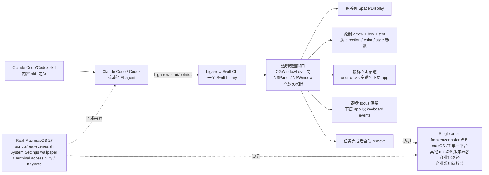

# franzenzenhofer/big-arrow-on-the-screen

## 一句话定位
macOS 命令行工具 bigarrow（一个 Swift binary）让 AI agent 在用户屏幕上画大箭头 / 框 / 文字，跨所有 Space/Display，绘制无需任何权限，鼠标点击穿透、键盘 focus 保留，箭头自动消失——为 Claude Code / Codex 这类 agent 加「finger」（HUD 箭头），附 Real Mac macOS 27 场景剧本。

## 它解决的问题
AI agent 已经是常态（Claude Code、Codex、Cursor Agent 等），但当需要用户点一个 GUI 按钮时，agent 只能在终端打 "please click Allow in the dialog"——用户根本没在终端前。big-arrow-on-the-screen 直击：**让 agent 能「画箭头」指引用户点击**——一个透明覆盖窗口跨所有 Space/Display 之上一层，绘制（arrow / box / text）不需要任何 macOS 权限，鼠标点击穿过（click-through）、键盘 focus 保留（不被 arrow 抢）、箭头自动消失。解决的是 **「AI agent 提示用户 GUI 操作的 HUD」** 的严肃工程化承诺问题，附 Real Mac macOS 27 的 System Settings wallpaper click → show desktop / Terminal accessibility / Keynote 三步 how-to 场景剧本和 9 个 Hacker News 同色箭头 × 2007-2026 时期图解。

## 为什么值得关注
- **Stars:** 418（截至 2026-10-10），2 天 418⭐ ⑂6 fork/star 1.4%
- **Forks:** 6，社区参与度低（个人项目为主）
- **Size:** 34594 KB（含 docs/images hero 图 + demo 资源）
- **License:** MIT
- **语言:** Swift
- **活跃度:** created 2026-10-08，pushed_at 2026-10-09，**2 天 418⭐ ⑂6 fork/star 1.4%**
- **CI:** GitHub Actions ci.yml 通过
- **发布:** docs/images/hero-hn.png + docs/images/demo.gif + docs/images/real/wallpaper.gif + docs/videos/wallpaper.mp4 + docs/images/real/settings.png + docs/images/real/keynote.png

## 热度来源判断
big-arrow-on-the-screen 的热度是 **「AI agent 在 macOS 上的 GUI 指示刚需 × 跨所有 Space/Display 透明覆盖层 × 绘制无需权限 × 鼠标点击穿透 + 键盘 focus 保留 × arrow 自动消失 × Claude Code/Codex skill × Real Mac macOS 27 场景剧本（System Settings/Terminal accessibility/Keynote 三步 how-to）× 9 个 Hacker News 同色箭头 × 2007-2026 时期图解」** 的组合。AI agent 落地的最大瓶颈之一就是 GUI 操作（System Settings 权限、Keyboard shortcut、dock 操作），bigarrow 提供「finger」功能直接命中刚需。2 days 418⭐ ⑂6 fork/star 1.4% fork/star 偏低（个人项目 + macOS 单一平台绑定），但 Stars 增速可观，反映 demo + 真实场景剧本驱动。

## 关键技术亮点
1. **透明覆盖窗口在所有 Space/Display 之上:** 一个 Swift binary，不依赖 daemon / menu-bar icon
2. **绘制无需任何 macOS 权限:** Apple 设计允许透明覆盖层不触发 Accessibility / Screen Recording 权限
3. **鼠标点击穿透（click-through）:** 用户点击穿透 arrow 到下方 app
4. **键盘 focus 保留:** arrow 不抢 app 的键盘焦点
5. **自动消失:** 任务完成后 arrow 自动 remove，无需用户手动关闭
6. **Claude Code/Codex skill:** 自带 skill 定义方便 Coding agent 调用
7. **Real Mac macOS 27 场景剧本:** scripts/real-scenes.sh 演示真实使用（非合成图）

## 架构师速览

| 决策问题 | 研究判断 | 证据边界 |
|---|---|---|
| 系统边界 | macOS 命令行工具 + 透明覆盖窗口 + 跨所有 Space/Display；输入是 `bigarrow point --element 'Allow' --app 'System Settings' --text 'click Allow'`，输出是用户看到的大箭头 + sign | 基于 README + 真实 macOS 27 System Settings / Terminal accessibility / Keynote 场景剧本；其他平台（Windows/Linux）支持、其他 app 兼容性矩阵未在档案中给出 |
| 主路径 | CLI call → process arrow params → 创建透明覆盖窗口（CGWindow / AppKit）→ 绘制 arrow / box / text → 用户点击穿透 → 任务完成自动 remove | 主路径为 README 语义抽象；具体 CGWindowLevel / NSPanel 选型、event tap、键盘 focus 屏蔽路径待核验 |
| 关键权衡 | 单一 Swift binary 无 daemon vs macOS 平台绑定 vs 绘制无需权限 vs 鼠标点击穿透 + 键盘 focus 保留 vs 自动消失 vs Claude Code/Codex skill vs 个人项目（franzenzenhofer 1 人）治理 vs 商业化路径 vs 与 macOS 27 时期 scene 剧本同步 | 档案明示透明覆盖、无权限、自动消失、click-through、keyboard focus 保留；跨平台扩展、其他 macOS 版本兼容、企业采用待核验 |
| 最小 PoC | clone → swift build → `bigarrow point --element 'Animate' --app 'Keynote' --role radiobutton --text '1. Click Animate' --from right --style ring --color purple`；验证点击穿透、键盘 focus 保留、自动消失 | PoC 范围、退出路径由档案"单 binary、单命令、可观测"建议推导；具体测试场景、benchmark、SLO 指标待核验 |

## 架构启发
big-arrow-on-the-screen 的核心启发是 **「透明覆盖窗口在所有 Space/Display 之上 + 不需要任何 macOS 权限 + 鼠标点击穿透 + 键盘 focus 保留 = agent GUI 提示的标准 primitive」**。这一思路类似 macOS 自带的「通知 / 演示者覆盖层」技术，但 franzenzenhofer 把它做成 CLI + 严肃工程化承诺 + Real Mac 场景剧本 + Claude Code/Codex skill。更深层的启发是：**「AI agent 在 GUI 操作场景的落地，最 practical 的不是 vision / accessibility API（权限重），而是透明覆盖层（无权限）」**——这一观察准确命中 macOS 27 System Settings 权限弹窗、Terminal accessibility 等高频 agent 痛点。

## 架构图（MMD）

> 证据边界：此图只采用本档案已有可核验描述；"待核验"节点不应视为项目实现事实。

## 定位判断
**Niche 工具型项目（macOS AI agent HUD）。** big-arrow-on-the-screen 不是通用可视化平台，而是 macOS 上 AI agent 的「画箭头工具」——透明覆盖 + 不需权限 + 点击穿透 + focus 保留 + 自动消失的组合严肃工程化承诺。决定其后续价值的是跨平台扩展速度、企业采用（客服/IT 培训/agent 演示）。

## 风险 / 局限 / 泡沫点
- **macOS 单一平台:** Windows/Linux 不支持（无透明覆盖层等价实现）
- **个人项目:** franzenzenhofer 1 人治理，长期可持续性存疑
- **fork/star 偏低:** 2 days 418⭐ ⑂6 fork/star 1.4%，参与度低
- **macOS 27 时期兼容:** 未来 macOS 版本变化是否打破 overlay 行为
- **Enterprise 接受度:** AI agent 工具的企业采用（IT/客服）需观察
- **竞争品:** Apple 自带「演示者叠加」+ 第三方 airdrop 风格 overlay 工具

## 与同类项目的关系
- **vs Hammerspoon:** Hammerspoon 是 macOS 自动化框架；bigarrow 是 agent 专用 HUD
- **vs Apple 演示者叠加:** 内置，无 CLI；bigarrow 提供 CLI 化
- **vs Mac 自带 Accessibility:** Accessibility 权限重；bigarrow 不需权限
- **vs screen-overlay 类工具:** 那些不 click-through / 不 focus 保留
- **vs AI agent vision API:** 那种 API 需要 macOS Screen Recording 权限；bigarrow 不需要

## 是否值得持续跟踪
**值得适度跟踪（macOS AI agent HUD 严肃工程化承诺 niche）。** big-arrow-on-the-screen 代表了 **「透明覆盖 + 不需权限 + click-through + focus 保留 = macOS agent GUI 操作的新路径」** 的严肃工程化承诺，无论其本身成败，这一方向是合理 evolution。建议关注：跨平台扩展、Windows 等价实现、企业采用（IT/培训/agent 演示）。

## 后续观察点
- 跨平台扩展（Windows/Linux 等价实现）
- macOS 新版本兼容（每年 macOS 更新是否破坏 overlay 行为）
- 其他 AI agent（Cursor Agent / Continue.dev 等）是否集成
- 企业采用（IT 培训、客服自动化、agent 演示）
- 商业化路径（开源 + 服务？企业版？）
- CLI 参数体系扩展（更多 arrow 风格 / shape / 动画）
- 是否有 macOS Accessibility / Screen Recording API 替代方案（成熟后）
- 与 system-level prompt injection / AI 操控边界（恶意利用 arrow 引导用户点击钓鱼按钮）

---
> 数据来源: GitHub API (2026-10-10) | Stars: 418 | Forks: 6 | License: MIT | 语言: Swift | 创建: 2026-10-08
