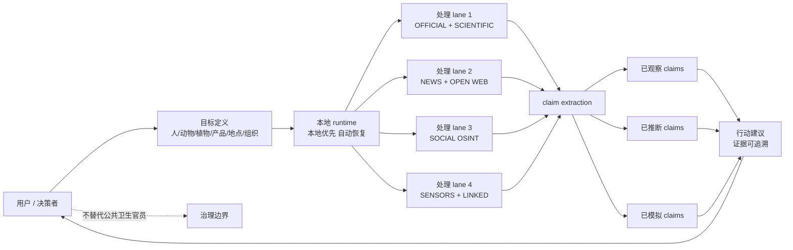

# Forsy-AI/biosecurity-agent

## 一句话定位
为任一目标（人 / 动物 / 植物 / 产品 / 地点 / 组织）构建**活的生物安全情报世界**的 AI agent——把官方与科学源、新闻、OSINT、传感器、关联数据持续拉取并相互连结，把"已观察 / 已推断 / 已模拟"三类声明在产品层显式分离。

## 它解决的问题
公共生物安全 / 应急响应场景下，AI 接管的关键阻力是**信任**：决策错误可能直接造成公共事件。biosecurity-agent 直击这一点——它**不试图"自动决策"**，而是：(1) 把可用证据分成三层（已观察、可推断、可模拟），每层都标记清楚；(2) 把数据流暴露为可审查的处理 lane（TARGET MODELLING / OFFICIAL + SCIENTIFIC / NEWS + OPEN WEB / SOCIAL 等）；(3) 在 README 顶部明示"不替代公共卫生官员判断"。这是"**agent-as-coworker + 永远保留审计痕迹**"形态在受监管高风险领域的范例。

## 为什么值得关注（2026-08-24）
- **2 天 356⭐**（GitHub API 可核验）：垂直领域首日聚焦效应明显
- **License: Apache-2.0**：商用 / 企业采用友好
- **TypeScript + npm 双轨**：`@forsy/biosecurity-agent` + 本地 CLI 两种入口——降低不同用户的使用门槛
- **完整工程化模板**：Dockerfile + `.env.example`（371 bytes）+ prettier + `.dockerignore`，代码完整可 review
- **README 顶部"不替代公共卫生官员"声明**：罕见但关键的伦理声明——是受监管场景合规设计的最务实样板

## 热度来源判断
biosecurity-agent 的热度来自**真实市场需求 + 治理美学示范**的组合：(1) 2026 年生物安全议题在公共卫生、动物疾病、抗生素耐药性、入侵物种等场景持续上升；(2) AI 进入这一领域有真实付费意愿，但**必须有可审计 / 可问责的产品形态**；(3) 同期其它 AI 决策产品在治理语义上明显弱于本项目。这是"市场需求 + 治理美学"的强力组合，但需注意：GitHub Star 数不等于公共部门采购决定，是否进入真实采购流程是后续需要独立追踪的指标。

## 关键技术亮点
1. **三层声明分离**：已观察 / 已推断 / 已模拟 显式区隔——这是 AI agent 在公共领域合规设计的关键创新
2. **处理 lane 暴露**：TARGET MODELLING / OFFICIAL + SCIENTIFIC / NEWS + OPEN WEB / SOCIAL 等处理 lane 在 README 内明确列出，每个 lane 都独立审计
3. **目标定义接受开放语义**：人 / 动物 / 植物 / 产品 / 地点 / 组织 / 多连接目标均可
4. **可注入私有上下文**：文件、私有数据、公开 URL、自定义源都可作为证据源
5. **本地优先 + 自动恢复**：本地 runtime，断电退出后再次启动可恢复 targets、watchers、world 状态
6. **npm + 本地 CLI 双分发**：降低集成门槛

## 架构师速览

| 决策问题 | 研究判断 | 证据边界 |
|---|---|---|
| 系统边界 | 本地运行的 agent runtime；通过 npm 包或本地 CLI 启动；外部依赖为官方 / 科学 / 新闻 / OSINT / 传感器 API；不向 Forsy 自身回传数据 | 边界由 README "Configure your AI agent"、"The local runtime restores the same targets, watchers, and world" 描述确认；"无数据外发"的合规承诺是否可被代码核验需待源码审查 |
| 主路径 | 用户定义 targets（含私有上下文）→ agent 启动多个并行处理 lane 拉取证据 → claim extraction & synthesis → 输出 action recommendations，三类声明保持分离 → 用户决策 | 主路径由 README "Define targets → Live biosecurity → Predict + protect" 三步流程确认；推理 / 模拟层的具体模型实现（自带 / 第三方 / 模型无关）未在档案中给出 |
| 关键权衡 | 三类声明必须分离 vs LLM 倾向把不确定信息压平成 confident 表述；本地优先 vs 多用户协作能力；通用多目标 vs 单垂直深度 | 权衡取舍由 README "claims always remain distinct" 与"不替代公共卫生官员"声明推导；具体技术实现（如 claim 类型系统设计）是推断 / 待核验 |
| 最小 PoC | 通过 npm 在本地安装 biosecurity-agent → 定义一个组织作为 target → 开启自动处理 lane → 验证 24h 内三类声明被独立列出 → 对比"已推断"声明是否有可回溯证据链 | PoC 流程由 README quick start 与"discover / retrieval / claim extraction / synthesis"描述推导；具体数据源覆盖范围未在档案中给出 |
| 证据边界 | 仓库公开 metadata + README + Dockerfile；具体数据源 API、claim 类型系统、模型选择、多用户隔离机制均为推断 / 待核验项 | 仅核验已核验事实（Stars/Forks/License/Created/Topics/Build system），其他来自语义推断 |

## 架构图（MMD）

> 证据边界：此图只采用本档案已有可核验描述；"待核验"节点不应视为项目实现事实。

## 架构启发
biosecurity-agent 的核心启发是 **"高风险垂直领域 agent 的形态学问题 = 治理语义如何内嵌进产品 UX"**。它没有走"我把 LLM 包装得越像决策者越成功"的路线，而是反过来——**故意把"我不做最终决策"写在 README 顶部**，并把"已观察 / 已推断 / 已模拟"三类声明做产品级显式分离，让用户在阅读时**自然保持怀疑**。这是一种产品哲学层面的决策。这种形态学的现实意义：**任何要做金融合规、医疗辅助、法律援助的 agent，都应该学习这一形态**——把"治理语义"做进产品 UX 比做进技术架构更直接。

## 定位判断
**垂直领域事实标准候选（AI × 生物安全）。** 在公开 GitHub 仓库中，biosecurity-agent 是当前"AI agent + 生物安全"赛道最具关注度的项目（topics 含 biosecurity、agent、scenario-simulation）。由于赛道极小（同时关注 LLM 与生物安全的人群少），它短期内不会成为大众化产品，但很可能成为**"公共部门 AI 决策支持系统"采购参考**——大量 RFP 文档会引用其"三类声明分离"模式。

## 风险 / 局限 / 泡沫点
- **GitHub Star 数不等于公共部门采购**：可能存在大量关注但 0 采购的真实场景
- **数据源覆盖未完整文档化**：在档案阶段无法确认覆盖哪些官方 / 科学 API、是否需要付费授权
- **claim 类型系统的实现细节未知**：仅 README 描述三类，但**实际如何判定"已推断 vs 已观察"** 是技术核心（此差异需要 strong probabilistic claim model）
- **AI 误判风险**：即使三类声明分离，"已推断"陈述仍可能误导未训练用户；产品需对决策者提供 uncertainty 量化
- **合规框架挑战**：欧美生物安全场景的合规框架（HSE / EFSA / USDA / CDC / ECDC 等）是否接受此架构待核验
- **第三方验证缺失**：尚未发现独立审计 / 评估报告

## 与同类项目的关系
- **vs NorthCinder（8-23）**：两者都是"垂直 MCP server + local-first + 治理语义"形态，但垂直不同（消费购物 vs 生物安全）
- **vs DNA-Lang / BioThings**：这些是生物信息学工具，与"agent × 情报"差异明显
- **vs Palisades / Palantir Foundry**：商业 BI / 决策支持平台；biosecurity-agent 是开源 + AI agent 路线，是商业产品的可能对手
- **vs LangChain / LlamaIndex 等 agent 框架**：biosecurity-agent 是垂直应用，不是通用框架
- **vs OSINT 工具（Maltego / Shodan 等）**：那些是数据采集工具，biosecurity-agent 是数据驱动的决策辅助 agent

## 是否值得持续跟踪
**值得高频跟踪（高风险 AI agent 形态学示范）。** 对生物安全 / 应急响应 / 公共卫生从业者：值得本地尝试，把"我的目标用例"跑通；对**做金融合规、医疗辅助、法律援助 agent 的产品经理**：**这个项目的 README 是必读样板**——它示范了"如何把'我不替代人'写进产品而不是写进免责声明"。对企业 AI 治理：直接可借鉴其"声明分类 + 处理 lane 显式化"的形态。

## 后续观察点
- 是否有公开的真实客户案例（政府、NGO、企业）
- claim 类型系统的实现细节是否会公开（论文 / 博客）
- 数据源扩展路径（与 ECDC / CDC / WHO 等公共数据接入）
- 是否有第三方独立审计 / benchmark
- 与 NorthCinder 等垂直 MCP 是否形成"local-first + 治理" 联盟（事实标准候选）

---
> 数据来源: GitHub API (2026-08-24) | Stars: 356 | Forks: 12 | License: Apache-2.0 | 语言: TypeScript | 创建: 2026-08-22
