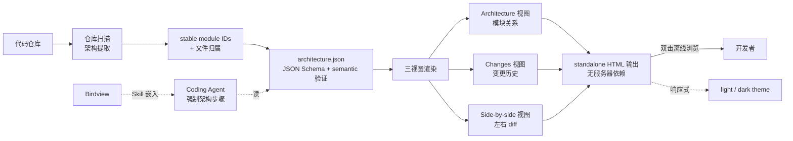

# Qiuner/birdview

## 一句话定位
Birdview——「Stop letting AI code blind」架构可视化 Skill 包；architecture-as-code + code-visualization；evidence-linked 架构图带 stable module IDs 与显式文件归属；Architecture / Changes / Side-by-side 三视图；standalone HTML 输出无服务器依赖。

## 它解决的问题
AI Coding 当前的「黑盒感」是用户主要焦虑——agent 改了哪些文件、影响哪些模块、是否动到关键路径，没人能快速看清。现有方案要么是事后补救（看 diff），要么需要 SaaS 接入（架构图工具）。**Birdview 直接把「架构上下文」做成强制步骤：先 map architecture，再允许 edit**——这是流程层面的硬约束，不是事后补丁。它把 architecture-as-code（架构即代码）+ code-visualization（代码可视化）+ diagram-as-code（图表即代码）三件事打包成一个 Skill，让 AI Coding 在写代码前先看清架构。

## 为什么值得关注（2026-09-13）
- 1 天 68⭐ / fork 3 / fork/star 4.4%
- 「Stop letting AI code blind」营销句直击 AI Coding 黑盒痛点
- evidence-linked 架构图（stable module IDs + 文件归属）——可验证、可复用
- Architecture / Changes / Side-by-side 三视图——架构层 + 时序层覆盖完整
- standalone HTML 输出——无服务器依赖、双击离线浏览
- 中英双语控制——本地化友好
- 0.1.0 早期阶段，但工程化明确

## 热度来源判断
Birdview 的热度是 **「AI Coding 黑盒透明化刚需 + architecture-as-code 范式 + standalone HTML 工程化」三因素叠加**。AI Coding 用户对黑盒感焦虑普遍，architecture-as-code 是 2025-2026 年软件工程领域的明确趋势（与 Terraform / IaC 同构）。standalone HTML 输出（无服务器、双击打开）是 Skill 形态的工程化极致——用户能离线分享、能复用、能验证。**热度来源真实**——AI Coding 黑盒感是普遍痛点；但**当前 0.1.0 早期阶段，能否破圈取决于 Skills 生态是否采用 Birdview 作为标准 architecture-as-code 格式**。

## 关键技术亮点
1. **architecture-as-code + diagram-as-code + code-visualization 三合一**——架构即代码 + 图表即代码 + 代码可视化
2. **evidence-linked 架构图**——stable module IDs + 显式文件归属；可验证、可复用
3. **Architecture / Changes / Side-by-side 三视图**——架构层（模块关系）+ 时序层（变更历史）+ 对比层（左右 diff）
4. **JSON Schema + semantic 验证**——map 和 activity history 都有 schema + 语义验证
5. **standalone HTML 输出**——无服务器依赖、双击离线浏览、可邮件分享
6. **响应式 light / dark theme**——自动适配用户主题
7. **relationship filtering + module inspection**——可按关系筛选 + 单模块深入查看
8. **中英双语控制**——本地化友好
9. **0.1.0 版本 + live demo**——examples/harness-activity.html 与 docs.installation.md 现场演示
10. **Node.js 18+**——无 npm install 也能用（README 提到 standalone）

## 架构师速览

| 决策问题 | 研究判断 | 证据边界 |
|---|---|---|
| 系统边界 | AI Coding 流程的「架构上下文强制步骤」；输入：代码仓库 + 架构 JSON；输出：standalone HTML 三视图；Skill 形态嵌入 Coding Agent | 来自 README 关于「map the architecture before every change」描述；具体与 Claude Code / Codex / Pi 的 Skill 接入方式待核验 |
| 主路径 | 仓库扫描 → 架构提取（stable module IDs + 文件归属）→ JSON Schema 验证 → 三视图渲染（Architecture / Changes / Side-by-side）→ standalone HTML 输出 | 主路径来自 README「evidence-linked 架构图 + 三视图 + JSON Schema + standalone HTML」特性；架构提取的具体算法（AST 解析 / import graph / 手动 JSON）待核验 |
| 关键权衡 | 架构提取自动化（vs 手动 JSON 维护成本）vs schema 严格度（vs 易用性）vs standalone HTML（无依赖 vs 文件大）vs evidence-linked（可验证 vs 工作量大） | 四权衡来自 README 特性对照；架构提取准确率、HTML 文件体积基准、evidence-linked 工作量未公开 |
| 最小 PoC | 在某项目根目录运行 `birdview init`（假设）→ 自动生成 architecture.json → `birdview view` → standalone HTML → 双击打开看三视图；对比不引入 Birdview 时 AI Coding 改动的模块影响 | PoC 由「architecture-as-code + standalone HTML」推导；具体 CLI 命令与 AI Coding Agent 集成方式待核验 |

## 架构图（MMD）

> 证据边界：此图只采用本档案已有可核验描述；"待核验"节点不应视为项目实现事实。

## 架构启发
Birdview 的核心启发是 **「AI Coding 流程层面的架构硬约束」**——不是事后补救，而是「先 map architecture，再允许 edit」的流程层面硬约束。这与昨日 maskit（出网打码）和昨日 routeVSCODE（模型路由）同构——都是在 AI Coding 流程中加入额外约束，让 agent 不那么「黑盒」。更深层的启发是 **「standalone HTML + evidence-linked」的工程化极致**——用户能离线分享、能复用、能验证，是 Skill 形态的成熟做法。**最值得借鉴的是「Architecture / Changes / Side-by-side 三视图」**——架构层（模块关系）+ 时序层（变更历史）+ 对比层（左右 diff）覆盖完整的 AI Coding 黑盒透明化需求。

## 定位判断
**工具型项目（AI Coding 架构可视化）。** Birdview 不是又一个架构图工具，而是 **「AI Coding 流程硬约束 + architecture-as-code + standalone HTML」三件套**——把架构上下文做成 AI Coding 的强制步骤，让 agent 改代码前先看清架构。能否进入「基础设施」取决于：(a) Skills 生态是否采用 Birdview 作为标准 architecture-as-code 格式；(b) 架构提取算法是否自动化（决定使用成本）；(c) evidence-linked 工作量是否可接受（决定采用门槛）。当前定位是「最有影响力的 AI Coding 架构可视化 Skill」。

## 风险 / 局限 / 泡沫点
- **0.1.0 早期阶段**——文档 / 错误处理 / 边界场景覆盖度有限
- **架构提取算法可能需要手动 JSON 维护**——全自动化成本高；半自动则需用户维护 architecture.json
- **evidence-linked 工作量**——每张架构图都需链接到文件归属，工作量大
- **standalone HTML 体积**——含图表 + 截图 + 元数据，可能几百 KB 到几 MB
- **fork=3 反映早期采用**——Skills 生态是否采用 Birdview 作为标准 architecture-as-code 格式未明
- **与现有架构图工具（Structurizr / C4 PlantUML / Mermaid）的差异化**——需明确边界

## 与同类项目的关系
- **vs Structurizr DSL：** Structurizr 是架构即代码 + SaaS / 本地部署；Birdview 是 Skill 形态 + standalone HTML
- **vs C4 PlantUML：** C4 是模型 + PlantUML 渲染；Birdview 是架构即代码 + JSON Schema + HTML 渲染
- **vs Mermaid：** Mermaid 是图表即代码 + 文本渲染；Birdview 是架构即代码 + HTML 渲染
- **vs 昨日 `FankChen/tracecrate`：** tracecrate 是时序层（agent 做了什么）；Birdview 是架构层（agent 动了哪部分代码）；两者叠加可构成完整的 AI Coding 可观测栈
- **vs 昨日 ccompactor：** ccompactor 是 session 层互操作；Birdview 是架构层可视化
- **vs `Qiuner` 其它项目：** Birdview 是 Qiuner 在 AI Coding 工具链的第一次明确亮相

## 是否值得持续跟踪
**值得跟踪（AI Coding 黑盒透明化样本）。** Birdview 代表了 AI Coding 黑盒透明化的方向——不是事后看 diff，而是「先 map architecture 再允许 edit」的流程硬约束。建议关注：(a) Skills 生态是否采用 Birdview 作为标准 architecture-as-code 格式；(b) 架构提取算法的自动化程度；(c) evidence-linked 工作量是否可接受。对 AI Coding 用户，这是直接可用的架构可视化 Skill（可替换为自己的 architecture.json）。对 AI Coding 生态观察者，它是「流程硬约束 + architecture-as-code」的标杆。

## 后续观察点
- Skills 生态是否采用 Birdview 作为标准 architecture-as-code 格式
- 架构提取算法是否全自动化（决定使用成本）
- evidence-linked 工作量是否被开发者接受
- 是否出现 v1.0 / 稳定版本（决定生产可用）
- standalone HTML 体积优化（决定邮件分享可行性）
- 与 tracecrate / ccompactor 能否形成 AI Coding 可观测栈完整组合

---
> 数据来源: GitHub API (2026-09-13) + README 公开摘录 | Stars: 68 | Forks: 3 | License: MIT | 语言: JavaScript | 创建: 2026-09-12 | 仓库 size: 1.6 MB
