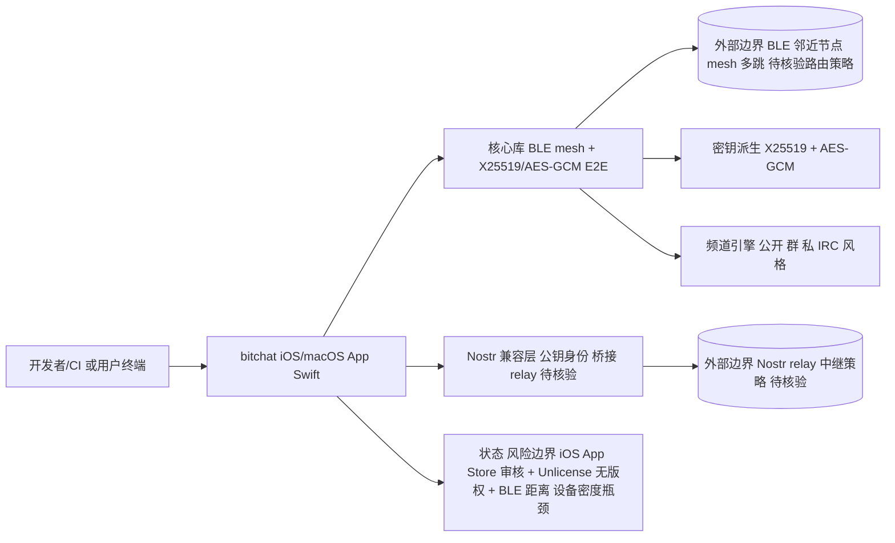

# bitchat

## 一句话定位
蓝牙 mesh + 端到端加密 + Nostr 兼容的离线即时通讯 App——iOS / macOS 原生 Swift 实现，无需服务器、无需 SIM 卡、无需账户，附近设备自组网就能聊天。

## 它解决的问题
传统即时通讯强依赖互联网/运营商/servers。bitchat 用 BLE（Bluetooth Low Energy）做 mesh 转发 + X25519 + AES-GCM 做端到端加密 + Nostr 公钥做身份，不需要任何中心化基础设施。在断网、灾区、抗审查场景下仍可使用。同时支持与 Nostr 公链互通，可桥接中继。

## 为什么值得关注（2026-08-15）
被 daily/2026-08-15.md 选为今日隐私通信重点。35,718 stars 在约 1 年的周期下增长极快——其话题热度集中在：
- 抗审查场景（2025-2026 多个国家对 IM 监管收紧）
- 自然灾害离线通讯（地震/飓风场景）
- 极客对"去中心化通信"持续追求

## 热度来源判断
热度来源是 **"抗审查刚需 × Nostr/mesh 叙事爆发 × 低门槛参与"**。Unlicense 极简许可证（公有领域）也降低了参与门槛。但需注意：bitchat 的"明星项目"属性部分来自开发者背景——permissionlesstech 即 Jack Dorsey（Twitter 联合创始人），早期曝光带来极大流量。建议区分名人效应与项目本身技术成熟度。

## 关键技术亮点
1. **BLE Mesh:** 设备之间多跳转发，无需路由器/4G/服务器
2. **X25519 + AES-GCM:** 标准端到端加密，公钥交换派生对称密钥
3. **Nostr 兼容:** 公钥格式与 Nostr 一致，可桥接 Nostr 中继
4. **Swift 原生:** iOS / macOS 全功能，性能与系统集成度优于 Flutter/RN
5. **频道（IRC 风格）:** 公开频道、群聊、私聊三模

## 架构师速览

| 决策问题 | 研究判断 | 证据边界 |
|---|---|---|
| 系统边界 | 边界为 iOS/macOS 宿主运行时 ↔ Swift 核心（BLE mesh + X25519/AES-GCM）↔ Nostr 兼容层 ↔ 频道（公开/群/私）。外部边界是 BLE 邻近设备与 Nostr relay；目前仅 iOS/macOS 原生，Android 端状态未在档案中确认（待核验）。 | 基于档案语言/标签与"技术亮点"四条；具体协议细节、持久化、SDK 结构未在档案给出。 |
| 主路径 | 设备启动 App → BLE 扫描/广播 → 邻节点 mesh 多跳转发 → X25519 派生 AES-GCM 会话密钥 → 频道/私聊投递；可经 Nostr 公钥桥接至 Nostr relay（具体中继策略待核验）。 | 主路径由档案"一句话定位+技术亮点 1/2/3"得出；消息路由/丢包重传/TTL 等策略档案未证实。 |
| 关键权衡 | 抗审查/离线可用性 vs 平台与法规风险：iOS App Store 审核、Unlicense 无版权约束、距离/设备密度对 BLE mesh 的强依赖、名人效应带来的流量≠技术成熟度。 | 来自档案"风险/局限"段；缺少实测吞吐、跳数上限、SLO 数据。 |
| 最小 PoC | 在两台同网 iOS/macOS 设备上验证：BLE 自动发现 → 私聊建立 → 消息可达；再扩展三跳验证频道广播；不接入 Nostr relay，先确认核心 mesh+e2e 子系统。 | 档案未给出推荐测试矩阵或基准，"500+ 节点"为待核验项；建议先小规模重复验证接口与失败语义。 |

## 架构启发
"用现成的、低功耗硬件能力（BLE）做去中心化通讯" 验证了一条软硬件结合路线——Mesh 网络在 mesh router、LoRa、低功耗设备间持续有应用，而 bitchat 把它推到了消费者 IM 级别。

## 架构图（MMD）

> 证据边界：此图只采用本档案已有可核验描述；“待核验”节点不应视为项目实现事实。

## 定位判断
**工具型 / 抗审查通讯工具（明星项目）。** 与 Session、Briar、Matrix 等同处去中心化通讯赛道，但 bitchat 独特定位是"无网络可用"——这让它在极端场景下不可替代。但日常场景用户仍更倾向 WhatsApp/Signal 等有 UX 优势的应用。

## 风险 / 局限 / 泡沫点
- **iOS/macOS 限制:** 未跨 Android，Android 才是 BLE mesh 真正爆发市场
- **依赖名人效应:** permissionlesstech 身份与项目热度绑定，需独立评估
- **Unlicense 商业化:** 完全放弃版权，对 fork/改造无任何约束，但实际企业采纳存在风险
- **距离与设备瓶颈:** BLE mesh 跳数与设备密度强相关，城市中好用，乡村可能失效
- **法规风险:** 抗审查工具可能被部分国家直接封禁分发（iOS 审核已经有过先例）

## 与同类项目的关系
- **vs Session:** Session 有 onion routing + token 经济；bitchat 完全无服务器
- **vs Briar:** Briar 也支持蓝牙/Tor/Wifi；bitchat 偏 Swift/Nostr
- **vs Matrix:** Matrix 是有服务器的去中心化协议，bitchat 是无服务器 mesh
- **vs Nostr:** Nostr 是协议；bitchat 把 Nostr 与 BLE mesh 结合

## 是否值得持续跟踪
**值得持续跟踪（隐私通讯 + 抗审查方向）。** bitchat 在技术与时机上都很不错，但日常应用空间有限——其核心用户是抗审查需求群体，而非普通 IM 用户。建议关注：
- Android 版本动向
- 与 Nostr relay 桥接的实际互通性
- 大规模 mesh 性能基准

## 后续观察点
- Android 客户端发布节奏
- Nostr 兼容层是否被广泛采用（成为 Nostr 客户端之一）
- 大规模 mesh (500+ 节点) 性能与延迟数据
- iOS App Store 审核政策的对抗演化
- 与 Briar/Session 的合并/互通可能

---
> 数据来源: GitHub API (2026-08-21) | Stars: 35,718 | Forks: 5,671 | License: Unlicense | 语言: Swift | 创建: 2025-07-04
