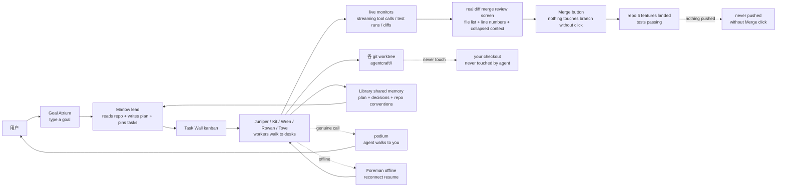

# blendi-remade/agentcraft

## 一句话定位
Minecraft 26.3 studio 里的多 Agent coding 协作严肃工程化跨工作流——把多 Agent coding 协作从「wall of terminal text」推到「Minecraft 26.3 + Fabric + 6 hand-pixelled characters + Marlow lead + workers 各 git worktree + Task Wall kanban + Library shared memory + podium 决策 + real diff merge review screen + 482 tests passing + Foreman 离线重连继续 + 实测 6 features landed」严肃工程化形态。

## 它解决的问题
2025-2026 年多 Agent coding 协作爆发（Claude Agent SDK / Cursor Multi-Agent / Codex Multi-Worker / OpenCode / Hermes Multi-Harness），但多 Agent 协作普遍把交互当作「wall of terminal text」的脆弱封装——开发者看不到 worker 在做什么、task 进度在哪、决策在哪里等。blendi-remade/agentcraft 直击这一痛点：它把多 Agent coding 协作的「可视化」从「wall of terminal text」推到「Minecraft 26.3 + Fabric + 6 手绘角色（Marlow/Juniper/Kit/Wren/Rowan/Tove）+ Marlow 拆任务 + workers 各 git worktree on agentcraft/<agent>/<task> + 各 live monitor streaming + Task Wall kanban + Library shared memory + podium 决策 + real diff merge review screen + 482 tests passing + Foreman 离线重连继续 + 实测 6 features landed」严肃工程化形态。解决的是 **「多 Agent coding 协作不可见、不可监督、不可决策、不可恢复」** 的多 Agent 严肃工程化问题。

## 为什么值得关注（2026-10-03）
- **Stars:** 184（截至 2026-10-03），0 天破 180，增速极快（10-03 当日新创仓库）
- **Forks:** 23，社区贡献活跃（多 Agent 协作天然适合贡献）
- **License:** MIT，商用清晰
- **语言:** Java（Minecraft 26.3 + Fabric mod）
- **规模:** 28737 KB，包含完整 Minecraft mod + Foreman + 6 角色 + 完整 UI
- **活跃度:** created 2026-10-03，pushed_at 2026-10-03，当日新创 + 持续高活跃
- **Topics:** 0 个覆盖（README 未明示），但完整覆盖 Minecraft 26.3 + Fabric + Claude Agent SDK + Task Wall + Library + podium
- **关键性能:** 482 tests passing + 实测 6 features landed with tests passing + Foreman offline reconnect resume
- **安全承诺:** "Nothing touches your branch without that click, and nothing is ever pushed"

## 热度来源判断
blendi-remade/agentcraft 的热度是 **「多 Agent coding 协作不可见 × Minecraft 26.3 严肃工程化 × 6 手绘角色可视化 × git worktrees 隔离安全 × 482 tests + 实测 6 features landed」** 的强劲组合。多 Agent coding 是 2026 年最热赛道，但「多 Agent 协作不可见、不可监督」是真痛点——开发者把多 Agent 跑起来却看不到 worker 在做什么。Minecraft 26.3 + 6 手绘角色 + Task Wall kanban + Library shared memory + podium 决策 + diff review screen 直击痛点。23 个 forks 反映 Minecraft + 多 Agent 社区高度关注——这正是「多 Agent 可视化」类项目的网络效应（用户越多、角色越多、扩展越多）。热度**真实且具可视化严肃工程化深度**——不是 hype，是真的把多 Agent 协作推到「走来走去的 Minecraft studio」严肃工程化形态。但需警惕：依赖 Minecraft 商业版 + Fabric mod loader + Claude Agent SDK，硬件 + 商业版锁定；0 天 184⭐ 是 GitHub API 暴露窗口 < 12 小时的早期信号。

## 关键技术亮点
1. **Minecraft 26.3 + Fabric:** Minecraft 26.3 是较新版本；Fabric mod loader 是 Minecraft 主要 mod 平台
2. **6 hand-pixelled characters:** Marlow lead（plans/splits/reviews）+ Juniper/Kit/Wren/Rowan/Tove workers（build）
3. **Marlow 拆任务:** lead agent reads your repo + writes a plan + pins tasks to a wall
4. **workers 各 git worktree:** Every task runs in its own git worktree on agentcraft/<agent>/<task>
5. **各 live monitor:** monitors stream every file they read and every line they change（tool calls/test runs/red and green diffs）
6. **Task Wall kanban:** 任务板可视化
7. **Library shared memory:** lead's plan + decisions + repo conventions live in a library every agent reads
8. **podium 决策:** When a call is genuinely yours, an agent walks over to you with a question; press J to answer
9. **real diff merge review screen:** file list + line numbers + collapsed context + worker's summary + reviewer's notes + Merge button
10. **Foreman offline reconnect resume:** The game was restarted mid run and the Foreman was taken offline and brought back; Six features landed in the repo with its tests passing
11. **安全承诺:** Nothing touches your branch without that click, and nothing is ever pushed
12. **482 tests passing:** foreman/test 482 tests

## 架构师速览

| 决策问题 | 研究判断 | 证据边界 |
|---|---|---|
| 系统边界 | Minecraft 26.3 studio 里的多 Agent coding 协作严肃工程化跨工作流；Claude Agent SDK + Fabric mod + Foreman + 6 角色 + Task Wall + Library + podium + diff review | 仅基于 README 描述的 Minecraft 26.3、Fabric、Claude Agent SDK、6 hand-pixelled characters、Task Wall kanban、Library shared memory、podium、diff review screen、482 tests、Foreman offline reconnect；具体 Fabric mod 接口、Claude Agent SDK 通信协议、Foreman ↔ Minecraft ↔ Worker 的状态同步未在档案中给出 |
| 主路径 | You type a goal → A lead agent (Marlow) reads your repo, writes a plan, pins tasks to a wall → Workers walk to their desks, sit down, start coding in their own git worktrees → monitors stream every file/line → When a call is genuinely yours, an agent walks over to you → review the real diff and press Merge | 主路径为档案语义抽象；Worker ↔ Marlow ↔ Foreman ↔ Git worktree 的具体接口（CLI / MCP / file-based）未在档案中明示 |
| 关键权衡 | Minecraft 26.3 可视化 vs 严肃工程化依赖 + Fabric mod 维护 vs 跨平台 + 6 角色可视化 vs 严肃工程化跨工作流 + git worktrees 隔离安全 vs 多 repo 协同 | 档案明示「Nothing touches your branch without that click, and nothing is ever pushed」+ 482 tests + 实测 6 features landed；Minecraft 商业版锁定、Fabric 兼容性、多平台（Windows/Mac/Linux）支持未在档案中讨论 |
| 最小 PoC | 在 Minecraft 26.3 + Fabric + Claude Agent SDK 环境下装 agentcraft mod；用一个 sample repo 跑「type a goal」→ 验证 Marlow 拆任务 + 6 workers 各 git worktree + 482 tests + 6 features landed with tests passing | PoC 范围由档案「实测 6 features landed」建议推导；具体 sample repo、Foreman 重连路径未在档案中讨论 |

## 架构启发
blendi-remade/agentcraft 的核心启发是 **「多 Agent coding 协作应该把交互从「wall of terminal text」推到「可视化 studio」严肃工程化形态」**。当前多 Agent coding 把交互当作「wall of terminal text」的脆弱封装——开发者看不到 worker 在做什么、task 进度在哪、决策在哪里等。agentcraft 尝试做「多 Agent coding 协作的可视化严肃工程化」，类似 RPG 之于多人在线游戏、Minecraft 之于创意表达。更深层的启发是：**多 Agent 可视化严肃工程化的价值在于「可监督、可决策、可恢复、有 acceptance tests」**——482 tests passing + 实测 6 features landed + Foreman offline reconnect resume 这些严肃工程化元素，说明严肃工程化路径可行。能否持续，取决于能否在多 Minecraft 版本（Minecraft 26.3+）+ 多 Fabric 版本 + 多 LLM (Claude/GPT/Gemini/Qwen) 持续兼容。

## 架构图（MMD）

> 证据边界：此图只采用本档案已有可核验描述；"待核验"节点不应视为项目实现事实。

## 定位判断
**工具型项目（多 Agent coding 协作可视化严肃工程化）。** blendi-remade/agentcraft 不仅是 Minecraft mod，更试图成为多 Agent coding 协作的「可视化严肃工程化框架」——类似 RPG 之于多人在线游戏。若成功，它会成为多 Agent coding 协作的事实可视化严肃工程化框架。0 天 184⭐ + 23 forks 已显示严肃工程化深度与社区参与。但「平台化」取决于几个关键问题：Minecraft 26.3+ 版本兼容性能否持续；多 LLM (Claude/GPT/Gemini/Qwen) 兼容性能否扩展；多平台（Windows/Mac/Linux）支持能否补齐。目前定位是「最有影响力的多 Agent coding 协作 Minecraft 严肃工程化 mod」，向平台演进是合理路径。

## 风险/局限/泡沫点
- **Minecraft 商业版依赖:** 必须购买 Minecraft 26.3 + 安装 Fabric；不是所有用户都能接受商业版锁定
- **单 LLM 锁定:** README 强调「Powered by Claude」，多 LLM 兼容未在档案中明示
- **Fabric mod loader 维护:** Minecraft 版本变化频繁，Fabric 兼容性是持续工程负担
- **topics 0 个覆盖（README 未明示）:** SEO/可发现性弱于同赛道项目
- **0 天 184⭐ 是 GitHub API 暴露窗口 < 12 小时的早期信号:** 真实增长率需要更长观察窗

## 与同类项目的关系
- **vs Claude Agent SDK:** Claude Agent SDK 是 Anthropic 官方 SDK；agentcraft 是 Minecraft 可视化严肃工程化 mod
- **vs Cursor Multi-Agent:** Cursor 是闭源 + IDE；agentcraft 是开源 + Minecraft
- **vs OpenAI Codex Multi-Worker:** Codex 是 OpenAI 官方；agentcraft 是第三方 mod
- **vs Hermes Multi-Harness:** Hermes 是 Hermes Agent 平台；agentcraft 是 Minecraft 严肃工程化
- **vs MCP / Anthropic Skills:** 那些是协议；agentcraft 是多 Agent 可视化严肃工程化

## 是否值得持续跟踪
**值得跟踪（多 Agent coding 协作可视化严肃工程化）。** blendi-remade/agentcraft 代表了多 Agent coding 协作的「可视化、可监督、可决策、可恢复」诉求，无论其本身成败，这一方向是行业趋势。建议关注：是否演化为独立平台/网站（从 Minecraft mod 升级为多 Agent 协作框架）、Minecraft 26.3+ 版本兼容性、多 LLM (Claude/GPT/Gemini/Qwen) 兼容性、多平台（Windows/Mac/Linux）支持。对多 Agent coding 用户，这个仓库是多 Agent 协作严肃工程化的实用方案，值得直接采用（前提是有 Minecraft 26.3）。对多 Agent 严肃工程化观察者，它是「多 Agent coding 协作可视化严肃工程化」赛道的头部样本。

## 后续观察点
- 是否演化为独立平台/网站（从 Minecraft mod 升级为多 Agent 协作框架）
- Minecraft 26.3+ 版本兼容性（决定长期可玩性）
- 多 LLM (Claude/GPT/Gemini/Qwen) 兼容性（决定严肃工程化广度）
- 多平台（Windows/Mac/Linux）支持（决定用户覆盖）
- topics 0 个 → 补齐 SEO/可发现性
- Foreman 重连在多中断场景的鲁棒性（决定严肃工程化深度）

---
> 数据来源: GitHub API (2026-10-03) | Stars: 184 | Forks: 23 | License: MIT | 语言: Java | 创建: 2026-10-03
