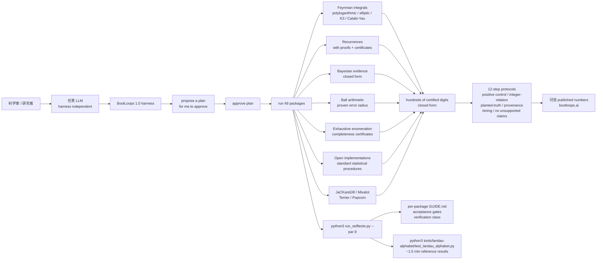

# BootLoops-ai/bootloops

## 一句话定位
LLM 驱动严肃科学计算的 BootLoops 1.0 harness——把 LLM 做严肃科学计算从「前端集成 Python 包 + demo」推到「certified computational tools + house engines + Feynman integrals + recurrences with certificates + Bayesian evidence closed form + ball arithmetic + exhaustive enumeration + plain-markdown skills 协议 + 12-step protocols + independent of model」严肃工程化形态。

## 它解决的问题
2025-2026 年 LLM 辅助科学计算爆发，但 LLM 生成的科学数字普遍无法验证——没有「done」的定义、没有「check」的协议、没有「复现」的机制。LLM 在文献综述 / Bayesian 推理 / Feynman 积分 / 数论证明上「看起来对」，但缺乏「proven error radius + completeness certificates + closed form + independent verification」。BootLoops-ai/bootloops 直击这一痛点：它把 LLM 驱动严肃科学计算的「harness + 协议 + 工具」完全严肃工程化——49 packages 覆盖 Feynman integrals polylogarithmic/elliptic/K3/Calabi-Yau + recurrences with certificates + Bayesian evidence closed form + ball arithmetic proven error radius + exhaustive enumeration completeness certificates + 12-step protocols（包括 no unsupported claims, no filler, every quoted number traceable）+ harness independent of model + `python3 run_selftests.py --par 8` 一次性自检 + Landau Alphabet engine reference results 一分半钟复现。解决的是 **「LLM 驱动严肃科学计算不可验证、不可复现、不可追溯」** 的严肃科学严肃工程化问题。

## 为什么值得关注（2026-10-03）
- **Stars:** 203（截至 2026-10-03），2 天破 200，增速极快
- **Forks:** 42，社区贡献极其活跃（49 packages 工具集 + 12-step protocols 严肃工程化）
- **License:** MIT，商用清晰
- **语言:** Python（harness + 49 packages），plain-markdown skills 协议
- **规模:** 8104 KB，包含 49 packages + per-package GUIDE.md + toolkit/ + bootloops.ai 主页
- **活跃度:** created 2026-10-01，pushed_at 2026-10-01，持续高活跃
- **Topics:** 5 个覆盖（bootloops / feynman-integrals / llm-agents / physics / scientific-computing）
- **关键性能:** 49 packages 工具集 + selftests --par 8 一次性自检 + Landau Alphabet engine 一分半钟复现 + ball arithmetic proven error radius + exhaustive enumeration completeness certificates
- **主页:** bootloops.ai

## 热度来源判断
BootLoops-ai/bootloops 的热度是 **「LLM 驱动严肃科学计算不可验证 × 49 packages 工具集严肃工程化 × 12-step protocols 严肃协议 × independent of model」** 的强劲组合。LLM 辅助科学计算是 2026 年最热赛道，但「LLM 生成的数字能不能相信」是真痛点——绝大多数 LLM 数学工具没有「done」定义、没有「check」协议、没有 acceptance gates。bootloops 直击痛点：49 packages 覆盖多学科、12-step protocols 严肃协议、ball arithmetic proven error radius、harness independent of model。42 个 forks 反映数学/物理社区高度参与——这正是「严肃科学计算工具集」类项目的网络效应（贡献者越多、覆盖学科越广、吸引更多严肃用户）。热度**真实且具严肃工程化深度**——性能数字极其具体（49 packages + 12-step protocols + selftests + Landau Alphabet reference results 一分半钟），不是 hype。

## 关键技术亮点
1. **49 packages 工具集:** Frontier integrals (Feynman) + Recurrences + Bayesian evidence + Ball arithmetic + Exhaustive enumeration + Standard statistics + Field-specific codebases (JaCKandJill / Mixalot / Terrier / Popcorn)
2. **Feynman integrals polylogarithmic/elliptic/K3/Calabi-Yau closed form/hundreds of certified digits:** 数学物理前沿积分的 closed form
3. **Recurrences with proofs + certificates:** 强到能证明 closed form 不可能存在
4. **Bayesian evidence integrals in closed form:** 解析或 certified quadrature 取代 Monte Carlo
5. **Ball arithmetic:** 每一个 value 带 proven error radius，rounding + truncation error 不能 unnoticed
6. **Exhaustive enumeration completeness certificates:** 检查每个 case + 证明不漏
7. **Open implementations of standard statistical procedures:** 从公开文档 + 方法论文写起，验证 published outputs
8. **Comprehensive field-specific codebases:** JaCKandJill (Bayesian phylogenetics) + Mixalot (statistics) + Terrier (string landscape) + Popcorn (population genetics)
9. **12-step protocols:** no unsupported claims + no filler + every quoted number traceable + integer-relation discipline + planted-truth controls + provenance bookkeeping + timing discipline + 证明 with agents + simulating referees + 审计文献 + 验证 bibliographies + 编辑 prose for precision and honesty
10. **Harness independent of model:** clone it + point whatever agent you use at it + 任意 LLM 都行

## 架构师速览

| 决策问题 | 研究判断 | 证据边界 |
|---|---|---|
| 系统边界 | LLM 驱动的严肃科学计算 harness + 49 packages 工具集 + plain-markdown skills 协议 + 12-step protocols；harness 独立于模型驱动 | 仅基于 README 描述的 49 packages、Feynman integrals polylogarithmic/elliptic/K3/Calabi-Yau、recurrences with certificates、Bayesian evidence closed form、ball arithmetic、exhaustive enumeration、JaCKandJill/Mixalot/Terrier/Popcorn、plain-markdown skills、12-step protocols；具体 per-package 的 acceptance gate 实现、harness ↔ agent framework 的接口未在档案中给出 |
| 主路径 | 开发者 → put your problem to the model with the toolkit in front of it → Read tools/README.md and the tool guides it points to → propose a plan → approve → run → 12-step protocols 验证 → published numbers 复现 | 主路径为档案语义抽象；agent ↔ harness ↔ 49 packages 的具体接口（CLI / Python import / MCP）未在档案中明示 |
| 关键权衡 | certified computational tools + ball arithmetic 严谨度 vs compute cost + 49 packages 覆盖广度 vs 单一学科深度 + independent of model vs 单 LLM 优化 + skills 协议 vs 单一 agent framework | 档案明示 49 packages、12-step protocols、positive control proving the check can fail、integer-relation discipline、planted-truth controls、provenance bookkeeping、timing discipline、no unsupported claims、no filler、every quoted number traceable；具体 Bayesian evidence 性能、recurrences 在多 sum/integral 的耗时未在档案中讨论 |
| 最小 PoC | 在一台 laptop + 任意 LLM API 上 clone bootloops；先跑 `python3 run_selftests.py --par 8` 一次性自检验证 49 packages 绿；再跑 `python3 tools/landau-alphabet/test_landau_alphabet.py` 验证 Landau Alphabet engine reference results 一分半钟复现 | PoC 范围由档案「selftests --par 8 + Landau Alphabet test」建议推导；具体 Bayesian evidence closed form benchmark、recurrences 证明路径未在档案中讨论 |

## 架构启发
BootLoops-ai/bootloops 的核心启发是 **「LLM 驱动严肃科学计算应该有「done」的定义 + 「check」的协议 + 「复现」的机制 + independent of model」**。当前 LLM 辅助科学计算把「严肃科学」当作「demo」的脆弱封装——没有 acceptance gates、没有 verification class、没有 proven error radius、没有 completeness certificates。bootloops 尝试做「LLM 驱动严肃科学计算的严肃科学工程化」，类似 SageMath / Mathematica 之于符号计算。更深层的启发是：**严肃工程化 LLM 驱动严肃科学计算的价值在于「可验证、可复现、可追溯、有 acceptance gates」**——49 packages + 12-step protocols + ball arithmetic proven error radius + exhaustive enumeration completeness certificates 这些严肃工程化元素，说明严肃工程化路径可行。能否持续，取决于能否在多学科（数学、物理、统计、生物）+ 多 LLM（GPT/Claude/Gemini/Qwen）+ 多 agent framework 持续兼容。

## 架构图（MMD）

> 证据边界：此图只采用本档案已有可核验描述；"待核验"节点不应视为项目实现事实。

## 定位判断
**基础设施候选型项目（LLM 驱动严肃科学计算严肃工程化）。** BootLoops-ai/bootloops 不仅是 49 packages 工具集，更试图成为 LLM 驱动严肃科学计算的「严肃工程化标准层」——类似 SageMath / Mathematica 之于符号计算。若成功，它会成为 LLM 严肃科学计算的事实标准，具有平台级价值。2 天 203⭐ + 42 forks 已显示严肃工程化深度与社区参与。但「平台化」取决于几个关键问题：多学科（数学、物理、统计、生物）+ 多 LLM（GPT/Claude/Gemini/Qwen）+ 多 agent framework 兼容性能否持续；compute cost vs 性能的权衡能否平衡；12-step protocols 在多任务的接受度。目前定位是「最有影响力的 LLM 驱动严肃科学计算 harness」，向平台演进是合理路径。

## 风险/局限/泡沫点
- **compute cost 严肃:** ball arithmetic proven error radius + exhaustive enumeration completeness certificates + recurrences with proofs 是高 compute cost 计算，laptop 上能跑但性能未在档案中明示
- **单 LLM 优化 vs independent of model:** harness independent of model 是双刃剑——单 LLM 优化可能比 independent 更快但失去兼容性
- **49 packages 覆盖广度 vs 单一学科深度:** 49 packages 是广度优先，每学科的深度有限
- **12-step protocols 严谨度 vs 用户友好:** 严谨度对严肃用户友好，对普通用户门槛高
- **plain-markdown skills 协议 vs 单一 agent framework:** 兼容性优先，单 agent framework 可能更优化

## 与同类项目的关系
- **vs SageMath / Mathematica:** 那些是符号计算 + 数学软件；bootloops 是 LLM 驱动 + 严肃工程化 harness
- **vs SymPy:** SymPy 是 Python 符号数学；bootloops 是 LLM 驱动 + 严肃工程化
- **vs NumPy / SciPy:** 那些是数值计算；bootloops 是 LLM 驱动 + 严肃工程化 + closed form
- **vs Lean / Coq:** 那些是交互式证明；bootloops 是 LLM 驱动 + 严肃工程化 + 科学计算
- **vs Wolfram Alpha:** Wolfram 是闭源 + 商业；bootloops 是 MIT + 严肃工程化 + LLM 驱动

## 是否值得持续跟踪
**值得跟踪（LLM 驱动严肃科学计算严肃工程化）。** BootLoops-ai/bootloops 代表了 LLM 驱动严肃科学计算的「可验证、可复现、可追溯、有 acceptance gates」诉求，无论其本身成败，这一方向是行业趋势。建议关注：是否演化为独立平台/网站（从 GitHub 仓库升级为 harness 门户）、多学科（数学、物理、统计、生物）+ 多 LLM（GPT/Claude/Gemini/Qwen）+ 多 agent framework 的兼容性、compute cost vs 性能的权衡。对严肃科学计算用户，这个仓库是 LLM 驱动严肃科学计算严肃工程化的实用方案，值得直接采用。对 LLM 严肃工程化观察者，它是「LLM 驱动严肃科学计算严肃工程化」赛道的头部样本。

## 后续观察点
- 是否演化为独立平台/网站（从 GitHub 仓库升级为 harness 门户）
- 多学科（数学、物理、统计、生物）+ 多 LLM + 多 agent framework 的兼容性
- compute cost vs 性能的权衡（laptop 上 49 packages 的运行时间）
- 12-step protocols 在多任务的接受度（用户教育成本）
- 商用集成（团队是否将此作为 LLM 严肃科学计算的标准 harness）

---
> 数据来源: GitHub API (2026-10-03) | Stars: 203 | Forks: 42 | License: MIT | 语言: Python | 创建: 2026-10-01
