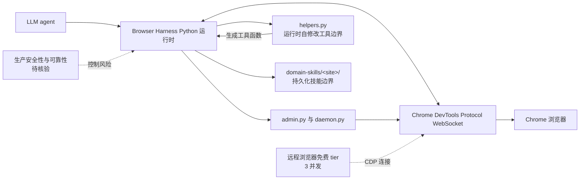

# Browser Harness

## 一句话定位
让 LLM 通过裸 CDP 协议直接控制浏览器的 self-healing harness，agent 运行时自动编写缺失功能。

## 它解决的问题
当前浏览器自动化方案（Playwright、Selenium、Puppeteer）都是人类驱动的框架——定义好 selector 和 action sequence 后执行。LLM 需要的不是预定义流程，而是**自由度**：遇到没见过的 UI 能自己想办法。browser-harness 直接给 agent 一个 WebSocket 到 Chrome，不预设任何 rails。

目标用户：AI agent 开发者、CI/CD 自动化工程师、RPA 架构师。

## 为什么值得关注（2026-04-20）
- browser-use 团队出品（该团队已有 browser-use 主项目 50k+ star）
- 4 天 2000+ star，增速强劲
- 首次提出 "self-healing" 概念：agent 自动编辑 helpers.py 补充缺失函数
- 约 592 行 Python，极简实现
- 免费远程浏览器（3 并发）

## 热度来源判断
60% 真实需求 + 30% browser-use 品牌效应 + 10% 社区对 "agent 自修改代码" 概念的兴奋。Self-healing 是真创新，不是包装。

## 关键技术亮点亮点
1. **裸 CDP 协议**：不用 Playwright/Selenium，直接 WebSocket 连 Chrome DevTools Protocol，agent 获得最大自由度
2. **Self-healing 机制**：`helpers.py` 提供 base tool calls，agent 在运行时发现缺失函数时自动编辑文件添加，下次运行自动可用
3. **Domain Skills 自生成**：agent 完成任务后自动生成 `domain-skills/<site>/` 目录下的持久化技能文件
4. **Daemon 架构**：`admin.py` + `daemon.py` 管理 CDP websocket 和 socket bridge
5. **远程浏览器支持**：免费 tier 3 并发，适合 sub-agent 和部署场景

## 架构师速览

| 决策问题 | 研究判断 | 证据边界 |
|---|---|---|
| 系统边界 | Browser Harness 是 Python 编写的 agent-native 浏览器控制层：LLM 经 CDP WebSocket 控制 Chrome，并由 `admin.py`、`daemon.py`、socket bridge 管理连接；`helpers.py` 与 `domain-skills/<site>/` 属于运行时自修改和知识持久化边界。远程浏览器免费 tier 提供 3 并发。 | 档案明确提到裸 CDP WebSocket、`admin.py`、`daemon.py`、socket bridge、辅助函数和 Domain Skills；未给出完整模块依赖、进程拓扑、认证方式或远程服务实现，需源码核验。 |
| 主路径 | 任务进入 agent 运行时后，通过 CDP WebSocket 直接控制浏览器；遇到缺失功能时由 agent 自动编辑 `helpers.py`，任务完成后生成并持久化 `domain-skills/<site>/` 技能文件，供后续运行复用。 | 主路径依据项目定位及“self-healing”“Domain Skills 自生成”描述；自动编辑的触发条件、错误恢复、并发写入与技能格式均未披露。 |
| 关键权衡 | 相比 Playwright、Selenium、Puppeteer 的预定义 selector 和 action sequence，Browser Harness 以 CDP 直接控制换取更高自由度，但同时承担 agent 修改本地文件、浏览器操作权限、CDP 兼容性及可观测性风险；扩展能力尚不能以生产稳定性或自愈错误率证明。 | 已知自由度、self-healing、远程浏览器 3 并发、Chrome/CDP 限制和安全风险；未见权限模型、审计日志、隔离机制、版本兼容、故障率或性能数据。 |
| 最小 PoC | 在单一 Chrome 浏览器环境中启用最小 agent 能力，验证三件事：缺失工具是否自动写入 `helpers.py`、任务后是否生成 `domain-skills/<site>/`、以及通过 CDP WebSocket 的控制链路是否可重复运行；同步记录文件变更、失败任务和运行时权限。 | PoC 只能覆盖这些明确能力；Chrome 版本、测试网站、LLM 供应商、并发方式、部署方式、安全验收指标和退出机制均为“待核验”，不得预设。 |

## 架构启发
- **从框架到协议**：传统 browser automation 是框架封装 → 预定义 API → 人类编排。browser-harness 走了反方向：给 agent 最原始的能力，让它自己构建工具
- **代码作为记忆**：helpers.py 既是工具库也是 agent 的记忆——agent 写的每个函数都是对未来任务的准备
- **Domain skill 持久化**：把 agent 学到的知识以文件形式沉淀，类似人类的 SOP 文档

## 架构图（MMD）

> 证据边界：此图只采用本档案已有可核验描述；“待核验”节点不应视为项目实现事实。

## 定位判断
在 Browser Use 生态中的位置：browser-use 是框架层，browser-harness 是 agent-native 的薄层。两者互补而非替代。

## 风险 / 局限 / 泡沫点
1. **Self-healing 可靠性**：agent 自动编辑代码在生产环境中的稳定性未经验证
2. **安全风险**：agent 直接操作浏览器 + 编辑本地文件，攻击面较大
3. **CDP 兼容性**：依赖 Chrome DevTools Protocol，浏览器兼容性受限

## 与同类项目的关系
- **browser-use**（同一团队）：框架层，更成熟但自由度更低
- **Playwright**（Microsoft）：传统 browser automation，适合人类编排的测试
- **LaVague**：另一个 AI browser agent，但更偏框架封装

## 是否值得持续跟踪
**是**。Self-healing 机制如果稳定运行，将改变浏览器自动化的基本范式。

## 后续观察点
1. Self-healing 机制在生产场景中的实际表现和错误率
2. Domain skill 生态是否能形成社区贡献飞轮
3. 与 browser-use 主项目的长期关系（合并？并存？）

---
*首次记录：2026-04-20*

*最近更新：2026-05-13 — stars 实测 12,304，25 天从 0 到 12.3K 爆发增长，自愈浏览器 Harness 定位确认，Agent 工具链核心拼图*

## 最近动态 (2026-05-15)

- **2026-05-15:** 网络受限日，趋势延续分析。基于 05-14 实测数据推算，持续跟踪中。
- Stars 数据为推算值，网络恢复后验证。

---
