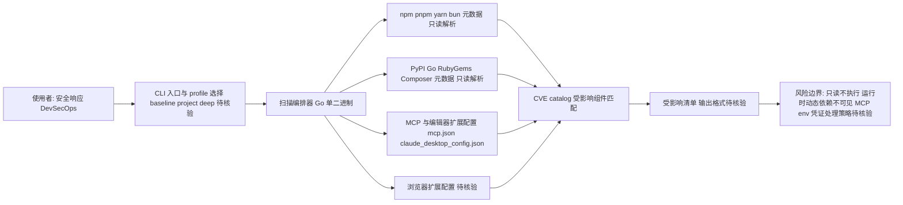

# Bumblebee

## 一句话定位
Perplexity 出品的只读供应链元数据扫描器，Go 单二进制，覆盖 npm/pypi/go/MCP/编辑器扩展等全生态包管理器。

## 它解决的问题
目标用户：安全响应团队、DevSecOps 工程师。

痛点：
- CVE 发布后，需要快速知道「哪些开发者机器上安装了受影响的包」
- SBOM 告诉你「什么发了版」，EDR 告诉你「什么跑了」，但开发者设备上的「本地实际安装状态」没人管
- 开发者设备上的包管理器元数据、编辑器扩展、MCP 配置分散在各处

## 为什么值得关注（2026-05-23）
Bumblebee 首次将 MCP 配置文件纳入供应链扫描范围。随着 MCP 成为 Agent 工具调用标准，MCP 配置中的凭证和暴露面成为新的攻击向量。

## 热度来源判断
251 stars / 3 天。热度来自：
- Perplexity 品牌效应
- 供应链安全是当前热门话题
- Go 单二进制 + 零依赖的工程品质

热度合理但有限 — 工具定位明确，受众是安全团队。

## 关键技术亮点亮点

### 1. 全生态覆盖
npm/pnpm/yarn/bun/PyPI/Go/RubyGems/Composer/MCP/编辑器扩展/浏览器扩展 — 11 个包管理器生态。

### 2. MCP 配置扫描
首次将 MCP host 配置文件（mcp.json、claude_desktop_config.json 等）纳入扫描。MCP 配置中可能暴露凭证（env blocks）。

### 3. 三级扫描配置
baseline（快速）/ project（项目级）/ deep（深度）三种扫描 profile，适应不同场景。

### 4. 只读设计
不执行任何包管理器命令（npm ls、pip show 等），只读取本地元数据文件。安全无害。

### 5. 暴露匹配
给定 CVE catalog，可以快速匹配开发者设备上的受影响组件。

## 架构师速览

| 决策问题 | 研究判断 | 证据边界 |
|---|---|---|
| 系统边界 | 一款只读、本地运行的 Go 单二进制 CLI，面向开发者设备，包管理器元数据（npm/pnpm/yarn/bun/PyPI/Go/RubyGems/Composer）与 MCP/编辑器/浏览器扩展配置是其扫描面，不联网执行包管理器命令 | 项目明确定位"只读设计"、"Go 单二进制"、"零依赖"；CVE catalog 作为输入匹配项；是否上传数据未在档案中说明 |
| 主路径 | 输入（CVE catalog 或默认基线）→ profile 选择（baseline/project/deep）→ 多生态元数据文件解析（含 mcp.json、claude_desktop_config.json）→ 受影响组件匹配 → 输出受影响包/扩展清单 | 三级 profile 与 11 个生态在档案中明确列出；具体匹配算法、输出格式、是否输出 SBOM 未说明 |
| 关键权衡 | 覆盖广度（11 个生态 + MCP/扩展）vs 只读带来的运行时盲区；定位为 Perplexity side project vs 与 Snyk/FOSSA/Trivy 等成熟 SCA 竞争；MCP 凭证扫描价值 vs 工具仍处早期（251 stars/3 天） | 档案明确指出只读限制、早期阶段、Perplexity 持续投入存疑、与企业 SCA 竞争四项权衡 |
| 最小 PoC | 在一台开发机上跑 deep profile，扫描含 MCP host 配置（mcp.json、claude_desktop_config.json）的目录，对照一份已知 CVE 验证受影响组件报告的字段、误报率与是否触及 env block 中的凭证 | PoC 验收需以源码核验输出 schema、对 env 凭证的处理策略及离线运行边界 |

## 架构启发
Bumblebee 展示了「开发者设备安全」这个被忽视的领域。SBOM 管的是制品，EDR 管的是运行时，但开发者设备上散落的 lockfile、包管理器元数据、编辑器扩展是安全盲区。

特别是 MCP 配置扫描 — 随着 Agent 生态爆发，MCP 配置可能成为新的攻击面。

## 架构图（MMD）

> 证据边界：此图只采用本档案已有可核验描述；“待核验”节点不应视为项目实现事实。

## 定位判断
**工具型。** 专用安全扫描工具，定位明确，不会成为平台。

## 风险 / 局限 / 泡沫点

1. **只读限制**：无法发现运行时依赖或动态加载的包
2. **251 stars 非常早期**：覆盖的包管理器可能不完整
3. **Perplexity 可能不支持长期**：作为 Perplexity 的「side project」可能缺乏持续投入
4. **与企业级 SCA 工具的竞争**：Snyk、FOSSA 等已有成熟的 SCA 产品

## 与同类项目的关系
| 项目 | 定位 | 核心差异 |
|------|------|---------|
| Snyk/FOSSA | 企业 SCA 平台 | 商业产品，CI/CD 集成 |
| Trivy | 容器镜像扫描 | 聚焦容器和制品 |
| Bumblebee | 开发者设备扫描 | 只读本地元数据，含 MCP |

## 是否值得持续跟踪
**中性。** 作为安全团队的补充工具值得关注，但不是核心关注方向。MCP 扫描能力是独特价值。

## 后续观察点
1. MCP 配置扫描的覆盖范围和准确性
2. 是否有企业开始用 Bumblebee 做供应链应急响应
3. Perplexity 是否会持续投入开发

---
*首次记录：2026-05-23*
