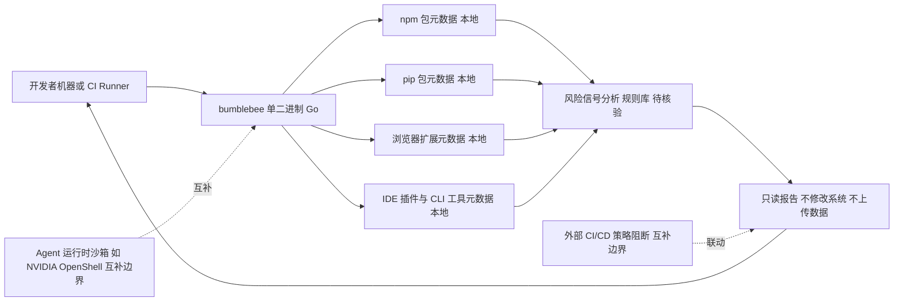

# Perplexity bumblebee

## 一句话定位
只读开发者端点扫描器——检测本地包、扩展、开发工具元数据暴露的软件供应链安全风险。

## 它解决的问题
AI Agent（如 Claude Code、Codex、Copilot）在开发者机器上执行代码，会自动安装 npm 包、pip 包、浏览器扩展。这些依赖链构成了新的攻击面。开发者无法知道哪些工具和扩展被 AI Agent 安装和使用，存在被供应链攻击的风险。

## 为什么值得关注（2026-06-05）
Perplexity 出品，Apache 2.0 协议，Go 实现。这是第一个面向「AI 编码时代」的供应链安全扫描器。4.3K stars 说明安全社区对 AI Agent 带来的新攻击面有高度认知。

## 热度来源判断
- Perplexity 品牌背书
- 供应链安全是 2026 年高热赛道（结合 AI Agent 自动安装依赖的场景）
- Go 语言实现降低了部署门槛
- 10 issues + 16 PRs = 早期但活跃

## 关键技术亮点亮点
1. **只读扫描**：不修改系统，不收集数据，安全可重复运行
2. **多目标检测**：npm/pip/extension/IDE 插件/CLI 工具全链路扫描
3. **元数据分析**：不只是检测包是否存在，分析包的元数据是否有风险信号
4. **Go 实现**：单二进制部署，无运行时依赖，CI/CD 集成友好

## 架构师速览

| 决策问题 | 研究判断 | 证据边界 |
|---|---|---|
| 系统边界 | 定位为本地开发者机器上运行的只读扫描器，扫描对象是 npm/pip 包、浏览器扩展、IDE 插件、CLI 工具等元数据暴露面，非网络服务、非运行时沙箱 | "只读开发者端点扫描器——检测本地包、扩展、开发工具元数据暴露的软件供应链安全风险"；覆盖范围、不含运行时检测、不含阻断能力均见原文 |
| 主路径 | 单二进制本地扫描 → 元数据采集与风险信号分析 → 只读报告输出；不修改系统、不上传数据 | "不修改系统，不收集数据，安全可重复运行"；Go 单二进制部署；但具体数据源格式与规则引擎细节未在档案中说明 |
| 关键权衡 | 只读安全 vs 无阻断能力；广覆盖（多包管理器/扩展/IDE）vs 规则深度；Apache 2.0 与早期阶段（4.3K stars、10 issues、16 PRs）之间的成熟度落差 | "只读设计是正确选择"+"只读扫描 = 只告警不阻断，需要与 CI/CD 策略结合"；"早期阶段：检测规则库需要持续扩充" |
| 最小 PoC | 在单台开发者机器或 CI runner 上以单二进制方式运行扫描，对 npm/pip/扩展三类目标分别验证检测项与误报率，并验证"不修改系统/不上传数据"的承诺 | 档案明确 Go 单二进制、无运行时依赖、CI/CD 集成友好；具体检测规则条目、CLI 参数、退出码语义档案未提供 |

## 架构启发
- AI Agent = 新的供应链入口。每次 Agent 安装一个 npm 包，就扩大了攻击面
- 只读设计是正确选择：安全工具不应该引入新的安全风险
- 启发：未来需要「Agent 运行时安全基线」——定义 Agent 可以安装什么、执行什么

## 架构图（MMD）

> 证据边界：此图只采用本档案已有可核验描述；“待核验”节点不应视为项目实现事实。

## 定位判断
**工具型。** 解决特定场景的安全工具，定位清晰。Perplexity 出品增加可信度，但不是平台级产品。

## 风险 / 局限 / 泡沫点
1. **覆盖范围有限**：只检测本地暴露面，不检测运行时行为
2. **无阻断能力**：只读扫描 = 只告警不阻断，需要与 CI/CD 策略结合
3. **早期阶段**：检测规则库需要持续扩充
4. **Perplexity 主营业务是搜索**：安全工具可能不是战略重点

## 与同类项目的关系
- **Snyk / Dependabot**：传统依赖安全扫描，bumblebee 更聚焦 AI Agent 场景
- **Socket.dev**：npm 供应链安全，bumblebee 范围更广（多语言、多工具）
- **NVIDIA OpenShell**：Agent 运行时沙箱（隔离），bumblebee 是检测层，两者互补

## 是否值得持续跟踪
**建议跟踪。** AI Agent 供应链安全是确定性增长赛道，bumblebee 是早期标杆项目。

## 后续观察点
1. 是否集成到主流 CI/CD（GitHub Actions / GitLab CI）
2. 检测规则的增长速度和覆盖面
3. Perplexity 是否将其集成到搜索产品中
4. 出现竞品（如 Snyk 推出 AI Agent 版本）

---
*首次记录：2026-06-05*
