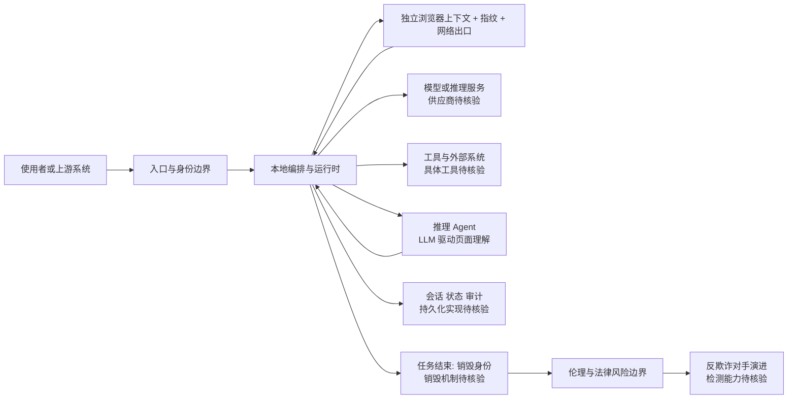

# Burner Agents

## 一句话定位
一次性身份 Agent swarm——每次 web 交互使用独立浏览器上下文和指纹，任务完成后销毁一切，实现不可归因、不可关联的 web 操作。

## 它解决的问题
现代 web 通过指纹、cookie、行为关联来识别和追踪用户。VPN 隐藏 IP，隐私模式清除本地状态，但都无法解决"你以同一个身份出现"这个根本问题。

## 为什么值得关注（2026-06-19）
- 概念创新：不是"更好地隐藏身份"，而是"不维护身份"
- 架构清晰：isolation / reasoning / orchestration / identity 四层
- Agent swarm 模式在隐私场景的首次系统化实现

## 热度来源判断
隐私议题热度 + Agent swarm 概念热度。但使用场景和用户群体不够明确。

## 关键技术亮点亮点
1. **Fresh identity per task** — 每个任务独立的浏览器上下文 + 指纹 + 设备特征 + 网络出口
2. **Orchestration in trust boundary** — 协调逻辑只在本地，对外不可见
3. **Reasoning agent** — 不是脚本，是 LLM 驱动的动态页面理解
4. **Complete erasure** — 任务完成 = 身份销毁，零残留

## 架构师速览

| 决策问题 | 研究判断 | 证据边界 |
|---|---|---|
| 系统边界 | 项目位于入口渠道、模型供应商、工具/数据源之间的编排层，自身不替代这三者 | 档案明示定位为"观察型"，未给出具体入口渠道或模型/工具清单，组件实例如浏览器指纹实现方式待核验 |
| 主路径 | 每个任务独立浏览器上下文与指纹 → 本地编排与推理 → 调用外部模型与工具 → 任务结束即销毁身份 | 档案描述了"fresh identity per task"与"orchestration in trust boundary"概念，底层协议、推理后端、销毁机制的具体实现待核验 |
| 关键权衡 | "不维护身份"的不可关联性 vs 资源开销、伦理/法律风险、反欺诈对手的检测能力 | 档案明确列出"资源密集""伦理风险""法律灰区""对手进化"四项局限，未给出量化对比或性能数据 |
| 最小 PoC | 单任务、单浏览器上下文、本地编排 + 最小模型与工具调用、可审计日志；优先验证销毁彻底性与不可关联假设 | 档案未提供部署形态、性能基线或验收标准，"完整销毁"的判定方法与审计日志结构待核验 |

## 架构启发
Burner Agents 定义了 **Disposability as Privacy** 范式——隐私不是隐藏，而是不可关联。这与零知识证明的哲学异曲同工。

## 架构图（MMD）

> 证据边界：此图只采用本档案已有可核验描述；“待核验”节点不应视为项目实现事实。

## 定位判断
观察型。概念前沿但伦理边界模糊，使用场景（记者、研究人员、隐私需求用户）有限。不适合企业部署。

## 风险 / 局限 / 泡沫点
1. **伦理风险** — 不可归因 web 交互可被滥用于攻击、欺诈
2. **法律灰区** — 不同司法管辖区对匿名访问的法律态度不同
3. **资源密集** — 每个 agent 需要独立浏览器 + 网络
4. **对手进化** — 反欺诈系统也在进化

## 与同类项目的关系
- **vs VPN + 隐私浏览器** — VPN/隐私浏览器隐藏身份，burner 不维护身份
- **vs browser-use** — browser-use 是通用 web 自动化，burner 是隐私优先的 web 自动化
- **vs Tor** — Tor 做网络层匿名，burner 做应用层不可关联

## 是否值得持续跟踪
**观察型跟踪。** 概念值得关注，但伦理和法律风险使其不适合推荐为生产工具。

## 后续观察点
1. 是否出现合规使用场景（记者保护、学术研究）
2. 社区是否增加治理机制（使用许可等）
3. 反欺诈行业对 disposable agent 的检测能力

---
*首次记录：2026-06-19*
