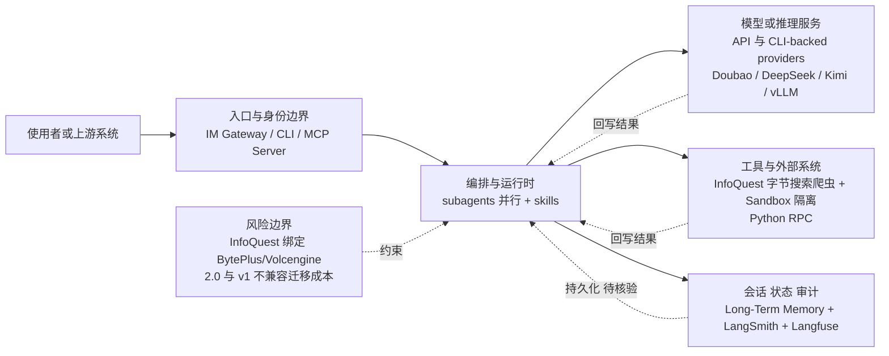

# bytedance/deer-flow

## 一句话定位
字节跳动开源的长周期 SuperAgent harness——编排 subagents、memory、sandbox 和 skills，处理分钟到小时级复杂任务。

## 它解决的问题
当前 Agent 框架大多处理"单轮对话 + 几次工具调用"的短任务。现实中的研究、编码、内容创作往往需要持续数十分钟到数小时，涉及多步骤探索、试错、记忆和子任务分解。缺乏一个能编排这一切的"SuperAgent harness"。

## 为什么值得关注（2026-06-24）
DeerFlow 2.0 曾在 2026 年 2 月 28 日登上 GitHub Trending #1。今天重新上 Daily Trending 说明它不是一日游。2.0 是完全重写（与 v1 无共享代码），从 Deep Research 框架升级为通用 SuperAgent harness——这是字节跳动在 Agent 基础设施层面的重要布局。

## 热度来源判断
- **字节跳动品牌**：大厂开源，有工程能力背书
- **2.0 完全重写**：说明项目在认真迭代，不是 demo 驱动
- **长周期任务需求真实**：深度研究、代码生成、报告撰写都需要长时间编排
- **多模型支持**：Doubao-Seed-2.0-Code、DeepSeek v3.2、Kimi 2.5、vLLM 部署
- **InfoQuest 集成**：字节自研搜索爬虫工具集，增强研究能力

## 关键技术亮点亮点
1. **长周期任务编排**：分钟到小时级，通过 subagents + sandbox + memory + skills 组合处理
2. **Subagents 并行**：生成隔离子代理做并行工作流，Python RPC 调用工具
3. **Sandbox 隔离**：安全执行环境，Agent 代码在沙箱中运行
4. **Long-Term Memory**：跨会话记忆持久化
5. **CLI-backed Providers**：支持 Codex CLI、Claude Code OAuth 作为模型 provider——不只 API，还可以 CLI
6. **vLLM 集成**：Qwen3-32B 等模型的本地部署，reasoning parser 支持
7. **InfoQuest**：字节跳动自研搜索爬虫工具集（支持免费在线体验）
8. **LangSmith + Langfuse 双 Tracing**：生产级可观测性
9. **IM 渠道集成**：Message Gateway 支持 IM 消息推送
10. **MCP Server**：可作为 MCP Server 被外部 Agent 调用

## 架构师速览

| 决策问题 | 研究判断 | 证据边界 |
|---|---|---|
| 系统边界 | DeerFlow 作为 SuperAgent harness，处于入口渠道（IM、CLI、MCP）、模型供应商（API 与 CLI-backed，含 Doubao/DeepSeek/Kimi/vLLM）与工具/数据源（InfoQuest、沙箱、Skills）之间的编排层 | 基于项目分类、标签与档案描述的"subagents + sandbox + memory + skills"做出的抽象；具体模块边界、RPC 协议、持久化格式未在档案中确认 |
| 主路径 | 用户/上游系统 → 入口与身份 → 编排与运行时（含 subagents、skills） → 并行调用模型/推理与工具/沙箱（含 InfoQuest） → 会话/状态/审计（LangSmith、Langfuse）回写 | 档案明列的组件与"生成隔离子代理做并行工作流"；图中的会话/状态节点覆盖 Long-Term Memory 与双 Tracing，确切存储后端未披露 |
| 关键权衡 | 扩展能力（CLI-backed provider、MCP Server、IM 渠道） vs. 权限隔离（沙箱、最小工具权限）、可观测性（LangSmith + Langfuse）、供应商耦合（InfoQuest 绑定 BytePlus/Volcengine） | 权衡来自档案"关键技术亮点"与"风险/局限"；不引用未列出的性能或安全数据 |
| 最小 PoC | 单一入口渠道 + 单一模型 provider（推荐先 vLLM 部署 Qwen3-32B 以规避云绑定）+ 最小工具权限沙箱 + 启用 LangSmith/Langfuse 审计后再扩大接入面 | PoC 步骤仅由档案"架构师速览·采用建议"推导；分钟级 vs 小时级任务成功率、reasoning parser 细节均待核验 |

## 架构启发
DeerFlow 2.0 的核心设计是**"SuperAgent + 可扩展能力栈"**——不是单体 Agent，而是一个 harness（编排层），通过组合 sandbox、memory、skills、subagents 来处理复杂任务。

CLI-backed provider 模式特别有启发性：大多数 Agent 框架只支持 API 调用 LLM，DeerFlow 允许通过 CLI（Codex CLI、Claude Code OAuth）使用模型——这意味着你可以在自己的 Agent 中嵌套使用其他 Agent 框架的能力。

## 架构图（MMD）

> 证据边界：此图只采用本档案已有可核验描述；“待核验”节点不应视为项目实现事实。

## 定位判断
**平台候选。** 字节跳动在 Agent 基础设施层的关键布局。如果 DeerFlow 成为长周期任务编排的标准 harness，它将成为 Agent 时代的"Kubernetes"——编排层标准。

## 风险 / 局限 / 泡沫点
1. **字节生态绑定**：InfoQuest 绑定 BytePlus/Volcengine，推荐模型包含 Doubao
2. **2.0 完全重写的迁移成本**：v1 用户无法平滑升级
3. **复杂度门槛**：SuperAgent harness 的概念对大多数开发者来说还太抽象
4. **与 hermes-agent 等 Self-Improving Agent 的路线竞争**：DeerFlow 偏编排，hermes 偏自进化
5. **维护可持续性**：字节跳动开源项目的长期维护承诺不确定

## 与同类项目的关系
- **NousResearch/hermes-agent**：hermes 偏自进化（creates skills from experience），DeerFlow 偏编排（subagents + sandbox + memory）
- **OpenClaw**：OpenClaw 是通用 Agent 框架 + Channel 集成，DeerFlow 更偏深度研究/长周期任务
- **LangGraph**：LangGraph 是 Agent 编排库，DeerFlow 是完整 harness（包含 UI、IM、部署）
- **AutoGPT**：早期通用 Agent，DeerFlow 是其成熟演化版本

## 是否值得持续跟踪
**是。** 字节跳动在 Agent 基础设施层的布局值得密切关注。特别是 CLI-backed provider 模式和长周期任务编排能力。

## 后续观察点
1. 字节是否开放 InfoQuest 的独立使用（不绑定 BytePlus）
2. 社区贡献的 skills 和 subagent 模板生态
3. 长周期任务的实际成功率（分钟级 vs 小时级）
4. 与 hermes-agent 是否会出现概念合并（自进化 + 编排）

---
*首次记录：2026-06-24*
