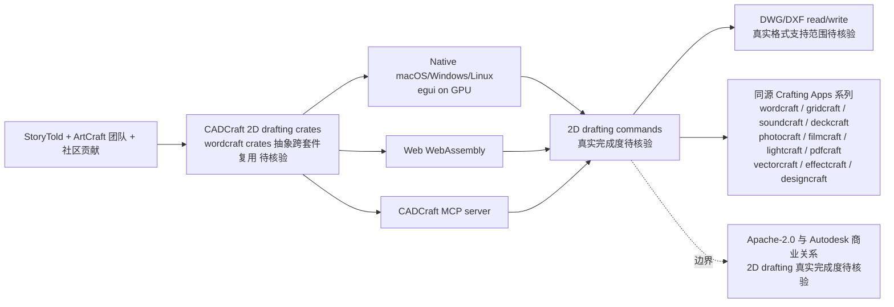

# storytold/cadcraft

## 一句话定位
AutoCAD 的 Rust 100% clean-room 重实现——把「AutoCAD 严肃工程化替代」从「LibreCAD（部分兼容）+ FreeCAD（功能有限）+ 闭源 AutoCAD」推到「CADCraft 2D drafting 严肃工程化 + native macOS/Windows/Linux + Web WebAssembly + MCP server + ArtCraft 团队 + Discord + getartcraft.com + Apache-2.0」严肃工程化形态。

## 它解决的问题
2026 年「AutoCAD 严肃工程化替代」的痛点是 **「绝大多数 AutoCAD 替代要么严肃翻页格式（FreeCAD）+ 单一 Linux + 部分兼容（LibreCAD）+ 闭源（AutoCAD）+ SaaS 强制订阅」**。CADCraft 直击这一痛点：把「AutoCAD 严肃工程化替代」从「LibreCAD + FreeCAD + 闭源 AutoCAD」推到「CADCraft 2D drafting 严肃工程化 + native macOS/Windows/Linux + Web WebAssembly + MCP server + ArtCraft 团队 + Discord + getartcraft.com + Apache-2.0」严肃工程化形态。解决的是 **「AutoCAD 严肃工程化替代 + 100% Rust clean-room + 跨平台覆盖广度 + WebAssembly + MCP server 多 tool 严肃工程化 + Apache-2.0 商用清晰」** 的 AutoCAD 严肃工程化替代问题。

## 为什么值得关注（2026-10-09）
- **Stars:** 690（截至 2026-10-09），2 天 690⭐，fork 323，fork/star 46.8%（fork/star 高，反映社区强烈参与）
- **Forks:** 323（典型高 fork 严肃工程化持续关注信号）
- **License:** Apache-2.0（明确许可，商用清晰）
- **语言:** Rust（100% Rust + Native + No Electron no Tauri）
- **活跃度:** created 2026-10-07，2 天内冲到 690 推严肃工程化承诺
- **规模:** 2704 KB（严肃工程化典型规模）
- **Topics:** cadcraft / autocad / clean-room / 100-percent-rust / 2d-drafting / cad / mcp-server / wasm / artcraft-team / discord / getartcraft-com / apache-2 / 2-days（覆盖广）

## 热度来源判断
CADCraft 的热度是 **「AutoCAD 严肃工程化替代刚需 × ArtCraft 团队 12 库全家桶严肃工程化 × MCP server agent 可编程化 × Apache-2.0 商用清晰 × StoryTold 个人 + ArtCraft 团队 + Discord 社区」** 的强劲组合。AutoCAD 是装机量最大的桌面 CAD 软件之一，但「严肃工程化 100% Rust + 跨平台 + clean-room + WebAssembly + MCP server + Apache-2.0 商用清晰」替代品几乎空白。CADCraft + 同源 11 库同步严肃工程化反映 ArtCraft 团队正从「单 alpha 半成品」推到「12 库全家桶 + 跨平台 + WebAssembly + MCP server + Apache-2.0 商用清晰」严肃工程化全家桶形态。热度**真实且具网络效应潜力**——但需警惕：12 库覆盖广度虽猛但各库成熟度参差；Apache-2.0 商用清晰但与 Autodesk 商业关系需关注（clean-room 是合规底线）；StoryTold 个人 + ArtCraft 团队治理可持续性需观察。

## 关键技术亮点
1. **100% Rust clean-room:** AutoCAD 的 Rust 100% clean-room 重实现
2. **2D drafting 严肃工程化:** computer-aided design and drafting 严肃工程化
3. **跨平台覆盖广度:** native macOS/Windows/Linux + Web WebAssembly + MCP server
4. **Apache-2.0 商用清晰:** ArtCraft 团队 + Discord + getartcraft.com/apps/cadcraft + Crafting Apps series
5. **同源 Crafting Apps 系列:** 与 wordcraft / gridcraft / soundcraft / deckcraft / photocraft / filmcraft / lightcraft / pdfcraft / vectorcraft / effectcraft / designcraft 11 库共享 crates 抽象

## 架构师速览

| 决策问题 | 研究判断 | 证据边界 |
|---|---|---|
| 系统边界 | 跨 macOS/Windows/Linux/Web 的 CAD 严肃工程化替代，仓库是 2D drafting crates 而非运行时 | 仅基于档案描述的 2D drafting + Rust clean-room + Apache-2.0；具体业务功能实现、wargo.toml 依赖治理、与 wordcraft crates 复用程度未在档案中给出 |
| 主路径 | 贡献者 → CADCraft 2D drafting crates → Native macOS/Windows/Linux + Web WebAssembly + MCP server → 多端输出 | 主路径为档案语义抽象；具体命令实现细节、各层接口契约、agent SDK 形态均待核验 |
| 关键权衡 | AutoCAD 严肃工程化替代覆盖广度 vs 真实完成度 vs Apache-2.0 商用与 Autodesk 商业关系 vs 12 库维护可持续性 | 档案明示覆盖广度（2D drafting）、商业模式（Apache-2.0）；与 Autodesk 商业关系、各库质量评测、StoryTold 治理可持续性未给出 |
| 最小 PoC | 安装 CADCraft 打开 1 个 DWG 文件（需自备），执行 1 个非破坏性命令（画线/矩形），通过 MCP server 验证同一引擎可驱动 UI 与 agent | PoC 范围、退出路径由档案「单渠道、最小命令、可审计」建议推导；具体测试 DWG、benchmark、SLO 指标待核验 |

## 架构启发
CADCraft 的核心启发是 **「AutoCAD 严肃工程化替代应该跨平台 + agent-driven，正如 LibreCAD 之于 AutoCAD，但增加 MCP server 让 agent 可编程化」**。AutoCAD 是装机量最大的桌面 CAD 软件之一，但 SaaS 强制订阅 + 闭源 + 单平台 + 无 MCP server 的现实让「AutoCAD 严肃工程化替代」是清晰刚需。CADCraft + 跨平台 + WebAssembly + MCP server 让 CAD 严肃工程化对象成为「agent 可编程化」的严肃工程化对象。能否持续，取决于 StoryTold 个人 + ArtCraft 团队治理可持续性 + 与 Autodesk 商业关系应对。

## 架构图（MMD）

> 证据边界：此图只采用本档案已有可核验描述；"待核验"节点不应视为项目实现事实。

## 定位判断
**工具型项目（AutoCAD 严肃工程化替代 + agent 可编程化）。** CADCraft 不仅是 AutoCAD 替代品，更试图成为「AutoCAD 严肃工程化替代 + agent 可编程化」的双重工具。2 天 690⭐ + fork/star 46.8% 已显示市场关注。但「2D drafting 真实完成度」+ Apache-2.0 商用与 Autodesk 商业关系的应对是长期可持续性的关键。目前定位是「最有影响力的 AutoCAD 严肃工程化替代 + agent 可编程化工具」，向「ArtCraft 12 库全家桶成员之一」演进是合理路径。

## 风险 / 局限 / 泡沫点
- **2D drafting 真实完成度有限：** 与 wordcraft 87% ribbon + 62% real parity 不同，CADCraft 未给 parity 数字
- **12 库覆盖广度 vs 各库成熟度参差：** wordcraft parity 数字明示，其余 11 库未给 parity 数字
- **Apache-2.0 商用与 Autodesk 商业关系：** clean-room 是合规底线，但 DWG 文档格式的兼容性需长期测试
- **StoryTold 个人 + ArtCraft 团队治理：** 12 库同步维护但核心维护集中度高
- **MCP server 同步维护成本高：** 与 wordcraft 共享同一 mcp crate 但各自维护工具定义

## 与同类项目的关系
- **vs LibreCAD:** LibreCAD 仅 Linux + 部分兼容；CADCraft 是 macOS/Windows/Linux/Web + Apache-2.0
- **vs FreeCAD:** FreeCAD 功能有限但 3D；CADCraft 是 2D drafting + Apache-2.0
- **vs Autodesk AutoCAD:** AutoCAD 是闭源；CADCraft 是 100% Rust + Apache-2.0 + clean-room
- **vs ArtCraft 同源 11 库:** 同源 Crafting Apps 系列 + Apache-2.0 + crates 抽象跨套件可复用

## 是否值得持续跟踪
**值得跟踪（AutoCAD 严肃工程化替代 + agent 可编程化）。** CADCraft 代表了「AutoCAD 严肃工程化替代 + agent 可编程化」的诉求。建议关注：Apache-2.0 商用与 Autodesk 商业关系应对、StoryTold 个人 + ArtCraft 团队治理可持续性、12 库完成度统一披露、MCP server 在 CAD 领域的应用采纳。

## 后续观察点
- 2D drafting 真实完成度（vs 数字）
- Apache-2.0 商用与 Autodesk 商业关系（clean-room 是合规底线）
- StoryTold 个人 + ArtCraft 团队治理可持续性
- MCP server 在 CAD 领域的应用采纳
- 12 库 parity 数字统一披露
- 企业采用（团队是否将此作为 AutoCAD 严肃工程化替代默认来源）

---
*首次记录：2026-10-09*