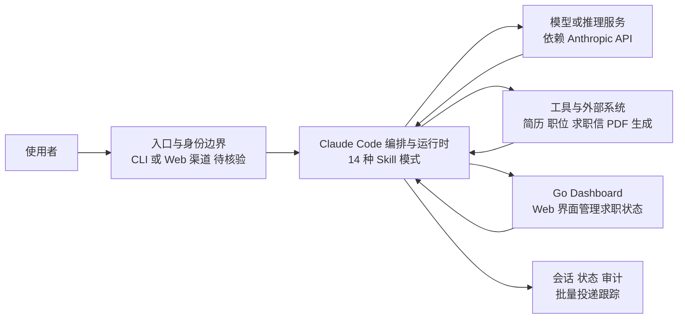

# Career-Ops

## 一句话定位
基于 Claude Code 的 AI 驱动求职系统，14 种 Skill 模式覆盖简历优化到面试准备的完整流程。

## 它解决的问题
求职流程中的重复性工作 — 简历定制、职位匹配、求职信生成、面试准备。将这些任务自动化，让求职者更高效地批量处理。

## 为什么值得关注（2026-06-10）
日增 1,114 stars，总 star 数 51.5K。代表了 AI Agent 进入"个人效率"场景的趋势。但也因为增速异常高、fork/issue 比例不健康，泡沫风险值得关注。

## 热度来源判断
混合驱动。真实需求（求职是普遍痛点）+ AI Agent 炒作热度 + 社交媒体传播。51.5K stars 对于一个垂直场景的 Claude Code Skill 封装来说增速过快，可能包含大量被动关注。

## 关键技术亮点亮点
1. **14 种 Skill 模式**：从简历优化到面试准备的全流程覆盖
2. **Go Dashboard**：提供 Web 界面管理求职状态
3. **PDF 生成**：自动生成格式化的求职文档
4. **批量处理**：支持批量投递和跟踪

## 架构师速览

| 决策问题 | 研究判断 | 证据边界 |
|---|---|---|
| 系统边界 | 围绕 Claude Code 编排层的求职 Skill 封装，外接 Go 实现的 Web Dashboard，核心由模型与一组垂直工具/数据源协同 | 档案仅确认入口、模型供应商耦合点、14 种 Skill 模式与 Go Dashboard；具体供应商协议、工具清单、Skill 注册机制未在档案中证实 |
| 主路径 | 用户从入口渠道发起求职任务 → Claude Code 编排 → 调用模型与 Skill/工具 → 生成 PDF/求职信等产物并回写会话与状态 | 路径上的批量投递跟踪、PDF 生成、状态写入由档案明确列出；底层协议、存储介质与并发模型为推断，待核验 |
| 关键权衡 | 扩展速度（14 Skill 一体化）与对 Anthropic API 的强耦合、可观测性/权限边界之间的取舍；Go Dashboard 是为补齐 Claude Code 缺失的可视化管理能力 | 权衡基于档案定位判断与“依赖 Claude Code”“竞争壁垒低”两条风险项；未给出 Dashboard 与 Claude Code 的通信协议、鉴权方式 |
| 最小 PoC | 在单一入口（CLI 或 Web 一处）、仅启用 1–2 个 Skill（如简历优化 + 匹配），关闭批量外发，开启审计日志下验证产物质量、成本与退出路径 | PoC 范围由档案“采用建议”直接推得；具体 Skill 内部细节、PDF 模板、批量投递接口均待核验 |

## 架构启发
无显著架构创新。本质是 Claude Code Skill 的垂直场景封装 + Go 编写的管理 Dashboard。

## 架构图（MMD）

> 证据边界：此图只采用本档案已有可核验描述；“待核验”节点不应视为项目实现事实。

## 定位判断
工具型 / 短期热点。解决了真实的短周期需求，但缺乏长期留存机制和技术壁垒。

## 风险 / 局限 / 泡沫点
1. **Star 增速异常**：51.5K 对于垂直工具增速过快，可能存在社交媒体驱动的被动关注
2. **短周期需求**：求职完成后用户即流失
3. **依赖 Claude Code**：核心能力完全依赖 Anthropic 的 API
4. **竞争壁垒低**：同类工具可快速复制

## 与同类项目的关系
- **AiToEarn**：另一个"AI 赚钱"概念项目，类似的问题
- **pm-skills**：另一个 Claude Code Skill 封装，但面向 PM 场景

## 是否值得持续跟踪
不建议。短期热点，缺乏持续演进的技术基础。

## 后续观察点
1. 30 天后 star 数是否维持或回落
2. 是否有持续的 commit 活跃度
3. 是否演进为更通用的 AI 求职平台

---
*首次记录：2026-06-10*
