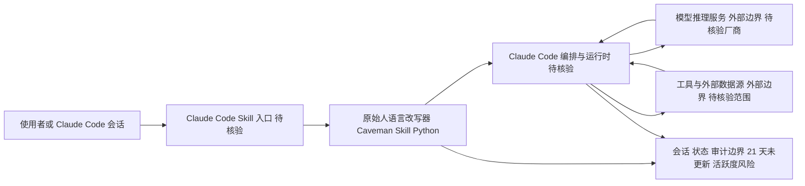

# Caveman

## 一句话定位
Claude Code Skill，用"原始人语言"（简化表述）砍掉 65% token 消耗，本质是 prompt 压缩策略。

## 它解决的问题
Agent（尤其 Claude Code）运行时 token 消耗巨大，成本高昂。Caveman 通过简化指令表述来降低 token 用量。

## 为什么值得关注（2026-04-27）
47.1K stars，暴露了 Agent 生态的真实痛点——token 成本。虽然"原始人语言"是 meme，但 prompt 压缩是有工程价值的方向。

## 热度来源判断
50% meme 效应（"原始人"概念有传播力），50% 真实痛点（token 成本是 Agent 用户的核心焦虑）。meme 属性大于技术属性。

## 关键技术亮点亮点
1. Prompt 表述压缩：通过简化语言结构减少 token 数
2. 质量保持：声称在压缩 65% token 的同时保持输出质量
3. Claude Code Skill 格式：即插即用

## 架构师速览

| 决策问题 | 研究判断 | 证据边界 |
|---|---|---|
| 系统边界 | 一个 Claude Code Skill（Python 实现），通过简化指令表述在 prompt 侧压缩 token，位于使用者/Claude Code 与推理调用之间的"指令改写层"；不替代模型供应商、工具调用与外部数据源 | 基于"Claude Code Skill"形态与"prompt 压缩策略"定位，组件边界为研究抽象 |
| 主路径 | 上游指令 → 原始人语言改写器（Caveman Skill） → Claude Code 运行时 → 模型与工具调用 → 响应回写 | 未公开改写器内部实现、是否含缓存/会话状态需源码核验 |
| 关键权衡 | prompt 侧压缩 vs 任务泛化质量：65% 压缩率仅在"声称"层面成立，复杂任务（多文件重构、架构设计）下语义损失与可控性未知；同时与模型侧 prompt caching 存在替代关系 | 压缩率、质量保持结论来自项目自述，未提供基准与任务覆盖 |
| 最小 PoC | 单一渠道 + 最小工具权限 + 可审计日志；选取 1–2 类典型任务对照"压缩前/后"的 token、用时与输出可用性；预留因模型侧压缩/缓存演进而退出的路径 | 项目无部署/协议细节，PoC 设计仅基于"Skill 即插即用"的形态描述 |

## 架构启发
Token 效率不应只在"模型侧"优化，也可以在"指令侧"优化。prompt 压缩是 Agent 工程的新维度。

## 架构图（MMD）

> 证据边界：此图只采用本档案已有可核验描述；“待核验”节点不应视为项目实现事实。

## 定位判断
短期热度型工具，meme 属性强。prompt 压缩的思路有长期价值，但这个项目本身可能不会持续。

## 风险 / 局限 / 泡沫点
1. 21 天未更新（最后 push 2026-04-18），活跃度下降
2. 65% 压缩率的泛化性存疑——可能只在特定任务类型有效
3. 当模型本身支持 prompt caching / 压缩时，这类 Skill 的价值会降低

## 与同类项目的关系
- **Codeburn**：从可观测性角度切入 token 成本，互补关系
- **Anthropic prompt caching**：模型侧压缩，可能替代这类方案

## 是否值得持续跟踪
低优先级跟踪。关注 prompt 压缩方向的演进，而非本项目本身。

## 后续观察点
1. 是否恢复活跃更新
2. 压缩率在复杂任务（多文件重构、架构设计）中的表现
3. 模型侧 prompt 优化是否让这类 Skill 失去意义

---
*首次记录：2026-04-27*
