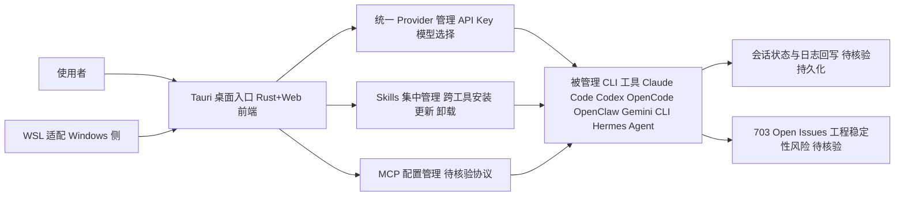

# cc-switch

## 一句话定位
跨平台桌面 All-in-One 助手工具，统一管理 Claude Code、Codex、OpenCode、openclaw 和 Gemini CLI 等 AI 编程工具。

## 它解决的问题
AI 编程工具碎片化：开发者同时使用 Claude Code、Codex、Gemini CLI 等多个工具，需要在它们之间切换上下文、管理不同的 Skill 和 MCP 配置。

## 为什么值得关注（2026-04-15）
- 44,702 stars，Rust 构建，Tauri 桌面应用
- 证明"多 AI 编程工具共存"是真实需求
- 提供 Skills 和 MCP 的统一管理界面

## 热度来源判断
**真实需求 + 技术选型：** 多工具共存是实际痛点，Rust + Tauri 的轻量桌面方案技术口碑好。

## 关键技术亮点亮点
1. **Tauri 架构**：Rust 后端 + Web 前端，安装包小、性能高、跨平台
2. **统一 Provider 管理**：一个界面管理多个 AI 编程工具的 API Key、模型选择
3. **Skills 集中管理**：跨工具的 Skill 安装、更新、卸载
4. **WSL 支持**：Windows Subsystem for Linux 完整支持

## 架构师速览

| 决策问题 | 研究判断 | 证据边界 |
|---|---|---|
| 系统边界 | 桌面端"元工具"层：管理 Claude Code、Codex、OpenCode、OpenClaw、Gemini CLI、Hermes Agent 的 Provider、Skill、MCP 配置，本身不替代这些编程工具 | 依据档案"支持工具列表"与"工具管理器，不是编程工具"判断；具体接入协议与配置文件格式未在档案中给出 |
| 主路径 | 用户 → Tauri(Rust+Web) 桌面入口 → 统一 Provider/Skill/MCP 配置读写 → 触发被管理 CLI 工具执行 → 状态与日志回显 | 路径依据"Tauri 架构"+"统一 Provider 管理"+"Skills 集中管理"组合推导；调用时序与持久化方案待源码核验 |
| 关键权衡 | 多工具并行收益 vs 单一工具厂商内置化风险（IDE/CLI 内置管理功能）；快速扩展工具数 vs 703 Open Issues 反映的稳定性债 | 权衡基于档案"风险/局限"章节与 Open Issues 数；具体崩溃率、SLO 无数据 |
| 最小 PoC | 在 Windows+WSL 环境，单一 Provider（如 Claude Code）+ 最小 Skill 集 + 启用审计日志，验证配置切换与 CLI 触发正确性，再扩展到 Codex/Gemini | 依据"WSL 支持"与"采用建议"中"先在单一渠道、最小工具权限和可审计日志下验证"；性能与多工具并发场景未实测 |

## 架构启发
AI 编程工具正在经历"浏览器大战"式的碎片化阶段。cc-switch 代表了"超级管理器"方向——不做 AI 编程本身，做所有 AI 编程工具的管理层。

## 架构图（MMD）

> 证据边界：此图只采用本档案已有可核验描述；“待核验”节点不应视为项目实现事实。

## 定位判断
工具管理器，不是编程工具。在 AI 编程生态中处于"元工具层"。

## 风险 / 局限 / 泡沫点
1. **依赖生态**：如果 AI 编程工具走向统一（如 OpenAI 收购竞争对手），管理器的价值下降
2. **57K+ stars 高位运行**：相比实际使用场景，stars 可能有热度膨胀，但 3.7K forks 比例健康
3. **功能与 IDE 插件重叠**：VS Code / Cursor 可能内置类似功能
4. **703 Open Issues**：工程稳定性有待提升

## 与同类项目的关系
- **Claude Code / Codex / openclaw**：被管理的对象
- **superpowers**：技能框架，cc-switch 可以管理 superpowers 安装的 Skill

## 是否值得持续跟踪
**是。** 多工具管理是过渡期的刚需，观察是否会成为长期基础设施。

## 后续观察点
1. 是否支持更多工具（如 Cursor、Windsurf）
2. 是否演化出团队级功能（共享配置、Skill 市场）
3. IDE 厂商是否内置类似功能
4. 703 Open Issues 的解决速度和稳定性

### 最近动态（2026-06-09）
- Stars 突破 95K（68K → 95K），一个月增长约 40%
- 新增 Hermes Agent 支持
- 周增 7,886 stars，增速加快
- Agent Desktop 层事实标准地位进一步巩固
- 支持工具列表：Claude Code, Codex, OpenCode, OpenClaw, Gemini CLI, Hermes Agent
- 维持"平台候选"判断

### 2026-05-12
- Stars 预估突破 59K
- 生态锁定效应初显：统一管理 10+ Agent CLI
- Agent 生态五层架构中锁定 Desktop 入口层
- 维持"平台候选"判断

---
*首次记录：2026-04-15*

### 历史动态
- 2026-05-03: Stars 57.8K，分类升级为"平台候选"
- 新增 Universal Provider 重复操作功能
- CI 增强：Pin Claude review checkout to PR head sha
- 主题切换重构
- Proxy 修复：Include zero usage in final message delta

---
