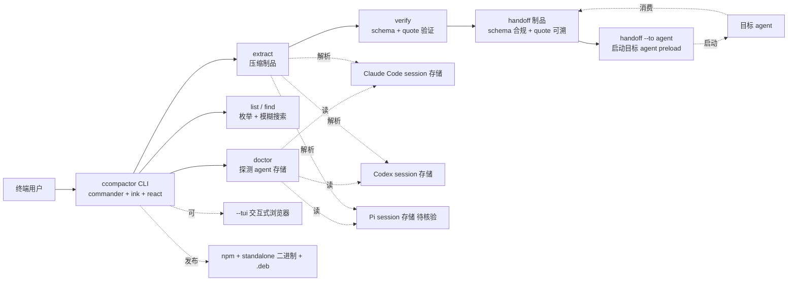

# ccompactor/ccompactor

## 一句话定位
ccompactor——Coding Agent Session Handoff CLI；把任意 coding agent session（Claude Code / Codex / Pi）提取为压缩 + 验证 + 跨 Agent 可继续的 handoff 制品；TypeScript；commander + ink + react；standalone 二进制 macOS arm64/x64 + Linux x64/arm64 + .deb + Windows x64/arm64 + npm。

## 它解决的问题
目前 Claude Code / Codex / Pi 等 Coding Agent 各自有 session 格式（JSONL / JSON / 自定义），互不兼容。当用户希望 (a) 把 Claude Code session 交给 Codex 继续；(b) 把 Codex session 交给 Pi 继续；(c) 跨 Agent 共享 session；(d) 长期归档 session；(e) 验证 session 完整性——都没有标准工具。**ccompactor 填补这一空白：把任意 coding agent session 压缩 + 验证 + 跨 Agent 可继续的 handoff 制品**——schema 标准化 + 引用完整性验证 + quote 可验证。它是 Agent 间交接（handoff）的最小可用形态。

## 为什么值得关注（2026-09-13）
- 1 天 16⭐ / **fork 11 / fork/star 68.8%**——**极端高企业 fork 信号**（本批最高，超过 50% 是异常值）
- 三适配器（Claude Code / Codex / Pi）——覆盖主流 Coding Agent
- schema + quote-verify 双重验证——handoff 制品可被独立验证
- 7 命令 CLI（doctor / list / find / extract / expand / verify / handoff / --tui）——功能完整
- standalone 二进制 + .deb + npm 三分发——安装门槛低
- CI + npm Automation token——自动 publish
- 「No Anthropic-derived code is present」——避免 license 风险
- SPEC.md 全阶段实现——工程严肃度高

## 热度来源判断
ccompactor 的热度是 **「Coding Agent 互操作刚需 + schema 标准化 + quote 可验证」三因素叠加**。当用户用多个 Coding Agent 时（Claude Code 写代码 + Codex 审查 + Pi 做研究），session 互操作是真痛点。fork/star 68.8% 极端高反映 **有相当比例 fork 来自企业内 fork 准备二次开发 / 私有部署**——意味着有团队在认真评估把它集成进内部 Agent 工作流。**热度来源真实且具企业级采用潜力**——但**风险是「fork 但不合并」导致上游孤立**。

## 关键技术亮点
1. **三适配器**——Claude Code / Codex / Pi session 格式解析
2. **schema 验证**——handoff 制品 schema 合规
3. **quote-verify**——引用的 quote 是否真在原 transcript 中
4. **七命令 CLI**——doctor / list / find / extract / expand / verify / handoff / --tui
5. **session refs**——`claude:7c1e8f82`、`claude:last`、`codex:6f1a2b3c`、路径四种寻址方式
6. **expand <ref> a..b**——展开 `[evt a–b]` 指针的原始 events
7. **--tui 交互式浏览器**——ink + react 渲染
8. **standalone 二进制**——macOS arm64/x64 + Linux x64/arm64 + Windows x64/arm64
9. **.deb 包**——Debian/Ubuntu 一键安装
10. **npm 包**——Node.js 生态分发
11. **CI 完备**——自动 build + 自动 publish（NPM_TOKEN Automation token 绕 OTP）
12. **「No Anthropic-derived code is present」**——避免 license 风险
13. **SPEC.md 全阶段实现**——CLI / discovery / 三适配器 / ledgers / artifact / verify / expand / handoff / skill / TUI / benchmark

## 架构师速览

| 决策问题 | 研究判断 | 证据边界 |
|---|---|---|
| 系统边界 | 跨 Agent（Claude Code / Codex / Pi）session 格式解析 + 压缩制品生成 + 跨 Agent 启动；本地 CLI 无服务端 | 来自 SPEC.md「All phases implemented」描述；具体适配器对各 Agent session 格式的覆盖度（claude.jsonl 全字段 vs 部分字段）待核验 |
| 主路径 | 探测本机 agent 存储（doctor）→ 列 session（list）→ 找目标 session（find）→ 压缩制品（extract）→ 验证 schema + quote（verify）→ 启动目标 agent 并 preload（handoff） | 主路径来自 SPEC.md 七命令流程；quote-verify 的具体算法（hash 比对 / 文本子串 / 编辑距离）待核验 |
| 关键权衡 | 跨 Agent 兼容（覆盖广 vs 各 Agent 格式演进同步成本）vs 制品可验证（schema 严格 vs 易用性）vs 二进制分发（无依赖 vs 体积大） | 三权衡来自 README + SPEC.md + 分发渠道；体积与启动延迟基准未公开 |
| 最小 PoC | 在一台已用过的机器上跑 `ccompactor doctor` → `ccompactor list` → 选一个 Claude Code session → `ccompactor extract claude:last --llm none` → `ccompactor verify .ccompactor` → `ccompactor handoff claude:last --to codex --run` 端到端走通 | PoC 由 SPEC.md 七命令推导；codex 是否能直接消费 handoff 制品（不报错）待核验 |

## 架构图（MMD）

> 证据边界：此图只采用本档案已有可核验描述；"待核验"节点不应视为项目实现事实。

## 架构启发
ccompactor 的核心启发是 **「Agent 间交接的 schema 标准化 + quote 可验证」**——把跨 Agent session 互操作做成 schema 合规 + 引用完整的可验证制品，让用户能跨 Agent 工作而不丢失上下文。更深层的启发是 **「fork/star 68.8% 极端高企业 fork 信号」**——这反映有团队在认真评估把它集成进内部 Agent 工作流，是 **Coding Agent 互操作层**的早期信号。**最值得借鉴的是「No Anthropic-derived code is present」+ SPEC.md 全阶段实现**——这是工程严肃度的明确信号，避免 license 风险且文档完整。

## 定位判断
**工具型项目（Coding Agent Session 互操作）。** ccompactor 是 **Agent 间互操作层**的最小可用形态——把任意 coding agent session 压缩 + 验证 + 跨 Agent 启动。它填补了「Agent 之间如何交接」的格式真空。能否进入「基础设施」取决于：(a) 各 Agent 平台是否接受 ccompactor 作为 session 互操作标准；(b) quote-verify 是否被广泛采用作为 handoff 制品验证标准；(c) fork 后的企业内集成是否反哺上游。**fork/star 68.8% 是本批最高**——是 **Coding Agent 互操作层**的明确早期标杆。

## 风险 / 局限 / 泡沫点
- **各 Agent session 格式演进时适配器可能滞后**——Claude Code JSONL 字段变化需同步
- **fork/star 68.8% 极端高企业 fork**——需警惕「fork 但不合并」导致上游孤立
- **SPEC.md 完整但 benchmark 实际数据集 / 真实交接成功率未公开**
- **standalone 二进制 + npm + .deb 三分发渠道增加维护成本**
- **Pi session 适配器是否真完成**——README 提到三适配器但 Pi 文档较少
- **目标 Agent 是否真能直接消费 handoff 制品**——`handoff --to codex` 真实成功率待核验
- **16⭐ 绝对值较低**——fork 高但星标基数小，反映企业 fork 准备二次开发但社区关注度低

## 与同类项目的关系
- **vs `FankChen/tracecrate`：** tracecrate 是时序层只读工作台；ccompactor 是 session 层互操作
- **vs `Qiuner/birdview`：** birdview 是架构层可视化；ccompactor 是 session 层互操作
- **vs `handyutils/sctxx`：** sctxx 是 ccompactor 同构工具（ccompactor README 自述「Same idea as sctxx, in TypeScript」）
- **vs `handyutils/sctxx`：** sctxx 似乎是 ccompactor 的灵感来源，但 cc 自己在 TS 实现且更完整
- **vs Coding Agent 官方 session 工具：** 官方工具只服务自家 Agent；ccompactor 跨 Agent
- **vs session 归档工具（如 `agent-sessions`）：** 归档工具只存储；ccompactor 跨 Agent 启动

## 是否值得持续跟踪
**值得高优跟踪（Coding Agent 互操作层早期标杆）。** ccompactor 填补了 Coding Agent 间互操作的格式真空，schema 标准化 + quote-verify + 跨 Agent 启动三件套是 Agent 互操作的最小可用形态。建议关注：(a) 是否被 Coding Agent 平台官方接受为 session 互操作标准；(b) fork 后的企业内集成是否反哺上游；(c) quote-verify 是否成为 handoff 制品事实标准。对 Coding Agent 用户，这是直接可用的跨 Agent 工具（避免重复输入上下文）。对 Coding Agent 生态观察者，它是「session 互操作层」的早期标杆。

## 后续观察点
- fork 后的企业内集成是否反哺上游（决定可持续性）
- 各 Agent session 格式演进时适配器同步策略
- quote-verify 是否被其他工具采用为 handoff 制品验证标准
- 是否出现 v1.0 稳定版本（决定生产可用）
- standalone 二进制 + npm + .deb 三分发渠道维护成本
- Pi session 适配器真实完成度

---
> 数据来源: GitHub API (2026-09-13) + README + SPEC.md 公开摘录 | Stars: 16 | Forks: 11 | License: MIT | 语言: TypeScript | 创建: 2026-09-12 | 仓库 size: 0.9 MB | fork/star 68.8%
