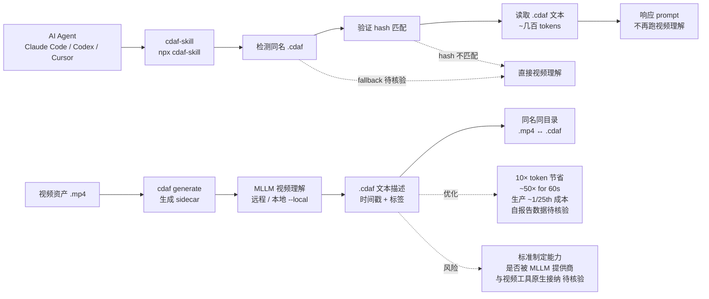

# UditAkhourii/cdaf

## 一句话定位
**CDAF（Cached Descriptive Asset Files）—— 视频资产的纯文本时间戳 sidecar 格式**。README 自述 "Stop making AI agents watch the same video twice"——生成一次 `.cdaf` 文本描述文件（与视频同名同目录），后续 agent 读取文本而非再跑视频理解。**视频元数据 first-class file format** 的早期尝试。

## 它解决的问题
AI agent 处理视频资产时面临三类成本：(1) **重复 token 成本**——同一视频被多个 agent 任务反复分析，每次都要消耗 MLLM tokens；(2) **慢 latency**——视频理解通常需要 30s-数分钟；(3) **不可缓存**——传统缓存只缓存"完全相同的请求"，但 agent 任务对同一视频的提问角度各异，缓存命中率低。CDAF 直击这三点：**生成一次纯文本时间戳描述（约几百 tokens）作为 sidecar，agent 读取 sidecar 而非再跑视频理解**。

## 为什么值得关注（2026-08-27）
- **1 天 63⭐ + 6 forks**：反映"agent 视频处理成本优化"赛道的真实需求
- **完整产品化**：含 SPEC.md（v1.0）+ CLI（`cdaf generate/validate/read/status`）+ agent skill（`npx cdaf-skill`，适配 Claude Code / Codex / Cursor 等）+ benchmarks + arXiv preprint 草稿 + npm/cdaf-skill 双包
- **可复现 benchmark**（自报告）：gemini-2.5-flash, 20 questions，"20/20 vs 19/20 accuracy + 10.1× 少 prompt tokens / 题（303 vs 3,066）+ ~35% lower latency"，声明 ~50× for 60-second footage、生产环境实测 ~1/25th 成本
- **多 harness 兼容**：通过 agent skill 同时支持 Claude Code / Codex / Cursor / 其他 compatible local agent
- **MIT 许可**：商用友好
- **双 provider 支持**：远程 API + 本地模型（`--local` 选项，无需 API key）

## 热度来源判断
热度来自 **"agent 视频处理 token 成本 × 重复理解浪费 × sidecar 模式成熟"** 的组合：(1) MLLM 处理视频的 token 成本是真实可量化的优化机会；(2) 同一视频被多个 agent 任务反复分析是常见 pattern（视频编辑 / 字幕 / 内容审核 / 摘要）；(3) sidecar 模式在 LLM 训练数据（parquet metadata）与游戏引擎（UE4 .uasset sidecar）已有成熟实践。**主要风险：** 1 天新项目，标准制定能力有限（是否会被 OpenAI / Anthropic / Google 等 MLLM 提供商接纳）；与现有视频元数据格式（FFmpeg metadata / EXIF / ID3）的兼容性未在 README 中明示；自报告 benchmark 数据未独立核验。

## 关键技术亮点
1. **纯文本时间戳 sidecar**：与视频同名同目录（如 `sunset-drone.mp4` ↔ `sunset-drone.cdaf`），文本格式可读可 diff
2. **Hash-based 验证**：agent skill 读取 sidecar 前先验证视频 hash，确保 sidecar 与视频匹配
3. **CLI 多命令**：`generate`（生成 sidecar）/ `validate`（验证）/ `read`（读取）/ `status`（状态查询）
4. **本地 provider**：`--local` 选项支持本地模型生成 sidecar，无需 API key
5. **Agent skill 一键安装**：`npx cdaf-skill` 自动安装到 Claude Code / Codex / Cursor
6. **可复现 benchmark**：自报告 10× token 节省 + ~50× for 60-second footage + 生产 ~1/25th 成本
7. **arXiv preprint 草稿**：把 benchmark 数据包装为学术论文，提升可信度

## 架构师速览

| 决策问题 | 研究判断 | 证据边界 |
|---|---|---|
| 系统边界 | CDAF 是一个文件格式 + Python CLI + agent skill 三件套，不做视频理解，只做"视频理解产物的 sidecar 缓存" | 仅基于 README 的 "open sidecar format" + SPEC v1.0 + CLI + agent skill 描述；具体 SPEC 的字段定义（必填/可选）、hash 算法、agent skill 的检测逻辑需阅读 SPEC.md 与 skills/ 才能量化 |
| 主路径 | 视频资产 → `cdaf generate` 生成 .cdaf sidecar → agent skill 检测同名 sidecar → 验证 hash → 读取 sidecar 而非视频 → 响应 prompt | 主路径来自 README "one command" + "Teach your agent the format" 段落；agent skill 的 fallback 逻辑（sidecar 缺失 / hash 不匹配时是否回退到直接视频分析）未在 README 中明示 |
| 关键权衡 | 视频理解的精度 vs sidecar 的生成成本 vs sidecar 的可移植性 vs 标准制定的话语权 | 档案明示 10× token 节省与 SPEC v1.0；具体 sidecar 生成成本（一次 MLLM 调用）、与 FFmpeg metadata 的兼容、是否被 Remotion / Premiere / DaVinci 等视频工具原生接纳均待核验 |
| 最小 PoC | 拿一段 60 秒视频生成 sidecar → 在 Claude Code / Codex 安装 cdaf skill → 提 5 个不同问题验证 sidecar-first protocol → 对比直接视频理解的 token 数与 latency | PoC 范围由"先单视频、5 个问题、可对照"原则推导；具体 sidecar 内容质量、token 节省实际比例、accuracy 差异待核验 |

## 架构启发
CDAF 的核心启发是 **"资产元数据 first-class file format"** ——把"视频理解产物"沉淀为可版本化、可 diff、可缓存的文本格式，而不只是缓存层中的临时数据。**与同类项目的启发：** 和 8-24 的 backpass（AGENTS.md 自动改写）、8-25 的 watermark-remover（视频水印移除）共同证明 **"AI agent 时代的 sidecar 模式"** 在不同场景的复用价值。**更深层的启发是：** 当 MLLM 处理昂贵资产（视频 / 图像 / 音频）时，**sidecar-first protocol 比 ad-hoc 缓存更易被多个 agent 共享**——这是"agent 协作时代"的基础设施空白。

## 架构图（MMD）

> 证据边界：此图只采用本档案已有可核验描述；"待核验"节点不应视为项目实现事实。

## 定位判断
**基础设施候选项目（video metadata format）。** CDAF 不做视频理解，只做"视频理解产物的 sidecar 缓存格式"——这是基础设施型定位。**核心竞争壁垒：** SPEC v1.0 + CLI + agent skill + benchmark + arXiv 草稿的完整产品化；与同类项目（FFmpeg metadata / EXIF / ID3）的差异化定位。**主要风险：** 1 天新项目，标准制定能力有限；自报告 benchmark 数据未独立核验；与现有视频元数据格式的兼容性未明示。若持续维护 + 被 MLLM 提供商接纳，**6-12 月内有潜力成为"agent 视频处理成本优化"的标准 sidecar**。

## 风险 / 局限 / 泡沫点
- **1 天新项目**：维护持续性待观察
- **自报告 benchmark**：10× token 节省、~50× for 60-second footage、~1/25th 生产成本数据未独立核验
- **标准制定能力有限**：作为 1 天新项目，能否被 OpenAI / Anthropic / Google 等 MLLM 提供商接纳为原生输入格式存疑
- **视频工具兼容性**：与 FFmpeg metadata / EXIF / ID3 等现有视频元数据格式的兼容性未在 README 中明示
- **agent skill fallback**：sidecar 缺失或 hash 不匹配时是否回退到直接视频分析未明示
- **SPEC v1.0 成熟度**：v1.0 暗示规范仍在演进，未来版本兼容性与迁移成本待观察
- **本地模型质量**：`--local` 选项的本地模型视频理解质量未与远程 provider 对比

## 与同类项目的关系
- **vs FFmpeg metadata / EXIF / ID3**：传统视频/图像元数据格式，CDAF 专为 AI agent 视频理解设计
- **vs 8-24 backpass（AGENTS.md 自动改写）**：同样是 sidecar-first 模式，但 backpass 作用于 agent 指令，CDAF 作用于视频资产
- **vs 8-25 ShadowAqueduct/watermark-remover**：watermark-remover 是视频水印移除，CDAF 是视频理解缓存，互补
- **vs 各类视频缓存方案**：传统缓存按请求 key 缓存，CDAF 按视频资产 sidecar 缓存（更细粒度）
- **vs MLLM 提供商的 native cache**：OpenAI / Anthropic / Google 的 cache 主要按 prompt key 缓存，CDAF 是 sidecar-first protocol

## 是否值得持续跟踪
**值得跟踪（agent 视频处理成本优化的早期基础设施）。** CDAF 1 天 63⭐ + 6 forks 体现市场对"agent 视频处理成本优化"的真实需求，**完整产品化（SPEC + CLI + skill + benchmark + arXiv）是显著加分项**。**对独立开发者：** 12 月内评估自家视频产品是否需要接入 CDAF sidecar（README 自报告 10× token 节省，但需独立核验）。**对 MLLM 提供商：** 这是"sidecar-first protocol"的早期样本，可能演化为"agent 协作时代"的基础设施空白。建议关注：(1) 自报告 benchmark 是否被独立核验；(2) 是否被 MLLM 提供商接纳为原生输入格式；(3) 是否被 Remotion / Premiere / DaVinci 等视频工具原生集成。

## 后续观察点
- 自报告 benchmark 是否被独立核验（决定数据可信度）
- 是否被 OpenAI / Anthropic / Google 等 MLLM 提供商接纳为原生输入格式
- 是否被 Remotion / Premiere / DaVinci 等视频工具原生集成
- SPEC v1.0 → v2 的演进路径（决定长期兼容性）
- agent skill fallback 逻辑（sidecar 缺失时的回退行为）
- 与传统视频元数据格式（FFmpeg metadata）的兼容性

---
> 数据来源: GitHub API (2026-08-27) | Stars: 63 | Forks: 6 | License: MIT | 语言: Python | 创建: 2026-08-26 | 数据截至 2026-08-27 19:30 UTC