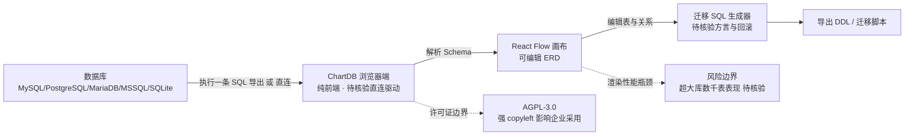

# chartdb/chartdb

## 一句话定位
基于单条 SQL 查询即可可视化数据库结构的免费在线/本地数据库图表编辑器，支持 MySQL、PostgreSQL、MariaDB、MSSQL、SQLite 等主流数据库。

## 它解决的问题
数据库 Schema 可视化的痛点：传统的 ERD（实体关系图）工具要么价格昂贵（如 dbdiagram.io Pro、Navicat），要么需要手动维护。ChartDB 通过直接连接数据库或执行单条查询即可自动生成可编辑的 ERD，实现了"零成本、即时、可编辑"的数据库结构可视化。

## 为什么值得关注
- **22,692 stars**，数据库工具领域增长最快的开源项目之一
- **隐私优先**：可在本地运行，数据不离开用户的机器；也支持仅通过一条 SQL 导出即可生成图表
- **基于 React Flow**：现代化的交互式画布体验
- **AGPL-3.0**：强 copyleft 许可，保护开源属性

## 热度来源判断
热度来自数据库开发者的普遍痛点——"拿到一个陌生数据库时想快速理解其结构"。传统工具（如 MySQL Workbench、pgAdmin）的 ERD 功能笨重且难用。ChartDB 填补了"轻量、美观、即时"这一空白市场。

## 关键技术亮点亮点
- **单查询模式**：不需要直连数据库，只需执行一条预生成的 SQL 即可导出完整 Schema
- **React Flow 画布**：流畅的拖拽、缩放、自动布局
- **多数据库支持**：MySQL、PostgreSQL、MariaDB、MSSQL、SQLite 统一界面
- **Schema 迁移**：支持可视化编辑 Schema 并生成迁移 SQL
- **纯前端**：无需后端服务，可部署为静态站点

## 架构师速览

| 决策问题 | 研究判断 | 证据边界 |
|---|---|---|
| 系统边界 | 浏览器端 ERD 工具；输入为一条 SQL 或直连数据库，输出为可编辑 Schema 与迁移 SQL | 档案明示“纯前端”“无需后端服务”，但具体直连驱动、本地运行形态、构建产物未在档案中给出 |
| 主路径 | 数据源 → 一条 SQL 导出 / 直连 → 浏览器内解析 → React Flow 渲染 → 编辑后导出迁移 SQL | 路径节点基于档案描述；解析器、迁移生成器在内部还是调用外部库无档案证据 |
| 关键权衡 | AGPL-3.0 强 copyleft 与“隐私优先本地化”之间的取舍：大库渲染性能 vs 当前画布实现的可扩展性 | 权衡项均来自档案“风险/局限”章节；具体性能阈值、许可证兼容性案例未提供 |
| 最小 PoC | 任选一个 MySQL/PostgreSQL/MariaDB/MSSQL/SQLite 真实库，启用单查询模式导出 → 在 ChartDB 中编辑一张表 → 生成迁移 SQL 并 dry-run | 档案未给出迁移 SQL 方言覆盖率、回滚支持及与 Flyway/Liquibase 的集成方式，列为待核验 |

## 架构启发
ChartDB 的"单查询导出"模式是一个巧妙设计——用户不需要开放数据库连接权限给外部工具，只需在本地执行一条 SQL，将结果粘贴到 Web 界面即可。这种"数据在用户侧，处理在前端"的架构兼顾了安全性和易用性。

## 架构图（MMD）

> 证据边界：此图只采用本档案已有可核验描述；“待核验”节点不应视为项目实现事实。

## 定位判断
**开发工具型**，定位为数据库开发者的日常工具。不是平台，不是框架，而是"小而美"的单功能工具。

## 风险 / 局限 / 泡沫点
- **功能边界**：ERD 可视化是相对窄的场景，扩展空间有限
- **竞品压力**：drawSQL、dbdiagram.io、Prisma Studio 都在争夺同一市场
- **AGPL 限制**：强 copyleft 可能阻止部分企业采用
- **大库性能**：超大型数据库（数千表）的渲染性能可能成为瓶颈

## 与同类项目的关系
- **竞品**：dbdiagram.io（商业）、drawSQL（商业）、prisma/studio（开源但更偏 ORM）
- **底层依赖**：React Flow（画布引擎）
- **互补**：可与 Prisma、Drizzle ORM 等工具配合使用

## 是否值得持续跟踪
**值得适度跟踪**。作为数据库工具链中有价值的补充工具，其产品设计（特别是单查询模式）值得借鉴。但项目本身的技术深度有限。

## 后续观察点
- 是否会扩展到 NoSQL（MongoDB、Redis）的可视化
- Schema 迁移功能能否与 Flyway/Liquibase 集成
- 是否会有商业化路径（如团队协作、版本管理）

---
> 数据来源: GitHub API (2026-08-07) | Stars: 22,692 | Forks: 1,458 | 语言: TypeScript | License: AGPL-3.0 | 首次发现: 2026-06-17
